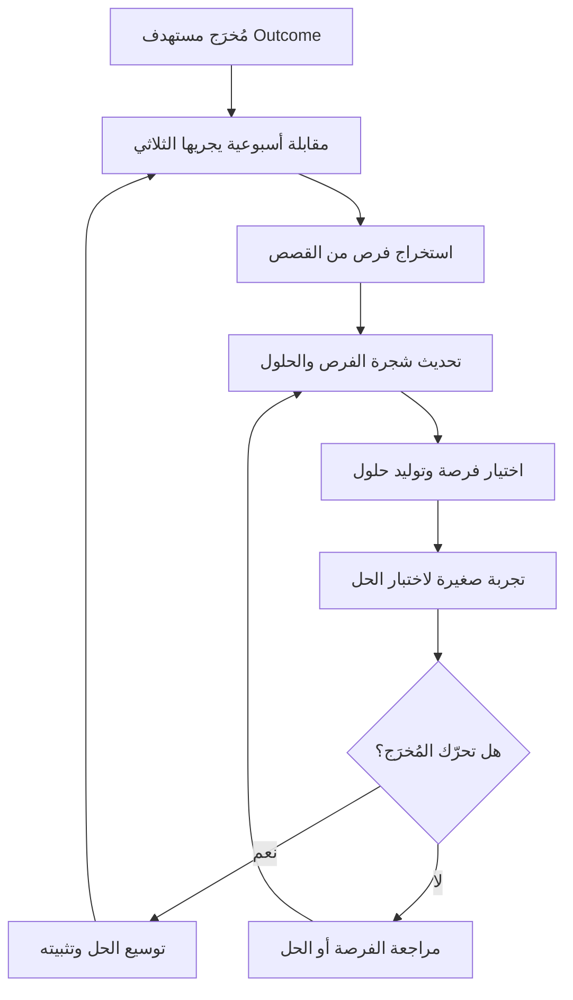

# الاكتشاف المستمرّ (Continuous Discovery)

> [!info] تعريف مختصر
> الاكتشاف المستمرّ (Continuous Discovery) ممارسة يشرحها كتاب *Continuous Discovery Habits* لتيريزا تورِس (Teresa Torres)، وتقوم على قاعدة بسيطة الصياغة صعبة الالتزام: **تواصل أسبوعي مع العملاء يقوم به فريق المنتج نفسه**، لا "مرحلة بحث" منفصلة يُجريها باحث ويسلّم نتائجها في تقرير. الفريق المقصود هو **الثلاثي (Product Trio)**: مدير المنتج + المصمّم + المهندس، يشاركون معًا في التواصل والتفسير واتخاذ القرار، بحيث يصبح التعلّم من العملاء **عادة أسبوعية** مرتبطة بقرارات جارية، لا حدثًا استثنائيًّا يسبق المشروع.

## الشرح العلمي والاحترافي

- **التعريف كما تصوغه تورِس.** الاكتشاف المستمرّ هو أن يكون هناك، **في كل أسبوع على الأقل**، تواصل مع العملاء يقوم به أعضاء الفريق الذين يبنون المنتج، بهدف اتخاذ قرارات المنتج جارية — لا لتوثيق المعرفة. العناصر الثلاثة في هذا التعريف كلها ملزمة: **الإيقاع الأسبوعي**، و**أن يقوم به الفريق نفسه**، و**أن يخدم قرارًا جاريًا**. إسقاط أي منها يعيدنا إلى البحث التقليدي.

- **الثلاثي (Product Trio) ولماذا هو ثلاثي.** يشترك ثلاثة أدوار في الاكتشاف لأن مخاطر المنتج نفسها ثلاثية الطبيعة: مدير المنتج يحمل هاجس القيمة وجدوى العمل، والمصمّم يحمل هاجس التجربة وقابلية الاستخدام، والمهندس يحمل هاجس الجدوى التقنية ويرى الحلول الرخيصة التي لا يراها غيره. حين يسمع الثلاثة **العميل نفسه في اللحظة نفسها**، يختفي فاقد الترجمة: لا حاجة لأن يشرح أحدهم للآخرين ما قاله العميل، ولا مجال لأن يُختزل الألم الحقيقي في سطر في وثيقة متطلبات. كما أن اشتراك المهندس مبكرًا يقلب معادلة الكلفة: كثيرًا ما يقترح حلًّا تقنيًّا أبسط بكثير من الحل الذي كان سيُطلب منه تنفيذه لو تسلّمه جاهزًا.

- **لماذا الإيقاع الأسبوعي تحديدًا؟** ليس الرقم شعارًا تنظيميًّا بل له منطق واضح:
  1. **يمنع تراكم الافتراضات.** الفريق يبني افتراضات كل يوم — عن سلوك المستخدم، عن أولوياته، عن فهمه للواجهة. إن لم تُختبر أسبوعيًّا، تتراكم وتتصلّب وتصبح "حقائق" غير مسؤول عنها أحد.
  2. **يجعل التعلّم تدريجيًّا لا صدمة.** البحث المشروعي الكبير يأتي بكمّ ضخم من النتائج دفعة واحدة، فيصعب استيعابه وتغيير المسار بناءً عليه — الكلفة النفسية والتنظيمية لتغيير مسار متقدّم كبيرة. التعلّم الأسبوعي يعدّل الاتجاه بدرجات صغيرة متتابعة.
  3. **يقلّل كلفة كل مقابلة.** حين تكون المقابلة حدثًا نادرًا، تُحمَّل بأهداف كثيرة ويطول التحضير لها. حين تصبح أسبوعية، تصير خفيفة ومركّزة على سؤال واحد جارٍ.
  4. **يبني ذاكرة جماعية.** الفريق الذي يسمع العملاء أسبوعيًّا يطوّر حدسًا مشتركًا يجعل معظم القرارات الصغيرة أسرع وأدقّ من غير حاجة إلى بحث في كل مرة.
  5. **يضمن استمرارية العلاقة مع العملاء.** الوصول إلى العملاء يصبح عملية جارية مؤتمتة، لا حملة يُعاد بناؤها من الصفر في كل مشروع.

- **البحث المشروعي مقابل الاكتشاف المستمرّ.** الفارق ليس في الجودة بل في الطبيعة:

| المحور | البحث المشروعي (Project-based Research) | الاكتشاف المستمرّ (Continuous Discovery) |
|---|---|---|
| الطبيعة | مشروع له بداية ونهاية | عادة أسبوعية لا تنتهي |
| المنفّذ | باحث متخصّص أو جهة خارجية | الثلاثي: مدير المنتج + المصمّم + المهندس |
| المُخرَج | تقرير أو عرض تقديمي | قرار منتج جارٍ + تحديث لخريطة الفرص |
| التوقيت | قبل المشروع أو عند أزمة | بالتوازي مع التسليم دائمًا |
| العلاقة بالعميل | حملة تُنظَّم ثم تنتهي | قناة دائمة مفتوحة |
| خطر التقادم | مرتفع: النتائج تشيخ بسرعة | منخفض: التحديث أسبوعي |

  ولا يعني هذا إلغاء البحث العميق المتخصّص؛ فبعض الأسئلة (دراسة سوق كبرى، بحث إثنوغرافي) تحتاج باحثًا محترفًا ووقتًا. الاكتشاف المستمرّ يغطّي **التدفّق اليومي للقرارات**، والبحث العميق يغطّي **الأسئلة الاستراتيجية النادرة**، وهما متكاملان.

- **العلاقة بأدوات أخرى.** الاكتشاف المستمرّ ليس مجرد "مقابلات كثيرة"؛ تورِس تربطه ببنية تفكير هي [[Opportunity Solution Tree]]: كل مقابلة تُثري خريطة الفرص المرتبطة بمُخرَج مستهدف، وكل فرصة تولّد حلولًا، وكل حلّ يولّد تجربة. كما يتقاطع مع [[Jobs to be Done]] في طريقة استخراج الدافع الحقيقي من كلام العميل، ومع [[Feedback Loop]] بوصفه حلقة تغذية راجعة قصيرة ومتكرّرة.

- **جمع القصص لا الآراء.** المقابلة في الاكتشاف المستمرّ ليست استبيانًا شفويًّا. الأسلوب المعتمد هو **المقابلة القصصية (Story-based Interview)**: يُطلب من المستخدم أن يحكي واقعة محدّدة حدثت فعلًا ("احكِ لي عن آخر مرة حاولت فيها…")، لأن الذاكرة السلوكية للواقعة أدقّ بكثير من التعميم ("عادةً أنا أفعل…") ومن التنبؤ ("لو كانت هناك ميزة كذا سأستخدمها"). من القصص تُستخرج الفرص، ومن الفرص يُبنى القرار.

## أين ومتى يُستخدم

- **في فرق المنتج المستمرّة** المسؤولة عن منتج قائم ونتائج مستمرّة (لا عن مشروع مؤقّت ينتهي بالتسليم).
- **حين تكون الأولويات محلّ جدل دائم** بين الجهات المعنية: التدفّق الأسبوعي للأدلة يحوّل النقاش من آراء إلى شواهد.
- **بعد كل إطلاق**، لفهم لماذا تصرّف المستخدمون كما تصرّفوا، خصوصًا حين لا يتحرّك مؤشر [[Adoption]] كما هو متوقّع.
- **في المنتجات الناضجة** التي تراكمت فيها افتراضات قديمة عن مستخدمين تغيّروا أو سوق تغيّر.
- **عند تكوين [[Cross-functional Team]] جديد**: الاكتشاف المستمرّ هو الطقس الذي يبني الفهم المشترك للمشكلة بين التخصّصات.
- **كمكمّل دائم لـ[[Product Discovery]]**: الاكتشاف هو النشاط، والاكتشاف المستمرّ هو **الإيقاع** الذي يجعله عادة لا حملة.

## مثال وسيناريو تطبيقي

> [!example] فريق منتج في منصّة لوجستية يخدم سائقي توصيل. الهدف الربعي (Outcome): رفع نسبة الطلبات المكتملة من المحاولة الأولى.
>
> **الحالة السابقة**: كان الفريق يطلب بحثًا من قسم تجربة المستخدم مرتين في السنة. التقرير الأخير جاء بعد أحد عشر أسبوعًا في ستّين شريحة عرض، وحين وصل كان الفريق قد شحن ثلاث ميزات بُنيت على تخمينات. لم يُغيَّر بسبب التقرير سوى بند واحد في الـ Backlog.
>
> **التحوّل**: قرّر الثلاثي (مديرة المنتج، المصمّم، أحد المهندسين) البدء بـ**مقابلة واحدة أسبوعيًّا فقط**. رتّبوا مع فريق العمليات آلية تلقائية: بعد كل طلب فاشل يُرسل للسائق دعوة قصيرة لمكالمة عشرين دقيقة مقابل مكافأة رمزية، فصار جدول المقابلات يمتلئ من نفسه بدل أن يُبنى يدويًّا كل أسبوع.
>
> **ما ظهر**: في المقابلات الأربع الأولى تكرّرت قصة لم تكن في أي تذكرة دعم — السائق يصل إلى المبنى الصحيح ثم يعجز عن معرفة المدخل الصحيح في المجمّعات الكبيرة، فيتّصل بالعميل، وإن لم يردّ يُلغي الطلب. لم يكن أحد في الفريق يعرف أن الإلغاء يسبقه غالبًا **اتصال فاشل بالعميل**.
>
> **من التعلّم إلى القرار**: أضيفت الفرصة إلى شجرة الفرص تحت المُخرَج المستهدف، ووُلّدت ثلاثة حلول: حقل "تعليمات الوصول" يملؤه العميل، وحفظ تلقائي لملاحظة السائق السابق عن العنوان نفسه، وزرّ مراسلة داخل التطبيق. المهندس — وقد سمع القصة بنفسه — أشار إلى أن الحل الثاني يمكن تنفيذه في أيام لأن البيانات موجودة أصلًا في السجلّات. جُرّب على منطقة واحدة أولًا وقيس أثره على المُخرَج قبل تعميمه.
>
> **الفارق الجوهري**: لم تكن القيمة في عدد المقابلات (أربع فقط)، بل في أن كل واحدة منها ارتبطت بقرار جارٍ وغيّرت خريطة الفرص في الأسبوع نفسه.

## خطوات أو مخطّط

1. **حدّد المُخرَج المستهدف (Outcome)** الذي سيوجّه الاكتشاف هذا الربع؛ بلا مُخرَج تصبح المقابلات فضولًا مشتّتًا.
2. **كوّن الثلاثي**: مدير منتج + مصمّم + مهندس، والتزام صريح بحضور مشترك.
3. **أنشئ قناة تجنيد مؤتمتة** للعملاء (دعوة داخل المنتج، أو تعاون مع الدعم والمبيعات) بحيث يمتلئ الجدول تلقائيًّا.
4. **ابدأ بمقابلة واحدة أسبوعيًّا** — لا خطة طموحة تنهار في الأسبوع الثالث. الاستمرارية أهم من الحجم.
5. **أجرِ المقابلة بأسلوب قصصي**: واقعة محدّدة، سلوك فعلي، سياق، بدائل استُخدمت.
6. **استخرج الفرص فورًا بعد المقابلة** (خلال ساعة) وحدّث [[Opportunity Solution Tree]]؛ التأجيل يفقد التفاصيل.
7. **اربط ما سُمع بقرار**: أي فرصة صعدت؟ أي حل تغيّر؟ أي تجربة ستُجرى؟ دوّن القرار وسببه.
8. **اختبر الحلول بتجارب صغيرة** وقِس أثرها على المُخرَج.
9. **راجع الإيقاع شهريًّا**: هل تمّت المقابلات فعلًا؟ وكم قرارًا تغيّر بسببها؟ المؤشر الثاني أهم من الأول.

## ⚠️ مفاهيم خاطئة شائعة

> [!warning]
> - **"الاكتشاف المستمرّ يعني مقابلات كثيرة"**: العدد ليس المقياس. مقابلة واحدة أسبوعيًّا ترتبط بقرار أنفع من ثلاثين مقابلة تنتهي إلى تقرير مؤرشف.
> - **"هذا عمل الباحث، ونحن ننفّذ"**: جوهر الممارسة أن يقوم بها **بناة المنتج** أنفسهم؛ إسناد التواصل بالكامل إلى وسيط يعيد فاقد الترجمة الذي جاءت الممارسة لإلغائه.
> - **"سنبدأ حين نُنظّم عملية بحث ناضجة"**: انتظار النضج قتل للعادة. البداية الصحيحة مقابلة واحدة هذا الأسبوع بأدوات ناقصة.
> - **"الاكتشاف المستمرّ بديل عن البيانات الكمّية"**: بل مكمّل لها؛ المقابلة تفسّر ما تكشفه البيانات، والبيانات تعمّم ما تلمّح إليه المقابلة.
> - **"يستهلك وقتًا يعطّل التسليم"**: عشرون إلى ستّين دقيقة أسبوعيًّا لثلاثة أشخاص كلفة زهيدة مقارنة بأسابيع بناء ميزة لا تُستخدم.
> - **"إن كان لدينا نظام تغذية راجعة (NPS، استبيانات) فنحن نمارسه"**: الاستبيان يجمع آراء مجمّعة عن الماضي، والاكتشاف المستمرّ يستخرج سلوكًا وسياقًا يخدمان قرارًا جاريًا.

## ❌ ممارسات خاطئة في المشاريع

> [!failure]
> - **قياس النجاح بالكمّ: "تحدّثنا إلى 30 عميلًا"**: يتحوّل الاكتشاف إلى نشاط يُتباهى به دون أن تتغيّر أولوية واحدة. الحل: قياس **عدد القرارات التي تغيّرت** بفعل ما سُمع، وتوثيق الرابط بين كل قرار والدليل الذي أنتجه.
> - **جدولة المقابلات يدويًّا في كل أسبوع**: عبء التجنيد المتكرّر هو أشيع سبب لموت العادة بعد شهر. الحل: أتمتة التجنيد عبر دعوة داخل المنتج أو قائمة عملاء متطوّعين دائمة.
> - **حضور مدير المنتج وحده ثم "تلخيص" ما سمعه للفريق**: يفقد الفريق السياق والنبرة والتفاصيل، ويتحوّل الدليل إلى رأي شخص واحد. الحل: حضور الثلاثي، أو على الأقل تسجيل المقابلة ومراجعة مقاطع منها معًا.
> - **أرشفة الملاحظات بلا بنية**: تتراكم مئات الملاحظات في مستند لا يُقرأ، ويعاد اكتشاف المعروف. الحل: تحويل كل مقابلة فورًا إلى فرص محدّدة في شجرة الفرص المرتبطة بالمُخرَج.
> - **مقابلة العملاء السعداء فقط أو المتاحين فقط**: تحيّز في العيّنة يعطي صورة وردية مضلّلة. الحل: تنويع متعمّد — مستخدمون متوقّفون، عملاء جدد، شرائح مختلفة، وحالات فشل.
> - **إيقاف الاكتشاف عند اقتراب الموعد النهائي**: يُفقد الفريق تغذيته الراجعة في أخطر لحظة، أي حين تكون كلفة الخطأ أعلى ما تكون. الحل: حماية الإيقاع الأسبوعي بوصفه التزامًا ثابتًا كالاجتماع اليومي، وتقليص مدّته لا إلغاؤه.
> - **معالجة الاعتراض "هذا ليس عملنا" بالتجاهل**: مقاومة المهندسين أو المصمّمين للمشاركة تنشأ غالبًا من غموض العائد لا من الكسل. الحل: البدء بمشاركة اختيارية في مقابلة واحدة، وإظهار أثرها المباشر على قرار وفّر عملًا كان سيُهدر.

## 🔗 مصطلحات ومفاهيم ذات صلة
[[Product Discovery]] | [[Opportunity Solution Tree]] | [[Jobs to be Done]] | [[Feedback Loop]] | [[Customer and Market Validation]] | [[Cross-functional Team]] | [[Adoption]]
