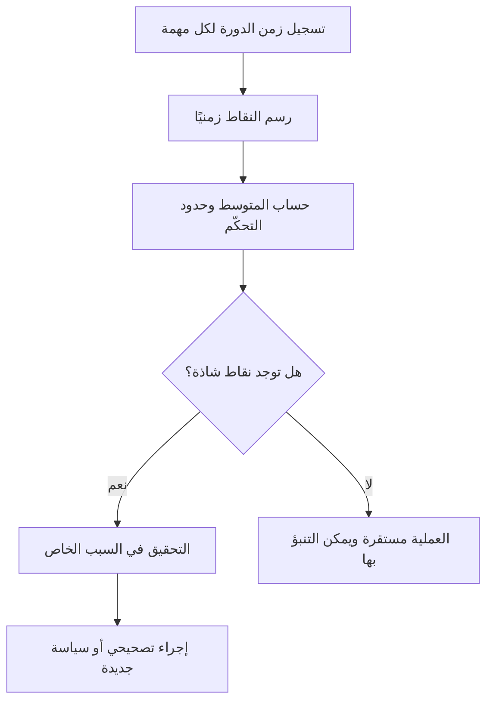

# مخطط التحكّم (Control Chart)

> [!info] تعريف مختصر
> مخطط التحكّم أداة إحصائية تُستخدم في إدارة المشاريع الرشيقة (خصوصًا كانبان) لقياس زمن الدورة ([[Cycle Time]]) لكل مهمة عبر الزمن، وتحديد ما إذا كانت العملية مستقرة ويمكن التنبؤ بها أم أنها تعاني من تذبذب غير طبيعي.

## الشرح العلمي والاحترافي
- ينشأ مخطط التحكّم من علم ضبط الجودة الإحصائي (Statistical Process Control) الذي طوّره والتر شيوهارت (Walter Shewhart) في مصانع الإنتاج، ثم استعارته إدارة المشاريع الرشيقة.
- المحور الأفقي يمثل تاريخ إنجاز كل مهمة، والمحور الرأسي يمثل زمن الدورة (المدة من بدء العمل على المهمة حتى اكتمالها).
- يُرسم خط "المتوسط" (Average) للبيانات، وأحيانًا "حدود التحكّم العليا والسفلى" (Control Limits) التي تحدد نطاق التذبذب الطبيعي المقبول.
- إذا وقعت نقطة بعيدًا عن هذه الحدود، فهذا يشير إلى "سبب خاص" (Special Cause) يستحق التحقيق، مثل عائق غير متوقع أو مهمة استثنائية التعقيد.
- كلما كانت النقاط متقاربة وقريبة من المتوسط، كانت العملية أكثر استقرارًا، مما يجعل التنبؤ بزمن تسليم المهام المستقبلية ([[SLE]]) أكثر دقة.
- يرتبط ارتباطًا وثيقًا بمفهوم قانون ليتل ([[Little's Law]]) الذي يربط زمن الدورة بحجم العمل الجاري ([[Capacity]]) ومعدل الإنتاجية ([[Throughput]]).

## أين ومتى يُستخدم
- يُستخدم بشكل أساسي في أنظمة كانبان ([[03 - Kanban]]) وسكرمبان ([[Scrum-ban]]) لمتابعة أداء التدفق المستمر للعمل.
- يُلجأ إليه أثناء اجتماعات المراجعة الدورية للفريق لتحديد ما إذا كانت هناك حاجة لتعديل حدود العمل الجاري ([[WIP Limit]]) أو معالجة اختناق ([[Bottleneck]]).
- مفيد عند تقديم التزامات زمنية واقعية للعملاء (مثال: "90% من المهام تكتمل خلال 8 أيام") بدلًا من الوعود الاعتباطية.
- يُستخدم أيضًا في مراقبة جودة العمليات المتكررة مثل معالجة تذاكر الدعم الفني أو طلبات النشر (Deployment).

## مثال وسيناريو تطبيقي
> [!example] في فريق دعم فني لتطبيق "دفترة" المحاسبي، تابع مدير الخدمة زمن الدورة لـ 40 تذكرة أُغلقت خلال شهر. أظهر مخطط التحكّم أن متوسط زمن الإغلاق هو 3 أيام، وأن معظم التذاكر تقع بين يوم واحد و6 أيام. لكن ثلاث تذاكر ظهرت كنقاط شاذة بزمن 15 يومًا فأكثر. عند التحقيق، تبيّن أن هذه التذاكر انتظرت موافقة من فريق خارجي لم يكن هناك اتفاق واضح معه بشأن زمن الاستجابة. بناءً على ذلك، أضاف الفريق سياسة صريحة ([[Explicit Policies]]) تحدد مهلة أقصاها يومان لأي موافقة خارجية، فانخفض عدد النقاط الشاذة في الأشهر التالية.

## خطوات أو مخطّط
1. تسجيل تاريخ بدء وانتهاء كل مهمة (زمن الدورة) لفترة كافية (يفضَّل 20-30 مهمة على الأقل).
2. رسم النقاط على مخطط زمني، مع خط أفقي للمتوسط.
3. تحديد حدود التحكّم (عادة المتوسط ± انحرافين معياريين أو باستخدام المئينات مثل P85).
4. رصد النقاط الشاذة خارج الحدود والتحقيق في أسبابها.
5. مراجعة النمط العام: هل التذبذب طبيعي أم متزايد بمرور الوقت؟
6. اتخاذ إجراء تصحيحي (تعديل السياسات، حدود العمل الجاري، أو توزيع المهارات).

## ⚠️ مفاهيم خاطئة شائعة
> [!warning]
> - الاعتقاد أن مخطط التحكّم يقيس "سرعة الفريق" أو "إنتاجيته"؛ في الحقيقة هو يقيس ثبات العملية والتنبؤ بها، وليس مقياس أداء أفراد.
> - الظن بأن هدف المخطط هو الوصول إلى زمن دورة صفري؛ الهدف الحقيقي هو الاستقرار والتنبؤ، حتى لو كان المتوسط أعلى قليلًا.
> - الخلط بين مخطط التحكّم ومخطط الاحتراق ([[17 - Burndown Chart]])؛ الأول يقيس زمن الدورة لكل عنصر عمل بشكل مستمر، والثاني يقيس تقدم إنجاز نطاق محدد ضمن سبرنت.

## ❌ ممارسات خاطئة في المشاريع
> [!failure]
> - استخدام المخطط لمعاقبة أفراد بعينهم أنجزوا مهامًا استغرقت وقتًا أطول من المتوسط. **الحل:** التركيز على تحليل النظام والعمليات، لا على مساءلة الأفراد.
> - قراءة المخطط بعينة صغيرة جدًا (5-10 مهام) واستخلاص استنتاجات قاطعة منها. **الحل:** جمع عدد كافٍ من نقاط البيانات (20 فأكثر) قبل اتخاذ قرارات.
> - تجاهل النقاط الشاذة دون تحقيق لأنها "حالات نادرة"، فتتكرر نفس المشكلة الجذرية لاحقًا. **الحل:** إجراء تحليل السبب الجذري ([[Root Cause Analysis]]) لكل نقطة شاذة متكررة.

## 🔗 مصطلحات ومفاهيم ذات صلة
[[Cycle Time]] | [[Little's Law]] | [[SLE]] | [[WIP Limit]] | [[Throughput]] | [[Bottleneck]] | [[Percentiles and Median vs Average]] | [[03 - Kanban]] | [[17 - Burndown Chart]]
