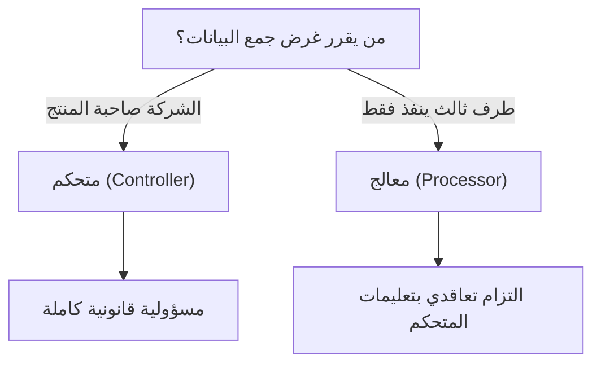

# المتحكم مقابل المعالج (Controller vs Processor)
> [!info] تعريف مختصر
> المتحكم بالبيانات (Data Controller) هو الجهة التي تحدد أغراض ووسائل معالجة البيانات الشخصية، بينما المعالج (Data Processor) هو الجهة التي تعالج البيانات نيابة عن المتحكم وبناءً على تعليماته فقط. هذا التمييز أساسي في قوانين حماية البيانات مثل GDPR و[[PDPL]].

## الشرح العلمي والاحترافي
- **المتحكم (Controller)**: عادة هو صاحب المنتج أو الشركة صاحبة المشروع الذي يجمع بيانات المستخدمين (مثلًا شركة تجارة إلكترونية تجمع بيانات عملائها). هو من يقرر "لماذا" و"كيف" تُجمع البيانات ولأي غرض تُستخدم.
- **المعالج (Processor)**: هو طرف ثالث (غالبًا مزوّد خدمة تقنية) يعالج البيانات نيابة عن المتحكم، مثل شركة استضافة سحابية، أو مزوّد خدمة بريد إلكتروني، أو فريق تطوير خارجي (Outsourced Team) يتعامل مع قاعدة بيانات العميل.
- هذا التمييز حاسم قانونيًا لأن المسؤوليات تختلف: المتحكم يتحمل المسؤولية القانونية الأساسية عن الامتثال، بينما المعالج مُلزم تعاقديًا (عبر اتفاقية معالجة بيانات - Data Processing Agreement) باتباع تعليمات المتحكم فقط وعدم استخدام البيانات لأغراضه الخاصة.
- في سياق إدارة المشاريع، يجب على مدير المشروع تحديد دور فريقه بوضوح: هل الفريق يبني نظامًا لعميل يملك البيانات (فالفريق هنا معالج)، أم أن الفريق يبني منتجًا داخليًا يجمع بيانات مستخدمين نهائيين (فالشركة هنا متحكم)؟
- ترتبط هذه العلاقة بوثائق مثل سجل أنشطة المعالجة ([[ROPA]]) والبنود التعاقدية القياسية ([[Standard Contractual Clauses]]) عند نقل البيانات عبر الحدود.

## أين ومتى يُستخدم
- يظهر هذا المفهوم في أي مشروع تقني يتعامل مع بيانات شخصية: تطبيقات، مواقع، أنظمة CRM، منصات تحليلات.
- يُحدَّد الدور (متحكم أو معالج) في مرحلة مبكرة من المشروع، ضمن وثائق متطلبات البرمجيات ([[Software Requirements Specification]]) أو عقد نطاق العمل ([[SOW]])، ويؤثر مباشرة على متطلبات الأمان والخصوصية المطلوبة في التصميم.
- ضروري بشكل خاص عند التعامل مع عملاء أوروبيين (GDPR) أو خليجيين/سعوديين (نظام حماية البيانات الشخصية [[PDPL]]).

## مثال وسيناريو تطبيقي
> [!example] شركة برمجيات "رواق" طوّرت منصة إدارة موارد بشرية لصالح شركة توظيف سعودية اسمها "توظيف+". في هذه العلاقة، شركة "توظيف+" هي المتحكم (Controller) لأنها تقرر ما البيانات التي تُجمع عن الموظفين ولأي غرض. أما شركة "رواق" فهي المعالج (Processor) لأنها فقط تستضيف وتُشغّل النظام بناءً على تعليمات "توظيف+". عندما طلب أحد الموظفين حذف بياناته، وجب على "توظيف+" (المتحكم) اتخاذ القرار القانوني بالموافقة، بينما "رواق" (المعالج) نفّذت الحذف تقنيًا في قاعدة البيانات دون أن يكون لها الحق في الاعتراض على الطلب أو استخدام تلك البيانات لأي غرض آخر.

## خطوات أو مخطّط
1. تحديد من يملك القرار بشأن غرض ووسيلة جمع البيانات في المشروع (هذا هو المتحكم).
2. تحديد الأطراف التي تعالج البيانات فقط تنفيذًا لتعليمات المتحكم (هذا هو المعالج).
3. توثيق العلاقة في اتفاقية معالجة بيانات (DPA) ضمن العقد.
4. تحديد نطاق الصلاحيات التقنية للمعالج (وصول محدود، تشفير، عدم الاحتفاظ بنسخ إضافية).
5. مراجعة الامتثال دوريًا وتحديث سجل أنشطة المعالجة ([[ROPA]]).

## ⚠️ مفاهيم خاطئة شائعة
> [!warning]
> - الاعتقاد أن شركة تطوير البرمجيات دائمًا "معالج" فقط؛ في الواقع قد تكون متحكمًا إذا كانت هي من تجمع بيانات مستخدمي منتجها الخاص.
> - الظن بأن المعالج غير مسؤول قانونيًا على الإطلاق؛ في الحقيقة القوانين الحديثة (مثل GDPR) تفرض التزامات مباشرة على المعالج أيضًا، وليس فقط على المتحكم.
> - الخلط بين "المعالج" و"المعالج الفرعي" (Sub-processor) عندما يستعين المعالج بطرف ثالث آخر (كخدمة استضافة سحابية)، وهو ما يتطلب موافقة صريحة من المتحكم.

## ❌ ممارسات خاطئة في المشاريع
> [!failure]
> - بدء تطوير نظام يعالج بيانات شخصية دون توقيع اتفاقية معالجة بيانات (DPA) واضحة بين الطرفين. **الحل:** جعل توقيع DPA خطوة إلزامية قبل بدء أي عمل على بيانات فعلية.
> - استخدام فريق التطوير (كمعالج) لبيانات العميل الحقيقية في بيئة الاختبار دون إخفاء الهوية (Anonymization). **الحل:** استخدام بيانات وهمية أو مقنّعة في بيئات التطوير والاختبار.
> - عدم تحديد من هو المتحكم بوضوح عند وجود عدة أطراف (شركة أم + شركة تابعة + مزوّد خارجي)، مما يسبب فراغًا في المسؤولية عند وقوع خرق بيانات. **الحل:** توثيق الأدوار بدقة في وثيقة الحوكمة منذ بداية المشروع.

## 🔗 مصطلحات ومفاهيم ذات صلة
[[PDPL]] | [[ROPA]] | [[Standard Contractual Clauses]] | [[KYC]] | [[Software Requirements Specification]] | [[SOW]] | [[Vendor Lock-in]]
