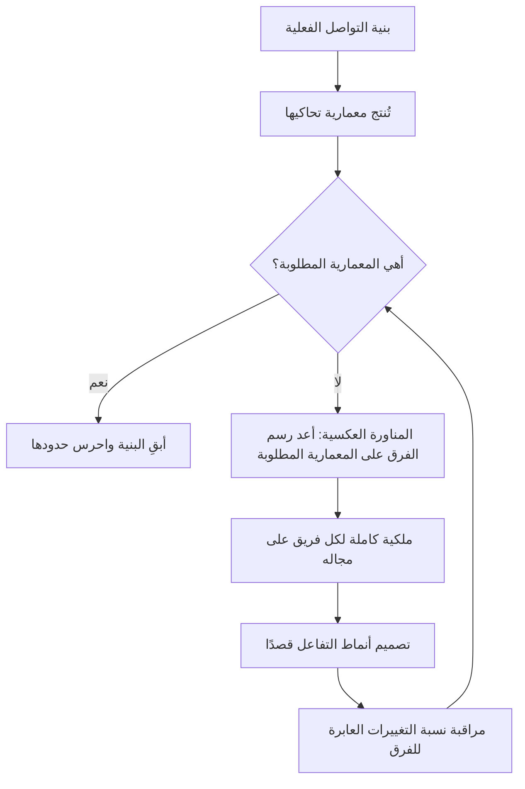

# قانون كونواي (Conway's Law)

> [!info] تعريف مختصر
> **قانون كونواي** يقول: *«المنظّمات التي تصمّم أنظمةً مضطرّةٌ إلى إنتاج تصاميم تحاكي بنية التواصل داخل تلك المنظّمات.»* صاغه ملفن كونواي في ورقة بعنوان *How Do Committees Invent?* نُشرت في مجلة *Datamation* سنة 1968. ومؤدّاه أن **الهيكل التنظيمي يتسرّب إلى المنتج**: فحدود الفرق تصير حدودًا في النظام، والفريقان اللذان لا يتحدّثان يُنتجان مكوّنين يتكلّف الربط بينهما. وهو ليس ملاحظة طريفة بل قيدًا هندسيًّا: **المعمارية التي تخالف بنية التواصل لا تصمد**، إمّا أن تُصلَح البنية أو أن تنهار المعمارية إليها.

## الشرح العلمي والاحترافي

### 1. لماذا يقع هذا حتمًا؟

- **لأن الواجهة بين مكوّنين هي في حقيقتها اتفاق بين شخصين.** فمن أراد أن يصمّم واجهة نظيفة بين وحدتين احتاج إلى حوار متكرّر بين من يبنيهما. فحيث يكون الحوار سهلًا تكون الواجهة نظيفة؛ وحيث يكون عسيرًا — فريق في إدارة أخرى، أو مورّد خارجي، أو منطقة زمنية بعيدة — **يميل المهندس إلى تجنّب الحوار**، فينتج عن ذلك تكرار للوظيفة أو واجهة ركيكة أو التفاف على النظام.
- ولهذا يظهر القانون بأوضح صوره في **حدود التعاقد والإدارات**: الأنظمة تنقسم حيث تنقسم المسؤولية الإدارية، لا حيث يقتضي المنطق التقني.

### 2. المناورة العكسية

- إن كان التصميم يتبع بنية التواصل، فالنتيجة العملية أن **بنية الفرق أداةُ تصميم**. وهذا ما يُعرف بـ**مناورة كونواي العكسية (Inverse Conway Maneuver)**: أن تُرسم بنية الفرق على صورة المعمارية المطلوبة، فيأتي التصميم تبعًا لها.
- وأشهر تطبيقاتها المعمارية الخدمية الدقيقة (Microservices): فهي لا تنجح بتقسيم الكود وحده، بل بأن يقابل كلَّ خدمة فريقٌ يملكها كاملة. **ومن قسّم الكود ولم يقسّم الملكية أنتج ما يُسمّى «الخدمات الدقيقة الموزّعة المتشابكة» — أسوأ من النظام المتراصّ الذي فرّ منه**، لأنه جمع تعقيد التوزيع إلى تشابك التبعية.
- ويلزم من ذلك أن **قرار إعادة الهيكلة التنظيمية قرار معماري**، وأن يُشارك فيه المهندسون لا أن يُبلَّغوا به.

### 3. ما يُبنى عليه اليوم

- **تصميم الفرق (Team Topologies)** يبني على القانون مباشرةً: أن تُصمَّم أنماط الفرق وأنماط التفاعل بينها عمدًا، لأن أنماط التفاعل هي التي ستصير واجهات في النظام.
- **حدود السياق في التصميم المقاد بالمجال (DDD)** تلتقي به من جهة أخرى: أن يوافق حدّ الفريق حدّ المجال، فيتكلّم الفريق لغة واحدة داخل حدوده.
- **وقياسه:** يظهر أثر القانون كمّيًّا في معدّل التغييرات التي تعبر أكثر من فريق. **فكلّما ارتفعت نسبة العمل الذي يحتاج تنسيقًا بين فريقين، دلّ ذلك على أن الحدود مرسومة في غير موضعها** — وهذا مؤشّر عملي يستحقّ أن يُرصد.

### 4. حدوده

- القانون **وصفيّ لا معياري**: يصف ميلًا قويًّا لا حتميّة صمّاء، ويمكن مقاومته بجهد واعٍ — بتوثيق صارم للواجهات، أو بأدوار جسر مقصودة. **لكن المقاومة تكلّف طاقة مستمرّة، وتنهار متى غفل عنها الفريق.**
- وهو **لا يفرض بنية بعينها**: المنتج المتراصّ (Monolith) الذي يبنيه فريق واحد متماسك وفاقٌ للقانون تمامًا، وليس مخالفًا له.

## أين ومتى يُستخدم

- قبل أي إعادة هيكلة تنظيمية في منظّمة تقنية: أيّ معمارية سينتجها الشكل الجديد؟
- عند تشخيص نظام مترابط ترابطًا يعسر معه التغيير: كثيرًا ما يكون الترابط انعكاسًا لتداخل مسؤوليات الفرق لا خطأً هندسيًّا محضًا.
- عند تصميم فرق منتج جديد: تُرسم الفرق على حدود المجال المطلوبة لا على التخصّصات (واجهة · خلفية · اختبار)، لأن التقسيم بالتخصّص يُنتج نظامًا تعبره كل ميزة عبر ثلاث تسليمات.
- في العمل مع مورّدين خارجيين: الحدّ التعاقدي سيصير حدًّا في النظام حتمًا، فيُرسم قصدًا بدل أن يُكتشف بعد التسليم.
- في تفسير ظاهرة تكرار الوظيفة نفسها في مكانين من النظام: غالبًا فريقان لا يتحدّثان.

## مثال وسيناريو تطبيقي

> [!example] سيناريو ملموس
> جهة قسّمت فرقها التقنية ثلاثة: **فريق الواجهات**، و**فريق الأنظمة الخلفية**، و**فريق قواعد البيانات** — تقسيمًا بالتخصّص، وكلٌّ في إدارة مستقلّة بمديرها وأولوياتها.
> فكانت كل ميزة صغيرة تمرّ بثلاث تسليمات وثلاث قوائم أولويات مختلفة، حتى صار تعديل حقل واحد في شاشة يستغرق ستّة أسابيع — أكثرها **انتظار** لا عمل. ونشأ في النظام ما يوافق ذلك تمامًا: ثلاث طبقات سميكة متكلّمة عبر عقود ضخمة، لا وحدات مستقلّة قابلة للتغيير.
> ولمّا أُعيد التنظيم على **مجالات الأعمال** — فريق للتسجيل، وفريق للدفع، وفريق للتقارير، في كلٍّ منها المهارات الثلاث — تغيّر النظام تبعًا خلال أشهر: نشأت خدمات ذات ملكية واحدة، وانخفض عدد التغييرات العابرة للفرق انخفاضًا حادًّا.
> **ولم يُطلب من أحد أن يعيد تصميم المعمارية.** أُعيد تصميم الفرق، فتبعتها المعمارية — وهذه هي المناورة العكسية في أوضح صورها.

## خطوات أو مخطّط

1. **ارسم بنية التواصل الفعلية لا الرسمية**: من يتحدّث إلى من يوميًّا؟ وأين يقع الحديث متعذّرًا؟
2. **ارسم المعمارية الحالية بجانبها** وقارن: ستجد الحدود متطابقة في أكثر المواضع، وهذا هو التشخيص.
3. **حدّد المعمارية المطلوبة** بوصفها هدفًا: أيّ حدود نريدها في النظام؟
4. **أعد رسم الفرق على تلك الحدود**، بحيث يملك كل فريق مجاله ملكيةً كاملة من الطلب إلى التشغيل.
5. **صمّم أنماط التفاعل بين الفرق قصدًا**: أيّ فريقين يتعاونان تعاونًا وثيقًا، وأيّهما يكتفي بواجهة معلَنة؟ **فما تصمّمه هنا سيصير واجهةً في النظام.**
6. **راقب مؤشّر العبور**: نسبة التغييرات التي تحتاج أكثر من فريق. وارتفاعها المستمرّ علامة على أن الحدود في غير موضعها.
7. **راجع الحدود دوريًّا**، فالمجال يتغيّر وتصير الحدود التي كانت صحيحة قيدًا.

## ⚠️ مفاهيم خاطئة شائعة

> [!warning]
> - **الظنّ أنه ملاحظة طريفة لا قيد عملي**: هو قيد يُدفع ثمنه في كل تسليمة. والمعمارية التي تخالف بنية التواصل تنهار إليها تدريجيًّا، ويُسمّى انهيارها «تراكم دَين تقني» وسببه تنظيمي.
> - **الظنّ أن المناورة العكسية تعني إعادة هيكلة دائمة**: التغيير التنظيمي المتكرّر يمنع الفرق من الاستقرار ويُنتج معمارية مضطربة. **والقاعدة: بنية مستقرّة تُراجَع دوريًّا، لا بنية متقلّبة.**
> - **الظنّ أن الخدمات الدقيقة تحقّقه بذاتها**: تقسيم الكود بلا تقسيم الملكية يُنتج تشابكًا موزّعًا أسوأ من التراصّ. **فالوحدة الحقيقية للتقسيم هي الفريق لا الخدمة.**
> - **الظنّ أن المنتج المتراصّ مخالف للقانون**: فريق واحد متماسك يُنتج نظامًا متراصًّا موافقةً للقانون لا مخالفةً له. **والقانون يصف المطابقة، ولا يفضّل توزيعًا على آخر.**
> - **الخلط بينه وبين [[Brooks's Law|قانون بروكس]]**: ذاك عن **أثر إضافة الناس في الجدول**، وهذا عن **أثر بنية التواصل في التصميم**. ويلتقيان في أن كليهما يردّ مشكلةً تقنية في ظاهرها إلى سبب تنظيمي.

## ❌ ممارسات خاطئة في المشاريع

> [!failure]
> - **تقسيم الفرق بالتخصّص التقني في منتج واحد**: كل ميزة تعبر ثلاث فرق وثلاث قوائم أولويات، فيصير أكثر زمن الدورة انتظارًا لا عملًا. **التجنّب:** فرق متعدّدة المهارات على حدود المجال.
> - **إعادة الهيكلة التنظيمية بمعزل عن المهندسين**: يُتّخذ قرار معماري كبير في اجتماع لا يحضره من يعرف أثره. **التجنّب:** اعرض على فريق المعمارية سؤالًا واحدًا قبل القرار: أيّ نظام سينتجه هذا الشكل؟
> - **إسناد مكوّن أساسي إلى مورّد خارجي بلا واجهة معلَنة مسبقًا**: يصير الحدّ التعاقدي حدًّا في النظام بشكل عشوائي يصعب تغييره لاحقًا. **التجنّب:** حدّد الواجهة وملكيتها في العقد نفسه، وانظر [[Vendor Lock-in|الاحتجاز لدى المورّد]].
> - **علاج التشابك التقني بإعادة كتابة الكود وحدها**: يعود التشابك بعد أشهر لأن بنية التواصل التي أنتجته لم تتغيّر. **التجنّب:** عالج الحدود التنظيمية والمعمارية معًا، وإلا فأنت تعيد إنتاج المشكلة.
> - **ترك أنماط التفاعل بين الفرق للصدفة**: فتنشأ اعتماديات ضمنية لا يعرف بها أحد حتى تتعطّل. **التجنّب:** أعلن لكل فريق من يتعاون معه ومن يكتفي بواجهته، واجعل ذلك مكتوبًا.

## 🔗 مصطلحات ومفاهيم ذات صلة

[[Brooks's Law]] | [[Cross-functional Team]] | [[Two-Pizza Team]] | [[Spotify Model]] | [[Dependency]] | [[Handoff]] | [[Technical Debt]] | [[Vendor Lock-in]] | [[Bottleneck]] | [[Alignment]] | [[Tesler's Law]] | [[23 - Project Program Portfolio]]
