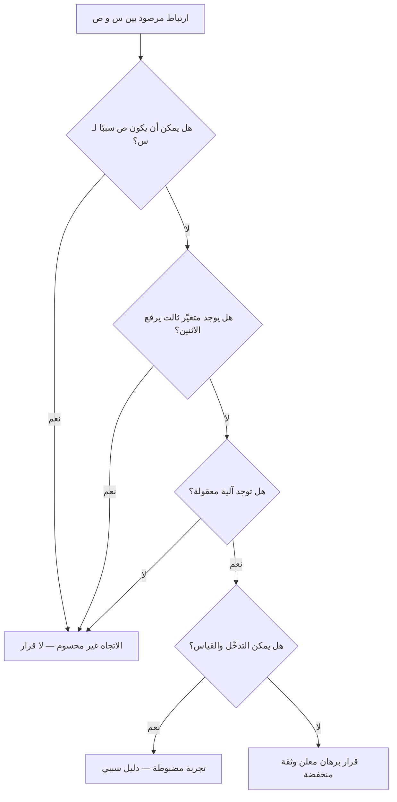

# الارتباط مقابل السببية (Correlation vs Causation)

> [!info] تعريف مختصر
> **الارتباط (Correlation)** أن يتحرّك مقداران معًا: يرتفعان معًا، أو يرتفع أحدهما حين ينخفض الآخر. **والسببية (Causation)** أن يكون أحدهما هو الذي **أحدث** التغيّر في الآخر، بحيث لو تدخّلتَ في الأوّل لتغيّر الثاني. والقاعدة التي يختصرها الاسم أن الأوّل **لا يُثبت** الثاني: فقد يتحرّك المقداران معًا لأن ثالثًا يحرّكهما، أو لأن اتّجاه التأثير معكوس لما ظننت، أو لأن الأمر محض مصادفة في بيانات قليلة. وأثرها العملي في إدارة المشاريع مباشر: كل قرار يُبنى على «لاحظنا أن كذا يرتفع مع كذا» هو رهانٌ على سببية لم تُختبَر.

## الشرح العلمي والاحترافي

- **لماذا يقع الخلط أصلًا؟** لأن العقل يبني قصّة سببية من كل تجاور، وهي عادة نافعة في الحياة اليومية ومكلفة في القياس. فالمقياس الذي يتحرّك مع مقياس آخر يقدّم نفسه بوصفه تفسيرًا جاهزًا، والتفسير الجاهز يوفّر عناء البحث عن التفسير الصحيح.
- **الاحتمالات الأربعة لكل ارتباط مرصود**، ولا يُقبل التفسير السببي قبل استبعادها:
  1. **أ يسبّب ب** — وهو المطلوب إثباته لا المفترَض.
  2. **ب يسبّب أ** — انعكاس الاتّجاه. مثاله المتكرّر: هل الفرق التي تكتب توثيقًا أكثر أنجح، أم أن الفرق الناجحة تملك متّسعًا من الوقت للتوثيق؟
  3. **متغيّر ثالث كامن (Confounder)** يحرّك الاثنين معًا. وهو أكثرها وقوعًا وأقلّها انتباهًا.
  4. **المصادفة** — وهي واردة جدًّا حين تُفحص عشرات المقاييس بحثًا عمّا يرتبط بشيء؛ فمع كثرة المقارنات يظهر ارتباط قويّ بلا أي علاقة (وهذا ما يُعرف بمشكلة **المقارنات المتعدّدة**).
- **قوّة الارتباط لا تُصلح شيئًا.** ارتباطٌ بالغ القوّة يبقى ارتباطًا: قوّته تخبرك أن العلاقة ليست ضجيجًا، ولا تخبرك عن اتّجاهها ولا عن سببها.
- **ما الذي يرقّي الارتباط إلى سببية؟** ثلاثة أمور مجتمعة عمليًّا: **التقدّم الزمني** (أن يسبق السبب الأثر)، و**آلية معقولة** تُفسّر كيف يقع التأثير، و**تدخّل مضبوط** — أي أن تُغيّر المتغيّر عمدًا وترى ما يحدث. وأقوى الثلاثة الثالث، وهو ما تفعله [[AB Testing|تجربة أ/ب]]: تُوزَّع الوحدات عشوائيًّا فتتوزّع معها المتغيّرات الكامنة المعروفة والمجهولة، فيبقى الفرق منسوبًا إلى التدخّل.
- **حين يتعذّر التجريب** — وهو حال كثير من أسئلة إدارة المشاريع — تبقى أدوات أضعف: المقارنة قبل/بعد مع مجموعة ضابطة، والتحقّق من ثبات العلاقة في سياقات مختلفة، والبحث الصريح عن المتغيّر الكامن. والمطلوب حينها **خفض درجة الثقة في القرار**، لا الادّعاء بأن الدليل كافٍ.
- **علاقتها بمقاييس التدفّق:** أكثر مقاييسنا مقاييس رصد لا تجريب — [[Velocity|السرعة]] و[[Cycle Time|زمن الدورة]] و[[Throughput|الإنتاجية]] وكفاءة التدفّق. فهي تُظهر ارتباطات كثيرة، وكل قرار يُبنى على أحدها بلا فحص هو تطبيق للمغالطة نفسها. وهذا موضع اتّصالها بـ[[Simpson's Paradox|مفارقة سيمبسون]]، إذ قد ينقلب اتّجاه الارتباط نفسه حين تُقسَّم البيانات.

## أين ومتى يُستخدم

- عند قراءة أي لوحة مقاييس قبل بناء قرار عليها: أهذا ارتباط مرصود أم أثر مُختبَر؟
- في [[10 - Sprint Retrospective|الاسترجاع]] حين يُنسب التحسّن إلى ممارسة أُدخلت في الدورة نفسها — وهو أشيع مواضع الوقوع فيها.
- عند تقييم أثر أداة أو إطار عمل جديد أُدخل على الفريق، لأن إدخاله يصاحبه دائمًا اهتمام إداري ومتابعة، وهما متغيّران كامنان.
- في تحليل أسباب العيوب: أن يرتبط ارتفاع العيوب بمطوّر بعينه لا يعني أنه سببها؛ فقد يكون هو من يُسند إليه أصعب العمل.
- عند عرض النتائج على أصحاب المصلحة، لضبط لغة الادّعاء: «تزامن مع» تختلف عن «أدّى إلى»، والفرق بينهما فرق في المسؤولية لا في الأسلوب.

## مثال وسيناريو تطبيقي

> [!example] سيناريو ملموس
> لاحظ مدير هندسة في شركة برمجيات خدمية أن الفرق التي تكتب اختبارات آلية أكثر تُطلق أسرع بنحو الثلث. فأصدر قرارًا: **حدّ أدنى لتغطية الاختبارات 80% على كل الفرق**، بوصف الاختبارات سببًا للسرعة.
> بعد ربعين، لم تتحسّن سرعة الفرق التي أُلزمت بالحدّ، بل ارتفعت شكواها من أن كتابة الاختبارات صارت طقسًا يُستوفى شكلًا.
> وعند الفحص تبيّن متغيّر ثالث لم يكن في الصورة: الفرق التي كانت تكتب اختبارات أكثر هي الفرق التي تملك **قاعدة كود أحدث وأقلّ ترابطًا**، فكان يسهل عليها الاختبار **ويسهل عليها الإطلاق** — للسبب نفسه. فالاختبارات والسرعة كلاهما **أثرٌ** لبنية الكود، لا أحدهما سببًا للآخر.
> ولمّا اختُبر الأمر تدخّلًا — بأن أُفرد فريق واحد ذو كود قديم لتفكيك وحدة مترابطة على مدى ستّة أسابيع — تحسّن زمن إطلاقه فعلًا، وارتفعت تغطيته تبعًا بلا إلزام. **فالتدخّل الذي كُشف أثره كان في البنية، والمقياس الذي أُلزم به كان عَرَضًا لا سببًا.**

## خطوات أو مخطّط

1. **اكتب الادّعاء صريحًا**: «س يسبّب ص» — فكثير من الادّعاءات تسقط بمجرّد صياغتها.
2. **اسأل عن الاتّجاه**: هل يمكن أن يكون ص هو الذي سبّب س؟
3. **ابحث عن الثالث**: ما الذي قد يرفع الاثنين معًا؟ وسمِّه بالاسم.
4. **افحص عدد المقارنات**: كم مقياسًا فحصتَ قبل أن تعثر على هذا الارتباط؟ فكلّما كثر الفحص هان ظهور المصادفة.
5. **اطلب آلية**: كيف — خطوةً خطوة — يُحدث س أثره في ص؟ فالعلاقة بلا آلية معقولة تبقى موضع شكّ.
6. **صمّم تدخّلًا صغيرًا** إن أمكن: غيّر س وحده في نطاق محدود وقِس.
7. **إن تعذّر التدخّل، اخفض الثقة صراحةً** واكتب القرار بوصفه رهانًا قابلًا للمراجعة، وحدّد ما الذي سيُبطله.

## ⚠️ مفاهيم خاطئة شائعة

> [!warning]
> - **الظنّ أن قوّة الارتباط دليل على السببية**: القوّة تنفي الضجيج ولا تحدّد الاتّجاه ولا تكشف المتغيّر الكامن. والارتباط شبه التامّ قد يكون كلّه أثرًا لسبب ثالث.
> - **الظنّ أن القاعدة تعني تجاهل الارتباطات**: الارتباط أثمن ما يُوجَّه به البحث؛ فهو **يفتح السؤال** ولا يُغلقه. ورفض الارتباطات كلّها شلل لا انضباط.
> - **الاكتفاء بحجم البيانات**: كثرة البيانات تُضيّق الخطأ العشوائي ولا تصلح الانحياز البنيوي. فمليون صفّ تحمل المتغيّر الكامن نفسه تُنتج الخطأ نفسه بثقة أعلى — وهذا أسوأ.
> - **الظنّ أن التقدّم الزمني يكفي**: أن يسبق «س» «ص» في الزمن شرطٌ لازم لا كافٍ؛ فقد يسبقهما ثالثٌ ويحرّكهما بفارق زمني بينهما.
> - **الخلط بينها وبين [[Simpson's Paradox|مفارقة سيمبسون]]**: المفارقة حالة خاصّة يقلب فيها التقسيم اتّجاه العلاقة نفسه، وهي **صورة حادّة** من مشكلة المتغيّر الكامن لا مفهوم منفصل عنها.

## ❌ ممارسات خاطئة في المشاريع

> [!failure]
> - **تعميم ممارسة على كل الفرق لأنها لوحظت في الفرق الأنجح**: الفرق الناجحة تختلف في أشياء كثيرة دفعةً واحدة، فنسخ إحداها قد ينسخ العَرَض لا السبب. **التجنّب:** جرّب الممارسة في فريق واحد مع قياس معلن قبل التعميم.
> - **نسب تحسّن ما بعد الاسترجاع إلى قرار الاسترجاع وحده**: في الدورة نفسها تغيّر الفريق وتغيّرت طبيعة العمل وارتفع الانتباه بحكم الملاحظة. **التجنّب:** اقصر الادّعاء على تغيير واحد، وتابعه ثلاث دورات لا واحدة.
> - **تقييم أداء الأفراد بارتباطات مستخرجة من أدوات التتبّع**: عدد الالتزامات أو التذاكر المغلقة يرتبط بأشياء كثيرة، أقلّها الكفاءة. **التجنّب:** استعمل هذه المقاييس لفحص تدفّق النظام، لا لتقييم الأشخاص — وانظر [[Goodhart's Law|قانون غودهارت]].
> - **بناء تنبّؤ بالجدول على ارتباط تاريخي بلا فحص للسياق**: ما ارتبط في مشروع سابق قد لا يرتبط في مشروع مختلف الحجم أو المجال. **التجنّب:** اذكر شروط السياق التي بُني عليها التنبّؤ مع التنبّؤ نفسه.
> - **إغلاق النقاش برسم بياني**: العرض البصري لخطّين متوازيين يُقنع أكثر ممّا يستحقّ. **التجنّب:** اشترط أن يُرفق مع كل رسم سببيّ ذِكرُ المتغيّر الكامن الذي فُحص واستُبعد.

## 🔗 مصطلحات ومفاهيم ذات صلة

[[Simpson's Paradox]] | [[Regression to the Mean]] | [[McNamara Fallacy]] | [[AB Testing]] | [[Cognitive Bias]] | [[Base Rate]] | [[Goodhart's Law]] | [[Data Informed vs Data Driven]] | [[Root Cause Analysis]] | [[22 - Outputs and Outcomes]]
