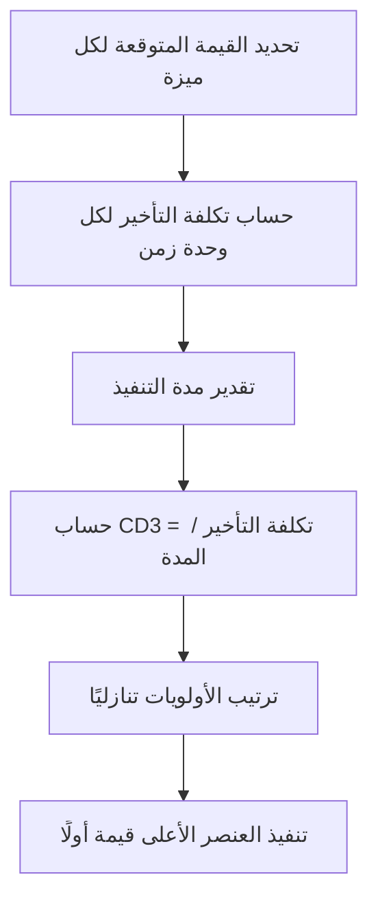

# تكلفة التأخير (Cost of Delay)
> [!info] تعريف مختصر
> تكلفة التأخير (Cost of Delay) هي مقياس اقتصادي يُترجم أثر تأخير تسليم ميزة أو مشروع إلى قيمة مالية أو قيمة أعمال ضائعة لكل وحدة زمن، مما يساعد الفرق على تحديد أولويات العمل بناءً على الأثر الحقيقي وليس فقط الحدس.

## الشرح العلمي والاحترافي
- الفكرة الأساسية: كل تأخير له ثمن، حتى لو لم يكن ظاهرًا في الميزانية المباشرة؛ فهو يشمل إيرادات مفقودة، حصة سوقية ضائعة لصالح منافس، أو تكلفة فرصة بديلة.
- تُحسب تكلفة التأخير غالبًا كدالة للوقت: كم ستخسر المنظمة (أو تفوّت من فرصة) عن كل أسبوع أو شهر تأخير في إطلاق الميزة.
- من أشهر أطر تطبيقها في الأجايل المقياس المركّب CD3 (Cost of Delay Divided by Duration)، والذي يُستخدم لترتيب أولويات العمل: يُقسَّم تكلفة التأخير على مدة تنفيذ المهمة، فتُعطى الأولوية للمهام ذات القيمة العالية والمدة القصيرة.
- يرتبط هذا المفهوم مباشرة بمنهجية SAFe (Scaled Agile Framework) التي تستخدم WSJF (Weighted Shortest Job First) وهو تطبيق عملي لـ CD3.
- على عكس التقدير التقليدي الذي يركّز فقط على "كم يكلف بناء هذا الشيء؟"، تكلفة التأخير تُجيب عن "كم يكلفنا عدم بنائه الآن؟"، وهذا يقلب أولويات كثيرة رأسًا على عقب عند تطبيقه بجدية.

## أين ومتى يُستخدم
- عند تحديد أولويات قائمة المهام الاستراتيجية (Product Backlog) في منتجات ذات ميزات متعددة متنافسة على نفس الموارد.
- في اتخاذ قرارات "المضي أو التوقف" (Go or No-Go Decision) بشأن مشروع معلّق أو ميزة مؤجلة.
- في تحليل تكلفة الفرصة البديلة عند مناقشة تأجيل إصدار (Release) لصالح ميزة أخرى.
- في سياقات SAFe لحساب WSJF عبر مؤسسات كبيرة تدير عدة فرق ومنتجات في آنٍ واحد.

## مثال وسيناريو تطبيقي
> [!example] شركة تجارة إلكترونية تدرس ميزتين مقترحتين: "الدفع بنقرة واحدة" المتوقع أن تزيد الإيرادات الشهرية بمقدار 40,000 دولار، وتستغرق 4 أسابيع تطوير؛ و"دعم لغة جديدة" المتوقع أن تزيد الإيرادات بمقدار 20,000 دولار شهريًا، وتستغرق أسبوعين فقط. تكلفة التأخير الأسبوعية للميزة الأولى تقارب 10,000 دولار (40,000÷4)، وللثانية تقارب 10,000 دولار أيضًا (20,000÷2). لكن عند حساب CD3 (تكلفة التأخير ÷ المدة): الميزة الأولى = 40,000÷4=10,000، والثانية = 20,000÷2=10,000. بما أنهما متعادلتان، يفحص الفريق عاملًا إضافيًا: مخاطرة عدم دعم اللغة الجديدة تُفقد حصة سوقية استراتيجية طويلة الأمد، فيقرر الفريق البدء بميزة اللغة الجديدة أولًا نظرًا لأثرها المستقبلي التراكمي الأعلى رغم تساوي CD3 الظاهري.

## خطوات أو مخطّط
1. حدّد القيمة المالية أو قيمة الأعمال المتوقعة من كل عنصر عمل (إيراد، توفير تكلفة، تقليل مخاطرة).
2. قدّر معدل خسارة هذه القيمة لكل وحدة زمن تأخير (أسبوع أو شهر).
3. قدّر المدة الزمنية اللازمة لتنفيذ كل عنصر عمل.
4. احسب CD3 = تكلفة التأخير ÷ المدة.
5. رتّب عناصر العمل تنازليًا حسب CD3 لتحديد الأولوية.
6. راجع الترتيب دوريًا لأن الظروف والقيمة المتوقعة تتغير مع الوقت.

## ⚠️ مفاهيم خاطئة شائعة
> [!warning]
> - الاعتقاد بأن تكلفة التأخير تُحسب فقط للمشاريع ذات إيرادات مباشرة، بينما تنطبق أيضًا على تقليل المخاطر أو الامتثال التنظيمي.
> - الخلط بين "المهمة الأكبر قيمة" و"المهمة الأعلى أولوية"؛ CD3 يأخذ المدة بعين الاعتبار وليس القيمة وحدها.
> - افتراض أن تكلفة التأخير رقم ثابت لا يتغير، رغم أن ظروف السوق والمنافسة تجعلها ديناميكية.

## ❌ ممارسات خاطئة في المشاريع
> [!failure]
> - ترتيب قائمة المهام حسب "من يصرخ بصوت أعلى" (سياسة داخلية) بدلًا من حساب تكلفة التأخير الفعلية.
> - تجاهل حساب تكلفة التأخير كليًا والاعتماد فقط على تقدير الجهد، مما يؤدي لتأخير ميزات عالية القيمة لصالح مهام سهلة لكنها منخفضة الأثر.
> - حساب تكلفة التأخير مرة واحدة في بداية المشروع دون تحديثها رغم تغيّر ظروف السوق أو دخول منافس جديد.

## 🔗 مصطلحات ومفاهيم ذات صلة
[[Go or No-Go Decision]] | [[Outcome vs Output]] | [[MoSCoW Prioritization]] | [[Buffer]] | [[Business Case]] | [[Estimation Variance]] | [[15 - Roadmap]] | [[13 - Backlog]]
