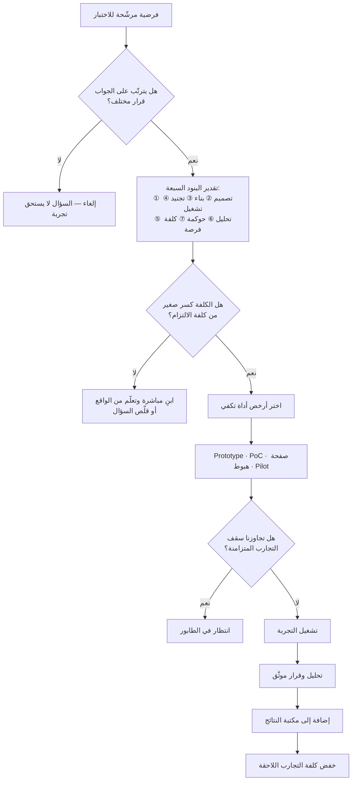

# كلفة التجربة (Cost of Experimentation)

> [!info] تعريف مختصر
> مجموع ما يلزم لاختبار **فرضية واحدة** اختبارًا يعطي **إجابة موثوقة** — لا كلفة بناء المخرَج وحده. تشمل: صياغة الفرضية وتصميم التجربة، وبناء ما يلزم لتنفيذها، وتجنيد المشاركين أو تهيئة الشريحة، والتشغيل والانتظار حتى تنضج البيانات، والتحليل والتفسير، والمراجعات والموافقات، و**كلفة الفرصة** لما لم يفعله الفريق بينما كان مشغولًا بالتجربة. والوحدة الصحيحة للقياس ليست «كم كلّف بناء النموذج؟» بل **«كم يكلّفنا سؤالٌ واحد مُجاب عنه بثقة كافية لاتّخاذ قرار؟»** — لأن التجربة التي تُبنى رخيصة ثم تُنتج نتيجة لا يُوثق بها لم تكن رخيصة، بل كانت مجّانية الثمن عديمة القيمة.

## الشرح العلمي والاحترافي

- **الأصل والمنشأ**: المفهوم وليد تقاطع ثلاثة تيارات: منهج التجربة في العلوم التجريبية وتصميم التجارب الإحصائي؛ واقتصاد الابتكار وأدبيات البحث والتطوير حيث تُقاس كفاءة الابتكار بعدد التجارب الممكنة لكل وحدة إنفاق؛ وحركة الشركات الناشئة الرشيقة (Lean Startup) في مطلع العقد الثاني من الألفية التي حوّلت بناء المنتج إلى دورة «بناء ← قياس ← تعلّم» وجعلت **سرعة الدورة وكلفتها** المتغيّر الحاكم بدل حجم الخطة.

- **المكوّنات السبعة التي تُنسى غالبًا**: يُختزل الحساب عادةً في بند واحد (كلفة البناء) بينما البنية الحقيقية للكلفة:
  1. **كلفة التصميم**: صياغة فرضية قابلة للدحض، وتحديد المقياس ومعيار الحسم وحجم العيّنة اللازم. أرخص البنود وأكثرها إهمالًا، وإهماله يُفسد كل ما بعده.
  2. **كلفة البناء**: ما يلزم لإخراج الشيء المُختبَر — [[Prototype]] أو [[Proof of Concept]] أو صفحة هبوط أو خدمة يدوية خلف واجهة.
  3. **كلفة التجنيد والوصول**: إيجاد مشاركين مناسبين، أو انتظار حركة مرور كافية، أو الحصول على إذن للوصول إلى عملاء حقيقيين — وهو غالبًا البند الأغلى في السياق المؤسسي، وقد يفوق البناء بأضعاف.
  4. **كلفة التشغيل والانتظار**: زمن التشغيل حتى تنضج البيانات. تجربة تحتاج أربعة أسابيع لتصل إلى دلالة كافية كلفتها الحقيقية أربعة أسابيع من التأخّر في القرار، لا ساعات إعدادها.
  5. **كلفة التحليل والتفسير**: تنظيف البيانات، وضبط التحيّزات، وترجمة النتيجة إلى قرار. وتزداد هذه الكلفة كلما ساء التصميم في البند الأول.
  6. **كلفة الحوكمة والموافقات**: مراجعة قانونية، وموافقة أمنية، ومعالجة بيانات شخصية بما ينسجم مع [[PDPL]]، وموافقة على مخاطبة العملاء. في المؤسسات الكبيرة قد تكون هذه وحدها ٧٠٪ من الكلفة الزمنية.
  7. **كلفة الفرصة**: أثمن البنود وأكثرها خفاءً — ما لم يُبنَ ولم يُختبر لأن السعة ذهبت إلى هذه التجربة. وهي الوجه الآخر لـ[[Cost of Delay]].

- **المعادلة الحاكمة**: إن كانت لديك ميزانية تعلّم ثابتة، فإن **عدد التجارب = الميزانية ÷ كلفة التجربة الواحدة**. وبما أن معدّل الإصابة في فرضيات المنتج منخفض بطبيعته — أي أن نسبة معتبرة من الأفكار الجيّدة ظاهريًّا لا تُحدث الأثر المتوقّع — فإن **عدد المحاولات، لا جودة التخمين، هو المتغيّر الذي يمكنك التحكّم فيه فعلًا**. خفض كلفة التجربة إلى النصف يضاعف عدد الأسئلة المُجاب عنها في الفترة نفسها.

- **لماذا انخفاضها يرفع قيمة الاختيار لا يخفضها**: هذه أدقّ نقطة في المفهوم وأكثرها إساءةَ فهم. الحدس الشائع أن رخص التجربة يعني أن الاختيار لم يعد مهمًّا: «ما دام الاختبار رخيصًا، جرّب كل شيء». والصحيح العكس، لأربعة أسباب:
  1. **القيود تنتقل ولا تختفي**: حين تنخفض كلفة البناء، لا يصبح النظام بلا قيد — بل ينتقل عنق الزجاجة إلى مورد آخر لم يرخص: انتباه المستخدمين المحدود، وحركة المرور المتاحة، وطاقة الفريق على المراجعة والتفسير، وقدرة المؤسسة على استيعاب التغيير. وبمنطق [[Theory of Constraints]]، الوفرة في مورد غير مقيِّد لا تنتج إنتاجية بل تُنتج مخزونًا معلّقًا.
  2. **الرخص يزيد الخيارات فيزيد ثمن اختيار الخطأ**: حين تستطيع اختبار ٥٠ فرضية بدل ٥، فإن قيمة **ترتيبها** ترتفع لا تنخفض — لأن الفارق بين أفضل خمس فرضيات وأسوأ خمس صار فارقًا حقيقيًّا قابلًا للتحقّق، بينما كان قبل ذلك نظريًّا. الاختيار هو ما يحدّد أيّ الأسئلة نُجيب عنها، وأثره تراكمي.
  3. **الضجيج ينمو أسرع من الإشارة**: تشغيل تجارب كثيرة بلا انضباط يرفع احتمال النتائج الإيجابية الزائفة، ويُنتج مخزونًا من «نتائج» متناقضة لا يستطيع أحد التصرّف بناءً عليها. والانضباط — أي الاختيار والتصميم المسبق — هو ما يفرق بين معرفة وضجيج.
  4. **كلفة ما بعد التجربة لم ترخص**: كل تجربة ناجحة تفتح بابًا لعمل حقيقي: بناء، وصيانة، وتوثيق، ودعم، وتعقيد دائم في المنتج. من يُشغّل كل ما استطاع تشغيله يجد نفسه أمام محفظة نتائج أكبر من قدرته على البناء — فتصبح النتيجة الوحيدة تشتّتًا.
  **الخلاصة**: انخفاض كلفة التجربة يحوّل الميزة التنافسية من «القدرة على التنفيذ» إلى «القدرة على طرح السؤال الصحيح واختيار ما يستحقّ». وحين يصير التنفيذ رخيصًا، تصبح **جودة الحكم** هي المورد النادر — لا اليد العاملة.

- **مبدأ التناسب**: كلفة التجربة يجب أن تكون **كسرًا صغيرًا** من كلفة الالتزام الذي ستُغني عنه. اختبار فكرة تنفيذها ١٠٠ يوم-عمل بتجربة تكلف ٥ أيام صفقة ممتازة؛ واختبارها بتجربة تكلف ٦٠ يومًا صفقة سيّئة — عندها الأرخص أن تبني وتتعلّم من الواقع مباشرة. وتحت عتبة معيّنة، **الاختبار نفسه يصبح إسرافًا**: لا تُختبر فرضية كلفة تنفيذها ساعتان.

- **العوامل التي تخفضها فعليًّا**: قابلية الملاحظة والقياس الجاهزة، ومنصّة تجارب وأعلام ميزات (Feature Flags) تُتيح تشغيل تجربة بلا إصدار، ونشر آليّ سريع ([[CI and CD]])، وقوالب موافقات مسبقة تختصر الحوكمة، ومجموعة مشاركين جاهزة، ومكتبة قرارات سابقة تمنع إعادة اختبار المُجاب عنه. وأغلب هذه استثمارات في **البنية التحتية للتعلّم**، لا في المنتج نفسه — ولذلك تُهمَل في ترتيب الأولويات رغم أن عائدها مضاعِف على كل تجربة لاحقة.

- **ما لا يخفضها**: تقليص حجم العيّنة إلى ما دون الكفاية، أو تقصير مدّة التشغيل قبل نضج البيانات، أو حذف مرحلة التحليل، أو الاكتفاء بالرأي بدل السلوك. هذه لا تخفض الكلفة بل تُلغي **الموثوقية** — فتتحوّل التجربة إلى إنفاق كامل بلا مخرَج، وهو أسوأ من عدم التجربة لأنه يُنتج ثقة زائفة يُبنى عليها قرار.

## أين ومتى يُستخدم

- **في ترتيب أولويات التعلّم داخل [[Product Discovery]] و[[Continuous Discovery]]**: تُوازن قيمة المعلومة المتوقّعة مقابل كلفة الحصول عليها، فتُختار الأسئلة ذات أعلى «تخفيض شكّ لكل ريال».
- **في تقييم أدوات التقييم نفسها**: لاختيار الأداة الأرخص التي تكفي — استطلاع سريع، أو صفحة هبّوط، أو [[Prototype]]، أو [[Proof of Concept]]، أو [[Pilot Launch]] — بحسب طبيعة السؤال لا بحسب المألوف في الفريق.
- **في بناء حالة العمل للاستثمار في البنية التحتية للتعلّم**: تبرير الإنفاق على منصّة تجارب أو أعلام ميزات أو قابلية ملاحظة، لأن أثرها يظهر في كل تجربة لاحقة لا في ميزة واحدة.
- **في تسعير المخاطرة قبل [[Go or No-Go Decision]]**: مقارنة كلفة اختبار المخاطرة المسجّلة في [[Risk Register]] بكلفة تحقّقها.
- **في مواجهة ثقافة [[Feature Factory]]**: حين تُقاس كلفة التجربة صراحةً، يصبح سؤال «ما الذي تعلّمناه هذا الربع؟» قابلًا للإجابة بالأرقام لا بالانطباع.
- **في تصميم إدارة العمل مع أدوات الذكاء الاصطناعي المولّدة**: حين تنهار كلفة البناء بينما تبقى كلفة المراجعة والتجنيد والتحليل كما هي، تتغيّر بنية الكلفة كلّها ويتحوّل عنق الزجاجة إلى الاختيار والمراجعة — وهو ما يستدعي حدودًا صريحة مثل [[Non-Goals]].
- **في مؤسسات مقيَّدة تنظيميًّا** (بنوك، صحة، جهات حكومية): حيث تكون كلفة الحوكمة هي المكوّن المهيمن، فتكون أنجع مبادرة تسريع هي تبسيط مسار الموافقات لا تسريع البرمجة.

## مثال وسيناريو تطبيقي

> [!example] بنك رقمي في الخليج، فريق منتج من ١٢ شخصًا. الكلفة الداخلية المحمَّلة ليوم-العمل الواحد **١٬٦٠٠ ريال** (رقم داخلي مفترض لغرض الحساب).
> **الوضع قبل**: كل تجربة تتطلّب إصدارًا كاملًا للتطبيق. البنية الفعلية لكلفة تجربة واحدة:
> • تصميم التجربة وصياغة الفرضية: ٢ يوم • بناء المتغيّر: ٦ أيام • مراجعة أمنية وقانونية وموافقة: ٩ أيام انتظار (منها ٣ أيام عمل فعلي) • انتظار دورة الإصدار: ١٤ يومًا تقويميًّا • تشغيل وجمع بيانات: ١٤ يومًا • تحليل وتقرير: ٣ أيام.
> **الإجمالي: ١٤ يوم-عمل ≈ ٢٢٬٤٠٠ ريال، وزمن دورة ٥٢ يومًا تقويميًّا.** أي أن الفريق كان يستطيع الإجابة عن **٧ أسئلة في السنة** بحدّ أقصى نظري — وعمليًّا ٥، لأن التجارب كانت تتنافس على السعة نفسها. والأخطر أن طول الدورة جعل كل تجربة قرارًا سياسيًّا: من يقبل أن ينتظر ٥٢ يومًا ثم يخرج بنتيجة سلبية؟ فصار الفريق يختار التجارب التي يُرجَّح نجاحها — أي التجارب **الأقل تعلّمًا**، لأن التجربة التي تعرف نتيجتها مسبقًا لا تُنتج معرفة.
> **الاستثمار**: خصّص الفريق ربعًا كاملًا (تقريبًا ١٢٠ يوم-عمل ≈ ١٩٢٬٠٠٠ ريال) لبناء بنية تحتية للتعلّم: أعلام ميزات تُتيح تشغيل متغيّر لشريحة دون إصدار جديد، وقالب موافقة أمنية مسبقة يغطّي فئة «تجارب واجهة بلا بيانات شخصية إضافية»، وقياس جاهز للأحداث الأساسية، ولوحة نتائج موحّدة.
> **الوضع بعد**: تصميم ١.٥ يوم • بناء المتغيّر ٢ يوم • موافقة ضمن القالب المسبق (صفر انتظار للفئة المغطّاة) • بلا انتظار إصدار • تشغيل ١٠ أيام • تحليل يوم واحد.
> **الإجمالي: ٤.٥ يوم-عمل ≈ ٧٬٢٠٠ ريال، وزمن دورة ١٤ يومًا.** أي انخفاض الكلفة ٦٨٪ وزمن الدورة ٧٣٪ — واسترداد الاستثمار بعد نحو ١٣ تجربة.
> **ما حدث بعد ذلك، وهو بيت القصيد**: في أول ربع بعد التحسين شغّل الفريق **٢٣ تجربة** بدل ٢. لكن مراجعة نهاية الربع كشفت أن ٩ منها كانت أسئلة لا يترتّب على جوابها قرار («أي درجة أزرق للزر؟»)، و٤ أُلغيت لأن شريحة المستخدمين لم تكفِ لدلالة معتبرة، و٣ أُهملت نتائجها لأن أحدًا لم يجد وقتًا لتفسيرها. أي أن **١٦ من ٢٣ تجربة كانت هدرًا** رغم رخصها — والأثر الفعلي جاء من ٧ تجارب فقط.
> فرض الفريق حينها قاعدتين: (١) لا تُعتمد تجربة دون جملة مكتوبة: «إن كانت النتيجة كذا فسنفعل كذا، وإن كانت كذا فسنفعل كذا» — فإن تطابق الفرعان فالسؤال لا يستحق التجربة؛ (٢) سقف ٦ تجارب متزامنة مهما اتّسعت السعة، لأن عنق الزجاجة انتقل من البناء إلى **الانتباه والتفسير**.
> النتيجة في الربع التالي: ١١ تجربة فقط، لكن ٩ منها أنتجت قرارًا موثّقًا في [[Decision Log]]. الدرس المستخلَص حرفيًّا في مراجعة الفريق: «رخصت التجربة، فصار الاختيار هو العمل».

## خطوات أو مخطّط

1. **قِس خط الأساس**: فكّك آخر ٣–٥ تجارب فعليًّا إلى بنودها السبعة، بالأيام والريالات وزمن الدورة. أغلب الفرق تُفاجأ بأن البناء ليس البند الأكبر.
2. **حدّد البند المهيمن**: هل هو الانتظار؟ أم الموافقات؟ أم التجنيد؟ أم التحليل؟ لا تُحسّن ما ليس عنق الزجاجة ([[Theory of Constraints]]).
3. **هاجم البند المهيمن ببنية تحتية لا بجهد فردي**: قالب موافقة مسبقة، أو أعلام ميزات، أو مجموعة مشاركين جاهزة، أو قياس مُثبَّت.
4. **صنّف الأسئلة بحسب أرخص أداة تكفي للإجابة**: لا تُشغّل تجربة على مستخدمين حقيقيين لسؤال يحسمه [[Prototype]] في يومين.
5. **قِس قيمة المعلومة لا كلفتها فقط**: كم يخفض هذا الجواب من الشكّ؟ وما حجم القرار المعلَّق عليه؟
6. **اشترط جملة القرار المسبقة**: «إن كانت النتيجة أ فسنفعل س، وإن كانت ب فسنفعل ص». تطابق الفرعين يعني إلغاء التجربة فورًا.
7. **ضع سقفًا للتجارب المتزامنة** بحسب طاقة التفسير والانتباه المتاحة، لا بحسب طاقة البناء — تطبيقًا لمنطق [[WIP Limit]].
8. **راجع المحفظة دوريًّا**: كم تجربة أنتجت قرارًا؟ وكم أُهملت؟ نسبة الإهمال هي المؤشّر الأصدق على أن الكلفة رخصت والاختيار لم ينضج.
9. **احتفظ بمكتبة النتائج**: كل سؤال مُجاب عنه ومُوثَّق يخفض كلفة كل تجربة لاحقة، لأنه يمنع إعادة اختبار المحسوم — بمنطق [[Single Source of Truth]].

## ⚠️ مفاهيم خاطئة شائعة

> [!warning]
> - **«كلفة التجربة = كلفة بناء النموذج»**: أشهر الأخطاء. البناء غالبًا ليس البند الأكبر؛ التجنيد والانتظار والموافقات والتحليل تفوقه في أغلب السياقات المؤسسية.
> - **«رخص التجربة يعني أن الاختيار لم يعد مهمًّا»**: العكس تمامًا. الرخص يوسّع فضاء الخيارات فيرفع أثر ترتيبها، وينقل عنق الزجاجة من التنفيذ إلى الانتباه والتفسير وقدرة المؤسسة على البناء بعد النتيجة. حين يرخص التنفيذ يصبح **الحكم** هو المورد النادر.
> - **«خفض الكلفة يعني تقليص العيّنة أو المدّة»**: هذا إلغاء للموثوقية لا خفض للكلفة. تجربة لا يُوثق بنتيجتها كلفتها كاملة ومردودها صفر — بل سالب، لأنها تُنتج ثقة زائفة يُبنى عليها قرار.
> - **«كل فرضية تستحق تجربة»**: لا. حين تكون كلفة التجربة قريبة من كلفة التنفيذ، أو حين يكون الجواب معروفًا سلفًا، أو حين لا يتغيّر القرار باختلاف النتيجة — فالتجربة تسويف مكلف يؤخّر [[Time to Value]].
> - **«التجربة الرخيصة تعني قرارًا أسرع»**: ليس بالضرورة. زمن الدورة قد تحكمه الموافقات ودورة الإصدار وزمن نضج البيانات، لا زمن البناء. من يسرّع البناء وحده يزيد المخزون المعلّق ولا يسرّع القرار.
> - **«نتيجة سلبية تعني تجربة فاشلة»**: النتيجة السلبية غالبًا أعلى عائدًا، لأنها تمنع إنفاقًا كبيرًا. الفشل الحقيقي هو التجربة التي لا تُنتج جوابًا حاسمًا في أي اتجاه.
> - **«الذكاء الاصطناعي جعل التجريب شبه مجاني»**: خفض مكوّنًا واحدًا فقط (البناء) خفضًا كبيرًا، وترك التجنيد والحوكمة والانتظار والتفسير على حالها — بل زاد عبء **المراجعة** لأن حجم المخرجات ارتفع. النتيجة أن بنية الكلفة تغيّرت وعنق الزجاجة انتقل، لا أنها اختفت.
> - **إهمال كلفة الفرصة**: تُحسب الأيام المنفَقة وتُنسى الأشياء التي لم تُفعل. وهي غالبًا أكبر بند في الحساب، ويقيسها منطق [[Cost of Delay]].

## ❌ ممارسات خاطئة في المشاريع

> [!failure]
> - **حساب كلفة البناء وحدها**: الخطأ: «النموذج كلّف يومين، إذن التجربة رخيصة». لماذا يضرّ: يخفي البند المهيمن (غالبًا التجنيد أو الموافقات أو الانتظار) فتُوجَّه جهود التحسين إلى المكان الخطأ ولا يتحسّن شيء. الحل: فكّك آخر خمس تجارب فعليًّا إلى بنودها السبعة قبل أي مبادرة تسريع.
> - **إطلاق تجارب بلا جملة قرار مسبقة**: الخطأ: «نشوف الأرقام وبعدين نقرّر». لماذا يضرّ: تُفسَّر النتيجة بعد ظهورها بما يوافق هوى أقوى صوت في الغرفة، فتصبح التجربة إجراءً شكليًّا. الحل: اشترط قبل الاعتماد كتابة «إن كانت النتيجة أ فسنفعل س، وإن كانت ب فسنفعل ص»؛ وإن تطابق الفرعان أُلغيت التجربة.
> - **تشغيل تجارب أكثر من طاقة التفسير**: الخطأ: تُشغَّل عشرات التجارب لأن الكلفة انخفضت. لماذا يضرّ: تتراكم نتائج بلا تحليل ويرتفع احتمال الإيجابيات الزائفة، فيصبح المخرَج ضجيجًا يُستشهد به انتقائيًّا. الحل: سقف صريح للتجارب المتزامنة بمنطق [[WIP Limit]]، مربوط بطاقة التحليل لا بطاقة البناء.
> - **تجاهل كلفة الحوكمة في التخطيط**: الخطأ: تُقدَّر التجربة بأيام العمل الهندسي فقط. لماذا يضرّ: تُفاجأ الفرق بأسابيع انتظار موافقات فتُختصر التجربة أو تُلغى بعد إنفاق جزء من كلفتها. الحل: تفاوض مسبقًا على قوالب موافقة لفئات تجارب منخفضة المخاطر، واجعلها أصلًا مؤسسيًّا ضمن [[Organizational Process Assets]].
> - **قياس عدد التجارب بوصفه مقياس نجاح**: الخطأ: هدف ربعي «تشغيل ٣٠ تجربة». لماذا يضرّ: يحوّل التعلّم إلى نشاط ويُنتج تجارب على أسئلة تافهة تُشغَّل لتُعدّ فقط — وهو [[Feature Factory]] بثوب تجريبي. الحل: قِس **عدد القرارات التي تغيّرت** بسبب نتيجة تجربة، بمنطق [[Outcome vs Output]].
> - **إعادة اختبار ما سبق حسمه**: الخطأ: تُعاد تجربة أُجريت قبل عام لأن أحدًا لا يذكر نتيجتها. لماذا يضرّ: إنفاق كامل بلا معلومة جديدة، ويُضعف الثقة بجدوى التجريب كلّه. الحل: مكتبة نتائج مفهرسة وقابلة للبحث ومربوطة بـ[[Decision Log]]، وشرط بحث فيها قبل اعتماد أي تجربة جديدة.
> - **التضحية بالموثوقية باسم السرعة**: الخطأ: إيقاف التجربة مبكرًا عند ظهور نتيجة مواتية. لماذا يضرّ: التوقّف الانتقائي عند الإشارة المرغوبة يُنتج نتائج إيجابية زائفة بمعدّل مرتفع، فيُبنى المنتج على وهم مُقاس. الحل: ثبّت مدّة التشغيل وحجم العيّنة قبل البدء ولا تُعدَّل بعده إلا بقرار معلن ومُسجَّل.
> - **إهمال الاستثمار في البنية التحتية للتعلّم**: الخطأ: يُؤجَّل بناء أعلام الميزات والقياس لأنه «لا يُنتج قيمة للمستخدم». لماذا يضرّ: تبقى كلفة كل تجربة مرتفعة إلى الأبد، فيقلّ عدد الأسئلة المُجاب عنها وتُتَّخذ القرارات بالرأي. الحل: عامل هذه البنية بندًا استثماريًّا صريحًا في خارطة الطريق وقِس عائدها بانخفاض كلفة التجربة وزمن دورتها.

## 🔗 مصطلحات ومفاهيم ذات صلة
[[Prototype]] | [[Proof of Concept]] | [[Non-Goals]] | [[Cost of Delay]] | [[Cost-of-Change Curve]] | [[Product Discovery]] | [[Continuous Discovery]] | [[MVP]] | [[Pilot Launch]] | [[Theory of Constraints]] | [[WIP Limit]] | [[Outcome vs Output]] | [[Feature Factory]] | [[Decision Log]] | [[Time to Value]]
