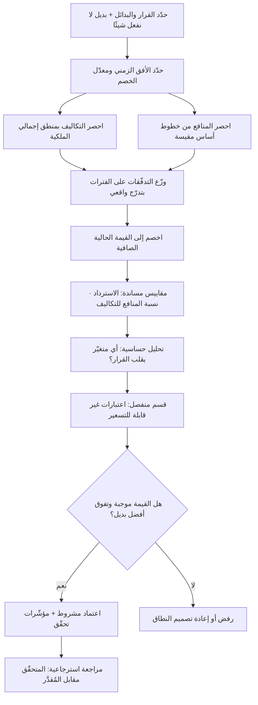

# تحليل التكلفة والعائد (Cost-Benefit Analysis)

> [!info] تعريف مختصر
> أسلوب منهجي لتقييم قرار أو مبادرة عبر حصر كل تكاليفها وكل منافعها، وتحويلها ما أمكن إلى وحدة قياس واحدة (المال عادةً)، وتوزيعها على محور زمني، ثم خصمها إلى قيمتها اليوم للحكم على جدواها ومقارنتها ببدائلها. أصوله في الاقتصاد العام والهندسة المالية في القرن التاسع عشر والعشرين، وشاع استخدامه في تقييم المشاريع الحكومية الكبرى قبل أن ينتقل إلى قرارات المؤسسات والتقنية. مساهمته الحقيقية ليست الرقم النهائي — الذي يبقى تقديرًا مبنيًّا على افتراضات — بل **إجبار الفريق على كتابة افتراضاته صراحةً بحيث يمكن مساءلتها**؛ ومَواطن خطره الثلاثة هي: التكاليف غير المباشرة التي لا تظهر في العرض السعري، وأثر الزمن على قيمة المال، وما لا يُقاس بالمال فيُعامَل خطأً كأنه يساوي صفرًا.

## الشرح العلمي والاحترافي
- **البنية الأساسية للتحليل**: تُحصر التكاليف والمنافع، ثم تُوزَّع على سنوات أو أرباع، ثم يُحسب **صافي التدفّق** لكل فترة، ثم تُخصم هذه التدفّقات إلى قيمتها الحالية، ثم يُحكم على المبادرة بمقارنة ناتجها ببدائلها وبخيار «لا نفعل شيئًا» — وهذا الخيار الأخير هو خطّ الأساس الواجب تضمينه دائمًا، لأن كل مبادرة تُقارَن ضمنًا به سواء صُرِّح بذلك أم لا.
- **القيمة الحالية الصافية (NPV — Net Present Value)**: ريال بعد ثلاث سنوات لا يساوي ريالًا اليوم، لأن للمال بديلًا استثماريًّا وله كلفة رأسمالية وتحيط به مخاطر. لذلك يُخصم كل تدفّق مستقبلي بمعدّل خصم يعكس كلفة رأس المال ودرجة المخاطرة، بالصيغة: القيمة الحالية = التدفّق ÷ (1 + معدّل الخصم) مرفوعًا لأسّ عدد الفترات. والقيمة الحالية الصافية هي مجموع القيم الحالية لكل التدفّقات (بما فيها الاستثمار الأولي السالب). القاعدة: قيمة موجبة تعني أن المبادرة تخلق قيمة تفوق كلفة رأس المال. **وأخطر ما في هذا الحساب أن معدّل الخصم مدخل تقديري شديد الحساسية**: تغييره من 8% إلى 15% قد يقلب قرارًا رأسًا على عقب في مشروع بعائد متأخّر. لذا القاعدة المهنية: لا تُعرض قيمة حالية صافية برقم واحد، بل بثلاثة سيناريوهات على الأقل (متحفّظ · مرجّح · متفائل) مع تحليل حساسية يبيّن أي متغيّر يقلب القرار.
- **مقاييس مساندة تُقرأ مع القيمة الحالية الصافية**: **فترة الاسترداد** (متى يعود رأس المال) وهي مقياس سيولة ومخاطرة لا ربحية، وتتجاهل كل ما بعد نقطة الاسترداد؛ و**نسبة المنافع إلى التكاليف** المفيدة للمقارنة بين مبادرات مختلفة الحجم؛ و**معدّل العائد الداخلي** الذي يجعل القيمة الحالية الصافية صفرًا. الاعتماد على مقياس واحد يُنتج انحيازًا معروفًا: من يحكم بفترة الاسترداد وحدها يرفض بانتظام المشاريع البنيوية طويلة الأثر.
- **التكاليف غير المباشرة — أكثر ما يُغفَل**: ما يظهر في عرض السعر أو تقدير التطوير هو غالبًا أقلّ من نصف الكلفة الحقيقية. الفئات التي تُنسى بانتظام: كلفة الفرصة لوقت الفريق (كل مهندس على هذه المبادرة ليس على غيرها)، وقت أصحاب المصلحة في الاجتماعات والمراجعات، التدريب وتغيير العادات، الهجرة وتنظيف البيانات، التشغيل والاستضافة والمراقبة، الدعم الإضافي بعد الإطلاق، الصيانة والتحديثات الأمنية على مدى العمر، تكاليف التكامل مع أنظمة قائمة، تراكم [[Technical Debt]]، وأخيرًا **كلفة الخروج** إن قرّرنا التوقّف أو التبديل ([[Vendor Lock-in]]). هذا بالضبط ما يعالجه مفهوم [[TCO]] — إجمالي كلفة الملكية — والذي ينبغي أن يكون هو مُدخل التكاليف في التحليل لا سعر الشراء وحده.
- **كلفة الفرصة البديلة جزء من الحساب لا خارجه**: القرار الاقتصادي ليس «هل هذا مربح؟» بل «هل هذا أفضل استخدام لهذا الجهد ورأس المال؟». مبادرة بقيمة حالية صافية موجبة قد تكون قرارًا خاطئًا إن كان بديلها المتاح أعلى قيمة. لذلك يُقرأ التحليل دائمًا في سياق [[Opportunity Cost]] وضمن مجموعة بدائل لا منفردًا.
- **خطر تجاهل ما لا يُقاس**: أعمق نقد يوجّه للأسلوب أن تحويل كل شيء إلى مال يمنح ما يسهل تسعيره وزنًا زائدًا، ويمنح ما يصعب تسعيره وزنًا صفريًّا فعليًّا — لا لأنه لا يساوي شيئًا، بل لأن الجدول لا يحتوي خانة له. الأمثلة الكلاسيكية: السمعة، ثقة العملاء، معنويات الفريق واحتمال استقالة الكفاءات، المرونة المستقبلية وقابلية التوسّع، المخاطر القانونية والتنظيمية، وأثر الخصوصية. النتيجة العملية: قرارات تبدو رشيدة عدديًّا وتكون مدمّرة استراتيجيًّا. **العلاج المهني ليس تجاهل هذه العناصر ولا اختراع أرقام لها، بل إدراجها في قسم منفصل صريح** يسمّى غالبًا "اعتبارات غير قابلة للتسعير"، تُوصف نوعيًّا وتُعرض بجوار الجدول لا تحته، ويُنصّ على أنها قد تقلب القرار وحدها. وأسلوب مساعد آخر هو **قلب السؤال**: بدل «كم تساوي السمعة؟» يُسأل «ما أقلّ ضرر سمعي يجعلنا نرفض هذه المبادرة رغم عائدها؟» — سؤال أسهل على الحدس البشري وأدقّ في نتيجته.
- **المنافع يجب أن تكون قابلة للتحقّق لا مأمولة**: الضعف الشائع في التحليلات المؤسسية أن التكاليف دقيقة (لأنها فواتير) والمنافع متفائلة (لأنها تقديرات صاحب المبادرة). العلاج: اشتقاق كل منفعة من مقياس قائم وخطّ أساس معلوم ([[Baseline]])، وتحديد من سيتحقّق من تحقّقها ومتى، مع إخضاعها لعامل تحفّظ.
- **علاقته بالحالة التجارية**: [[Business Case]] وثيقة أوسع تشمل السياق الاستراتيجي والبدائل والمخاطر وخطّة التنفيذ؛ وتحليل التكلفة والعائد هو **القلب الكمّي** لتلك الوثيقة. حالة تجارية بلا تحليل كمّي تبقى سردًا إقناعيًّا؛ وتحليل كمّي بلا حالة تجارية يبقى جدولًا بلا معنى استراتيجي.
- **حدّه في بيئات عدم اليقين العالي**: في المبادرات الاستكشافية المبكّرة تكون المنافع مجهولة بطبيعتها، ومحاولة تسعيرها تُنتج دقّة زائفة تُستخدم لاحقًا كالتزام. البديل المناسب هناك ليس تحليلًا مفصّلًا بل تحديد **سقف إنفاق للتعلّم** ومعايير قطع صريحة ([[Kill Criteria]]) — أي شراء معلومة بمبلغ محدود قبل شراء القرار. ويرتبط هذا بمفهوم [[Knightian Uncertainty]] حيث لا تتوفّر توزيعات احتمالية أصلًا.
- **مقاومته للانحياز**: من أهمّ وظائفه العملية أنه سلاح ضدّ [[Sunk Cost Fallacy]] — لأن التحليل السليم لا ينظر إلى ما أُنفق (فهو غارق وغير قابل للاسترداد) بل إلى التدفّقات المستقبلية وحدها؛ وضدّ [[HiPPO]] لأنه ينقل النقاش من التفضيل الشخصي إلى الافتراض المكتوب القابل للفحص.

## أين ومتى يُستخدم
- **عند طلب اعتماد ميزانية لمبادرة كبيرة**: كجزء كمّي من [[Business Case]] المقدَّم إلى [[Steering Committee]] أو الراعي ([[Sponsor]]).
- **في المفاضلة بين البناء والشراء والاشتراك**: حيث تختلف بنية الكلفة جذريًّا بين خيار رأسمالي وآخر تشغيلي ([[CapEx vs OpEx]])، ولا تظهر الفروق إلا بالخصم الزمني ونظرة إجمالي الملكية.
- **عند تقييم مشروع سداد دَين تقني أو إعادة هندسة**: لتحويل «الكود سيّئ» إلى تقدير لكلفة الإبطاء الحالية مقابل كلفة الإصلاح، ومقارنتها بـ[[Cost of Delay]].
- **في قرارات الأتمتة وإلغاء العمل اليدوي**: لمقارنة كلفة البناء والصيانة بالوفر في ساعات العمل المتكرّر ([[Toil]])، مع الانتباه إلى أن الوفر لا يصير حقيقيًّا إلا إن أُعيد توجيه الوقت المُحرَّر فعلًا.
- **عند اتخاذ قرار الاستمرار أو الإيقاف** ([[Go or No-Go Decision]]): بحساب التدفّقات المستقبلية فقط دون ما أُنفق.
- **في تقييم مشاريع الامتثال والبنية التحتية**: حيث المنفعة غالبًا **تجنّب خسارة** لا تحقيق ربح، فتُقدَّر بضرب احتمال الحدث في أثره — وهو ما يُبنى عادة انطلاقًا من [[Risk Register]] و[[Probability and Impact Matrix]].
- **في تحديد أولويات محفظة المشاريع**: كمُدخل لأساليب الترتيب المرجّح مثل [[Weighted Scoring]] أو [[WSJF]]، حيث تُغذّي المخرجات الكمّية بسط المعادلة.
- **بعد انتهاء المشروع**: كتحليل استرجاعي يقارن ما تحقّق بما وُعد به، لمعايرة دقّة التقديرات المستقبلية ([[Calibration]]) — وهي الخطوة التي تُهمَل دائمًا وتُفقِد المؤسسة قدرتها على التعلّم من تقديراتها.

## مثال وسيناريو تطبيقي
> [!example] **شركة لوجستية خليجية متوسّطة تدرس استبدال نظام تتبّع الشحنات القديم.** الخياران: تطوير نظام داخلي، أو الاشتراك في منصّة جاهزة. الأفق المعتمد 4 سنوات، ومعدّل الخصم المعتمد من الإدارة المالية 12%.
> **الخيار الأول — بناء داخلي**: تقدير التطوير 1,400,000 ريال (5 مهندسين × 7 أشهر). عند تطبيق منطق إجمالي الملكية أُضيفت بنود لم تكن في التقدير الأصلي: استضافة ومراقبة 90,000 سنويًّا، صيانة وتحديثات أمنية بواقع مهندس واحد بدوام جزئي 180,000 سنويًّا، هجرة بيانات وتنظيفها 120,000 لمرة واحدة، تدريب 60,000، ودعم إضافي في السنة الأولى 70,000. وأُضيف بند نادرًا ما يُكتب: **كلفة الفرصة** — المهندسون الخمسة كانوا مخصّصين لمشروع تحسين مسارات التوصيل المقدَّر وفره بـ400,000 ريال سنويًّا، وتأجيله سبعة أشهر يعني خسارة نحو 233,000 ريال من ذلك الوفر.
> **الخيار الثاني — منصّة جاهزة**: اشتراك 420,000 ريال سنويًّا، تكامل وتخصيص 260,000 لمرة واحدة، هجرة بيانات 120,000، تدريب 40,000. وأُضيف بند مخاطرة: كلفة الخروج المقدّرة عند التبديل بعد سنوات، وقُدّرت بـ200,000 في السنة الرابعة كسيناريو متحفّظ.
> **المنافع (مشتركة بين الخيارين تقريبًا)**، وكلها مشتقّة من خطوط أساس مقيسة فعليًّا لا من تقدير المورّد: خفض مكالمات «أين شحنتي؟» بواقع 3,200 مكالمة شهريًّا بكلفة 6.5 ريال للمكالمة = 249,600 سنويًّا؛ خفض الشحنات المفقودة من 0.9% إلى 0.4% بوفر مقدَّر 310,000 سنويًّا؛ تقليص الإدخال اليدوي بواقع 1.5 موظّف = 135,000 سنويًّا. الإجمالي نحو 694,600 ريال سنويًّا، طُبّق عليه عامل تحفّظ 25% ليصبح **520,950 ريالًا** في السيناريو المرجّح، مع تدرّج في السنة الأولى (60% فقط لأن المنافع لا تتحقّق من الشهر الأول).
> **النتيجة بعد الخصم على 4 سنوات**: الخيار الجاهز جاء بقيمة حالية صافية موجبة أعلى، أساسًا لسببين: تحقّق المنافع أبكر بستة أشهر (وقيمة الزمن هنا حاسمة عند خصم 12%)، وتجنّب كلفة الفرصة الكبيرة لفريق الهندسة. الخيار الداخلي كان يتفوّق فقط في سيناريو الأفق السبع سنوات وبمعدّل خصم 8% — وهو ما جعل النقاش في اللجنة ينتقل من «أيّهما أفضل؟» إلى السؤال الصحيح: «كم من الثقة لدينا في بقاء هذه العملية على حالها سبع سنوات؟».
> **قسم الاعتبارات غير القابلة للتسعير** (عُرض منفصلًا ولم يُحوَّل إلى أرقام): ملكية البيانات ومكان استضافتها ([[Data Residency]]) وأثرها على متطلّبات تنظيمية محتملة؛ اعتماد على مورّد أجنبي وحيد وما يعنيه عند تغيّر تسعيره؛ أثر تحرير فريق الهندسة على معنوياته واحتمال احتفاظه بكفاءاته؛ ومرونة التخصيص لعملاء كبار لهم متطلّبات خاصة.
> القرار النهائي كان الاشتراك في المنصّة الجاهزة، **مشروطًا** بتضمين بند تعاقدي لتصدير البيانات بصيغة مفتوحة، وهو شرط جاء مباشرة من قسم الاعتبارات غير المُسعَّرة لا من الجدول المالي — وهذا بالضبط سبب وجود ذلك القسم.

## خطوات أو مخطّط
1. صُغ القرار بدقّة وحدّد البدائل المطروحة، وضمّن دائمًا بديل «لا نفعل شيئًا» كخطّ أساس.
2. حدّد الأفق الزمني للتحليل ومعدّل الخصم المعتمد، واحصل على إقرار الإدارة المالية بهما قبل الحساب لا بعده.
3. احصر التكاليف بمنطق إجمالي الملكية: بناء، ترخيص، هجرة، تدريب، تشغيل، دعم، صيانة، تكامل، خروج، وكلفة فرصة موارد الفريق.
4. احصر المنافع مشتقّة من خطوط أساس مقيسة، وحدّد لكل منفعة مصدر بياناتها ومالك التحقّق منها وتاريخ بدء تحقّقها.
5. وزّع كل بند على الفترات الزمنية بواقعية: المنافع تتدرّج ولا تبدأ كاملة من اليوم الأول.
6. طبّق عامل تحفّظ صريح على المنافع، واذكر نسبته بدل إخفائه داخل الأرقام.
7. اخصم التدفّقات واحسب القيمة الحالية الصافية، ثم احسب فترة الاسترداد ونسبة المنافع إلى التكاليف كمقاييس مساندة.
8. أجرِ تحليل حساسية: غيّر معدّل الخصم والمنافع الأساسية بنسبة ±30% وحدّد **أي متغيّر يقلب القرار** — هذا المتغيّر هو ما يستحقّ جهدًا إضافيًّا في التقدير.
9. اكتب قسمًا منفصلًا للاعتبارات غير القابلة للتسعير، ووصّفها نوعيًّا، وحدّد أيّها قد يقلب القرار وحده.
10. اعرض ثلاثة سيناريوهات لا رقمًا واحدًا، مع قائمة صريحة بالافتراضات ودرجة الثقة في كلٍّ منها.
11. سجّل القرار وأسبابه في [[Decision Log]]، وحدّد موعدًا لمراجعة استرجاعية تقارن المتحقّق بالمُقدَّر.

## ⚠️ مفاهيم خاطئة شائعة
> [!warning]
> - **الظنّ بأن الرقم النهائي حقيقة موضوعية**: الناتج دالّة على افتراضات اختارها بشر — معدّل الخصم، الأفق الزمني، تقدير المنافع. تغيير افتراض واحد قد يقلب النتيجة، ولهذا فإن **قائمة الافتراضات هي المخرج الحقيقي** للتحليل لا الرقم.
> - **معاملة ما لا يُقاس كأنه يساوي صفرًا**: أخطر خلل بنيوي في الأسلوب. غياب خانة للسمعة أو المرونة أو معنويات الفريق في الجدول لا يعني انعدام قيمتها، بل يعني أن الجدول يتجاهلها. القسم النوعي المنفصل ليس ترفًا بل شرط سلامة.
> - **الاكتفاء بفترة الاسترداد كمعيار**: مقياس سيولة لا ربحية، ويتجاهل كل ما يحدث بعد نقطة الاسترداد، وينحاز بانتظام ضدّ المشاريع البنيوية والاستثمارات طويلة الأجل.
> - **حصر التكلفة في السعر المدفوع**: سعر الترخيص أو تقدير التطوير غالبًا أقلّ من نصف الكلفة الحقيقية عبر العمر. التقدير الصحيح يبدأ من [[TCO]] لا من عرض السعر.
> - **إغفال كلفة الفرصة لوقت الفريق**: ساعات المهندسين ليست مجانية لأنها مدفوعة أصلًا في الرواتب؛ كلفتها الحقيقية هي المشروع الذي لم يُنفَّذ بسببها.
> - **الخلط بينه وبين الحالة التجارية**: التحليل جزء كمّي داخل [[Business Case]]، والأخيرة تشمل الاستراتيجية والمخاطر والبدائل وخطّة التنفيذ. تقديم جدول أرقام بدل حالة تجارية يترك اللجنة بلا سياق للحكم.
> - **استخدامه في مبادرات استكشافية عالية اللايقين**: يُنتج دقّة زائفة تتحوّل لاحقًا إلى التزام يُحاسَب عليه الفريق. البديل: سقف إنفاق للتعلّم ومعايير قطع مسبقة.
> - **الظنّ بأن الوفر في ساعات العمل يتحوّل تلقائيًّا إلى مال**: توفير 1.5 موظّف لا يصبح وفرًا حقيقيًّا إلا إن أُعيد توجيه الوقت المُحرَّر إلى عمل ذي قيمة أو تغيّر الملاك الوظيفي فعلًا؛ وإلا فهو وفر ورقي.

## ❌ ممارسات خاطئة في المشاريع
> [!failure]
> - **الخطأ: تقدير المنافع بواسطة صاحب المبادرة نفسه دون مراجعة مستقلّة.** لماذا يضرّ: ينشأ انحياز تأكيدي منهجي يجعل كل المبادرات مجدية على الورق، فتفقد الأداة قدرتها على الرفض وتصير طقسًا للاعتماد. الحل: اجعل مراجعة تقديرات المنافع مسؤولية طرف محايد (مالية أو تحليل بيانات)، واشترط لكل منفعة مصدر بيانات وخطّ أساس.
> - **الخطأ: بناء التحليل على سيناريو واحد متفائل.** لماذا يضرّ: يخفي هشاشة القرار أمام تغيّر بسيط في افتراض واحد، فتُفاجأ الإدارة لاحقًا بانهيار الجدوى ولا تفهم السبب. الحل: ثلاثة سيناريوهات إلزامية مع تحليل حساسية يبيّن المتغيّر الحرج، ويمكن في القرارات الكبيرة استخدام [[Monte Carlo Simulation]] لعرض توزيع النتائج بدل رقم.
> - **الخطأ: إغفال تكاليف ما بعد الإطلاق (الدعم والصيانة والتشغيل).** لماذا يضرّ: تُعتمد مبادرة على أساس كلفة بنائها ثم تستهلك جزءًا دائمًا من طاقة الفريق سنويًّا، فيتآكل ما تبقّى من القدرة على بناء أي شيء جديد. الحل: احسب كلفة السنوات التالية بوضوح كنسبة سنوية من كلفة البناء أو كعدد أشخاص مخصّصين، واعرضها كالتزام مستقبلي.
> - **الخطأ: احتساب ما أُنفق سابقًا ضمن حسابات قرار الاستمرار.** لماذا يضرّ: يُبقي المؤسسة في مشاريع خاسرة بحجّة «أنفقنا كثيرًا لنتوقّف»، وهو تجسيد مباشر لـ[[Sunk Cost Fallacy]]. الحل: في أي قرار استمرار، احسب التدفّقات المستقبلية فقط بدءًا من اليوم، واذكر صراحةً أن المُنفَق غير قابل للاسترداد ولا يدخل الحساب.
> - **الخطأ: تحويل عناصر نوعية إلى أرقام مخترعة لجعل الجدول مكتملًا.** لماذا يضرّ: يمنح تقديرًا اعتباطيًّا هيبة الرقم، فيُناقَش وكأنه معطى موثوق ويُبنى عليه قرار غير قابل للتفكيك لاحقًا. الحل: افصلها في قسم نوعي صريح، أو اقلب السؤال إلى: «ما حجم الضرر الذي يجعلنا نرفض رغم العائد؟».
> - **الخطأ: استخدام معدّل خصم واحد لكل المبادرات مهما اختلفت مخاطرها.** لماذا يضرّ: يجعل مبادرة استكشافية عالية المخاطرة تبدو مساوية لتحسين تشغيلي شبه مؤكّد، فتُوزَّع الموارد بشكل مشوّه. الحل: اعتمد معدّلات متدرّجة بحسب فئة المخاطرة بالتنسيق مع المالية، ووثّق أساس التدرّج.
> - **الخطأ: عدم إجراء مراجعة استرجاعية تقارن ما تحقّق بما وُعد.** لماذا يضرّ: تتكرّر أخطاء التقدير نفسها لسنوات ولا تكتسب المؤسسة أي قدرة على معايرة أرقامها، وتفقد التحليلات مصداقيتها تدريجيًّا. الحل: اجعل المراجعة بعد 6–12 شهرًا بندًا إلزاميًّا في اعتماد أي مبادرة، وسجّل انحراف التقدير كمُدخل لمعايرة التقديرات القادمة.
> - **الخطأ: تقديم التحليل بعد اتخاذ القرار لتبريره.** لماذا يضرّ: يحوّل الأداة إلى غطاء إجرائي، ويعلّم الفريق أن الأرقام تُصنع على المقاس، فتفقد كل تحليل لاحق قيمته التداولية. الحل: اشترط تقديم التحليل قبل بوابة القرار وتسجيله في [[Decision Log]] بتاريخه، مع توثيق البدائل التي فُحصت ورُفضت.

## 🔗 مصطلحات ومفاهيم ذات صلة
[[Business Case]] | [[TCO]] | [[Opportunity Cost]] | [[CapEx vs OpEx]] | [[Cost of Delay]] | [[Sunk Cost Fallacy]] | [[Risk Register]] | [[Monte Carlo Simulation]] | [[Weighted Scoring]] | [[Decision Log]] | [[Go or No-Go Decision]] | [[DACI]]
