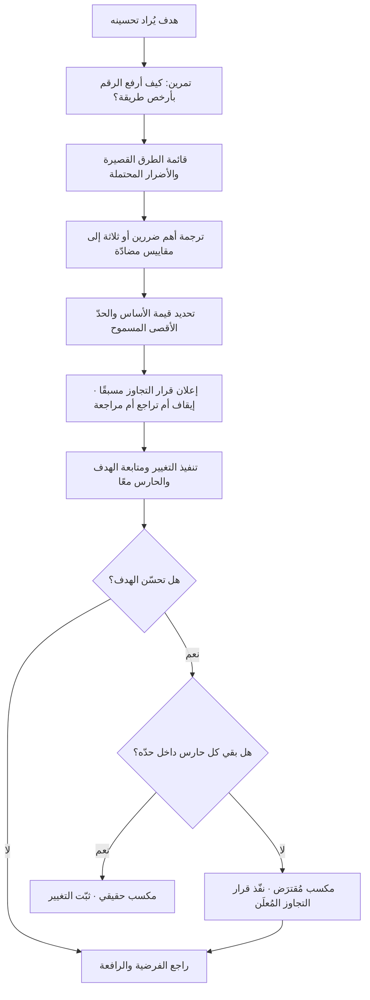

# المقياس المضادّ (Counter Metric)

> [!info] تعريف مختصر
> مقياس يُرصد عمدًا إلى جانب مقياس الهدف لالتقاط **الضرر الجانبي** الذي قد ينشأ من تحسين ذلك الهدف. وظيفته ليست أن يتحسّن، بل **ألّا يسوء**: يُوضع له حدّ لا يُتجاوَز، فإن تجاوزه اعتُبر التحسين خسارة لا مكسبًا مهما بدا رقم الهدف جميلًا. جوهره اعتراف بأن كل نظام مترابط، وأن أي مقياس يُدفع بقوّة في اتّجاه واحد يُنتج ضغطًا معاكسًا في مكان آخر — والمقياس المضادّ هو الاختيار الواعي لأن نرى هذا الضغط بدل أن نكتشفه متأخّرًا في شكوى عميل أو استقالة موظف. ويُسمّى أيضًا **مقياس الحراسة (Guardrail Metric)**.

## الشرح العلمي والاحترافي
- **المبدأ الأساس: لكل تحسين ثمن يُدفع في مكان لا نقيسه.** حين نُحسّن سرعة التسليم، يُدفع الثمن غالبًا من الجودة أو الدَّين التقني. وحين نُحسّن معدّل التحويل، قد يُدفع من جودة العملاء المكتسبين أو من ثقة المستخدم. وحين نُحسّن كلفة التشغيل، قد يُدفع من زمن الاستجابة. المقياس المضادّ لا يمنع الثمن، لكنه **يجعله مرئيًّا وقابلًا للمساومة الواعية** بدل أن يُزاح إلى الظلّ.
- **لماذا يحتاج كل هدف واحدًا: لأن التحسين أحادي البُعد يُنتج دائمًا مسارًا رخيصًا للغش.** لأي مقياس تقريبًا طريق قصير يرفعه دون خلق قيمة: يُرفع «عدد التذاكر المغلقة» بإغلاق التذاكر بلا حل، و«عدد المستخدمين المسجَّلين» بإزالة التحقّق، و«زمن الاستجابة» بإرجاع نتائج ناقصة، و«الإيراد الشهري» بخصم يقتل هامش العام كلّه. المقياس المضادّ هو الآلية البنيوية التي تسدّ هذه الطرق القصيرة، وهو الترجمة العملية المباشرة لـ[[Goodhart's Law]]: إن كان ضغط الهدف سيفسد المقياس، فالحلّ ليس إلغاء الهدف بل تسييج تحسينه.
- **الفرق بين مقياس مضادّ ومقياس ثانٍ للهدف.** المقياس الثاني للهدف يُراد له أن يرتفع أيضًا؛ المقياس المضادّ يُراد له أن **يبقى في مكانه**. لذلك يُصاغ دائمًا بصيغة حدّ لا بصيغة طموح: «ألّا يتجاوز x» أو «ألّا ينخفض عن y»، ولا يُكافأ أحد على تحسينه. الخلط بينهما يُنتج فريقًا يطارد هدفين متعارضين فيفشل في كليهما.
- **أنواعه الأربعة الشائعة.** ① **مضادّ جودة**: يحرس صحّة المخرَج (نسبة الأخطاء، [[Escaped Defect Rate]]، معدّل إعادة الفتح [[Reopen]]). ② **مضادّ تجربة**: يحرس شعور المستخدم (شكاوى، تقييمات، [[NPS]]، معدّل إلغاء الاشتراك). ③ **مضادّ تكلفة**: يحرس الاقتصاد (كلفة الاكتساب، كلفة الاستدلال [[Inference Cost]]، ساعات الدعم لكل حساب). ④ **مضادّ إنساني وتشغيلي**: يحرس النظام نفسه (العمل الإضافي، [[Sustainable Pace]]، دوران الفريق، حجم [[Technical Debt]]).
- **قاعدة الاشتقاق: ابدأ من سؤال «كيف أغشّ؟».** الطريقة الأدقّ لاختيار مقياس مضادّ ليست العصف الذهني عن المخاطر، بل تمرين عكسي صريح يجلس فيه الفريق ويكتب: **لو أردت رفع هذا الرقم بأسرع طريقة وأقلّ جهد وبلا أي اعتبار للنزاهة، ماذا سأفعل؟** كل إجابة في القائمة تُترجَم إلى مقياس مضادّ. التمرين يستغرق نصف ساعة ويكشف ما لا تكشفه ورشة مخاطر كاملة.
- **الحدّ يُعلَن قبل التجربة لا بعدها.** المقياس المضادّ بلا حدّ رقمي مُعلَن مسبقًا يتحوّل إلى مادّة للتبرير: يُنظر إليه بعد النتيجة فيُقال «الارتفاع مقبول». لذلك تشترط الممارسة السليمة كتابة الحدّ ونوع القرار عند تجاوزه (إيقاف، تراجع، مراجعة) في وثيقة القرار **قبل** بدء التغيير، تمامًا كما تُكتب معايير [[Go or No-Go Decision]].
- **موقعه في منظومة القياس.** المقياس المضادّ ليس بديلًا عن التصنيف الزمني ([[Leading and Lagging Indicators]]) بل عمود ثالث عليه: لكل هدف مؤشّر متأخّر يعرّف النجاح، ومؤشّر متقدّم يُدار أسبوعيًّا، ومقياس مضادّ يحدّ من الأضرار. والثلاثة معًا هي الحدّ الأدنى لبطاقة هدف صحّية، سواء في [[OKR]] أو في [[KPI]] تشغيلي.
- **حدوده الحقيقية.** المقياس المضادّ يرصد الضرر الذي **توقّعناه**؛ ولا يرصد الضرر خارج الخيال. لذلك يُستكمل بآليتين: قراءة نوعية دورية (شكاوى، [[User Interview]]) تلتقط ما لا يظهر في الأرقام، ومراجعة ربعية تضيف مقاييس مضادّة جديدة كلما ظهر نمط ضرر لم يكن مرصودًا. كما أن كثرة المقاييس المضادّة تشلّ الحركة؛ اثنان لكل هدف كافيان غالبًا.

## أين ومتى يُستخدم
- **في تعريف كل [[KPI]] تشغيلي**: لا يُعتمَد مؤشّر أداء بلا مقياس يحرس الجانب الذي قد يتضرّر من ملاحقته.
- **مع [[North Star Metric]]**: النجم القطبي بطبيعته يُدفع بقوّة على مستوى الشركة كلّها، فيحتاج سياجًا صريحًا يمنع تضخيمه على حساب الثقة أو الاقتصاد.
- **في تصميم التجارب والإطلاقات التدريجية ([[Pilot Launch]])**: مقاييس الحراسة هي شروط الإيقاف؛ تجاوزها يستدعي [[Rollback]] فورًا حتى لو كان المقياس الأساسي إيجابيًّا.
- **في أهداف السرعة والتدفّق**: مطاردة [[Throughput]] أو [[Cycle Time]] بلا حارس جودة تُنتج ديونًا خفيّة؛ الحارس المعتاد هو [[Rework Percentage]] أو [[Escaped Defect Rate]].
- **في أهداف الموثوقية والتكلفة**: خفض التكلفة يُحرَس بـ[[SLO]] و[[Uptime]]، ورفع الأداء يُحرَس بكلفة التشغيل — والاتّجاهان متعاكسان بطبيعتهما.
- **في اتفاقيات مستوى الخدمة والعقود**: الالتزام بـ[[SLA]] يُلاحَق أحيانًا بإغلاق شكلي للطلبات؛ الحارس هو معدّل إعادة الفتح ورضا مقدّم الطلب.
- **في أهداف النمو والاكتساب**: نمو التسجيلات يُحرَس بجودة الفوج (نسبة تفعيل الفوج الجديد) وبكلفة الاكتساب، وإلا صار الرقم من [[Vanity Metrics]].
- **في الحوكمة وإدارة التغيير**: عند فرض سياسة جديدة ([[Explicit Policies]] أو [[Governance]])، يُرصد مقياس مضادّ لالتقاط الالتفاف عليها بدل افتراض الامتثال.

## مثال وسيناريو تطبيقي
> [!example] بنك رقمي في دولة خليجية يضع هدفًا لفريق العمليات: **خفض متوسّط زمن معالجة طلب فتح الحساب من 48 ساعة إلى 6 ساعات** خلال ربعين. الهدف معلن ومربوط بمكافأة ربعية.
> قبل الإطلاق أجرى الفريق تمرين «كيف أغشّ؟» في جلسة مدّتها 40 دقيقة، فخرج بأربعة طرق قصيرة: ① رفض الطلبات الصعبة سريعًا بدل معالجتها. ② تخفيف تدقيق [[KYC]] لتسريع الموافقة. ③ إغلاق الطلب فور إرسال رسالة للعميل واعتباره «منجَزًا» ثم إعادة فتحه لاحقًا. ④ تحويل العبء إلى مركز الاتصال ليتحمّل هو الوقت.
> تُرجمت الطرق الأربع إلى بطاقة هدف كاملة:
> | الدور | المقياس | القيمة الأساس | الحدّ أو الهدف |
> |---|---|---|---|
> | الهدف | متوسّط زمن المعالجة | 48 ساعة | 6 ساعات |
> | مؤشّر متقدّم | نسبة الطلبات المكتملة البيانات من أول مرّة | 55% | 85% |
> | مضادّ ① | نسبة الطلبات المرفوضة | 7% | ألّا تتجاوز 9% |
> | مضادّ ② | نسبة حالات إعادة الفتح خلال 14 يومًا | 4% | ألّا تتجاوز 6% |
> | مضادّ ③ | ملاحظات الامتثال في تدقيق [[KYC]] العشوائي | 1.2 لكل 100 طلب | ألّا تتجاوز 1.5 |
> | مضادّ ④ | مكالمات الدعم لكل 100 طلب | 21 | ألّا تتجاوز 24 |
> في الشهر الثاني هبط الزمن إلى **9 ساعات** — تقدّم ممتاز ظاهريًّا. لكن مضادّ ① قفز إلى **13%** ومضادّ ② إلى **9.8%**. أي أن جزءًا من «السرعة» كان رفضًا مبكّرًا وإغلاقًا شكليًّا. لو غابت المقاييس المضادّة لاحتُفل بالنتيجة، ولظهر الضرر بعد أشهر في صورة انخفاض الحسابات الجديدة وارتفاع شكاوى الجهة الرقابية.
> القرار: أُوقف صرف المكافأة عن الشهر، وأُعيد ضبط المسار — أُضيفت قناة رفع مستندات ذاتية للعميل، وأُعيد تدريب فريق التدقيق، ورُفع سقف الهدف الزمني إلى **10 ساعات** بوصفه سقفًا واقعيًّا. بعد ربع: الزمن 11 ساعة، الرفض 8.1%، إعادة الفتح 5.2%، ملاحظات الامتثال 1.1. النتيجة أقلّ إبهارًا من «6 ساعات» لكنها **مكسب حقيقي غير مقترَض من الجودة**.

## خطوات أو مخطّط
1. اكتب مقياس الهدف بتعريف دقيق ومصدر بيانات واحد ([[Single Source of Truth]]).
2. أجرِ تمرين «كيف أغشّ؟»: اطلب من الفريق كتابة كل طريقة رخيصة لرفع الرقم دون خلق قيمة.
3. رتّب الطرق بحسب احتمال وقوعها وحجم ضررها، واختر منها ضررين أو ثلاثة على الأكثر.
4. ترجم كل ضرر إلى مقياس قابل للرصد فعليًّا بالبيانات المتاحة اليوم، لا إلى مقياس مثالي يحتاج تتبّعًا لم يُبنَ بعد.
5. حدّد لكل مقياس مضادّ **قيمة أساس** و**حدًّا لا يُتجاوَز**، واكتبهما قبل بدء التغيير.
6. حدّد **قرار التجاوز** صراحةً: إيقاف، تراجع ([[Rollback]])، أم مراجعة في اجتماع محدّد — ومن يملك سلطة القرار.
7. اعرض المقاييس المضادّة في **اللوحة نفسها** وبنفس حجم مقياس الهدف، لا في ملحق منفصل.
8. راجع البطاقة ربعيًّا: أضف مقياسًا مضادًّا لكل ضرر ظهر ولم يكن مرصودًا، واحذف حارسًا لم يقترب من حدّه إطلاقًا لتخفيف الضجيج.

## ⚠️ مفاهيم خاطئة شائعة
> [!warning]
> - **«المقياس المضادّ هدف ثانٍ»**: لا. الهدف يُراد رفعه، والمضادّ يُراد إبقاؤه في مكانه. من يكافئ على تحسين الحارس يخلق تعارضًا يشلّ الفريق ويجعل كل قرار مساومة بلا مرجع.
> - **«المقياس المضادّ يبطئ الفريق»**: العكس أقرب. غيابه هو ما يُبطئ لاحقًا عبر إعادة العمل والتراجعات والأزمات؛ والحارس يسمح بالمضيّ بسرعة أعلى لأن حدّ التوقّف معروف سلفًا.
> - **«يكفي مقياس مضادّ واحد عامّ لكل الشركة»**: الأضرار خاصّة بكل هدف. حارس رضا العميل لا يلتقط تراكم الدَّين التقني، وحارس التكلفة لا يلتقط تدهور الامتثال.
> - **«يمكن تحديد الحدّ بعد رؤية النتائج»**: هذا يُلغي وظيفته. الحدّ المُقرَّر بعد النتيجة يُعاد ضبطه دائمًا ليقول إن ما حدث مقبول.
> - **«المقاييس المضادّة للمنتجات الرقمية فقط»**: تنطبق على كل نظام يُدار بأهداف — إنشاءات، مبيعات، خدمة، توظيف. أي مكافأة على رقم تستدعي حارسًا.
> - **«كثرة الحرّاس أأمن»**: عشرة حرّاس لهدف واحد تعني عمليًّا صفر حرّاس، لأن أحدًا لن يتابعها ولأن تجاوز أحدها سيصير حدثًا عاديًّا. اثنان أو ثلاثة بحدود واضحة أقوى من قائمة طويلة.

## ❌ ممارسات خاطئة في المشاريع
> [!failure]
> - **الخطأ: إطلاق هدف طموح ومربوط بمكافأة بلا أي مقياس مضادّ.** لماذا يضرّ: يجعل أقصر طريق للمكافأة هو إتلاف شيء غير مقيس، والضرر يظهر بعد أن يكون الحافز قد صُرف. الحل: اجعل وجود حارس معلَن شرطًا إجرائيًّا لاعتماد أي هدف مرتبط بحافز.
> - **الخطأ: وضع الحارس في ملحق التقرير أو شريحة أخيرة.** لماذا يضرّ: ما لا يُرى بجانب رقم الهدف لا يُقرأ في لحظة القرار. الحل: اعرض الهدف والحارس في صفّ واحد وبنفس البروز البصري في كل تقرير.
> - **الخطأ: تعريف الحارس بمقياس لا تملك بياناته اليوم.** لماذا يضرّ: يبقى الحدّ نظريًّا وتمرّ الأشهر بلا قياس فعلي، فيظنّ الجميع أن الحراسة قائمة وهي غائبة. الحل: اختر حارسًا قابلًا للقياس فورًا ولو كان تقريبيًّا، وحسّن دقّته لاحقًا.
> - **الخطأ: تجاهل تجاوز الحدّ بحجّة «الاتّجاه العام إيجابي».** لماذا يضرّ: يُفرغ الحارس من معناه ويُعلّم الفريق أن الحدود قابلة للتفاوض تحت الضغط. الحل: اربط التجاوز بقرار آلي مكتوب مسبقًا، وسجّل أي استثناء في [[Decision Log]] باسم من أقرّه.
> - **الخطأ: قياس الحارس على المستوى الإجمالي فقط.** لماذا يضرّ: قد يبقى المتوسّط داخل الحدّ بينما تنهار شريحة كاملة من المستخدمين، وقد ينقلب الاتّجاه عند التجميع كما في [[Simpson's Paradox]]. الحل: راقب الحارس مقسّمًا على أهمّ الشرائح، وانظر إلى الذيل عبر [[Percentiles and Median vs Average]] لا إلى المتوسّط.
> - **الخطأ: نسيان الحارس الإنساني.** لماذا يضرّ: كثير من التحسينات تُموَّل من ساعات الفريق الإضافية، فتظهر المكاسب في الربع وتظهر الاستقالات في الربع التالي. الحل: أدرج مقياسًا لصحّة الفريق ([[Sustainable Pace]]) ضمن حرّاس أي هدف سرعة أو إنتاجية.
> - **الخطأ: عدم تحديث الحرّاس بعد تغيّر المنتج أو السوق.** لماذا يضرّ: تُحرَس أضرار لم تعد قائمة وتُترك أضرار جديدة بلا رقيب. الحل: راجع بطاقة الهدف كل ربع، وأضف حارسًا لكل نمط ضرر ظهر في الشكاوى أو ما بعد الحوادث.

## 🔗 مصطلحات ومفاهيم ذات صلة
[[KPI]] | [[North Star Metric]] | [[Outcome vs Output]] | [[Leading and Lagging Indicators]] | [[Goodhart's Law]] | [[Vanity Metrics]] | [[Cohort Analysis]] | [[Funnel Analysis]] | [[Simpson's Paradox]] | [[Percentiles and Median vs Average]] | [[Guard Rails]] | [[OKR]] | [[SLO]] | [[Rollback]] | [[Decision Log]]
