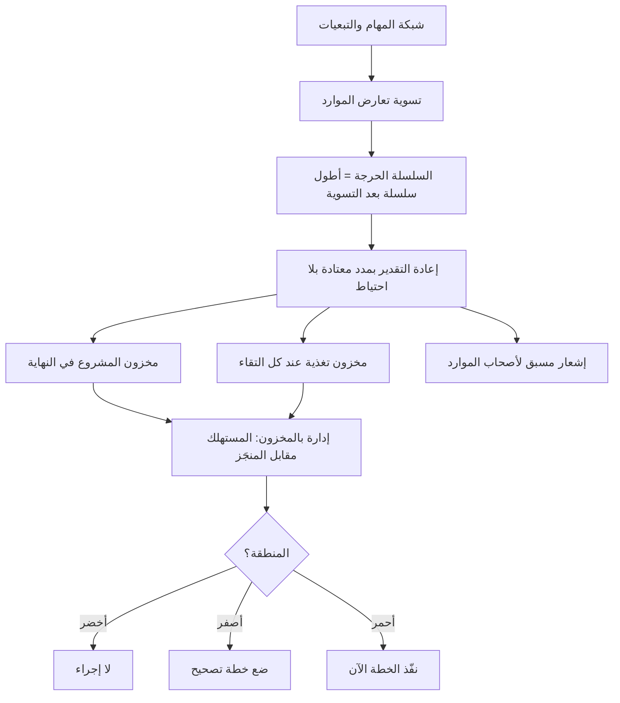

# السلسلة الحرجة (Critical Chain)

> [!info] تعريف مختصر
> **السلسلة الحرجة** أطول سلسلة من المهام المترابطة في المشروع بعد أخذ **تعارض الموارد** في الحسبان، لا التبعيات المنطقية وحدها. وهي محور طريقةٍ في الجدولة قدّمها إلياهو جولدرات في كتابه *Critical Chain* (1997) تطبيقًا لـ**نظرية القيود** على المشاريع، مؤدّاها: أن يُنتزع الاحتياط الزمني المخبّأ داخل تقدير كل مهمة، ويُجمَع في **مخزونات مؤقّتة (Buffers)** مشتركة عند مواضع محدّدة، ثم يُدار المشروع بمراقبة استهلاك هذه المخزونات لا بمراقبة مواعيد المهام. فالفرق عن [[Critical Path|المسار الحرج]] فرقان: أنها تحسب الموارد، وأنها تُدير **عدم اليقين** بمخزون مُجمَّع بدل أن تُوزّعه على المهام.

## الشرح العلمي والاحترافي

### 1. المشكلة التي جاءت لحلّها

- **كل مقدِّر يخبّئ احتياطًا في تقديره.** فمن سُئل عن مهمّة يعرف أنها تستغرق خمسة أيام في الأحوال المعتادة أجاب بثمانية، لأنه يُسأل عن **وعد** لا عن **تقدير**، ويُحاسَب على تجاوزه. فيتكوّن في المشروع احتياط ضخم موزّع على عشرات المهام.
- **ثم يُهدَر هذا الاحتياط كلّه في الطريق**، وذلك بثلاث آليات معروفة:
  1. **متلازمة الطالب (Student Syndrome):** أن يُؤجَّل البدء إلى قرب الموعد ما دام في المدّة فسحة، فيُستهلك الاحتياط قبل أن يبدأ العمل.
  2. **قانون باركنسون:** أن يتمدّد العمل حتى يملأ الوقت المتاح له، فلا يُسلَّم مبكرًا حتى لو أُنجز مبكرًا — إذ لا مصلحة لأحد في إعلان أنه انتهى قبل موعده.
  3. **تعدّد المهام المتزامنة (Multitasking):** أن يتنقّل الشخص بين ثلاث مهام فتطول الثلاث جميعًا. وهذا في نظر جولدرات أشدّ الثلاثة أثرًا.
- **والنتيجة المفارقة:** أن التأخير في المهام لا يُعوَّض، والتبكير لا يُنقَل. **فالتأخيرات تتراكم والتوفيرات تضيع** — ومشروع كل مهمّة فيه محتاطة قد يتأخّر كلّه.

### 2. الحلّ المقترح

- **تُقدَّر المهام بمدّة معتادة بلا احتياط** — أي بالمدّة التي تُنجز فيها في نحو نصف الحالات، لا في تسعين منها.
- **يُجمَع الاحتياط المنتزَع في مخزونات ثلاثة:**
  1. **مخزون المشروع (Project Buffer):** يوضع في **آخر السلسلة الحرجة**، وهو الذي يحمي تاريخ التسليم النهائي.
  2. **مخزون التغذية (Feeding Buffer):** يوضع حيث تلتقي سلسلة فرعية بالسلسلة الحرجة، فيمنع تأخّر الفرعية من دفع الحرجة.
  3. **مخزون الموارد (Resource Buffer):** ليس وقتًا مضافًا بل **إشعارًا مسبقًا** يُنبّه صاحب المورد بأن دوره يقترب فيتفرّغ له.
- **وعلّة التجميع إحصائية لا نفسية:** فتقلّبات المهام مستقلّة نسبيًّا، وبعضها يتأخّر وبعضها يبكّر. والاحتياط المُجمَّع يكفي للمجموع بأقلّ من مجموع الاحتياطات المفرّقة — ولهذا تكون خطّة السلسلة الحرجة **أقصر** من خطّة المسار الحرج المحتاطة عادةً، مع حماية أفضل لتاريخ التسليم.
- **ويُدار المشروع بمراقبة المخزون لا المواعيد:** تُقارَن نسبة المستهلك من مخزون المشروع بنسبة المنجَز من السلسلة الحرجة، وتُعرض في **مخطّط الحرارة (Fever Chart)** بثلاث مناطق — أخضر لا يستدعي شيئًا، وأصفر يستدعي وضع خطّة، وأحمر يستدعي التنفيذ. **فالمخزون المستهلك ليس خسارة بل هو وظيفته**، والإشارة في **معدّل** الاستهلاك لا في وقوعه.
- **وسلوك الفريق يتغيّر تبعًا:** لا مواعيد لكل مهمة على حدة، ولا مكافأة على «التسليم في الموعد» ولا لوم على تجاوزه. المطلوب **سباق التتابع (Relay Race)**: أن تبدأ فور وصول الدور، وتعمل بلا تشتيت، وتسلّم فور الانتهاء.

### 3. حدودها وما يُؤخذ عليها

- **تفترض التزامًا تنظيميًّا واسعًا**: انتزاع الاحتياط من التقديرات يقتضي أن يثق الفريق بأنه لن يُحاسَب على تجاوز مدّة نصف احتماليّة. **وهذا شرط ثقافي قبل أن يكون تقنيًّا، وسقوطه هو أشيع سبب لفشل تطبيقها**.
- **ليست معتمَدة معيارًا رسميًّا**، وإن كانت مذكورة في أدبيات المجال ومعروفة عند ممارسيه. وقواعد حساب حجم المخزون فيها تقريبية شائعة (كأن يُؤخذ نصف مجموع ما انتُزع) لا مشتقّة من نموذج إحصائي دقيق.
- **أثرها محلّ نقاش**: أدلّتها في الأصل دراسات حالة صناعية لا تجارب مضبوطة، ونقّادها يرون أن كثيرًا من مكاسبها يعود إلى **منع تعدّد المهام** وحده — وهو مكسب يمكن تحصيله بلا تبنّي الطريقة كاملة.
- **علاقتها بالأطر الرشيقة:** كثير من مبادئها يلتقي بكانبان التقاءً بيّنًا — تقليل العمل الجاري، ومنع التشتيت، وإدارة التدفّق لا المواعيد — وإن اختلفت اللغة والأدوات. فمن يعمل بحدّ [[WIP Limit|العمل الجاري]] يكون قد أخذ أنفع ما فيها من حيث لا يقصدها.

## جدول التمييز: المسار الحرج · السلسلة الحرجة · PERT

الثلاثة أدوات جدولة تُخلط كثيرًا، والفرق بينها فرق في **ما تُديره** لا في دقّة الحساب:

| وجه المقارنة | [[Critical Path\|المسار الحرج]] | السلسلة الحرجة | [[PERT]] |
|---|---|---|---|
| **ما يُدار فعلًا** | التبعيات المنطقية | الموارد والوقت الاحتياطي | عدم اليقين في المدد |
| **هل تُحسب الموارد؟** | لا | نعم، وهي جوهرها | لا |
| **طبيعة المدّة** | رقم واحد قاطع | مدّة معتادة بلا احتياط | ثلاثة تقديرات باحتمالاتها |
| **موضع الاحتياط** | داخل المهام أو في نهايتها | مخزونات مُجمَّعة معلنة | التباين محسوب لا مضاف |
| **ما يُراقَب أثناء التنفيذ** | مواعيد المهام الحرجة | معدّل استهلاك المخزون | احتمال الوفاء بالتاريخ |
| **ما تعجز عنه** | لا ترى تنازع الموارد | تحتاج ثقافة لا تحاسب على المهمة | تُقلّل مدّة المشروع عند تعدّد المسارات |

> **السؤال الفارق:** المسار الحرج يسأل **ما الذي يعطّل المشروع إن تأخّر؟**، والسلسلة الحرجة تسأل **من الذي لا يستطيع أن يعمل في مهمّتين معًا؟**، وPERT يسأل **بأيّ احتمال نفي بهذا التاريخ؟** — والثلاثة قد تُستعمل معًا على المشروع نفسه.

## أين ومتى يُستخدم

- في المشاريع التي **يتنازع فيها المشاريعُ المتوازية مواردَ نادرة مشتركة** — مهندس أمن واحد، أو بيئة اختبار واحدة، أو مختبر واحد. وهذا مجالها الأقوى بلا منازع.
- في المشاريع الهندسية والصناعية ذات المدد الطويلة والمهام المتسلسلة الواضحة.
- حيث يكون تاريخ التسليم النهائي **صلبًا** ويُراد حمايته بمخزون معلن بدل احتياطات مخبّأة لا يعرف أحد حجمها.
- عند تشخيص مشروع تتأخّر مهامه فرادى بلا سبب ظاهر: فمتلازمة الطالب وتعدّد المهام تفسّران كثيرًا من ذلك.
- **ولا تُستعمل** حيث يكون النطاق نفسه متغيّرًا باستمرار، إذ تفترض شبكة مهام مستقرّة نسبيًّا حتى تُحسب السلسلة.

## مثال وسيناريو تطبيقي

> [!example] سيناريو ملموس
> مشروع ربط نظام داخلي بمنصّة حكومية، وفيه ستّ مهام متسلسلة، ومهندس أمن معلومات واحد مطلوب في مهمّتين منها — **الرابعة والسادسة** — وهو نفسه يخدم مشروعين آخرين.
> **بمنطق المسار الحرج** كان المسار 42 يومًا، لأن الحساب نظر إلى التبعيات المنطقية فقط، وافترض أن المهندس متاح متى جاء دوره.
> **وبمنطق السلسلة الحرجة** تبيّن أن المهمّتين لا يمكن أن تتوازيا مع التزاماته الأخرى، فامتدّت السلسلة إلى **51 يومًا** — وهو الرقم الصادق الذي كان يقع فعلًا في المشاريع السابقة بلا أن يُفسَّر.
> ثم أُعيدت الجدولة: انتُزع من تقديرات المهام الستّ ما مجموعه 12 يومًا كانت احتياطات مخبّأة، ووُضع منها **6 أيام مخزون مشروع** في النهاية، و**يومان مخزون تغذية** حيث تلتقي سلسلة تجهيز البيانات بالسلسلة الحرجة، مع **إشعار للمهندس قبل دوره بأسبوع** ليتفرّغ.
> فصار التاريخ المعلن 47 يومًا بدل 51، وصار السؤال في اجتماع المتابعة سؤالًا واحدًا: **كم استُهلك من المخزون مقابل ما أُنجز من السلسلة؟** وحين استُهلك ثلثه وقد أُنجز خُمس السلسلة، ظهرت الإشارة الحمراء في الأسبوع الثاني — أي **قبل أن يظهر أي تأخّر في أي مهمّة**.

## خطوات أو مخطّط

1. ابنِ شبكة المهام وتبعياتها كما تفعل في [[Critical Path|المسار الحرج]].
2. **أضف قيد الموارد**: أيّ مهمّتين تحتاجان الشخص أو الأصل نفسه ولا يمكن أن تتوازيا؟ وسوِّ التعارض.
3. حدّد **أطول سلسلة بعد التسوية** — وهذه هي السلسلة الحرجة، وقد تختلف عن المسار الحرج.
4. **أعد تقدير المهام بلا احتياط**: اسأل عن المدّة المعتادة لا عن المدّة الآمنة، وصرّح بأن التجاوز متوقّع ولا يُحاسَب عليه.
5. **ضع المخزونات**: مخزون المشروع في نهاية السلسلة، ومخزون تغذية عند كل التقاء سلسلة فرعية بها.
6. **أضف إشعارات الموارد** قبل مواعيد الحاجة بمدّة كافية.
7. **امنع تعدّد المهام صراحةً**: شخص واحد لمهمّة واحدة حتى يفرغ منها.
8. **أدر بالمخزون**: راقب نسبة استهلاكه مقابل نسبة الإنجاز، وتصرّف بحسب المنطقة لا بحسب تأخّر مهمّة.

## ⚠️ مفاهيم خاطئة شائعة

> [!warning]
> - **الظنّ أنها المسار الحرج بتسمية أخرى**: الفرق جوهري لا لفظي؛ فهي تحسب **تعارض الموارد** ولا يحسبه المسار الحرج، وتُدير الاحتياط مُجمَّعًا لا موزّعًا.
> - **الظنّ أن استهلاك المخزون خلل**: المخزون وُضع ليُستهلك، والإشارة في **معدّل** استهلاكه مقارنًا بنسبة الإنجاز، لا في مجرّد نقصانه.
> - **الظنّ أن انتزاع الاحتياط ضغط على الفريق**: المقصود عكسه — أن يُرفع عن الفرد عبء الوعد الفردي ويُنقل إلى مخزون جماعي معلن. **وإن بقيت المحاسبة على المهمّة قائمة، فقد صارت الطريقة ضغطًا فعلًا، وهذا هو أشيع فشل تطبيقها.**
> - **الظنّ أنها لا تناسب البرمجيات**: تناسبها حيث تكون الموارد المتخصّصة نادرة ومشتركة، وهو حال كثير من فرق التشغيل والأمن والبيانات.
> - **الخلط بين مخزون المشروع و[[Contingency Reserve|احتياطي الطوارئ]]**: هذا مخزون **زمني** يحمي تاريخًا من التقلّب المعتاد، وذاك احتياطي يُخصَّص لمخاطر مُعرَّفة مرصودة في [[Risk Register|سجلّ المخاطر]].

## ❌ ممارسات خاطئة في المشاريع

> [!failure]
> - **انتزاع الاحتياط من التقديرات مع إبقاء المحاسبة على مواعيد المهام**: يتعلّم الفريق أن يعيد تخبئة الاحتياط في أماكن أخفى، فتُفقد الطريقة أثرها وتبقى كلفتها. **التجنّب:** أعلن صراحةً أن تجاوز مدّة المهمة متوقّع ولا يُقيَّم به أحد، ثم اجعل التقييم على انضباط سباق التتابع.
> - **وضع مخزون المشروع ثم إخفاؤه عن العميل خشية أن يطلب اختصاره**: يعود المخزون إلى الظلّ فتضيع وظيفته الرقابية، ويُدار المشروع بمواعيد مرة أخرى. **التجنّب:** اعرض المخزون بوصفه أداة حماية للتاريخ المُعلن لا فسحة قابلة للقصّ.
> - **تطبيق الطريقة على مشروع واحد داخل منظّمة تُشتّت مواردها بين عشرة**: الشرط الأساسي — تفرّغ المورد لمهمّته — يقع خارج المشروع، فتفشل الطريقة ويُنسب الفشل إليها. **التجنّب:** ابدأ بضبط تعدّد المهام على مستوى المحفظة، وانظر [[23 - Project Program Portfolio|المشروع والبرنامج والمحفظة]].
> - **حساب المخزون نسبةً ثابتة بلا نظر إلى تقلّب المهام**: سلسلة مهامها متقلّبة تحتاج مخزونًا أكبر من سلسلة مستقرّة بالطول نفسه. **التجنّب:** عاير حجم المخزون بتاريخ المشروعات المشابهة عندك، لا بقاعدة عامّة منقولة.
> - **الاكتفاء بمخطّط الحرارة تقريرًا للإدارة بلا قرار**: يصير المخطّط زينةً في الشريحة، ويُعرض أحمر ثلاثة أسابيع بلا تصرّف. **التجنّب:** اربط كل منطقة بإجراء مُعرَّف مسبقًا وصاحب قرار مسمّى.

## 🔗 مصطلحات ومفاهيم ذات صلة

[[Critical Path]] | [[PERT]] | [[Buffer]] | [[Contingency Reserve]] | [[Context Switching Cost]] | [[WIP Limit]] | [[Bottleneck]] | [[Gantt Chart]] | [[Monte Carlo Simulation]] | [[Estimation Variance]] | [[23 - Project Program Portfolio]]
