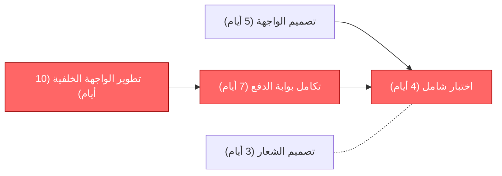

# المسار الحرج (Critical Path)

> [!info] تعريف مختصر
> المسار الحرج (Critical Path) هو أطول سلسلة من المهام المترابطة في المشروع، والتي تحدّد أقصر مدة زمنية ممكنة لإنجاز المشروع بأكمله. أي تأخير في مهمة على هذا المسار يؤخّر تاريخ التسليم النهائي مباشرة.

## الشرح العلمي والاحترافي
- يُحسَب المسار الحرج بتحليل جميع مسارات المهام المترابطة في مخطط الشبكة (Network Diagram) واختيار المسار الأطول زمنياً، لأنه هو الذي يحدّد الحد الأدنى لمدة المشروع، وليس أقصر مسار.
- كل مهمة على المسار الحرج لديها "احتياط زمني صفري" (Zero Float أو Zero Slack)، أي لا يمكن تأخيرها ولو بيوم واحد دون أن يتأخر المشروع كله. أما المهام خارج المسار الحرج فلديها احتياط زمني (Float) يسمح بتأخيرها قليلاً دون التأثير على الموعد النهائي.
- يُحسَب باستخدام تقنية تحليل الشبكة (Critical Path Method - CPM)، وهي إحدى أدوات جدولة المشروع الأساسية في مخططات جانت ([[Gantt Chart]])، حيث تُحدَّد لكل مهمة: أبكر وقت بدء ممكن، وأبكر وقت انتهاء، وأحدث وقت بدء وانتهاء دون تأخير المشروع.
- إدارة المسار الحرج جزء أساسي من إدارة الوقت في المشروع؛ فمراقبة هذه المهام تحديداً، وليس كل المهام بنفس الاهتمام، هي أكثر استخداماً فعّالاً لوقت مدير المشروع المحدود.
- يرتبط المسار الحرج بمفهوم [[Buffer]] (احتياط الوقت) الذي يُضاف أحياناً في نهاية المسار الحرج لامتصاص أي تأخير طفيف غير متوقع دون التأثير على الموعد النهائي التعاقدي.
- في المشاريع الرشيقة يقل استخدام مصطلح "المسار الحرج" الرسمي لأن الجدولة تعتمد على سبرنتات قصيرة، لكن المفهوم الأساسي (تحديد الاعتماديات ([[Dependency]]) الأكثر تأثيراً على الموعد) يبقى مفيداً عند التخطيط لإطلاقات كبرى تضم عدة فرق.

## أين ومتى يُستخدم
- يُستخدم أساساً في مشاريع الشلال ([[04 - Waterfall]]) وإدارة المشاريع التقليدية عند بناء الجدول الزمني الأولي وأثناء المراقبة طوال التنفيذ.
- يُلجأ إليه عند تقييم أثر أي [[Change Request]] أو تأخير على تاريخ التسليم النهائي: هل المهمة المتأخرة على المسار الحرج أم لا؟
- يُستخدم في التخطيط لمشاريع كبرى متعددة الفرق (مثل إطلاق منتج جديد) لتحديد أي الفرق يجب مراقبته عن كثب لأن تأخره يؤخر الجميع.
- يظهر في تحليل [[Monte Carlo Simulation]] لتقدير احتمالية تسليم المشروع في موعده مع الأخذ بعين الاعتبار تباين المسارات المختلفة.

## مثال وسيناريو تطبيقي
> [!example] سيناريو ملموس
> مشروع بناء تطبيق حجز فنادق لشركة "درة السفر" يتضمن أربع مهام رئيسية: تصميم واجهة المستخدم (5 أيام)، تطوير الواجهة الخلفية (10 أيام)، تكامل بوابة الدفع (7 أيام يبدأ بعد الواجهة الخلفية)، واختبار شامل (4 أيام يبدأ بعد التكامل).
> بالتوازي، هناك مهمة تصميم الشعار والهوية البصرية التي تستغرق 3 أيام فقط ولا ترتبط بأي مهمة أخرى قبل الإطلاق.
> المسار الحرج هنا هو: تطوير الواجهة الخلفية (10) ← تكامل بوابة الدفع (7) ← اختبار شامل (4) = 21 يوماً، وهو أطول من مسار التصميم (5 أيام) أو الشعار (3 أيام). لذلك، حتى لو تأخر تصميم الشعار يوماً كاملاً، فلن يؤثر على تاريخ الإطلاق لأن لديه احتياطاً زمنياً (Float) يفوق ذلك.
> لكن حين تأخر تكامل بوابة الدفع يومين بسبب مشكلة في وثائق مزوّد الدفع، تأخر تاريخ الإطلاق يومين كاملين تلقائياً، لأن هذه المهمة على المسار الحرج بلا أي احتياط زمني.

## خطوات أو مخطّط
1. تحديد جميع مهام المشروع ومدة كل مهمة وترتيب الاعتماديات ([[Dependency]]) بينها.
2. رسم مخطط الشبكة (Network Diagram) الذي يوضّح تسلسل المهام والمسارات الممكنة.
3. حساب أبكر وقت بدء وانتهاء لكل مهمة (تمرير أمامي - Forward Pass).
4. حساب أحدث وقت بدء وانتهاء ممكن لكل مهمة دون تأخير المشروع (تمرير خلفي - Backward Pass).
5. حساب الاحتياط الزمني (Float) لكل مهمة: الفرق بين أحدث وقت وأبكر وقت.
6. تحديد المسار الحرج: المهام التي احتياطها الزمني يساوي صفراً.
7. مراقبة هذه المهام بأولوية قصوى طوال التنفيذ، وتحديث الحساب عند أي تغيير في المدة أو الاعتماديات.

## ⚠️ مفاهيم خاطئة شائعة
> [!warning]
> - الاعتقاد أن المسار الحرج هو "أقصر" طريق لإنجاز المشروع؛ الصحيح أنه أطول مسار من المهام المترابطة، وهو ما يحدّد الحد الأدنى لمدة المشروع.
> - الظن بأن جميع المهام مهمة بنفس القدر؛ في الواقع المهام خارج المسار الحرج تملك احتياطاً زمنياً (Float) يسمح بتأخيرها دون التأثير على الموعد النهائي، بينما مهام المسار الحرج لا تحتمل أي تأخير.
> - الاعتقاد بأن المسار الحرج ثابت طوال المشروع؛ في الواقع يمكن أن يتغيّر إذا تأخرت مهمة كان لديها احتياط زمني كبير حتى استنفدته بالكامل، فتصبح جزءاً من مسار حرج جديد.

## ❌ ممارسات خاطئة في المشاريع
> [!failure]
> - توزيع الاهتمام والموارد بالتساوي على جميع المهام دون تمييز مهام المسار الحرج، مما يهدر جهداً على مهام لديها احتياط زمني بينما تتأخر المهام الحرجة الفعلية. التجنب: تحديد المسار الحرج بوضوح ومتابعته يومياً بأولوية أعلى.
> - عدم إعادة حساب المسار الحرج بعد كل تغيير في الجدول أو الاعتماديات، فيستمر الفريق بمراقبة مسار لم يعد هو الأطول فعلياً. التجنب: تحديث تحليل المسار الحرج فور أي تغيير جوهري في المدد أو الترتيب.
> - إهمال إضافة [[Buffer]] في نهاية المسار الحرج للمشاريع عالية المخاطر، فيتحوّل أي تأخير بسيط وغير متوقع إلى تأخير مباشر في التسليم النهائي. التجنب: تخصيص احتياط زمني معقول في نهاية المسار الحرج بناءً على تحليل المخاطر.

## 🔗 مصطلحات ومفاهيم ذات صلة
[[Gantt Chart]] | [[Dependency]] | [[Buffer]] | [[Milestone]] | [[Monte Carlo Simulation]] | [[04 - Waterfall]] | [[Baseline]] | [[Contingency Reserve]] | [[CPI and SPI]]
