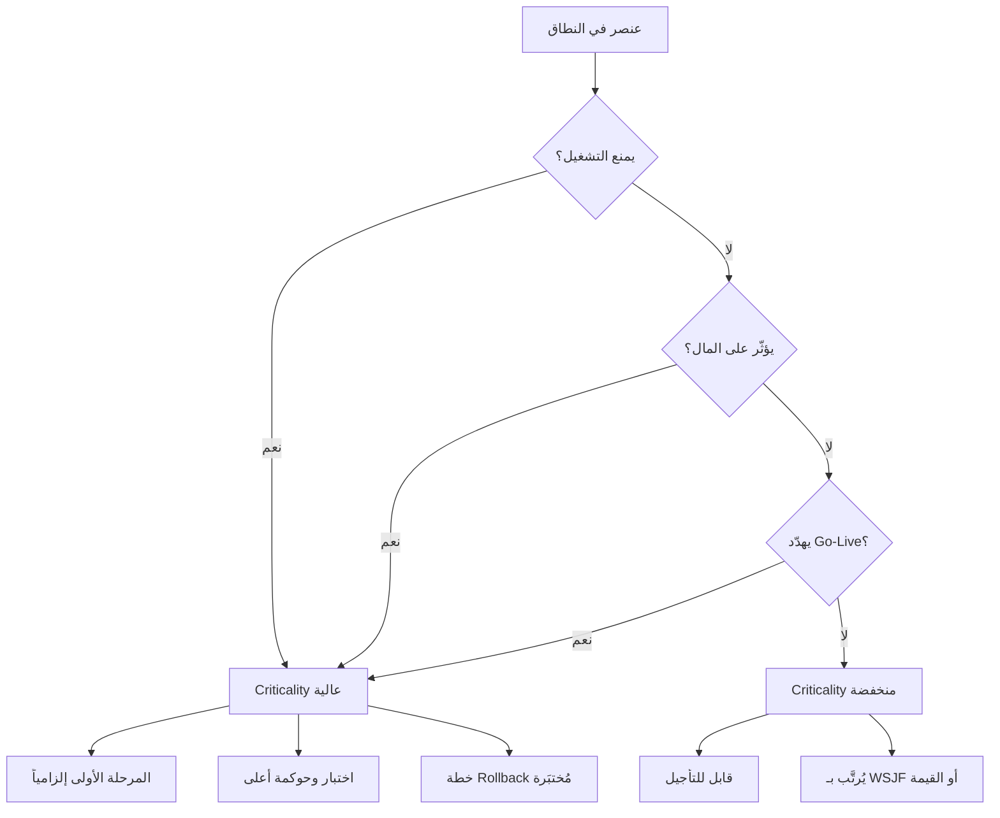

---
title: "Criticality — الحرجية: تكلفة الفشل لا حجم العمل"
aliases: [Criticality, الحرجية, Business Criticality, تكلفة الفشل]
type: مصطلح
area: "[[Project Management]]"
tags:
  - إدارة-المشاريع
  - معجم
  - مخاطر
status: لم يبدأ
---
# الحرجية (Criticality)

> [!info] تعريف مختصر
> **الحرجية** مقياس لـ**تكلفة فشل** عنصر ما — لا لصعوبة بنائه ولا لحجمه. تجيب على سؤال واحد: *ماذا يتعطّل في المؤسسة لو لم يعمل هذا العنصر؟* وهي بذلك مستقلّة تماماً عن **التعقيد** (`Complexity`): قد يكون عنصران متساويين في صعوبة البناء ومتباعدين تماماً في أثر فشلهما. وأهمّيتها العملية أنها تحدّد **مستوى الحوكمة والاختبار والمتابعة** الذي يستحقّه العنصر، وتحدّد ما يدخل المرحلة الأولى وما يُؤجَّل — فالحرجية تغلب الحجم دائماً.

## الشرح العلمي والاحترافي

- **الفصل الجوهري بين محورين مستقلّين**:
  | | `Complexity` (التعقيد) | `Criticality` (الحرجية) |
  |---|---|---|
  | يقيس | صعوبة البناء | **تكلفة الفشل** |
  | يجيب عن | «كم سيستغرق؟» | «**ماذا يتعطّل بدونه؟**» |
  | مالكه | الفريق التقني | **صاحب العمل** |
  | أثره | على الجدول والتكلفة | على **الحوكمة والاختبار وقرار المرحلة** |

- **الأمثلة التي تكشف الاستقلال بين المحورين**:
  | العنصر | `Complexity` | `Criticality` | لماذا |
  |---|---|---|---|
  | `Dashboard` | متوسط | **منخفضة** | لو تعطّل نستمرّ بالعمل |
  | `Opening Balance` | متوسط | **شديدة الارتفاع** | لو فشل فشل الإطلاق كلّه |
  | `Invoice Posting` | متوسط | عالية | يوقف الدورة المالية |
  | `Barcode` | متوسط | عالية | يهدم دقة المخزون |
  
  لاحظ أن الأربعة **متساوون في التعقيد** ومتباعدون تماماً في الحرجية. ولو رتّبت العمل بالتعقيد وحده لعاملتها بالتساوي — وهذا خطأ يكلّف إطلاقاً كاملاً.

- **الأسئلة الثلاثة التي تحدّد الحرجية العالية**:
  1. **هل يمنع التشغيل؟** — لا يستطيع الناس أداء عملهم اليومي بدونه.
  2. **هل يؤثّر على المال؟** — يوقف بيعاً أو تحصيلاً أو قيداً محاسبياً.
  3. **هل يهدّد الإطلاق؟** — فشله يعني `No-Go`.
  
  إجابة «نعم» على أيٍّ منها ⇒ حرجية عالية ⇒ دخول المرحلة الأولى إلزامياً.

- **الحرجية كمضاعِف في التقدير**: في [[PFRE]] تدخل الحرجية بوصفها مضاعِفاً (1.0 / 1.2 / 1.3). ولاحظ أن **مداها أضيق** من مدى التكامل (1.1→1.6) — وهذا مقصود: الحرجية لا تضاعف **العمل** بل تضاعف **الحذر** (اختباراً إضافياً، ومراجعةً، وتوثيقاً، وخطة تراجع). وهي زيادة حقيقية في الجهد لكنها أقلّ من زيادة التكامل.

- **الحرجية كمحدِّد لمستوى الحوكمة**: العنصر عالي الحرجية يستحقّ:
  - **متابعة أعلى** — يُرفع إلى [[Steering Committee]] لا إلى الاجتماع الأسبوعي.
  - **اختبار أعلى** — دورة `UAT` مخصّصة وسيناريوهات استثنائية.
  - **حوكمة أعلى** — قرار مكتوب في [[Decision Log]] قبل البناء.
  - **خطة تراجع** — [[Rollback]] مُختبَرة لا مُعلَنة.

- **العلاقة بالتقسيم المرحلي**: هنا يظهر الدرس المضادّ للحدس. عنصر بوزن ثقيل جداً (تخصيص كبير، جهد مرتفع) وحرجية عالية جداً **يدخل المرحلة الأولى** رغم كلفته، بينما عنصر أخفّ منه بحرجية منخفضة يُؤجَّل. فالمعيار ليس «كم يكلّف؟» بل **«ماذا يتعطّل بدونه؟»**.

- **الفرق عن `Priority` و`Severity`**: `Priority` قرار ترتيب يمكن أن يتغيّر بتغيّر السياق؛ و`Severity` وصف لخطورة **خلل وقع فعلاً**؛ أمّا `Criticality` فخاصية **بنيوية** للعنصر نفسه، ثابتة نسبياً ما دامت العملية التجارية ثابتة. ولذلك تُحدَّد مرّة في التحليل وتُراجَع نادراً، بخلاف الأولوية التي تُراجَع كل دورة.

## أين ومتى يُستخدم
- في [[Fit-Gap Analysis]] وأثناء [[PFRE]] كمضاعِف تقدير وكعمود تصنيف مستقلّ.
- عند **قرار التقسيم إلى مراحل**: الحرجية هي المرشِّح الأول لعمود `Can Delay?`.
- في **تخطيط الاختبار**: توزيع عمق `UAT` على العناصر بحسب الحرجية لا بحسب عددها.
- في **تحديد مستوى الحوكمة**: أي عنصر عالي الحرجية يحتاج مالك قرار مُسمّى و[[SLA]] أقصر.
- عند **التفاوض على تقليص النطاق تحت ضغط الوقت**: الحرجية هي الخطّ الذي لا يُتجاوَز — يُقلَّص كل شيء عداها.
- في **خطط الاستمرارية و[[Rollback]]**: العناصر عالية الحرجية هي التي تستحقّ سيناريو تراجع مُختبَراً.

## مثال وسيناريو تطبيقي
> [!example] شركة توزيع بثلاثة فروع — قرار مرحلي محيّر
> ثمانية متطلبات مُقدَّرة بـ[[PFRE]]، ومن بينها بندان لافتان:
>
> | المتطلَّب | الجهد | `Criticality` | الاعتمادية | القرار |
> |---|---|---|---|---|
> | `Branch Credit Limit` | **25 وحدة** (الأثقل) | **شديدة الارتفاع** | المالية + الفروع | **المرحلة الأولى** |
> | `Mobile App` | 18 وحدة | منخفضة | لا شيء | المرحلة الثانية |
>
> كلاهما **تخصيص ثقيل**، والأول أثقل من الثاني بـ39%. وكل غريزة إدارية تقول: أجّل الأثقل.
>
> لكن `Branch Credit Limit` **يمنع الفروع من البيع والتحصيل** إن تعطّل — أي أنه يفشل في الأسئلة الثلاثة كلّها (يمنع التشغيل ✔ · يؤثّر على المال ✔ · يهدّد الإطلاق ✔). أمّا التطبيق الجوّال فلا يمنع أحداً من العمل، واعتماديته التشغيلية `None`.
>
> **القرار:** الأثقل يدخل أولاً والأخفّ يُؤجَّل. ومعه استراتيجية تسليم مختلفة: `Executive Monitoring` — أي يُتابَع في [[Steering Committee]] لا في الاجتماع الأسبوعي، وتُخصَّص له دورة اختبار مستقلّة، وتُكتب له خطة تراجع.
>
> **الأثر:** لولا فصل الحرجية عن الحجم لخرج البند الأثقل إلى المرحلة الثانية، ولانطلق النظام بفروع لا تستطيع البيع — وهو `Go-Live` ناجح تقنياً وفاشل تشغيلياً.

## خطوات أو مخطّط
1. اجمع كل عناصر النطاق من [[Fit-Gap Analysis]].
2. اسأل عن كل عنصر الأسئلة الثلاثة: يمنع التشغيل؟ يؤثّر على المال؟ يهدّد الإطلاق؟
3. صنّف الحرجية: `Low` / `Medium` / `High` / `Very High` — واكتب **سبب التصنيف** لا الدرجة فقط.
4. سجّل الحرجية في **عمود مستقلّ** عن التعقيد — ولا تدمجهما في «أهمية» واحدة.
5. استخدمها مضاعِفاً في [[PFRE]] (1.0 / 1.2 / 1.3).
6. استخدمها محدِّداً لعمود `Can Delay?` في قرار التقسيم.
7. اشتقّ منها مستوى الحوكمة: مَن يتابع؟ وبأي وتيرة؟ وما عمق الاختبار؟
8. راجعها فقط عند **تغيّر العملية التجارية** — لا كل سبرنت.

## ⚠️ مفاهيم خاطئة شائعة
> [!warning]
> - **الخلط بين الحرجية والتعقيد**: أشيع خطأ على الإطلاق. عنصر بسيط البناء قد يكون أخطر عنصر في المشروع (الرصيد الافتتاحي مثلاً).
> - **الخلط بينها وبين الأولوية**: الأولوية قرار ترتيب يتغيّر بالسياق؛ والحرجية خاصية بنيوية ثابتة نسبياً.
> - **الظنّ بأن الحرجية العالية تعني «مهمّ للعميل»**: العميل قد يتحمّس لتقرير تنفيذي أنيق حرجيته صفر. الحرجية تقيس **الاعتماد التشغيلي** لا الحماس.
> - **افتراض أن الحرجية تُقدَّر تقنياً**: هي حكم **صاحب العمل** لا المهندس. المهندس يقول «هذا صعب»، وصاحب العمل يقول «هذا لو تعطّل توقفنا».
> - **اعتبارها ثابتة عبر المشاريع**: `Barcode` حرجيّته عالية في شركة توزيع بأربعة مستودعات، ومنخفضة في شركة خدمات بلا مخزون.
> - **الظنّ بأنها تُبرّر التخصيص**: الحرجية العالية تعني أن العنصر يجب أن **يعمل**، لا أنه يجب أن يُبنى مخصّصاً. الحلّ القياسي عالي الحرجية أفضل من تخصيص عالي الحرجية.

## ❌ ممارسات خاطئة في المشاريع
> [!failure]
> - **ترتيب العمل بالحجم وحده**: يدفع البنود الثقيلة عالية الحرجية إلى الوراء فينطلق النظام بلا قدرة تشغيلية. الحلّ: عمود `Criticality` إلزامي في جدول قرار التقسيم.
> - **توزيع جهد الاختبار بالتساوي على العناصر**: يمنح `Dashboard` وقتاً يساوي وقت `Opening Balance`. الحلّ: خصّص عمق `UAT` بحسب الحرجية.
> - **تقدير الحرجية داخل الفريق التقني وحده**: يُنتج تصنيفاً يعكس صعوبة البناء لا أثر الفشل. الحلّ: جلسة تصنيف مع `Business Owner` وتوثيق سبب كل درجة.
> - **إهمال خطة التراجع للعناصر عالية الحرجية**: أخطر ما في الإطلاق أن العنصر الذي لا يُحتمل فشله لا خطة لفشله. الحلّ: كل عنصر `Very High` يحتاج [[Rollback]] مُختبَراً لا مكتوباً.
> - **تجميد التصنيف بعد التحليل**: تغيّر نموذج العمل (فتح فرع جديد، تغيير سياسة ائتمان) يغيّر الحرجية. الحلّ: مراجعة عند كل تغيير جوهري في العملية.
> - **استخدامها لتبرير تجاهل التقدير**: «هذا حرج فلننفّذه مهما كلّف» يُنتج تجاوزاً في الجدول. الحلّ: الحرجية تحدّد **ما يُنفَّذ أولاً**، ولا تلغي حساب كلفته.

## 🔗 مصطلحات ومفاهيم ذات صلة
[[PFRE]] | [[Fit-Gap Analysis]] | [[Rollback]] | [[RAID Log]] | [[Decision Log]] | [[Steering Committee]] | [[WSJF]] | [[10 - PFRE Decision Model]] | [[Go or No-Go Decision]]
