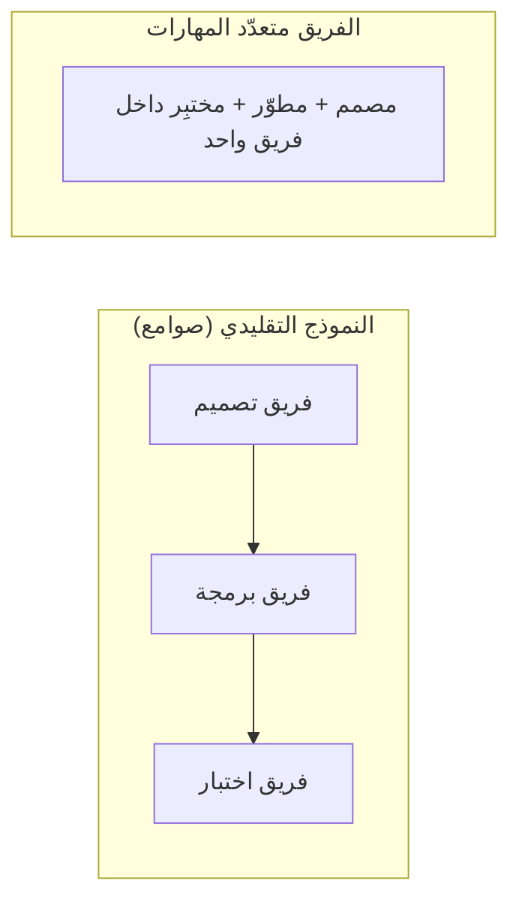

# الفريق متعدّد المهارات (Cross-functional Team)
> [!info] تعريف مختصر
> الفريق متعدّد المهارات هو فريق يضم أعضاء بتخصصات مختلفة (تصميم، برمجة، اختبار، بيانات...) تكفي مجتمعةً لتسليم منتج كامل من البداية للنهاية، دون الاعتماد على فرق خارجية.

## الشرح العلمي والاحترافي
في المنظمات التقليدية، تُقسَّم الفرق حسب التخصص الوظيفي (فريق تصميم منفصل، فريق برمجة منفصل، فريق اختبار منفصل)، فيتنقّل العمل بينها كمنتج نصف مصنّع ينتظر دوره في كل قسم. هذا يُنتج تأخيراً كبيراً بسبب الانتظار بين الأقسام (انظر Handoff وBottleneck).

الفريق متعدّد المهارات يقلب هذا الترتيب: يجمع كل الكفاءات اللازمة داخل فريق واحد صغير (عادة 5 إلى 9 أشخاص)، فيصبح قادراً على أخذ عنصر عمل من الفكرة حتى الإنتاج دون انتظار موافقات أو تسليمات خارجية.

كيف يعمل:
- الفريق يمتلك كل المهارات اللازمة (Full-Stack) أو قريباً من ذلك.
- يُقلّل الاعتماد على أشخاص محوريين خارج الفريق (Bus Factor منخفض).
- يُشجّع تبادل المهارات (Cross-training) بين الأعضاء بمرور الوقت.
- يُسرّع دورة القيمة لأن معظم القرارات تُتخذ داخلياً.

لماذا يهم: منهجيات رشيقة مثل سكرَم (Scrum) تفترض صراحة أن المطوّرين يجب أن يكونوا متعدّدي المهارات وقادرين على تسليم زيادة قابلة للشحن (Increment) كل سبرنت دون انتظار أي فريق آخر.

## أين ومتى يُستخدم
- عند تشكيل فرق سكرَم (Scrum) أو فرق منتج (Product Teams) دائمة.
- في الشركات التي تتبنى بنية "الفريق الصغير المستقل" (Squad Model).
- عند إعادة هيكلة تنظيمية للتخلص من صوامع الأقسام (Silos) وتسريع التسليم.
- عند بناء فرق منصات (Platform Teams) تخدم منتجات متعددة.

## مثال وسيناريو تطبيقي
> [!example] كانت شركة تجارة إلكترونية تُطلق ميزة جديدة خلال 3 أشهر لأن الطلب يمرّ عبر: فريق تصميم منفصل (أسبوعان انتظار)، ثم فريق برمجة (شهر)، ثم فريق اختبار منفصل (3 أسابيع انتظار + أسبوع تنفيذ). أعادت الشركة الهيكلة إلى فرق متعددة المهارات: كل فريق يضم مصمماً ومطورَين ومختبِراً بدوام كامل. أصبح نفس نوع الميزات يُطلَق خلال 3 أسابيع فقط، لأن كل القرارات والعمل يحدث داخل الفريق نفسه دون انتظار أدوار خارجية.

## خطوات أو مخطّط
1. تحديد كل المهارات اللازمة لتسليم قيمة كاملة (تصميم، تطوير، اختبار، بيانات...).
2. تجميع أشخاص من هذه التخصصات في فريق واحد ثابت وصغير الحجم.
3. تحديد هدف مشترك للفريق (مثل ملكية ميزة أو منتج كامل) لا مهمة تخصصية ضيقة.
4. تشجيع تبادل المعرفة الداخلي لتقليل الاعتماد على فرد واحد.
5. قياس الأداء بناءً على القيمة المُسلَّمة للعميل، لا بإنتاجية تخصص بمفرده.

## ⚠️ مفاهيم خاطئة شائعة
> [!warning]
> - لا يعني أن كل عضو يجب أن يتقن كل المهارات بنفس المستوى (نموذج شخص T-Shaped لا نموذج "خبير في كل شيء").
> - ليس بديلاً عن التخصص العميق؛ الأعضاء لديهم تخصص أساسي مع معرفة عامة بالمجالات الأخرى.
> - لا يعني إلغاء الفرق المتخصصة تماماً؛ بعض الوظائف (كالأمن السيبراني المركزي) قد تبقى مشتركة بين عدة فرق.

## ❌ ممارسات خاطئة في المشاريع
> [!failure]
> - تسمية فريق "متعدّد المهارات" بينما يظل يعتمد فعلياً على موافقات فريق خارجي لكل تسليم — الحل: التأكد من امتلاك الفريق للسلطة والمهارة الفعليتين لا الاسم فقط.
> - إجبار الفريق على تسليم مهام غير متعلقة بهدفه الأساسي لأنه "يستطيع فعل كل شيء" — الحل: الحفاظ على تركيز واضح للفريق حول منتج أو ميزة محددة.
> - إهمال بناء الكفاءات المشتركة بين الأعضاء، فيبقى الفريق معتمداً داخلياً على شخص واحد لكل مهارة — الحل: تشجيع البرمجة الزوجية (Pair Programming) ومراجعة الأكواد المشتركة.

## 🔗 مصطلحات ومفاهيم ذات صلة
[[Self-Organizing Team]] | [[Bottleneck]] | [[Cycle Time]] | [[Increment]] | [[Capacity]] | [[02 - Scrum]] | [[03 - Kanban]] | [[Value Stream Mapping]]

> [!tip] 💡 إثراء عملي — كورس الإنتاجية
> الشروط الثلاثة للفريق متعدّد الوظائف (أكثرها إهمالًا **سلطة القرار**)، ومتى تكون الصومعة صحيحة: [[03 - الفجوة الكبرى والفوضى التشغيلية]].
