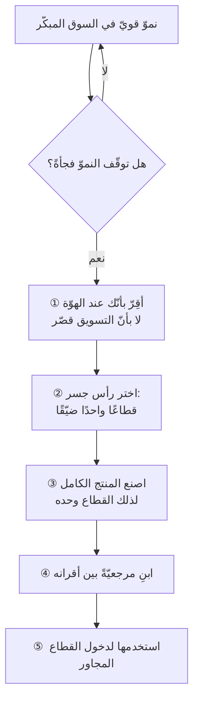

# عبور الهوّة (Crossing the Chasm)

## تعريف مختصر

**الهوّة** فجوة سلوكية حادّة بين **السوق المبكّر** — المتبنّون الأوائل الذين يشترون رؤيةً — و**السوق الجماهيريّ** الذي يشتري **مرجعيّةً وضمانًا**. و**عبور الهوّة** هو تغيير المنتج والتسويق والتموضع تغييرًا متعمّدًا للانتقال بينهما، بدل الاعتماد على زخم النموّ السابق.

## الشرح العلمي

الاسم من كتاب **جيفري مور** *Crossing the Chasm* (١٩٩١)، وهو تعديل نقديّ على **منحنى انتشار الابتكار** لإفريت روجرز (١٩٦٢). فروجرز رسم انتقالًا سلسًا بين خمس فئات متبنّين؛ ومور قال إنّ المنحنى في **منتجات التقنية العالية** ليس متّصلًا: بين *المتبنّين الأوائل (early adopters)* و*الأغلبية المبكّرة (early majority)* **انقطاع**، لأنّ دوافع الشراء عند الفئتين متعارضة لا متدرّجة.

| | السوق المبكّر | السوق الجماهيريّ |
|---|---|---|
| **يشتري** | رؤيةً وقفزةً | تحسينًا مضمونًا |
| **يحتمل** | نقصًا وخشونة | لا يحتمل |
| **مرجعه** | حدسه هو | **أقرانه** الذين اشتروا قبله |
| **كلفة بيعه** | منخفضة (كلام منقول داخل مجتمع مغلق) | عالية (تموضع، ودعم، وتكامل) |

والمفارقة القاتلة: **المتبنّي المبكّر مرجع رديء عند الأغلبية المبكّرة** — فالثاني لا يثق برأي الأوّل بالضبط لأنّه يعدّه متهوّرًا. فالمرجعيّة التي بنيتَها في السوق الأولى **لا تنتقل** إلى الثانية.

وعلاج مور **استراتيجية رأس الجسر (beachhead)**: بدل مخاطبة السوق الجماهيريّ كلّه، اختر **قطاعًا واحدًا ضيّقًا** واحتلّه احتلالًا كاملًا حتى تصير فيه المعيار — ثم استخدم مرجعيّته لدخول القطاع المجاور.

## أين ومتى

- عند التخطيط لجولة تمويل تُقدَّم على أنّها «توسّع»، للتمييز بين **نموّ داخل السوق المبكّر** ونموّ حقيقيّ.
- عند تفسير **ركود مفاجئ** بعد نموّ قويّ متّصل — وهو العرَض الكلاسيكيّ لبلوغ حافّة الهوّة.
- عند اتّخاذ قرار **فتح سوق جغرافية جديدة**: أهو حلّ للمشكلة أم تأجيل لها؟

## مثال وسيناريو

> [!example] عرَض الهوّة كما يصفه ممارس
> يصف **سامر السحن** في [[11.1 التوسّع وعبور الهوّة - سامر السحن]] نمطًا رآه في خمس شركات متتالية: ينضمّ إلى الشركة بعد أكبر جولة تمويل، وقد كانت تنمو نموًّا بخانتين — فيجد النموّ قد اختفى. وتشخيصه أنّ الشركات تعبر إلى السوق الجماهيريّ **بالقصور الذاتيّ**: بالفريق نفسه، وملاءمة المنتج للسوق نفسها، واستراتيجية الدخول نفسها.
>
> وعلامة العبور عنده سلوكية لا رقمية: **حين تبدأ أسرتك تتحدّث عن المنتج**.

## الخطوات

## ⚠️ مفاهيم خاطئة

- **«الهوّة مرحلة زمنية»** — بل هي **حدث سوقيّ** قد يقع مبكّرًا أو متأخّرًا؛ ومقياسه تغيّر نوع المشتري لا عمر الشركة.
- **«نموّ الإيراد ينفي وجود هوّة»** — قد ينمو الإيراد وأنت لا تزال تستنزف السوق المبكّر؛ فالمقياس الكاشف **مَن** يشتري، لا **كم**.
- **«الهوّة مشكلة تسويق»** — بل تمسّ المنتج و**[[Product-Market Fit|ملاءمته للسوق]]** والدعم والتسعير معًا؛ فالسوق الجماهيريّ يشتري *المنتج الكامل* لا النواة.

## ❌ ممارسات خاطئة

- **فتح سوق جغرافية جديدة هربًا من الركود** — فتلتقط متبنّيها الأوائل فتنمو مؤقّتًا، ثم تركد مجدّدًا؛ وتكون قد **ضاعفت المشكلة** بدل حلّها.
- **الاحتفاظ بخطاب «نُغيّر العالم»** أمام مشترٍ يريد أن يسمع مَن يُشبهه اشترى ونجا.
- **قياس النجاح بعدد الميزات المُطلَقة** في لحظة تقتضي **تركيزًا** على قطاع واحد.
- **بيع النواة بلا المنتج الكامل** — بلا تكامل ولا دعم ولا تدريب — للسوق الجماهيريّ.

## 🔗 ذات صلة

[[Product-Market Fit]] · [[Product Life Cycle]] · [[Adoption]] · [[Go-to-Market]] · [[Theory of Constraints]] · [[Product Strategy]] · [[Retention]]
