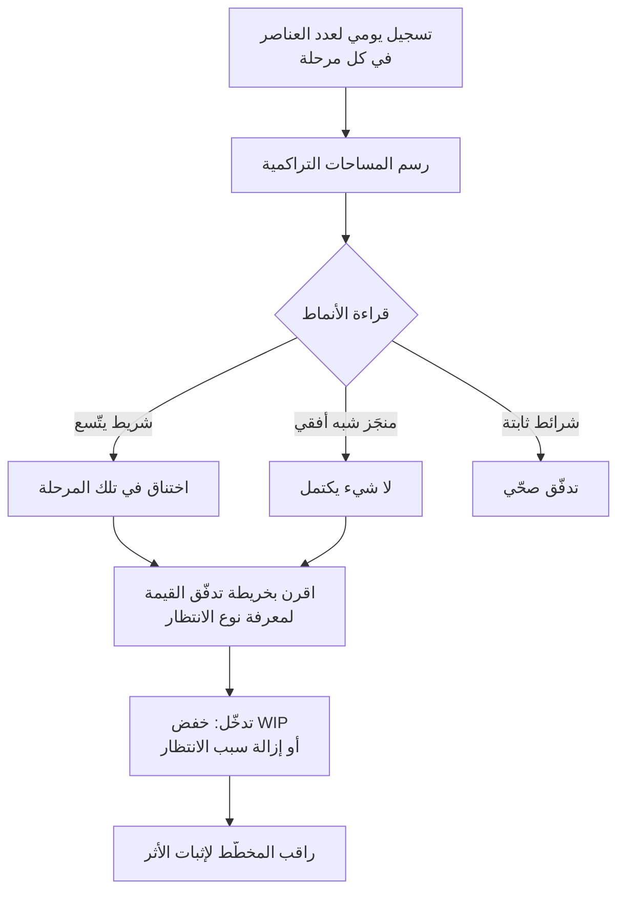

# مخطّط التدفّق التراكمي (Cumulative Flow Diagram)

> [!info] تعريف مختصر
> **مخطّط التدفّق التراكمي** رسم بياني مساحي يُظهر **عدد عناصر العمل في كل مرحلة عبر الزمن**، بحيث تمثّل كل مساحة ملوّنة مرحلة من مراحل اللوحة (قيد التحليل، قيد التطوير، قيد الاختبار، منجَز). وقوّته أنه يعرض **ثلاثة مقاييس تدفّق في صورة واحدة**: العمل الجاري (سُمك الشريط رأسياً)، وزمن الدورة (عرضه أفقياً)، ومعدّل الإنجاز (ميل الحدّ الأعلى للمنجَز) — كما يكشف **مكان الاختناق** بمجرّد النظر إلى الشريط الذي يتّسع.

## الشرح العلمي والاحترافي

- **كيف يُقرأ؟** ثلاث قراءات بصرية مباشرة:
  | ما تنظر إليه | ما يعنيه |
  |---|---|
  | **السُّمك الرأسي** لشريط مرحلة | العمل الجاري (`WIP`) في تلك المرحلة |
  | **العرض الأفقي** بين دخول عنصر وخروجه | [[Cycle Time\|زمن الدورة]] |
  | **ميل الحدّ الأعلى** لمنطقة «منجَز» | [[Throughput\|معدّل الإنجاز]] |
  | **شريط يتّسع باستمرار** | [[Bottleneck\|اختناق]] في تلك المرحلة تحديداً |

- **الأنماط التشخيصية**:
  - **شريط يتّسع تدريجياً** ⇒ المرحلة تستقبل أسرع ممّا تُخرِج — اختناق مؤكّد.
  - **شرائط متوازية بسُمك ثابت** ⇒ تدفّق متّزن وصحّي.
  - **مسطّح أفقي في «منجَز»** ⇒ لا شيء يكتمل رغم أن العمل يدخل — أوضح إنذار على الإطلاق.
  - **قفزة رأسية مفاجئة في الأسفل** ⇒ إغراق اللوحة بعمل جديد دفعةً واحدة.
  - **اتّساع عام في كل الشرائط** ⇒ ارتفاع `WIP` الكلّي، والنتيجة الحتمية إطالة زمن التسليم لا تقصيره.

- **علاقته بقانون ليتل**: المخطّط تجسيد بصري لـ[[Little's Law|قانون ليتل]] (`زمن الدورة = العمل الجاري ÷ معدّل الإنجاز`). فحين ترى الشريط يسمك دون أن يزيد ميل المنجَز، فأنت ترى القانون يعمل أمامك: **العمل الجاري ارتفع فارتفع زمن التسليم — دون أي زيادة في الإنتاج.**

- **ما يكشفه ولا تكشفه لوحة كانبان**: اللوحة تُظهر **الحالة الآن**؛ والمخطّط يُظهر **الاتّجاه عبر الزمن**. فقد تبدو اللوحة معقولة اليوم بينما المخطّط يُظهر أن شريط الاختبار يتّسع منذ ثلاثة أسابيع — أي أن المشكلة كانت تتراكم قبل أن تُرى.

- **علاقته بـ[[WIP Aging|تقادم العمل الجاري]]**: المخطّط يُظهر المشكلة **إجمالاً** (أي مرحلة تختنق)، وتقادم العمل الجاري يُظهرها **فردياً** (أي عنصر بالذات علق ومنذ متى). واستخدامهما معاً يعطي التشخيص الكامل: أين المشكلة، وعلى أي عنصر تتدخّل الآن.

- **حدوده**: لا يخبرك **لماذا** اختنقت المرحلة — بل أين فقط. والسبب يُستخرَج من تحليل نوع الانتظار: اعتماد بشري؟ مراجعة يدوية؟ اعتمادية خارجية؟ ولذلك يُقرَن دائماً بخريطة [[Value Stream Mapping|تدفّق القيمة]] التي تسمّي مصدر الانتظار.

## أين ومتى يُستخدم
- في **المراجعات الدورية للفريق** كأداة تشخيص بصرية سريعة بدل جداول الأرقام.
- عند **الشكوى المتكرّرة من البطء** دون معرفة مصدره.
- في **إثبات أثر تقليل العمل الجاري** على الإدارة — إذ يُظهر «قبل وبعد» بصرياً ومقنعاً.
- في **أنظمة [[03 - Kanban|كانبان]]** كأحد المقاييس الأساسية.
- عند **التفاوض على حدود العمل الجاري**: المخطّط يُظهر أثر تجاوزها بلا جدال.

## مثال وسيناريو تطبيقي
> [!example] فريق «مشغول» ولا يُسلِّم
> فريق من ستّة أشخاص يشتكي المدير من بطئه. مؤشّراته الظاهرة: الجميع مشغول، ولا أحد عاطل، وعدد المهام المفتوحة مرتفع.
>
> **ما أظهره المخطّط عبر ثمانية أسابيع:**
> - شريط «قيد التطوير» **ثابت السُّمك** — الفريق ينتج بمعدّل مستقرّ.
> - شريط «قيد الاختبار» **يتّسع أسبوعاً بعد أسبوع** — من 3 عناصر إلى 14.
> - ميل «منجَز» **يكاد يكون أفقياً** منذ الأسبوع الرابع.
> - العرض الأفقي (زمن الدورة) تضاعف من 6 أيام إلى 13.
>
> **التشخيص:** الاختناق في الاختبار لا في التطوير. والفريق «مشغول» لأنه يبدأ عملاً جديداً كلّما توقّف عن الانتظار — فيرتفع العمل الجاري ويطول زمن التسليم بحسب قانون ليتل.
>
> **الخطأ الذي كان سيُرتكب:** إضافة مطوّر ثانٍ — وهو ما كان سيوسّع شريط الاختبار أسرع.
> **ما فُعل فعلاً:** تحويل مطوّرَين إلى الاختبار مؤقّتاً + حدّ أعلى للعمل الجاري في مرحلة الاختبار. وبعد ثلاثة أسابيع عاد الشريط إلى سُمكه الطبيعي وانخفض زمن الدورة إلى 7 أيام — **بنفس عدد الأفراد**.

## خطوات أو مخطّط
1. عرّف مراحل اللوحة بوضوح وثبّتها — تغيير المراحل يُبطل المقارنة التاريخية.
2. سجّل يومياً عدد العناصر في كل مرحلة (تراكمياً).
3. ارسم المساحات مرتّبة من «منجَز» أسفل إلى «جديد» أعلى.
4. اقرأ الأنماط: أي شريط يتّسع؟ هل ميل المنجَز ثابت؟
5. حدّد المرحلة المختنقة — لا تفترضها.
6. اقرن التشخيص بخريطة التدفّق لمعرفة **نوع** الانتظار.
7. تدخّل بتقليل العمل الجاري أو إزالة سبب الانتظار — لا بزيادة الأفراد.
8. راقب المخطّط بعد التدخّل لإثبات الأثر.

## ⚠️ مفاهيم خاطئة شائعة
> [!warning]
> - **الظنّ بأنه يُظهر السبب**: يُظهر **أين** الاختناق لا **لماذا**؛ والسبب من تحليل نوع الانتظار.
> - **قراءة السُّمك على أنه إنتاجية**: الشريط السميك عمل **عالق** لا عمل منجَز.
> - **الخلط بينه ولوحة كانبان**: اللوحة حالة آنية، والمخطّط اتّجاه زمني.
> - **تغيير مراحل اللوحة أثناء القياس**: يُبطل المقارنة ويجعل الاتّجاه بلا معنى.
> - **افتراض أن اتّساع شريط ما يعني كسل من فيه**: غالباً يعني أن المرحلة تستقبل أسرع ممّا تُخرِج — وهي مشكلة نظام لا أفراد.
> - **الاكتفاء به دون [[WIP Aging|تقادم العمل الجاري]]**: يخبرك أين المشكلة ولا يخبرك على أي عنصر تتدخّل اليوم.

## ❌ ممارسات خاطئة في المشاريع
> [!failure]
> - **معالجة الاختناق بزيادة الأفراد في المرحلة السابقة له**: يوسّع الاختناق أسرع. الحلّ: عزّز المرحلة المختنقة أو خفّض العمل الجاري قبلها.
> - **عرضه على الإدارة بلا تفسير**: يُقرأ خطأً كمؤشّر إنتاجية أفراد. الحلّ: اعرضه مع الاستنتاج والتدخّل المقترح.
> - **قياسه دون حدود للعمل الجاري**: يُشخّص ولا يعالج. الحلّ: اقرنه بـ[[WIP Limit|حدّ العمل الجاري]].
> - **إهماله بعد التدخّل**: يحرمك من إثبات الأثر ومن رصد الانتكاس. الحلّ: راقبه ثلاثة أسابيع بعد كل تدخّل.
> - **استخدامه لمقارنة فرق مختلفة**: مراحل اللوحة تختلف بين الفرق. الحلّ: استخدمه للمقارنة الزمنية داخل الفريق نفسه.

## 🔗 مصطلحات ومفاهيم ذات صلة
[[WIP Aging]] | [[WIP Limit]] | [[Little's Law]] | [[Cycle Time]] | [[Lead Time]] | [[Throughput]] | [[Flow Efficiency]] | [[Bottleneck]] | [[Control Chart]] | [[03 - Kanban]] | [[Value Stream Mapping]]
