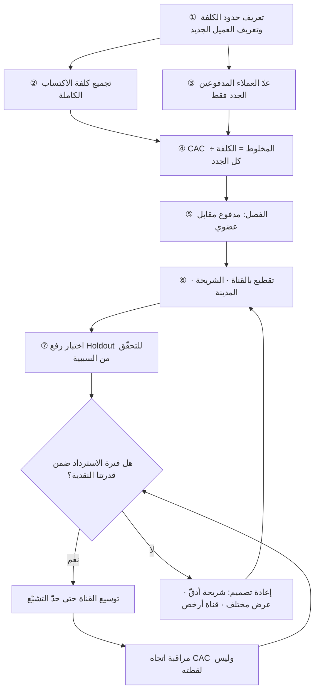

# كلفة اكتساب العميل (Customer Acquisition Cost)

> [!info] تعريف مختصر
> إجمالي ما تنفقه المؤسّسة لتحويل شخص أو منشأة من «غير عميل» إلى **عميل مدفوع فعليًّا**، مقسومًا على عدد العملاء الجدد الذين تحقّقوا في المدّة نفسها. المعادلة تبدو بسيطة (`إجمالي كلفة الاكتساب ÷ عدد العملاء الجدد`)، لكن كل الخلاف يقع في البسط: ما الذي يُحسب داخل الكلفة؟ وفي المقام: من يُعدّ «عميلًا جديدًا»؟ ومن الأخطاء الأكثر شيوعًا وأشدّها ضررًا **حصر البسط في ميزانية الإعلانات وحدها**، فينتج رقم متفائل يُبنى عليه قرار توسّع خاطئ. الـ CAC ليس رقمًا واحدًا للشركة، بل رقم لكل قناة ولكل شريحة ولكل سوق، ولا معنى له إطلاقًا إن لم يُقرأ إلى جانب ما يُدرّه العميل ([[Customer Lifetime Value]]) وهامش الوحدة ([[Unit Economics]]).

## الشرح العلمي والاحترافي
- **البسط: ما الذي يدخل فعلًا في كلفة الاكتساب؟** المبدأ الحاكم: *كل كلفة ما كانت لتُنفَق لولا السعي إلى عملاء جدد*. وهذا يشمل عادةً: الإنفاق الإعلاني المدفوع بكل قنواته؛ رواتب وحوافز فريق التسويق والمبيعات المخصَّص للاكتساب (لا فريق نجاح العملاء القائم)؛ عمولات المبيعات والشركاء والمسوّقين بالعمولة؛ كلفة إنتاج المحتوى والإبداع؛ رخص أدوات التسويق وأتمتته وتحليلاته؛ الخصومات والقسائم التمهيدية والحوافز التي تُمنح لجذب العميل الأول؛ الفترات التجريبية المجانية بكلفتها التشغيلية الفعلية؛ وكلفة الإعداد والتفعيل (Onboarding) حين تكون شرطًا للتحوّل إلى عميل مدفوع.
- **وما الذي لا يدخل؟** كل ما يخدم عميلًا قائمًا لا اكتسابًا جديدًا: الدعم الفني الاعتيادي، التجديد، البيع الإضافي للعملاء الحاليين (Upsell)، تكاليف تطوير المنتج نفسه، الكلفة الإدارية العامّة. ودخول أي من هذه في البسط يضخّم CAC ظلمًا فيبدو النموّ غير مجدٍ وهو مجدٍ. الخطأ إذن يقع في الاتجاهين: **البخل في البسط يخدع بالتفاؤل، والإفراط فيه يخدع بالتشاؤم.** والمعيار الوحيد الصالح هو الاتّساق: عرّف الحدود كتابةً وثبّتها عبر الزمن، وإن غيّرتها فأعد احتساب السلاسل التاريخية.
- **المقام: من هو «العميل الجديد»؟** في منتج اشتراك B2B العميل هو **الحساب** المتعاقد لا المستخدم داخله. في متجر إلكتروني هو المشتري الذي أتمّ أول عملية شراء مدفوعة، لا من سجّل بريده. في تطبيق توصيل هو من أتمّ طلبًا فعليًّا واستُلم. أما احتساب التسجيلات أو التنزيلات فينتج رقمًا يبدو ممتازًا وهو من نوع [[Vanity Metrics]]. وفي المنصّات متعدّدة الأطراف ([[Two-sided Marketplace]]) يجب حساب CAC **لكل جانب على حدة**، لأن كلفة اكتساب تاجر تختلف جذريًّا عن كلفة اكتساب مشترٍ.
- **التمييز الحاسم: المدفوع · العضوي · المخلوط (Blended).** الـ CAC **المخلوط** يقسم كل الإنفاق على كل العملاء الجدد بمن فيهم من جاء عضويًّا (بحثًا، أو إحالة، أو سمعة). وهو مفيد كمؤشّر صحّة عام للشركة، لكنه **مضلّل تمامًا كأساس لقرار زيادة الإنفاق**، لأن العملاء العضويين يخفّضون المتوسّط دون أن يزيدوا بزيادة الميزانية. أما الـ CAC **المدفوع** فيقسم الإنفاق المدفوع على العملاء المنسوبين إلى القنوات المدفوعة وحدها، وهو الرقم الصحيح لقرار: «هل أزيد الإعلان أم لا؟». الفارق بينهما قد يكون ضعفين أو ثلاثة. والقاعدة العملية: **قرّر بالمدفوع، وراقب الصحّة بالمخلوط، ولا تخلط بينهما في الجملة نفسها.**
- **الـ CAC العضوي ليس صفرًا.** المحتوى والسيو والمجتمع والعلامة كلها تكلّف رواتب ووقتًا وأدوات؛ فالقناة العضوية أقرب إلى استثمار رأسمالي بطيء العائد منها إلى مجّانية. وتجاهل ذلك ينتج مقارنة ظالمة تُغري بتحويل الميزانية كلها إلى «العضوي المجاني» ثم تُفاجأ الشركة بأن كلفته الحقيقية عالية وعائده متأخّر بأشهر.
- **مشكلة النسبة (Attribution) والتأخّر الزمني.** رحلة الشراء ليست نقرة واحدة: قد يرى العميل إعلانًا، ثم يبحث، ثم يسأل صديقًا، ثم يشتري بعد شهرين. نماذج النسبة (آخر نقرة · أول نقرة · متعدّدة اللمسات) تعطي أرقامًا مختلفة للقناة نفسها. ومع تشدّد قواعد الخصوصية وتقييد المعرّفات، صارت النسبة على مستوى الفرد أضعف. ولهذا يزداد الاعتماد على **اختبارات الرفع (Incrementality / Geo-holdout)**: إيقاف الإنفاق في منطقة أو شريحة عشوائية ومقارنة النتيجة — وهي الطريقة الأقرب إلى السببية لا الارتباط. كذلك يجب مقارنة إنفاق فترة بعملاء **نفس الفوج** لا بعملاء الشهر نفسه، وإلا انحرف الرقم كلما تغيّرت الميزانية.
- **الـ CAC يتحرّك مع الحجم لا يبقى ثابتًا.** أرخص الجمهور يُلتقط أولًا؛ ثم يرتفع سعر الوصول إلى الشرائح الأبعد (تشبّع الجمهور، منافسة على المزاد الإعلاني، تراجع جودة النية). لذا تخطيط النموّ على أساس CAC اليوم ثابتًا للعام كله خطأ تخطيطي منهجي. الصحيح افتراض **منحنى صاعد** واختبار حدّ التشبّع لكل قناة قبل الالتزام بأهداف نموّ مبنية عليها.

## أين ومتى يُستخدم
- **في قرار توزيع ميزانية التسويق بين القنوات**: تُقارن القنوات بـ CAC المدفوع لكل قناة مع جودة العملاء الناتجين عنها لا بحجمهم فقط.
- **عند تقييم جدوى دخول سوق أو مدينة جديدة**: كلفة الاكتساب في سوق لا تعرف العلامة تختلف جذريًّا عن سوقها الأصلية ([[Market Entry Modes]] و[[Go-to-Market]]).
- **في بناء [[Business Case]] ونماذج التوقّع المالي**: CAC هو أحد المدخلات الثلاثة الحاسمة مع [[Customer Lifetime Value]] وهامش المساهمة في [[Unit Economics]].
- **في تصميم التسعير والعروض التمهيدية**: كل قسيمة أو شهر مجاني هو بند في CAC، وتصميمه يغيّر الرقم مباشرةً.
- **عند تقييم قنوات الإحالة والشراكات**: الإحالة عادةً أدنى كلفة وأعلى احتفاظًا، وربطها بـ[[Retention]] و[[NPS]] يوضّح أثرها المركّب.
- **في اجتماعات مراجعة الأداء التنفيذية**: يُقرأ CAC دومًا مقترنًا بفترة الاسترداد لا منفردًا، ويُقطَّع بـ[[Cohort Analysis]] لكشف تدهوره الصامت.

## مثال وسيناريو تطبيقي
> [!example] **الافتراض معلن: سيناريو تعليمي مُركَّب لشركة افتراضية؛ الأرقام للتوضيح ولا تُنسب إلى أي جهة حقيقية.**
> شركة برمجيات افتراضية في الرياض تبيع نظام إدارة مخزون للمنشآت الصغيرة بسعر 450 ريالًا شهريًّا للحساب. في مراجعة الربع عرض فريق التسويق: «كلفة اكتساب العميل لدينا 900 ريال — ممتازة، الاسترداد خلال شهرين». الرقم كان: 180,000 ريال إنفاق إعلاني ÷ 200 حساب جديد.
> عند التدقيق ظهرت ثلاث مشكلات:
> **الأولى — البسط ناقص.** الإنفاق الإعلاني وحده لا يمثّل الكلفة: هناك ثلاثة مندوبي مبيعات ميدانيين برواتب وحوافز 96,000 ريال في الربع، ومنتج محتوى بدوام كامل 33,000 ريال، وأدوات تسويق وأتمتة 12,000 ريال، وعمولات شركاء 21,000 ريال، وشهر أول مجاني تُقدَّر كلفته التشغيلية بـ 60 ريالًا للحساب (12,000 ريال). المجموع الحقيقي: **354,000 ريال**.
> **الثانية — المقام مضخَّم.** من الـ200 «حساب جديد» كان 46 حسابًا مجرّد تسجيل في التجربة المجانية لم يتحوّل إلى دفع، و18 حسابًا كانت ترقيات لعملاء قائمين (توسّع لا اكتساب). العملاء المدفوعون الجدد فعلًا: **136**.
> → **CAC المخلوط الحقيقي = 354,000 ÷ 136 ≈ 2,603 ريالًا** — أي ما يقارب ثلاثة أضعاف الرقم المعروض.
> **الثالثة — الخلط بين المدفوع والعضوي.** بتقطيع الـ136: جاء 51 حسابًا من الإحالة والبحث العضوي (لم تُنفَق عليها إعلانات، وإن كانت كلفة المحتوى تخدمها)، و85 حسابًا من القنوات المدفوعة. → **CAC المدفوع = (180,000 إعلانات + 96,000 مبيعات + 21,000 عمولات) ÷ 85 ≈ 3,494 ريالًا**، بينما CAC القنوات العضوية (المحتوى والأدوات موزّعة عليها) ≈ 882 ريالًا لكن بزمن نضج أطول.
> **أثر التصحيح على القرار.** بمتوسّط بقاء 19 شهرًا وهامش مساهمة 62% من الاشتراك (≈ 279 ريالًا شهريًّا)، تكون فترة استرداد القناة المدفوعة ≈ 12.5 شهرًا لا شهرين. وبما أن الشركة تموّل نموّها من تدفّقها النقدي لا من رأس مال مخاطر، فإن 12.5 شهرًا تعني أن كل حساب جديد يحبس نقدًا لأكثر من عام.
> ما قرّره الفريق: (١) تقطيع القناة المدفوعة بحسب حجم المنشأة، فتبيّن أن المنشآت ذات 3 فروع فأكثر لها CAC مدفوع 2,100 ريال واحتفاظ أطول، بينما المنشآت المفردة تجاوزت 5,600 ريال؛ (٢) إيقاف الإعلان على المنشآت المفردة وتحويلها إلى مسار تسجيل ذاتي بلا مندوب؛ (٣) تحويل جزء من ميزانية الإعلان إلى برنامج إحالة يمنح شهرًا مجانيًّا للطرفين — بكلفة فعلية 120 ريالًا للإحالة الناجحة؛ (٤) تشغيل اختبار رفع: إيقاف الإعلان في مدينة واحدة لأربعة أسابيع، فتبيّن أن 23% من «العملاء المنسوبين للإعلان» كانوا سيصلون على أي حال.
> بعد ربعين: عدد العملاء الجدد بقي قريبًا (129)، لكن CAC المخلوط انخفض إلى نحو 1,410 ريالًا وفترة الاسترداد إلى نحو 5 أشهر.

## خطوات أو مخطّط
1. **اكتب سياسة CAC**: ما يدخل في البسط، ما يُستبعد، وتعريف «العميل الجديد» في المقام. وثّقها ولا تغيّرها ضمنيًّا.
2. **اجمع الكلفة الكاملة** للفترة: إعلانات + رواتب وحوافز فريق الاكتساب + عمولات + محتوى وإبداع + أدوات + حوافز وقسائم + كلفة التجربة المجانية.
3. **احسب ثلاثة أرقام لا رقمًا واحدًا**: مخلوط · مدفوع · عضوي — واعرضها معًا دائمًا.
4. **قطّع بحسب القناة والشريحة والمدينة**، وابحث عن الشرائح التي يختبئ فيها CAC مرتفع خلف متوسّط مقبول.
5. **حاذِ التوقيت**: انسب إنفاق فترة إلى عملاء **فوجها** لا إلى عملاء الشهر التقويمي، خصوصًا في دورات بيع طويلة.
6. **اختبر السببية** بإيقاف مضبوط لقناة أو منطقة (Holdout) لقياس الرفع الفعلي لا النسبة المُعلَنة من المنصّة الإعلانية.
7. **اقرن CAC بمخرجاته**: احسب فترة الاسترداد وهامش المساهمة و[[Retention]] لكل قناة — فالقناة الأرخص قد تجلب أسوأ العملاء بقاءً.
8. **راقب الاتجاه لا اللقطة**: ارتفاع CAC مع ثبات الميزانية إشارة تشبّع؛ واستعد لمنحنى صاعد في التخطيط بدل افتراض ثبات.

## ⚠️ مفاهيم خاطئة شائعة
> [!warning]
> - **«CAC = الإنفاق الإعلاني ÷ العملاء الجدد»**: أشهر خطأ في المصطلح كله. تجاهل رواتب فريق المبيعات والمحتوى والعمولات والحوافز قد يخفض الرقم إلى الثلث أو أقل، وعلى أساسه تُتّخذ قرارات توسّع تُكتشف بعد أشهر أنها خاسرة.
> - **الظنّ بأن CAC رقم واحد للشركة**: هو دالّة على القناة والشريحة والسوق والزمن. الرقم الإجمالي صالح للتقرير السنوي، لا لقرار تشغيلي أسبوعي.
> - **معاملة القنوات العضوية على أنها بلا كلفة**: المحتوى والسيو والمجتمع تستهلك رواتب وأدوات وزمنًا طويلًا حتى ينضج العائد. تسميتها «مجانية» تشوّه المقارنة وتؤخّر إدراك كلفتها الحقيقية.
> - **الخلط بين CAC وكلفة العميل المحتمل (CPL) أو كلفة التثبيت (CPI)**: هذه مقاييس وسيطة في القمع. عميل محتمل رخيص لا يتحوّل إلى دفع هو كلفة صافية، والقياس عند نقطة الدفع فقط ([[Funnel Analysis]]).
> - **الاعتقاد بأن انخفاض CAC خبر جيد دائمًا**: قد ينخفض لأنك تستهدف شريحة أرخص وأسوأ بقاءً، فينهار [[Retention]] لاحقًا ويرتفع [[Churn]]. الـ CAC وحده بلا جودة العميل مؤشّر ناقص، ويجب أن يقترن بمؤشّر مضادّ ([[Counter Metric]]).
> - **الثقة المطلقة بلوحات المنصّات الإعلانية**: كل منصّة تنسب لنفسها ما تستطيع، وقد يتجاوز مجموع «التحويلات المنسوبة» عدد العملاء الفعلي. التحقّق يكون بالمقارنة مع سجلّ المبيعات الداخلي وباختبارات الرفع.

## ❌ ممارسات خاطئة في المشاريع
> [!failure]
> - **الخطأ: تحديد هدف «خفض CAC» مؤشّرًا مستقلًّا لفريق التسويق.** → **لماذا يضرّ**: يُحسَّن الرقم بأسهل طريقة — استهداف جمهور رخيص منخفض النية — فينخفض CAC ويرتفع [[Churn]] وتخسر الشركة صافيًا ([[Goodhart's Law]]). → **الحل**: اجعل الهدف مركّبًا: فترة الاسترداد أو نسبة القيمة إلى الكلفة مع حدّ أدنى لجودة الفوج.
> - **الخطأ: حساب CAC بقسمة إنفاق الشهر على عملاء الشهر نفسه في منتج دورة بيعه ثلاثة أشهر.** → **لماذا يضرّ**: يجعل الرقم يهبط اصطناعيًّا كلما زدت الإنفاق (لأن أثره لم يظهر بعد) ويقفز كلما خفّضته، فتُتّخذ قرارات معكوسة تمامًا. → **الحل**: طابق الإنفاق مع الفوج الذي أنتجه زمنيًّا، واستخدم [[Cohort Analysis]] بدل الشهر التقويمي.
> - **الخطأ: التوسّع في قناة مربحة حتى نفاد الميزانية دون اختبار التشبّع.** → **لماذا يضرّ**: يرتفع CAC الحدّي بصمت بينما يبقى المتوسّط مقبولًا، فتُنفَق آخر الريالات بأسوأ عائد دون أن يظهر ذلك في اللوحة. → **الحل**: راقب CAC **الحدّي** (كلفة آخر شريحة إنفاق) لا المتوسّط، وزد الميزانية على درجات مع قياس عند كل درجة.
> - **الخطأ: استخدام حوافز نقدية كبيرة لجذب العملاء دون احتسابها ضمن CAC.** → **لماذا يضرّ**: يخلق قاعدة عملاء مرتبطة بالحافز لا بالمنتج، وينهار الاكتساب لحظة توقّف الحافز بينما بدا الاقتصاد سليمًا. → **الحل**: أدرِج كل قسيمة وحافز وشهر مجاني في البسط، وقِس بقاء الفوج المحفَّز مقابل غير المحفَّز.
> - **الخطأ: قياس CAC لجانب واحد فقط في منصّة متعدّدة الأطراف.** → **لماذا يضرّ**: تُموّل شركة كامل نموّها على أساس كلفة اكتساب المشترين وتتجاهل كلفة اكتساب المورّدين، فينهار العرض وتفشل التجربة رغم صحّة الأرقام المعروضة ([[Two-sided Marketplace]]). → **الحل**: احسب CAC لكل جانب على حدة، وضع لكل جانب ميزانية ومؤشّرًا مستقلًّا.
> - **الخطأ: تغيير طريقة الاحتساب في منتصف السنة دون إعادة بناء السلاسل التاريخية.** → **لماذا يضرّ**: يظهر «تحسّن» وهمي أو «تدهور» وهمي، ويفقد المجلس الثقة في كل الأرقام لا في هذا الرقم فقط. → **الحل**: عامل تعريف CAC معاملة [[Single Source of Truth]]: أي تغيير يُوثَّق، وتُعاد معالجة التاريخ، ويُعرض الرقمان جنبًا إلى جنب لفترة انتقالية.

## 🔗 مصطلحات ومفاهيم ذات صلة
[[Customer Lifetime Value]] | [[Unit Economics]] | [[Two-sided Marketplace]] | [[Network Effects]] | [[Churn]] | [[Retention]] | [[Cohort Analysis]] | [[Funnel Analysis]] | [[Vanity Metrics]] | [[Goodhart's Law]] | [[Counter Metric]] | [[Go-to-Market]] | [[Business Case]] | [[NPS]]
