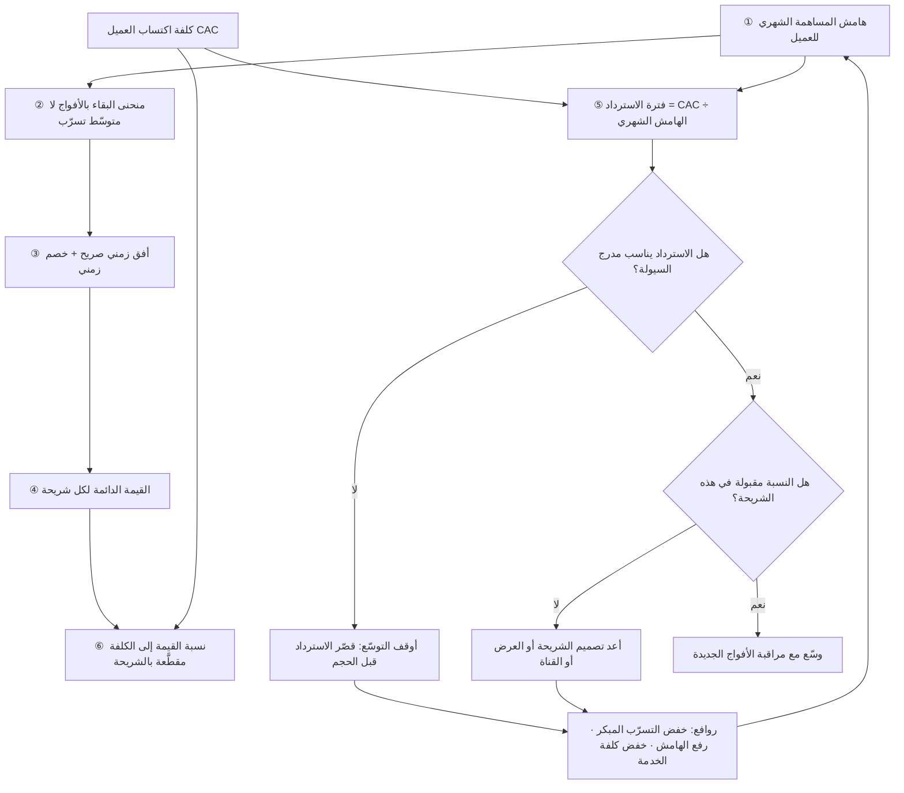

# القيمة الدائمة للعميل (Customer Lifetime Value)

> [!info] تعريف مختصر
> تقدير لصافي القيمة التي يُتوقَّع أن يدرّها عميل واحد على المؤسّسة طوال مدّة علاقته بها — لا مجموع ما يدفعه، بل **مجموع هوامش المساهمة** التي يخلّفها بعد طرح الكلفة المتغيّرة لخدمته، مخصومةً زمنيًّا إن كانت المدّة طويلة. القيمة الدائمة أداة لترشيد الإنفاق على الاكتساب والاحتفاظ: كم يجوز أن ندفع لاجتذاب عميل؟ وأي شريحة تستحقّ خدمة أعلى؟ وأين يُجدي الاستثمار في تقليل التسرّب؟ ولأنها **تقدير مستقبلي** لا واقعة محاسبية، فهي بطبيعتها هشّة أمام الافتراضات؛ ولهذا يفضّل كثير من المشغّلين قراءة **فترة الاسترداد (Payback Period)** إلى جانبها — بل قبلها — لأنها رقم أقرب إلى الحاضر وأصعب على التجميل.

## الشرح العلمي والاحترافي
- **القاعدة الأولى: القيمة بالهامش لا بالإيراد.** الصيغة الشائعة الخاطئة هي `متوسّط الإيراد الشهري × عدد أشهر البقاء`. والصحيحة تستبدل الإيراد بـ**هامش المساهمة** لكل عميل: أي الإيراد ناقص الكلفة المتغيّرة لخدمته (استضافة، استدلال، رسوم دفع، دعم، لوجستيات). عميل يدفع 500 ريال شهريًّا وتكلّف خدمته 380 ريالًا ليس بقيمة عميل يدفع 500 وتكلّف خدمته 90. تجاهل هذا يضخّم القيمة أضعافًا ويقود إلى إنفاق اكتساب غير مبرَّر ([[Unit Economics]]).
- **طرق الحساب الثلاث المتدرّجة في الدقّة:**
  1. **التقريب البسيط بمعدّل التسرّب**: `LTV = (هامش المساهمة الشهري للعميل) ÷ (معدّل التسرّب الشهري)`. سهلة وسريعة، لكنها تفترض تسرّبًا ثابتًا مع الزمن — وهو افتراض خاطئ غالبًا، إذ ينخفض التسرّب مع تقادم العميل (الناجون أكثر ولاءً)، فتُقلّل الصيغة من قيمة العملاء القدامى وتبالغ في قيمة الجدد.
  2. **الحساب بالأفواج (Cohort-based)**: تُتابَع أفواج حقيقية شهرًا بشهر ويُجمع هامشها المتحقّق فعلًا، ثم يُستقرأ الذيل المتبقّي بمنحنى ملائم. أدقّ بكثير لأنها مبنيّة على سلوك مرصود لا على متوسّط مفترض ([[Cohort Analysis]]).
  3. **النماذج الاحتمالية والتنبّؤية**: تقدّر لكل عميل احتمال بقائه ووتيرة شرائه وقيمته المتوقّعة، وتُستخدم في التجزئة وقنوات التسويق الدقيقة. أقوى تحليليًّا لكنها تتطلّب بيانات كافية وانضباطًا في التحقّق، وإلا صارت ثقة زائفة مغلّفة برياضيات.
- **الخصم الزمني والأفق المحدود.** ريال بعد أربع سنوات ليس كريال اليوم؛ فالقيمة البعيدة تُخصم بمعدّل يعكس كلفة رأس المال والمخاطرة. والأهمّ عمليًّا: **قصّ الأفق**. حساب القيمة على «عمر لا نهائي» يولّد أرقامًا خيالية لشركة عمرها سنتان ولا تملك دليلًا على بقاء عميل خمس سنوات. الممارسة المنضبطة أن يُحسب LTV على أفق 12 أو 24 أو 36 شهرًا ويُسمّى صراحةً: «قيمة 24 شهرًا» لا «القيمة الدائمة».
- **نسبة LTV:CAC وحدودها.** تُقارَن القيمة الدائمة بـ[[Customer Acquisition Cost]] لتقدير كفاءة الاكتساب، وتتداول الأدبيات التشغيلية قاعدة إبهام شائعة مفادها أن نسبة تقارب 3:1 صحّية، وأن ما دونها يشير إلى إنفاق مفرط، وأن ما فوقها بكثير قد يشير إلى **إنفاق ناقص** وفرصة نموّ ضائعة. لكن هذه القاعدة **إرشادية لا قانونًا**، وحدودها جدّية:
  - النسبة تجمع رقمًا مستقبليًّا هشّ الافتراضات (LTV) مع رقم حاضر صلب (CAC)، فيسهل تحسينها بتعديل افتراض في جدول بيانات.
  - لا تقول شيئًا عن **متى** يعود المال — وشركتان بنفس النسبة قد تكون إحداهما تسترد خلال 5 أشهر والأخرى خلال 30، والفارق بينهما هو الفارق بين البقاء والإفلاس.
  - تتجاهل تباين الشرائح؛ فنسبة إجمالية 3:1 قد تخفي شريحة عند 8:1 وأخرى عند 0.7:1.
  - تختلف دلالتها باختلاف الهيكل: شركة ذات كلفة ثابتة ضخمة تحتاج نسبة أعلى من شركة خفيفة.
- **فترة الاسترداد (Payback Period) هي المقياس الأهمّ عند ضيق السيولة.** وهي: `CAC ÷ هامش المساهمة الشهري للعميل` — أي بعد كم شهرًا يعيد العميل ما دُفع لاكتسابه. أهمّيتها تفوق النسبة في شركة تموّل نموّها من تدفّقها النقدي، لأن الاكتساب يستهلك نقدًا **الآن** بينما القيمة تتحقّق على مدى سنوات. فترة استرداد 6 أشهر تتيح دورة نقدية سريعة تعيد تمويل نفسها مرّتين في السنة؛ وفترة 24 شهرًا تعني أن كل عميل جديد يحبس نقدًا لعامين ويجعل النموّ محكومًا بحجم رأس المال المتاح لا بحجم الطلب. ولهذا يُقال إن **النسبة تصف الجدوى، وفترة الاسترداد تصف القدرة على البقاء حتى تتحقّق تلك الجدوى.**
- **العلاقة بالاحتفاظ والتسرّب.** القيمة الدائمة نتيجة لا سبب: تتحسّن أساسًا برفع [[Retention]] وخفض [[Churn]]، ثم برفع القيمة لكل عميل (توسيع الاستخدام، بيع إضافي، رفع التسعير)، ثم بخفض كلفة الخدمة. وتحسين الاحتفاظ هو الرافعة الأقوى لأنه يعمل تراكميًّا: يمدّ العمر ويزيد فرص التوسّع ويحسّن الإحالة في آن واحد.
- **ما لا تلتقطه القيمة الدائمة الكلاسيكية.** العميل قد يخلق قيمة غير مباشرة: إحالات تجلب عملاء جددًا بكلفة اكتساب شبه معدومة، أو بيانات تحسّن المنتج، أو حضورًا يجذب الطرف الآخر في منصّة متعدّدة الأطراف ([[Network Effects]] و[[Two-sided Marketplace]]). بعض الفرق تحتسب هذا ضمن «قيمة موسّعة»، والأسلم عرضه منفصلًا بافتراضات معلنة بدل دمجه في الرقم الأساسي وتضخيمه بلا تمييز.

## أين ومتى يُستخدم
- **في تحديد سقف الإنفاق على الاكتساب لكل شريحة**: يُشتقّ الحدّ الأعلى المقبول لـ[[Customer Acquisition Cost]] من القيمة الدائمة وفترة الاسترداد المستهدفة.
- **في تجزئة العملاء وتصميم مستويات الخدمة**: الشرائح عالية القيمة تستحقّ إعدادًا مخصّصًا ودعمًا أسرع؛ والشرائح منخفضة القيمة تُخدَم بمسار ذاتي منخفض الكلفة.
- **في ترتيب أولويات خارطة المنتج**: ميزة تخفض [[Churn]] بنقطتين قد تفوق قيمتها ميزة تزيد التسجيلات، لأن أثرها يضرب في كامل القاعدة لا في الفوج الجديد فقط.
- **في تقييم قنوات التسويق**: القناة تُحكم بقيمة العملاء الذين تجلبهم لا بعددهم؛ وقناة أغلى تجلب عملاء أطول بقاءً قد تكون الأفضل فعلًا.
- **في [[Business Case]] ونماذج التوقّع**: القيمة الدائمة مدخل أساسي في تقدير الإيراد المتكرّر المستقبلي، ويجب أن تُعرض بافتراضاتها ظاهرة لا مطويّة.
- **عند تقييم قرار رفع الأسعار أو تغيير الباقات**: يُقاس الأثر الصافي على القيمة (ارتفاع الهامش مقابل احتمال ارتفاع التسرّب) لا على الإيراد الفوري وحده.

## مثال وسيناريو تطبيقي
> [!example] **الافتراض معلن: سيناريو تعليمي مُركَّب لشركة افتراضية؛ الأرقام للتوضيح ولا تُنسب إلى جهة حقيقية.**
> منصّة اشتراك افتراضية في جدّة تقدّم نظام حجز مواعيد لصالونات وعيادات صغيرة، بسعر 300 ريال شهريًّا للفرع.
> **العرض الأول للفريق**: «متوسّط بقاء العميل 40 شهرًا × 300 ريال = LTV يساوي 12,000 ريال. وكلفة الاكتساب 2,400 ريال. إذن النسبة 5:1 — ممتازة، فلنضاعف ميزانية التسويق.»
> **التدقيق كشف ثلاث مشكلات:**
> (١) **الإيراد ليس هامشًا**: كلفة خدمة الفرع شهريًّا تشمل استضافة ورسائل تأكيد للعملاء ورسوم دفع ودعمًا بشريًّا (الصالونات تتّصل كثيرًا) = 126 ريالًا. الهامش الحقيقي 174 ريالًا لا 300. → القيمة تنزل إلى 6,960 ريالًا.
> (٢) **مدّة الـ40 شهرًا مستنبطة من قسمة 1÷معدّل تسرّب شهري 2.5%** وهو متوسّط شركة عمرها 26 شهرًا فقط — أي أن الرقم يستقرئ ما لم يُرصد قط. وبالنظر إلى الأفواج الحقيقية تبيّن أن التسرّب في الأشهر الثلاثة الأولى مرتفع جدًّا (11% شهريًّا) ثم يهبط إلى نحو 1.8% للناجين. الاستقراء بمتوسّط واحد كان يخفي منحنيين مختلفين تمامًا.
> (٣) **بالتقطيع** ظهر فرقان حادّان: العيادات (فوج بقاء طويل، هامش 189 ريالًا، تسرّب مستقرّ 1.2%) مقابل الصالونات المفردة (تسرّب 4.9%، دعم مكثّف، هامش 141 ريالًا).
> **إعادة الحساب على أفق 24 شهرًا مخصومًا:**
> - العيادات: قيمة 24 شهرًا ≈ 3,760 ريالًا، وCAC ≈ 2,050 ريالًا، وفترة الاسترداد ≈ 10.8 شهرًا.
> - الصالونات المفردة: قيمة 24 شهرًا ≈ 1,590 ريالًا، وCAC ≈ 2,780 ريالًا → **نسبة أقل من 1:1**، أي أن كل صالون تكتسبه الشركة يخسّرها مالًا صافيًا.
> النسبة الإجمالية 5:1 التي عُرضت في البداية لم تكن خاطئة الحساب فحسب، بل كانت **تخفي شريحة كاملة تُموَّل خسارتها من شريحة أخرى**.
> **ما لماذا كانت فترة الاسترداد أهمّ من النسبة هنا**: الشركة تموّل نموّها من نقدها التشغيلي ولا تملك جولة استثمارية. بفترة استرداد 10.8 شهرًا، كل مليون ريال يُنفق على الاكتساب يعود بعد نحو عام؛ فسقف النموّ السنوي محكوم بالنقد المتاح لا بحجم السوق. وبعد إجراءات: (١) وقف اكتساب الصالونات المفردة عبر المندوبين وتحويلها إلى تسجيل ذاتي بكلفة 380 ريالًا؛ (٢) إعادة تصميم أول 14 يومًا (إعداد موجَّه + استيراد بيانات المواعيد القديمة) فانخفض تسرّب الأشهر الثلاثة الأولى من 11% إلى 6.4%؛ (٣) إضافة باقة أعلى بخدمة تذكير مدفوعة رفعت الهامش الشهري للعيادات إلى 226 ريالًا — انخفضت فترة الاسترداد الإجمالية إلى نحو 6.9 أشهر، فتضاعفت قدرة الشركة على إعادة تدوير نقدها في السنة نفسها دون أي تمويل خارجي.

## خطوات أو مخطّط
1. **اختر وحدة العميل**: حساب أم مستخدم أم فرع؟ وثبّتها (يتقاطع هذا مع تعريف الوحدة في [[Unit Economics]]).
2. **احسب هامش المساهمة الشهري للعميل** لا إيراده: اطرح كلفة الخدمة المتغيّرة كاملة.
3. **ارسم منحنى البقاء بالأفواج** ولا تستخدم متوسّط تسرّب واحدًا؛ افصل مرحلة التسرّب المبكر عن مرحلة الاستقرار ([[Cohort Analysis]]).
4. **حدّد أفقًا زمنيًّا صريحًا** (12/24/36 شهرًا) وسمّ الرقم به، وطبّق خصمًا زمنيًّا للسنوات البعيدة.
5. **احسب فترة الاسترداد** لكل شريحة وقناة: `CAC ÷ الهامش الشهري`، وقارنها بمدرج السيولة المتاح.
6. **احسب النسبة LTV:CAC** بعد ذلك، واقرأها **مقطَّعة** لا إجمالية، مع ذكر افتراضاتها كتابةً.
7. **رتّب روافع التحسين**: خفض التسرّب المبكر أوّلًا، ثم رفع القيمة لكل عميل، ثم خفض كلفة الخدمة، ثم خفض كلفة الاكتساب.
8. **راجع الافتراضات دوريًّا** وقارن القيمة المتوقّعة بالمتحقّقة فعلًا لكل فوج ناضج، وسجّل الانحراف في [[Decision Log]].

## ⚠️ مفاهيم خاطئة شائعة
> [!warning]
> - **حساب القيمة بالإيراد بدل الهامش**: أشيع خطأ وأخطره؛ يضخّم الرقم بنسبة تعادل كلفة الخدمة كاملة، ويبرّر إنفاق اكتساب لا تحتمله الشركة.
> - **افتراض تسرّب ثابت وعمر لا نهائي**: التسرّب يتغيّر بتقادم العميل، والاستقراء إلى ما لا نهاية ينتج أرقامًا لا يسندها أي رصد فعلي. الأمانة التحليلية تقتضي أفقًا محدودًا معلنًا.
> - **اعتبار 3:1 قانونًا عالميًّا**: هي قاعدة إبهام متداولة بين المشغّلين لا نتيجة بحثية مُلزِمة؛ تختلف باختلاف هيكل الكلفة ودورة البيع وطبيعة السوق، وتفقد معناها تمامًا إن حُسبت إجماليًّا فوق شرائح متباينة.
> - **الظنّ بأن نسبة عالية جدًّا خبر ممتاز**: نسبة 12:1 قد تعني أنك تترك نموًّا على الطاولة وتنفق أقلّ ممّا يحتمله السوق، وقد تعني أيضًا أن حساب القيمة متفائل. الرقم المرتفع جدًّا يستدعي تدقيقًا لا احتفالًا.
> - **الخلط بين القيمة الدائمة والإيراد المتكرّر السنوي**: الأول تقدير لكامل العلاقة المستقبلية بالهامش، والثاني قياس لحالة راهنة بالإيراد. استخدامهما بالتبادل يُربك أي نقاش مالي.
> - **إهمال أثر رفع السعر على التسرّب**: رفع 20% في السعر يرفع الهامش فورًا لكنه قد يرفع [[Churn]] بما يبتلع الزيادة ويزيد. القياس يكون على القيمة الكلّية للفوج بعد فترة كافية لا على إيراد الشهر التالي.

## ❌ ممارسات خاطئة في المشاريع
> [!failure]
> - **الخطأ: عرض LTV واحد للشركة في اجتماع مجلس الإدارة.** → **لماذا يضرّ**: يخفي شرائح خاسرة داخل متوسّط رابح، فتستمرّ الشركة في تمويل خسارة لا تراها ([[Simpson's Paradox]]). → **الحل**: اشترط عرض القيمة وفترة الاسترداد مقطَّعتين بحسب الشريحة والقناة، مع إبراز أسوأ شريحة صراحةً.
> - **الخطأ: بناء خطة نموّ سنوية على نسبة LTV:CAC دون فحص فترة الاسترداد.** → **لماذا يضرّ**: قد تكون الجدوى سليمة نظريًّا بينما تنفد السيولة قبل تحقّقها، فتموت شركة «مربحة على الورق». → **الحل**: اجعل فترة الاسترداد قيدًا صلبًا في خطة الاكتساب، واربط سقف الإنفاق الشهري بالنقد المتاح لا بالنسبة.
> - **الخطأ: مطاردة رفع القيمة عبر البيع الإضافي قبل إصلاح التسرّب المبكر.** → **لماذا يضرّ**: تُباع إضافات لعملاء سيغادرون خلال أشهر، فيرتفع الإيراد مؤقّتًا ويرتفع الاستياء والاسترداد لاحقًا. → **الحل**: عالج الأشهر الثلاثة الأولى أوّلًا ([[Time to Value]] و[[Adoption]])، فأثرها على القيمة أكبر من أي رافعة أخرى.
> - **الخطأ: تجميد افتراضات النموذج وعدم مقارنتها بالمتحقّق.** → **لماذا يضرّ**: يتحوّل جدول البيانات إلى مصدر ثقة زائف يقود قرارات لعامين دون أن يُختبر مرّة واحدة. → **الحل**: راجع كل فوج ناضج وقارن القيمة الفعلية بالمتوقّعة، واجعل الانحراف بندًا دوريًّا في المراجعة.
> - **الخطأ: احتساب قيمة الإحالات وأثر الشبكة داخل الرقم الأساسي دون فصل.** → **لماذا يضرّ**: يضخّم القيمة بافتراضات يصعب التحقّق منها، ويجعل الرقم غير قابل للمقارنة أو المساءلة. → **الحل**: اعرض القيمة الأساسية وحدها، وأضف «قيمة موسّعة» منفصلة بافتراضات مكتوبة.
> - **الخطأ: استخدام القيمة الدائمة لتبرير خدمة متدنّية للعملاء منخفضي القيمة.** → **لماذا يضرّ**: قد يكونون قناة إحالة أو الجانب الذي يجذب الطرف الآخر في منصّة، فيضرّ خفض خدمتهم النظامَ كلّه ([[Systems Thinking]]). → **الحل**: ميّز بين خفض **كلفة** الخدمة (أتمتة، مساعدة ذاتية) وخفض **جودتها**، وقس الأثر الشبكي قبل القرار.

## 🔗 مصطلحات ومفاهيم ذات صلة
[[Customer Acquisition Cost]] | [[Unit Economics]] | [[Retention]] | [[Churn]] | [[Cohort Analysis]] | [[Network Effects]] | [[Switching Cost]] | [[Two-sided Marketplace]] | [[Time to Value]] | [[Adoption]] | [[NPS]] | [[Business Case]] | [[Systems Thinking]] | [[Simpson's Paradox]]
