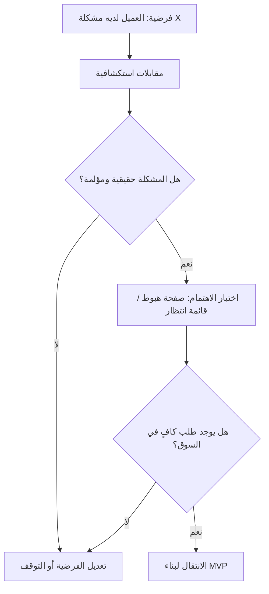

# تحقّق العميل والسوق (Customer and Market Validation)
> [!info] تعريف مختصر
> عملية منهجية لاختبار الافتراضات حول احتياج العميل الحقيقي وحجم السوق قبل استثمار موارد كبيرة في بناء منتج كامل، وذلك عبر جمع أدلة فعلية من عملاء حقيقيين بدل الاعتماد على التخمين.

## الشرح العلمي والاحترافي
- الهدف من هذه العملية هو الإجابة على سؤالين جوهريين قبل بدء التطوير الكامل: هل هذه المشكلة حقيقية ومؤلمة بما يكفي للعميل (Problem Validation)؟ وهل الحل المقترح والسوق كبير بما يكفي لبناء عمل مستدام حوله (Solution/Market Validation)؟
- تعتمد هذه العملية على أدوات مثل: المقابلات الاستكشافية مع العملاء (Customer Discovery Interviews)، الاستبيانات، صفحات الهبوط الاختبارية (Landing Page Tests) لقياس الاهتمام، والمنتج الأدنى القابل للتطبيق (MVP) لاختبار السلوك الفعلي.
- يرتبط هذا المفهوم بشكل مباشر بمنهجية "بناء العميل" (Customer Development) التي وضعها ستيف بلانك، والتي تسبق أو تتوازى مع بناء المنتج بمنهجية Lean Startup.
- الفرق الجوهري بين هذه العملية وأبحاث السوق التقليدية أنها تعتمد على أدلة سلوكية فعلية (هل دفع العميل؟ هل سجّل فعلًا؟) وليس فقط آراء واستطلاعات لفظية قد لا تعكس السلوك الحقيقي.
- في المشاريع، هذا التحقق يقلّل بشكل كبير من مخاطر "بناء منتج لا يريده أحد"، وهو من أشيع أسباب فشل المشاريع والشركات الناشئة.

## أين ومتى يُستخدم
- في المراحل الأولى من أي مشروع منتج جديد، قبل تخصيص ميزانية تطوير كاملة، وغالبًا كجزء من دراسة الجدوى (Business Case).
- عند إطلاق ميزة جديدة كبيرة داخل منتج قائم، للتأكد من رغبة العملاء الحاليين فيها قبل الاستثمار الكامل.
- في منهجيات Lean Startup و Design Thinking، كخطوة أساسية ضمن حلقة "ابنِ - قِس - تعلّم" (Build-Measure-Learn).
- قبل تجربة الإطلاق التجريبي (Pilot Launch) أو التوسّع لسوق جديد.

## مثال وسيناريو تطبيقي
> [!example] سيناريو ملموس
> فريق ناشئ يريد بناء تطبيق لإدارة فواتير أصحاب المحال الصغيرة. بدلًا من البدء ببناء التطبيق فورًا، يقضي مدير المنتج أسبوعين في إجراء 25 مقابلة مع أصحاب محال فعليين. يكتشف أن 18 من أصل 25 يعانون فعلًا من مشكلة تتبّع الفواتير المتأخرة (تحقّق من المشكلة). بعدها، ينشئ صفحة هبوط بسيطة تشرح الحل وتطلب من الزوار التسجيل في قائمة انتظار مقابل بريدهم الإلكتروني؛ خلال أسبوع يسجّل 120 شخصًا (تحقّق أولي من السوق). بناءً على هذه الأدلة، يقرر الفريق تخصيص ميزانية لبناء نسخة أولى (MVP) بدلًا من التخلي عن الفكرة أو بنائها بشكل كامل مباشرة دون أدلة.

## خطوات أو مخطّط
1. صياغة الفرضية الأساسية بوضوح: من هو العميل، وما المشكلة التي نحلّها له.
2. إجراء مقابلات استكشافية مع عملاء محتملين حقيقيين لفهم الألم (Pain Point) دون بيع الفكرة لهم.
3. اختبار الاهتمام الفعلي عبر أدوات منخفضة التكلفة (صفحة هبوط، نموذج ورقي، استطلاع مدفوع).
4. قياس مؤشرات سلوكية حقيقية (نسبة التسجيل، الدفع المسبق، التفاعل) لا الآراء فقط.
5. اتخاذ قرار المتابعة أو التوقف أو تغيير الاتجاه (Go or No-Go Decision) بناءً على الأدلة المجمّعة.
6. الانتقال لبناء MVP فقط بعد تحقّق كافٍ من الحاجة الفعلية.

## ⚠️ مفاهيم خاطئة شائعة
> [!warning]
> - الاعتقاد بأن سؤال الأصدقاء والعائلة "هل تعجبك الفكرة؟" يُعتبر تحقّقًا كافيًا من السوق؛ التحقّق الحقيقي يحتاج عملاء مستهدفين فعليين وأدلة سلوكية.
> - الخلط بين تحقّق العميل والسوق وبين اختبار المنتج (Usability Testing)؛ الأول يجيب "هل يجب أن نبني هذا أصلًا؟" بينما الثاني يجيب "هل بنيناه بشكل جيد؟".
> - الظن أن هذه العملية تحدث مرة واحدة فقط في بداية المشروع؛ في الواقع هي عملية مستمرة تتكرر مع كل ميزة أو توسّع كبير جديد.

## ❌ ممارسات خاطئة في المشاريع
> [!failure]
> - الاعتماد فقط على استطلاعات الرأي اللفظية ("هل ستستخدم هذا؟") دون قياس سلوك فعلي مثل الدفع أو التسجيل. الحل: تصميم تجارب تتطلب التزامًا فعليًا من العميل (دفعة رمزية، تسجيل بريد).
> - إجراء مقابلات موجّهة تسأل العميل عن رأيه في الحل الجاهز بدلًا من استكشاف مشكلته الحقيقية أولًا (Leading Questions). الحل: التدرّب على أسئلة الاستكشاف المفتوحة قبل عرض أي حل.
> - تجاهل نتائج التحقّق السلبية والاستمرار في بناء المنتج بسبب التحيّز للفكرة الأصلية (Sunk Cost / Confirmation Bias). الحل: تحديد معايير نجاح/فشل واضحة قبل بدء التحقّق والالتزام بها بموضوعية.

## 🔗 مصطلحات ومفاهيم ذات صلة
[[MVP]] | [[Pilot Launch]] | [[Go or No-Go Decision]] | [[Business Case]] | [[Outcome vs Output]] | [[Pain Point]] | [[User Journey Map]]
