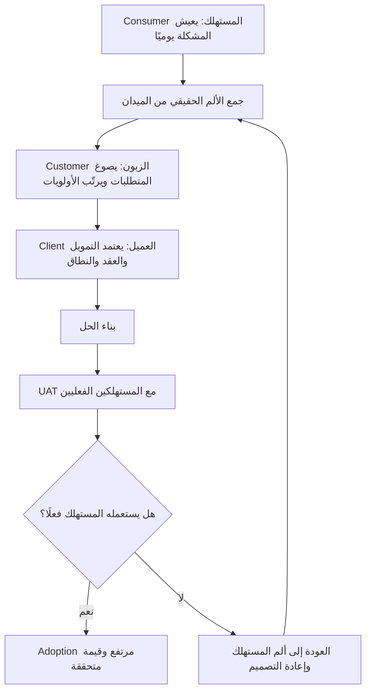

# الزبون والعميل والمستهلك (Customer vs Client vs Consumer)

> [!info] تعريف مختصر
> ثلاثة أدوار يجمعها الناس تحت كلمة واحدة هي "العميل"، بينما هي في الواقع ثلاثة مواقع مختلفة تمامًا من المشروع: **Consumer (المستهلك)** هو المستخدم النهائي الذي يعيش المشكلة يوميًا ويستعمل النظام بيديه؛ **Customer (الزبون)** هو من يحدّد المتطلبات ويطلب الحل ويستلمه؛ **Client (العميل التعاقدي)** هو صاحب العقد والسلطة والتمويل. الخلط بين الثلاثة يُنتج نظامًا موقّعًا ومقبولًا رسميًا لكنه غير مُستخدَم فعليًا.

## الشرح العلمي والاحترافي
- **Consumer — المستهلك / المستخدم النهائي**: الشخص الذي يستعمل المنتج فعلًا في سياق عمله أو حياته. هو من يعيش نقطة الألم ([[Pain Point]]) يوميًا، ويعرف تفاصيل العملية التي لا تظهر في أي وثيقة رسمية: الاستثناءات، الحالات الخاصة، الحيل اليدوية التي ابتكرها للالتفاف على النظام القديم. المستهلك غالبًا **لا يملك أي سلطة** على قرار الشراء ولا على الميزانية، ولهذا يُهمَل — وهو أخطر إهمال في المشروع.
- **Customer — الزبون / طالب الحل**: الجهة أو الشخص الذي يعرّف ما هو المطلوب، ويصوغ المتطلبات، ويستلم النتيجة، ويحكم على مطابقتها. هو الوسيط بين الحاجة الميدانية والقرار التعاقدي. قد يكون مدير إدارة، أو مالك منتج ([[05 - Product Owner]])، أو مدير تشغيل. الزبون يفهم العملية على مستوى الإدارة، لكنه لا يستعملها بالضرورة على مستوى الشاشة.
- **Client — العميل التعاقدي**: الطرف الذي يوقّع العقد، ويموّل المشروع، ويملك سلطة إيقافه أو تعديل نطاقه. اهتمامه الأساسي: الكلفة، الجدول الزمني، الالتزام التعاقدي، المخاطر القانونية والمؤسسية. نادرًا ما يهتم بتفاصيل تجربة الاستخدام، وقد لا يرى الشاشة الفعلية طوال المشروع.
- **التمييز ليس لغويًا بل تشغيليًا**: لكل دور منهم *معيار نجاح مختلف*. نجاح الـ Client = تسليم ضمن الميزانية والوقت. نجاح الـ Customer = مطابقة المتطلبات المتفق عليها. نجاح الـ Consumer = أن يصبح عمله اليومي أسهل فعلًا. وهذه المعايير الثلاثة يمكن أن تتحقق منها اثنتان ويفشل المشروع، لأن المعيار الثالث (المستهلك) هو الوحيد الذي يحدّد الاستخدام الفعلي ([[Adoption]]).
- في بعض الحالات تجتمع الأدوار في شخص واحد (مطوّر مستقل يشتري أداة لنفسه: هو Client وCustomer وConsumer معًا)، وفي مشاريع المؤسسات تتفرّق الأدوار على ثلاث جهات لا تلتقي في اجتماع واحد إلا نادرًا — وهنا يبدأ الخطر.
- إطار [[Value Proposition Canvas]] يُبنى أصلًا على جانب المستهلك (مهامه، آلامه، مكاسبه)، لا على جانب الموقّع على العقد؛ ولهذا يُعدّ أداة تصحيح مباشرة لهذا الخلط.

## أين ومتى يُستخدم
- عند بناء [[Stakeholder Map]] في بداية المشروع: تصنيف كل طرف حسب دوره الحقيقي (تمويل / تعريف متطلبات / استخدام) بدل وضع الجميع في خانة "العميل".
- عند تخطيط [[21 - Stakeholder Communication]]: لكل دور لغة ووتيرة مختلفة — الـ Client يريد تقرير حالة وميزانية، الـ Customer يريد مراجعة متطلبات، الـ Consumer يريد أن يجرّب الشاشة ويقول رأيه.
- عند جمع وتحليل المتطلبات: نبدأ من الميدان (Consumer) صعودًا نحو الإدارة، لا العكس.
- عند تخطيط اختبار قبول المستخدم ([[UAT]]): تحديد من الذي سيختبر فعلًا — ويجب أن يكون المستهلك، لا الموقّع على العقد.
- عند تحليل ضعف الاستخدام بعد الإطلاق: أول سؤال تشخيصي هو "هل شارك المستهلك في التصميم أصلًا؟".
- عند رسم [[User Journey Map]]: الرحلة تُرسم دائمًا بعيني المستهلك، لا بعيني من دفع الفاتورة.

## مثال وسيناريو تطبيقي
> [!example] **مشروع نظام إدارة مواعيد لمستشفى حكومي.**
> - **Client = وزارة الصحة**: هي التي أطلقت المناقصة، ووقّعت العقد، وتملك الميزانية، وتُتابع المشروع عبر تقارير ربعية. مقياس نجاحها: تسليم النظام في الموعد وضمن المبلغ المعتمد.
> - **Customer = إدارة المستشفى**: هي التي صاغت المتطلبات ("نريد حجزًا إلكترونيًا، وتقارير إشغال، وربطًا بالملف الطبي")، وهي التي ستستلم وتوقّع محضر التسليم.
> - **Consumer = المريض والطبيب وموظف الاستقبال**: هم من سيستعملون النظام كل يوم. المريض يحجز من هاتفه، الطبيب يرى جدوله، الموظف يعدّل المواعيد الملغاة.
>
> سار المشروع كما هو مخطط: الوزارة راضية عن الالتزام بالجدول، وإدارة المستشفى وقّعت أن كل المتطلبات مُنفَّذة. لكن بعد ثلاثة أشهر من الإطلاق، تبيّن أن **72% من المواعيد ما زالت تُحجز هاتفيًا**، وأن موظفي الاستقبال يستخدمون جدولًا موازيًا على الورق. السبب: شاشة الحجز تتطلب سبع خطوات وإدخال رقم ملف طبي لا يحفظه المريض، والطبيب لا يستطيع تعديل جدوله إلا عبر طلب للإدارة. لم يجلس أحد مع المستهلك قبل التصميم، ولم يُختبر النظام إلا مع فريق إدارة المستشفى في قاعة اجتماعات.
>
> **مثال مصغّر يوضح الفكرة نفسها**: أب يشتري حاسوبًا محمولًا لابنه. الأب هو **Customer** (يحدّد الميزانية والمواصفات ويدفع)، والابن هو **Consumer** (سيستعمله يوميًا). إذا صمّم البائع تجربته للأب وحده، سيبيع جهازًا "ممتاز المواصفات على الورق" لا يناسب استخدام الابن الفعلي — والنتيجة جهاز مشترى ومُهمَل.

## خطوات أو مخطّط
1. حصر كل الأطراف المرتبطة بالمشروع دون تصنيف مسبق.
2. تصنيف كل طرف بسؤال ثلاثي: **من يدفع ويوقّع؟** (Client) — **من يعرّف المطلوب ويستلم؟** (Customer) — **من سيستعمله يوميًا؟** (Consumer).
3. البدء بجمع المتطلبات من **المستهلك** عبر المقابلة والملاحظة الميدانية ورسم [[User Journey Map]].
4. رفع ما جُمع إلى الـ Customer للتحقق من اتساقه مع أهداف الإدارة وسياساتها.
5. عرض الأثر والكلفة على الـ Client في لغة القيمة والمخاطر لا في لغة الشاشات.
6. تصميم الحل مع نماذج أولية تُختبر مع المستهلكين قبل البناء الكامل.
7. تنفيذ [[UAT]] بمستخدمين حقيقيين من الميدان في بيئة تشبه عملهم، لا بممثلي الإدارة في قاعة اجتماعات.
8. قياس [[Adoption]] بعد الإطلاق كمؤشر نهائي، لأنه المؤشر الوحيد الذي يعكس رضا المستهلك لا رضا الموقّع.

## ⚠️ مفاهيم خاطئة شائعة
> [!warning]
> - **اعتبار الكلمات الثلاث مترادفات لغوية**: الفرق ليس في الترجمة بل في السلطة والمصلحة ومعيار النجاح؛ كل دور يحكم على المشروع بمسطرة مختلفة.
> - **الظن بأن من يدفع هو من يعرف الحاجة**: صاحب التمويل غالبًا أبعد الناس عن تفاصيل العملية اليومية، ورضاه لا يضمن صلاحية الحل.
> - **افتراض أن توقيع محضر التسليم يعني نجاح المشروع**: التوقيع يُنهي الالتزام التعاقدي فقط، ولا يقول شيئًا عن الاستخدام الفعلي.
> - **الاعتقاد بأن المستهلك "لا يعرف ماذا يريد" فلا داعي لسؤاله**: المستهلك قد لا يعرف الحل، لكنه الأعلم بالمشكلة — ومهمتنا استخراج المشكلة منه لا انتظار الحل.
> - **الخلط بين شكوى المستهلك ومتطلب رسمي**: الشكوى مادة خام تُحلَّل وتُترجم إلى متطلب، لا تُنسخ كما هي إلى الوثيقة.

## ❌ ممارسات خاطئة في المشاريع
> [!failure]
> - **أخذ المتطلبات من الإدارة فقط لأنها "الجهة الرسمية"**: يُنتج وصفًا للعملية كما يُفترض أن تكون، لا كما تجري فعلًا، فتُهمَل الاستثناءات التي تشكّل نصف العمل اليومي. الحل: جلسات ملاحظة ميدانية مع المستهلكين إلى جانب اجتماعات الإدارة، وتوثيق الفجوة بين الاثنين صراحة.
> - **إجراء [[UAT]] مع ممثلي العميل التعاقدي بدل المستخدمين الفعليين**: من وقّع العقد لن يستعمل الشاشة، فيمرّ النظام في الاختبار ويسقط في الواقع. الحل: اشتراط في خطة الاختبار أن يكون المختبِرون من الميدان، بنسب تمثّل كل فئة مستخدمين.
> - **إهمال المستهلك في مرحلة التصميم ثم تفسير ضعف الاستخدام بأنه "مقاومة تغيير"**: التسمية تُريح الفريق وتخفي سبب الفشل الحقيقي. الحل: قياس [[Adoption]] كمؤشر نجاح معتمد منذ البداية، وربط أي انخفاض فيه بمراجعة تجربة المستهلك لا بلوم المستخدمين.
> - **بناء قنوات تواصل واحدة للجميع**: تقرير موحّد لا يخدم أحدًا؛ الـ Client يغرق في التفاصيل والمستهلك لا يجد ما يخصّه. الحل: خطة [[21 - Stakeholder Communication]] تفصل الرسائل حسب الدور والاهتمام و[[Power-Interest Grid]].
> - **تجاهل المستهلك عند تغيّر النطاق**: يُحذف متطلب "غير مهم" تعاقديًا وهو في الواقع الخطوة التي يقوم عليها عمل الموظف اليومي. الحل: تقييم أي تغيير في النطاق بأثره على رحلة المستهلك قبل اعتماده.

## 🔗 مصطلحات ومفاهيم ذات صلة
[[Stakeholder Map]] | [[21 - Stakeholder Communication]] | [[Value Proposition Canvas]] | [[UAT]] | [[Adoption]] | [[User Journey Map]] | [[Power-Interest Grid]] | [[UX vs CX]]
