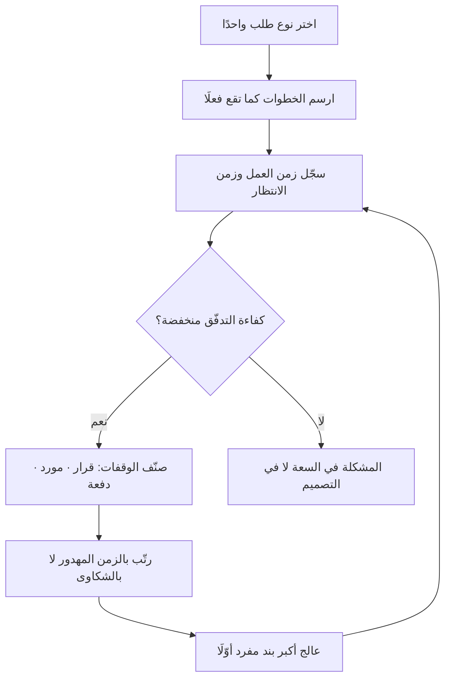

# العملية المتمركزة حول العميل (Customer-Centric Process)

> [!info] تعريف مختصر
> العملية المتمركزة حول العميل (Customer-Centric Process) هي عملية **رُسِمت على مسار وصول القيمة إلى العميل**، لا على الهيكل الإداري للمؤسّسة. ويقابلها **العملية من الداخل إلى الخارج** (Inside-Out Process) التي تتبع خرائط الأقسام. والمعيار الفاصل بينهما **بنيويّ لا نيّويّ**: أنّ الأولى تُقاس بزمن العبور الكلّي، والثانية تُقاس بكفاءة كلّ محطّة على حدة — ولذلك يمكن أن تكون كلّ محطّة في الثانية كفؤةً تمامًا والنظام كلّه بطيئًا.

## الشرح العلمي والاحترافي

- **أصل المدرستين.** العملية من الداخل إلى الخارج امتدادٌ لتقسيم العمل الوظيفي: من آدم سميث (1776) إلى [[Scientific Management|الإدارة العلمية]] عند تايلور (1911). أمّا التمركز حول العميل فأصلاه المباشران **مايكل هامر** في *«Reengineering Work: Don't Automate, Obliterate»* (HBR, 1990)، و**ووماك وجونز** في *Lean Thinking* (1996) حيث صيغ مفهوم [[Value Stream|تدفّق القيمة]].
- **العملية الوظيفية ليست خطأً، بل هي الحالة الافتراضية.** فهي ما يقع تلقائيًّا حين لا يقرّر أحد شيئًا، لأنّ الهيكل هو المعطى الوحيد الواضح أمام من يرسم العملية. أمّا التمركز حول العميل فلا يقع تلقائيًّا أبدًا — يجب أن **يُقصَد**.
- **موضع فرضيّتها المنقلبة.** التخصّص الوظيفي يرتفع عائده كلّما **تكرّرت** الوحدة وقلّ تغيّرها. والبرمجية هي الحالة المضادّة تمامًا: الوحدة لا تتكرّر، إذ لو تكرّرت لنُسخت بأمر واحد. **فالخطأ ليس في المدرسة بل في نقلها إلى مجال تنقلب فيه فرضيتها.**
- **الأثر الكمّي.** كلّ حدّ بين قسمين يُنشئ [[Handoff|تسليمًا بينيًّا]] وطابورًا، فيرتفع [[Flow Time|زمن التدفّق]] بلا أن يُخطئ أحد. ولهذا تكون [[Flow Efficiency|كفاءة التدفّق]] في العمليات الوظيفية منخفضةً على نحو مطّرد — 10% إلى 20% ليست استثناءً فيها.
- **علاقتها بـ[[Conway's Law|قانون كونواي]].** القانون يقول إنّ بنية النظام تعكس بنية التواصل. فالعملية المرسومة على الأقسام لا تُنتج بطئًا فحسب، بل تُنتج **معماريةً متشابكة** — لأنّ الحدود التي في المؤسّسة تصير حدودًا في الكود.
- **ما تُقاس به.** زمن التدفّق الكلّي من الطلب إلى الوصول، وكفاءة التدفّق، ونسبة زمن الانتظار من الزمن الكلّي. **ولا تُقاس بإنتاجية الأقسام** — فذلك مقياس المدرسة الأخرى.

## أين ومتى يُستخدم

- عند تشخيص **بطء تسليم لا مذنب فيه**: كلّ قسم يعمل بكفاءة عالية والزمن الكلّي طويل.
- عند تصميم **فريق متعدّد الوظائف** — فهو نتيجة هذا المبدأ لا بديل عنه ([[Cross-functional Team]]).
- في **الرشاقة المؤسّسية**: عند فحص الأقسام غير التقنية (توظيف · مشتريات · امتثال) التي تقع في مسار وصول القيمة.
- عند التفاوض على **إزالة تبعيّة قرار**: فالحجّة أنّ الخطوة ترعى الهيكل لا العميل.
- في مراجعة **أيّ عملية موروثة** لا يعرف أحد علّة خطواتها.

## مثال وسيناريو تطبيقي

> [!example] منصّة حجوزات: طلب واحد يعبر أربعة أقسام
> **الحالة:** «إضافة نوع موعد جديد» تستغرق **أحد عشر أسبوعًا**. مجموع زمن العمل الفعلي **عشرة أيّام**، ومجموع الانتظار **ثمانية وخمسون يومًا** — فكفاءة التدفّق نحو **15%**.
> **القراءة الحاسمة:** لو ضاعفتَ إنتاجية كلّ من يعمل — أي جعلتَ العشرة أيّام خمسة — لانخفض الزمن الكلّي من 68 إلى 63 يومًا. **تحسّن 7% مقابل مضاعفة الإنتاجية.**
> **إعادة التصميم:** نشر أسبوعي بدل شهري (يوفّر 9 أيّام) · تفويض ما دون حدّ معلن بلا لجنة (8 أيّام) · ضمّ مهندس اختبار إلى الفريق (11 يومًا) · فحص أمني آليّ مع مراجعة يدوية للحالات عالية الخطر (6 أيّام).
> **النتيجة:** نحو **27 يومًا** وكفاءة تدفّق **37%** — بلا ساعة عمل إضافية وبلا توظيف أحد.

## خطوات أو مخطّط

1. اختر **نوع طلب واحدًا** يتكرّر أسبوعيًّا على الأقلّ.
2. ارسم خطواته **كما تقع فعلًا** بشهادة من ينفّذها — لا كما هي موثّقة. واسأل عن الطريق المختصر الذي يُسلَك عند الاستعجال، فذلك هو العملية الحقيقية.
3. سجّل لكلّ خطوة: **من ينفّذها · زمن العمل · زمن الانتظار قبلها**.
4. احسب كفاءة التدفّق: مجموع زمن العمل ÷ الزمن الكلّي.
5. صنّف كلّ وقفة: **انتظار قرار** · **انتظار مورد** · **انتظار دفعة**.
6. رتّب بالزمن المهدور الكلّي **لا** بعدد الشكاوى.
7. عالج: احذف ما لا يراه العميل ولا يحميه · وازِ ما يمكن توازيه · فوّض القرار بحدّ مكتوب · ألغِ التسليم البيني بضمّ التخصّص.
8. أبقِ ما يلزم بحكم النظام أو التعاقد — **وصرّح بعلّته** لئلّا يصير طقسًا بعد سنة.

## ⚠️ مفاهيم خاطئة شائعة

> [!warning]
> - **الخلط بينها وبين تجربة المستخدم**: تجربة المستخدم تخصّ **الواجهة**، وهذه تخصّ **الطريق إلى الواجهة**. وأكثر ما يُبطئ العميل لا يراه العميل أصلًا.
> - **الخلط بينها وبين خدمة العملاء**: خدمة العملاء **محطّة واحدة** في المسار، وتحسينها لا يجعل العملية متمركزة حول العميل.
> - **الظنّ بأنّ «هوس العميل» يكفي**: تلك قيمة ثقافية في اتّخاذ القرار، وهذه بنية في سير العمل. والقيمة وحدها لا تُغيّر خطوةً واحدة.
> - **الظنّ بأنّ تسمية الفرق بأسماء المنتجات تكفي**: فقد تجد «فريق منتج الحجوزات» وهو اجتماع دوريّ لا يملك أحدٌ فيه قرارًا إلّا بالرجوع إلى قسمه. **والمعيار موضع القرار لا موضع المقعد.**
> - **قراءة «متمركز حول العميل» على أنّه إلغاء الحوكمة**: العملية التي أُزيل منها كلّ ضابط ليست متمركزةً حول العميل بل بلا حوكمة.

## ❌ ممارسات خاطئة في المشاريع

> [!failure]
> - **رسم الخريطة مرّةً وتعليقها**: تصير بعد سنة وثيقةً تصف مؤسّسةً لم تعد موجودة. الحلّ: قياس الزمن الكلّي لنوع طلب واحد كلّ ربع بالطريقة نفسها.
> - **إعادة التسمية بلا إعادة التفويض**: تُسمّى الأقسام «فرقًا» وتبقى الموافقات كما هي، فلا يتحرّك زمن التدفّق ربعًا واحدًا — ويُنسَب الثبات إلى «ضعف التبنّي».
> - **تسريع الواجهة وحدها**: يرتفع رضا العميل عن الواجهة ولا يتغيّر زمن وصول ما يطلبه. **وهذا أخفى صور الفشل لأنّه يُنتج أرقامًا صاعدة.**
> - **البدء بأكثر الشكاوى تكرارًا**: أكبر بنود الانتظار غالبًا «سياسات» لا يشتكي منها أحد — كنافذة نشر شهرية.
> - **إلغاء بوّابة قرار قبل كتابة ما يقوم مقامها**: يُنتج سرعةً وتشتّتًا معًا، فوظيفة البوّابة كانت **الاتّساق** لا الموافقة.

## 🔗 مصطلحات ومفاهيم ذات صلة

[[Value Stream]] | [[Value Stream Mapping]] | [[Cross-functional Team]] | [[Conway's Law]] | [[Flow Efficiency]] | [[Handoff]] | [[Dependency]] | [[Enterprise Agility]] | [[Business Process]] | [[Service Blueprint]] | [[11 - العملية المتمركزة حول العميل وقانون كونواي]]
