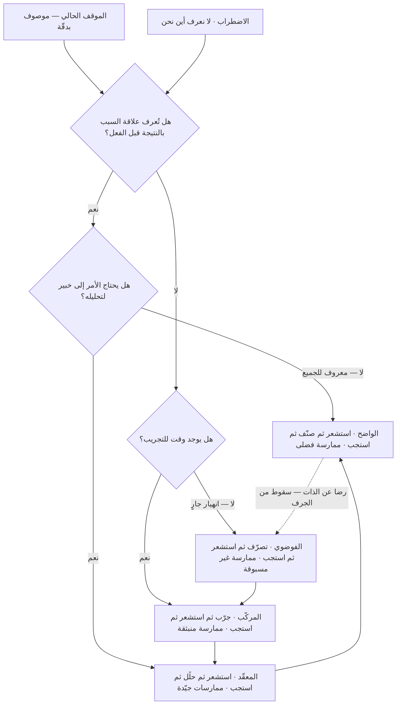

# إطار كونيفين (Cynefin)

> [!info] تعريف مختصر
> إطار لصنع القرار يصنّف الموقف الذي تواجهه — لا الحل — إلى خمسة سياقات (أو "مجالات"): **الواضح**، و**المعقّد**، و**المركّب**، و**الفوضوي**، و**الاضطراب**. لكل سياق طبيعة سببية مختلفة، ولذلك يستوجب كلٌّ منها أسلوب قرار مختلفًا: ما ينجح في المعقّد (تحليل الخبراء ثم التنفيذ) يفشل فشلًا ذريعًا في المركّب (حيث لا تُعرف العلاقة بين السبب والنتيجة إلا بأثر رجعي، فيجب التجريب أولًا). قيمة الإطار الأساسية ليست في تسمية المجالات، بل في أنه يجعل **سؤال «أي نوع من المشكلات هذه؟» سؤالًا يسبق سؤال «ما الحل؟»**، ويكشف أخطر خطأ إداري شائع: معاملة المركّب معاملة المعقّد.

## الشرح العلمي والاحترافي
- **الأصل والاسم**: الإطار من صياغة **ديف سنودن (Dave Snowden)**، الباحث الويلزي في إدارة المعرفة، وقد طوّره في أواخر التسعينيات أثناء عمله في **IBM** ضمن ما كان يُعرف بمعهد إدارة المعرفة التابع لها، ثم واصل تطويره بعد استقلاله عبر شركته Cognitive Edge (المعروفة لاحقًا باسم The Cynefin Company). وذاع الإطار على نطاق واسع بعد مقالة نشرها سنودن مع **ماري بون (Mary Boone)** في *Harvard Business Review* عام ٢٠٠٧ بعنوان «إطار للقائد في صنع القرار» (A Leader's Framework for Decision Making).
- **معنى الكلمة ونطقها**: `Cynefin` كلمة **ويلزية** (من اللغة الويلزية Cymraeg)، تُنطق تقريبًا **«كَنِڤِن»** — بمقاطع «كُ‑نِڤ‑ين» مع تشديد المقطع الأوسط، والحرف `f` في الويلزية يُلفظ صوت الڤاء لا الفاء، والحرف `y` هنا صوت قريب من الكسرة المخطوفة. الترجمة الحرفية الشائعة لها هي «الموئل» أو «المكان المألوف» (Habitat / Place)، لكن سنودن نفسه يشرح أن الترجمة الحرفية قاصرة: الكلمة تحمل في الويلزية معنى **«مكان الانتماءات المتعدّدة»** — أي أن الإنسان يفهم موقفه من خلال طبقات متراكمة من الانتماء والتجربة والثقافة والتاريخ، أكثرها لا يعيه وعيًا صريحًا. اختيار الاسم مقصود إذًا: الإطار يقول إن قراءتنا للموقف مشروطة بخلفيتنا، وإن الوعي بهذه المشروطية جزء من العمل.
- **المجالات الخمسة وطبيعتها السببية**:
  1. **الواضح (Clear)** — سُمّي في الأدبيات الأقدم «البسيط» (Simple) ثم «البديهي» (Obvious) قبل أن يستقرّ على «الواضح». هنا العلاقة بين السبب والنتيجة بديهية ومعروفة للجميع سلفًا. الأسلوب: **استشعر ← صنّف ← استجب**، والممارسة المناسبة هي **الممارسة الفضلى** (Best Practice) لأن الحل الأمثل موجود فعلًا ومحدَّد.
  2. **المعقّد (Complicated)** — العلاقة السببية موجودة ومستقرّة لكنها غير ظاهرة؛ تحتاج إلى **خبرة وتحليل** لاستخراجها. الأسلوب: **استشعر ← حلّل ← استجب**، والممارسة المناسبة هي **ممارسة جيّدة** (Good Practice) بصيغة الجمع — أي أن هناك عدّة حلول صحيحة لا حلًّا وحيدًا. هذا مجال المهندسين والمحلّلين والاستشاريين.
  3. **المركّب (Complex)** — لا توجد علاقة سببية قابلة للاستنتاج مسبقًا؛ النظام يتغيّر بتدخّلك فيه، والنمط لا يُرى إلا **بأثر رجعي** بعد وقوعه. الأسلوب: **جرِّب ← استشعر ← استجب**، عبر **تجارب آمنة الفشل** (Safe-to-Fail) صغيرة ومتوازية، تُضخَّم نتائجها الناجحة وتُخمَد الفاشلة. الممارسة هنا **منبثقة** (Emergent) لا مستنسخة.
  4. **الفوضوي (Chaotic)** — لا توجد علاقة سببية يمكن التعويل عليها أصلًا، والوضع ينهار الآن. الأسلوب: **تصرّف ← استشعر ← استجب**؛ الأولوية إيقاف النزيف وفرض قدر من الاستقرار ينقل الموقف إلى المركّب. الممارسة **جديدة/غير مسبوقة** (Novel).
  5. **الاضطراب (Confusion / Disorder)** — المركز الذي لا تعرف فيه في أيّ مجال أنت. وهو أخطر المجالات لأن كل طرف يفسّر الموقف بحسب مجاله المفضّل: المهندس يراه معقّدًا، والبيروقراطي يراه واضحًا، ورائد الأعمال يراه مركّبًا.
- **الحدّ الفاصل الخطر بين الواضح والفوضوي**: يرسم سنودن بين مجال «الواضح» ومجال «الفوضوي» حدًّا يصفه بأنه **جرف (Cliff)** لا حدود متدرّجة. حين تفرط المؤسسة في الثقة بأن كل شيء «واضح ومحكوم بالإجراءات»، فإنها لا تنزلق تدريجيًّا إلى الفوضى بل تسقط فيها دفعةً واحدة عند أول حدث لم تتوقّعه الإجراءات. الرضا عن الذات (Complacency) هو الآلية التي تدفع المؤسسات عن هذا الجرف.
- **ليس إطار تصنيف بل إطار استشعار**: يشدّد سنودن على أن كونيفين **إطار استشعار (Sense-making)** لا إطار تصنيف (Categorisation). الفرق جوهري: إطار التصنيف يسبق البيانات (تضع الواقع في صناديق جاهزة)، أمّا إطار الاستشعار فتنبثق فيه البنية من البيانات نفسها. ولهذا يُنصح بأن تُجرى تمارين كونيفين جماعيًّا وبنقاش حول **الحالات الحدّية** لا بتصنيف فردي سريع.
- **ديناميكية العبور بين المجالات**: الموقف لا يبقى في مجاله. المسار «الصحّي» المعتاد هو أن يبدأ الشيء مركّبًا (منتج جديد لم يُجرَّب)، ثم يستقرّ معقّدًا (صارت له هندسة معلومة يديرها خبراء)، ثم واضحًا (صار إجراءً تشغيليًّا موثّقًا)، ثم يتعرّض لصدمة تعيده إلى الفوضى. إدارة النضج هذه هي بالضبط ما ترصده أدوات مثل [[Wardley Mapping]] على محور التطوّر.
- **علاقته بمفهوم عدم اليقين**: المجال المركّب يتقاطع مباشرة مع [[Knightian Uncertainty]] — أي عدم اليقين الذي لا يمكن اختزاله في توزيع احتمالي. في المركّب لا تستطيع أن تحسب احتمالًا لأنك لا تعرف فضاء النتائج الممكنة أصلًا؛ ولذلك تُستبدل «التقديرات الأدقّ» بـ«التجارب الأرخص» ([[Cost of Experimentation]]).

## أين ومتى يُستخدم
- **في اختيار منهجية إدارة المشروع**: قبل الجدال بين الشلالي والرشيق، يُسأل: هل المتطلّبات معلومة وقابلة للتحليل (معقّد → التخطيط المسبق مشروع)، أم أنها ستنبثق من التفاعل مع السوق (مركّب → [[Dual-Track Agile]] و[[Continuous Discovery]])؟
- **في [[Product Discovery]] وصياغة [[Problem Statement]]**: لتحديد ما إذا كانت المشكلة تحتاج إلى تحليل خبير أم إلى تجربة ميدانية. الاعتراف بأن المشكلة مركّبة يبرّر تمويل تجارب متعدّدة بدل تمويل «الحل الصحيح» الواحد.
- **في إدارة الحوادث والأزمات**: لحظة الحادث الكبير فوضوية؛ الأسلوب هو التصرّف الفوري لتحقيق الاستقرار (انظر [[Rollback]] و[[MTTR]])، ثم النقل إلى المركّب للتحليل عبر [[Blameless Postmortem]] و[[Root Cause Analysis]] — لا التحليل أثناء النزيف.
- **في إدارة المخاطر**: يميّز بين مخاطر قابلة للتسجيل والتقدير في [[Risk Register]] (معقّدة)، ومخاطر لا تُعرف إلا بالمحاكاة والتخيّل مثل [[Pre-mortem]] و[[Monte Carlo Simulation]] (مركّبة).
- **في تصميم الحوكمة والسياسات**: [[Explicit Policies]] و[[SOP]] أدوات مجال «الواضح»، وفرضها على عمل مركّب يقتل التكيّف؛ بينما ترك عمل واضح بلا إجراء يعني إعادة اختراع العجلة يوميًّا.
- **في قرارات لا رجعة فيها**: يتقاطع مع [[Reversible vs Irreversible Decisions]] — في المركّب تُفضَّل القرارات القابلة للعكس بشدّة، لأن التعلّم لا يأتي إلا بعد الفعل.

## مثال وسيناريو تطبيقي
> [!example] جهة حكومية خليجية تطلق منصّة خدمات رقمية موحّدة تجمع ١٧ خدمة كانت موزّعة على ٤ جهات. خُصّص للبرنامج ١٨ شهرًا وميزانية قدرها ٢٢ مليون ريال، وأُعدّت وثيقة متطلّبات من ٤٠٠ صفحة اعتُمدت في اللجنة التوجيهية ([[Steering Committee]]).
> بعد ١١ شهرًا: نسبة الإنجاز التقنية المعلنة ٧٤٪، لكن التجربة التشغيلية الأولى مع ٣٠٠ مستفيد أظهرت أن ٤١٪ منهم لم يكملوا الرحلة، وأن أكثر نقاط التعثّر لم تكن تقنية بل تتعلّق بترتيب الخطوات وتوقّعات المستفيد عن المستندات المطلوبة.
> عند تشخيص الموقف بإطار كونيفين تبيّن أن البرنامج خلط ثلاثة أنواع من العمل في خطة واحدة:
> — **ربط الأنظمة الخلفية والهوية الرقمية**: عمل **معقّد**. سببه ونتيجته معلومان لخبراء التكامل، ويصلح له تخطيط تفصيلي مسبق وتقدير موثوق. هذا الجزء كان فعلًا يسير جيّدًا.
> — **إجراءات الرفع والأرشفة الداخلية**: عمل **واضح**. له إجراء موثّق ومكرّر، ويصلح له [[SOP]] وأتمتة مباشرة.
> — **سلوك المستفيد في رحلة من ١٧ خدمة متشابكة**: عمل **مركّب**. لا أحد — ولا وثيقة من ٤٠٠ صفحة — يستطيع أن يعرف مسبقًا أين سيتعثّر مواطن يراجع لأول مرة. هذا الجزء بالذات كان يُدار بأسلوب المجال المعقّد: تحليل مكتبي، ثم قرار، ثم تنفيذ كامل، ثم اكتشاف الخطأ بعد ١١ شهرًا.
> أُعيد تنظيم الأشهر السبعة المتبقّية على أساس المجال: بقي التكامل التقني على خطته المسبقة، بينما حُوّل مسار تجربة المستفيد إلى **ست تجارب آمنة الفشل متوازية** تُجرى كل منها مع ٥٠–٨٠ مستفيدًا حقيقيًّا خلال أسبوعين، بتكلفة لا تتجاوز ٣٠ ألف ريال للتجربة الواحدة، مع معيار توقّف مكتوب مسبقًا ([[Kill Criteria]]) لكل تجربة. ثلاث تجارب فشلت وأُوقفت، وواحدة أعطت نتيجة عكسية مفيدة، واثنتان ضُخّمتا وأصبحتا التصميم المعتمد. انخفض معدّل عدم إكمال الرحلة في التشغيل التجريبي الثاني إلى ١٦٪. الفارق لم يكن في مهارة الفريق ولا في الميزانية، بل في **الاعتراف بأن جزءًا من العمل مركّب فلا يُدار بالتحليل المسبق**.

## خطوات أو مخطّط
1. صِف الموقف الفعلي بجملة واحدة محدّدة، لا بعنوان عام مثل «تحسين التجربة».
2. اسأل السؤال المفصلي: **هل يمكن معرفة علاقة السبب بالنتيجة قبل الفعل؟** إن نعم فالموقف واضح أو معقّد، وإن لا فهو مركّب أو فوضوي.
3. فرّق بين الواضح والمعقّد: هل الحل معروف لأي شخص مدرَّب (واضح) أم يحتاج خبيرًا لتحليله (معقّد)؟
4. فرّق بين المركّب والفوضوي: هل يوجد وقت للتجريب (مركّب) أم أن النظام ينهار الآن ويجب التصرّف فورًا (فوضوي)؟
5. **فكّك المبادرة الكبيرة إلى مكوّناتها** وصنّف كل مكوّن على حدة — نادرًا ما يقع مشروع كامل في مجال واحد.
6. اختر أسلوب القرار المطابق لكل مكوّن: تصنيف · تحليل · تجريب · تصرّف فوري.
7. في المكوّنات المركّبة: صمّم تجارب آمنة الفشل متوازية، لكل منها فرضية مكتوبة ([[Hypothesis]])، ومعيار نجاح، ومعيار توقّف، وسقف تكلفة.
8. راقب انتقال المكوّنات بين المجالات مع الوقت، وأعد التصنيف دوريًّا بدل تجميده في وثيقة.

## ⚠️ مفاهيم خاطئة شائعة
> [!warning]
> - **الخلط بين «المعقّد» و«المركّب»**: أخطر التباسات الإطار على الإطلاق، ويزيده سوءًا أن الترجمات العربية تتأرجح بين الكلمتين. الطائرة **معقّدة** (Complicated): آلاف القطع، لكن خبيرًا يستطيع تفكيكها وفهمها وإعادة تركيبها والتنبّؤ بسلوكها. حركة المرور في مدينة **مركّبة** (Complex): مكوّناتها أبسط بكثير، لكن سلوكها ينبثق من تفاعل الفاعلين ويتغيّر بمجرّد تدخّلك فيه. المعيار ليس عدد القطع بل **قابلية التنبّؤ**.
> - **الظنّ بأن المجالات ترتيب هرمي أو مستويات نضج**: المجالات ليست سلّمًا يُصعد فيه من الفوضوي إلى الواضح؛ فمجال «الواضح» ليس أرقى المجالات، بل أخطرها من جهة أنه يجاور جرف الفوضى مباشرة.
> - **اعتبار المركّب مرادفًا للـ«صعب» والواضح مرادفًا للـ«سهل»**: كثير من المهامّ المعقّدة صعبة جدًّا ومكلفة، لكنها قابلة للتخطيط تمامًا. والصعوبة بُعد مستقل عن قابلية التنبّؤ.
> - **معاملة كونيفين كمصفوفة ذات محورين**: هو ليس مصفوفة ٢×٢ بمحاور كمّية، ولا يُقاس عليه بدرجات. المجالات فضاءات نوعية مختلفة في **طبيعة السببية** لا في شدّة متغيّر واحد.
> - **تصنيف المشروع كاملًا في مجال واحد**: المشروع الواقعي خليط دائمًا. الحكم على «المشروع» ككتلة يهدر قيمة الإطار الأساسية وهي تمييز المكوّنات.
> - **الظنّ بأن المجال المركّب يعني الارتجال وغياب الانضباط**: العكس تمامًا. العمل في المركّب يتطلّب انضباطًا أعلى: فرضيات مكتوبة مسبقًا، وحدود تكلفة، ومعايير توقّف، وآلية لتضخيم الناجح وإخماد الفاشل. الارتجال بلا هذه الضوابط ليس عملًا مركّبًا بل فوضى مُدارة سوءًا.

## ❌ ممارسات خاطئة في المشاريع
> [!failure]
> - **مطالبة الفريق بتقدير دقيق لعمل مركّب**: الخطأ → طلب خطة تفصيلية وتقدير بهامش ±١٠٪ لمنتج لم يُختبر في السوق. لماذا يضرّ → يولّد أرقامًا وهمية تُبنى عليها التزامات تعاقدية، ثم يُلام الفريق على انحراف كان حتميًّا ([[Estimation Variance]]). الحل → في المركّب التزم بسقف إنفاق ونافذة زمنية وقرار مراجعة ([[Go or No-Go Decision]])، لا برقم إنجاز.
> - **استدعاء «الممارسات الفضلى» في سياق مركّب**: الخطأ → استيراد نموذج نجح في مؤسسة أخرى وتطبيقه حرفيًّا. لماذا يضرّ → الممارسة الفضلى صالحة في المجال الواضح فقط، لأنها تفترض ثبات علاقة السبب بالنتيجة عبر السياقات. الحل → استخرج المبدأ لا الوصفة، واختبره بتجربة محلّية صغيرة قبل التعميم.
> - **إبقاء الأزمة في وضع الطوارئ بعد انتهائها**: الخطأ → الاستمرار في نمط «القائد يقرّر وحده فورًا» بعد استقرار الحادث. لماذا يضرّ → أسلوب المجال الفوضوي يعطّل التعلّم ويُنشئ ثقافة البطولة الفردية ويستنزف الفريق ([[Sustainable Pace]]). الحل → أعلن صراحةً انتهاء حالة الطوارئ وانتقل إلى تحليل بلا لوم.
> - **الاستمرار في التحليل هربًا من التجريب**: الخطأ → طلب دراسة إضافية كلما ظهر غموض. لماذا يضرّ → في المركّب لا تولّد الدراسة معرفة جديدة لأن المعلومة غير موجودة بعد؛ فتتحوّل الدراسات إلى تكلفة تأخير خالصة ([[Cost of Delay]]). الحل → اجعل التجربة الميدانية الأرخص هي الخطوة الافتراضية بعد جولة تحليل واحدة.
> - **تجارب «آمنة الفشل» بلا معيار فشل**: الخطأ → إطلاق تجارب متعدّدة ثم إبقاؤها جميعًا لأن إيقاف أي منها يُقرأ فشلًا شخصيًّا. لماذا يضرّ → تتراكم مبادرات نصف حيّة تستهلك السعة ([[WIP Limit]]) ويصبح [[Sunk Cost Fallacy]] هو الحاكم. الحل → اكتب معيار الإخماد قبل الإطلاق، واجعل إيقاف تجربة نتيجةً معتبَرة تُحتفى بها ([[Intelligent Failure]]).
> - **استخدام الإطار كمصطلح في العرض التقديمي فقط**: الخطأ → ذكر «هذه مشكلة مركّبة» ثم المضي في الخطة نفسها بلا تغيير. لماذا يضرّ → يمنح غطاءً بلاغيًّا للسلوك القديم ويحصّن الخطة من النقد. الحل → اربط كل تصنيف بقرار ملموس يتغيّر: نوع العقد، وحجم الدفعة، ودورية المراجعة، ومَن يملك القرار.
> - **ترك المؤسسة في مجال الاضطراب دون حسم**: الخطأ → غياب أي نقاش صريح حول طبيعة المشكلة، فيفترض كل قسم مجاله المفضّل. لماذا يضرّ → ينتج نزاعًا يبدو نزاعًا على الحلول وهو في الحقيقة نزاع على تشخيص الموقف. الحل → افتتح كل مبادرة كبرى بجلسة تصنيف جماعية موثّقة في [[Decision Log]].

## 🔗 مصطلحات ومفاهيم ذات صلة
[[Systems Thinking]] | [[OODA Loop]] | [[VUCA]] | [[Knightian Uncertainty]] | [[Wardley Mapping]] | [[Design Thinking]] | [[Double Diamond]] | [[Pre-mortem]] | [[Reversible vs Irreversible Decisions]] | [[Cost of Experimentation]] | [[Intelligent Failure]] | [[Blameless Postmortem]] | [[Explicit Policies]]
