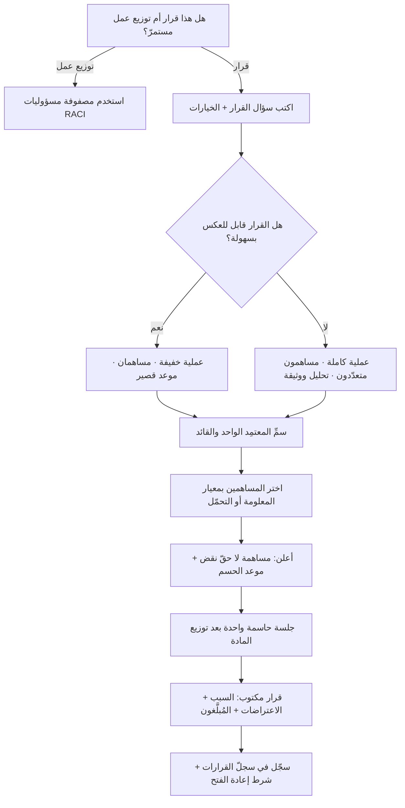

# نموذج أدوار القرار (DACI)

> [!info] تعريف مختصر
> نموذج لتوزيع الأدوار في **قرار واحد محدّد**، بأربعة أدوار: **القائد/المحرّك (Driver)** الذي يقود عملية الوصول إلى القرار ويجمع المدخلات ويلتزم بموعده؛ و**المعتمِد (Approver)** الشخص **الواحد** الذي يملك سلطة الحسم النهائي؛ و**المساهمون (Contributors)** الذين يُستشارون لخبرتهم دون امتلاك حقّ النقض؛ و**المُبلَّغون (Informed)** الذين يُخطَرون بالنتيجة لأنها تمسّهم دون أن يكونوا جزءًا من صنعها. اشتُهر النموذج عبر شركة **أطلاسيان (Atlassian)** التي نشرته ضمن أدلّتها المفتوحة لأساليب العمل، وتُذكر له جذور أقدم في ممارسات شركات التقنية. قيمته الأساسية أنه يعالج المرض الأشيع في القرارات المؤسّسية: **قرار يملك الجميع فيه رأيًا ولا يملك أحدٌ فيه حسمًا**.

## الشرح العلمي والاحترافي
- **الأدوار الأربعة بدقّة**:
  1. **القائد (Driver)**: مالك **العملية** لا مالك النتيجة. مسؤوليته أن يُصاغ سؤال القرار بوضوح، وأن تُجمَع البدائل والبيانات، وأن يُستشار الأشخاص الصحيحون، وأن يصل الملفّ إلى المعتمِد في الموعد. لا يُشترط أن يكون الأعلى رتبة؛ قد يكون محلّلًا أو مدير مشروع. غياب هذا الدور هو سبب أن كثيرًا من القرارات لا تُتّخذ ببساطة — لا لأن أحدًا رفض، بل لأن لا أحد كان مسؤولًا عن دفعها.
  2. **المعتمِد (Approver)**: **شخص واحد لا مجموعة**. هذه ليست تفصيلة شكلية بل جوهر النموذج؛ فتوزيع الاعتماد على لجنة يعني عمليًّا أن الاعتماد يُصنع بالإجماع، والإجماع يُنتج إمّا شللًا أو حلًّا وسطًا رديئًا. المعتمِد يقرّر بعد سماع المساهمين، وله أن يخالفهم — وهذا مشروع تمامًا شرط أن يُعلن السبب.
  3. **المساهمون (Contributors)**: أصحاب خبرة أو مصلحة تُثري القرار — أمن، قانوني، تصميم، تشغيل، بيانات. **يُسمَع لهم ولا يُطاع** بالضرورة، وتوضيح هذا التمييز صراحةً في بداية العملية يمنع الشعور بالخيانة لاحقًا حين يُتّخذ قرار مخالف لرأيهم.
  4. **المُبلَّغون (Informed)**: من يحتاجون معرفة القرار لتنفيذ عملهم أو لتغيير خططهم، دون مشاركة في صنعه. تجاهل هذه الفئة مصدر معتاد لتعطّل التنفيذ بعد قرار سليم.
- **التمييز الدقيق عن `RACI`**: النموذجان يبدوان متشابهين لكنهما يعالجان مسألتين مختلفتين اختلافًا جوهريًّا.
  - **موضوع النموذج**: `RACI` يوزّع الأدوار على **المهام والتسليمات** (من ينفّذ؟ من يُحاسَب على النتيجة؟)، فهو أداة تنفيذ ومساءلة على امتداد المشروع. أمّا DACI فيوزّع الأدوار على **قرار واحد**، فهو أداة حوكمة لحظة اتخاذ القرار.
  - **الدلالة الزمنية**: مصفوفة `RACI` وثيقة مستقرّة تُبنى مرّة وتُراجع دوريًّا وتغطّي عشرات البنود؛ وDACI **حدث** يُنشأ لقرار بعينه ثم يُغلق وينتهي بانتهاء القرار.
  - **الفرق الأهمّ — القائد**: في `RACI` يوجد منفّذ (Responsible) ومحاسَب (Accountable)، لكن **لا يوجد دور مسؤول عن تحريك القرار نفسه** — عن جمع المدخلات وتنظيم النقاش وفرض الموعد. هذا هو الفراغ الذي يملؤه دور Driver، وهو تحديدًا سبب وجود DACI.
  - **الفرق في الاستشارة**: حرف C في الأول (Consulted) وC في الثاني (Contributor) متقاربان، لكن DACI يذكر صراحةً أن المساهمة لا تعني حقّ النقض، بينما تُفهَم "الاستشارة" في كثير من التطبيقات المؤسّسية خطأً كموافقة ضمنية مطلوبة.
  - **متى يُستعمل كلٌّ منهما**: استخدم `RACI` حين يكون السؤال «من يفعل ماذا في هذا المشروع/العملية المستمرّة؟» — مشاريع ذات تسليمات متعدّدة وفرق متقاطعة وحاجة إلى مساءلة مستمرة. واستخدم DACI حين يكون السؤال «كيف نصل إلى هذا القرار المحدّد ومن يحسمه؟» — اختيار مورّد، تحديد نطاق إصدار، تغيير سياسة تسعير، اعتماد بنية تقنية. والاستخدام المشترك شائع وسليم: `RACI` يحكم تنفيذ المشروع، وDACI يُستدعى عند كل مفترق قرار كبير داخله.
- **الشرط التمكيني الأول — سؤال قرار واحد واضح**: DACI مطبَّق على سؤال فضفاض («ماذا نفعل بشأن الأداء؟») لا ينتج شيئًا. الصياغة الصالحة تحدّد الخيارات: «هل نستمرّ مع المورّد الحالي بتجديد سنة، أم ننتقل إلى البديل، أم نبني داخليًّا؟».
- **التوقيت الملزم جزء من النموذج**: لكل قرار موعد حسم مُعلن. بلا موعد يتحوّل جمع المدخلات إلى استمرار بلا نهاية، ويصبح التأجيل قرارًا ضمنيًّا لم يتّخذه أحد ولا يُحاسَب عليه أحد — وهو أسوأ أنواع القرارات لأنه غير مرئي.
- **علاقته بقابلية عكس القرار**: كلفة العملية يجب أن تتناسب مع نوع القرار وفق [[Reversible vs Irreversible Decisions]]. القرار القابل للعكس بسهولة يستحقّ DACI خفيفًا (قائد، معتمِد، مساهمان، ساعتان). القرار غير القابل للعكس يستحقّ العملية كاملة بمساهمين متعدّدين وتحليل ووثيقة. تطبيق العملية الثقيلة على كل قرار يُنتج بيروقراطية تُبطئ المؤسسة أكثر مما تحميها.
- **أثره على الثقافة التنظيمية**: تسمية معتمِد واحد قد تبدو معاكسة لثقافة التمكين ([[Empowerment]])، والحقيقة عكس ذلك: الغموض في الصلاحية هو ما يُنتج التدخّل المتأخّر من الإدارة العليا ونقض القرارات بعد تنفيذها. تحديد المعتمِد صراحةً — وغالبًا **تفويضه إلى أدنى مستوى ممكن** — هو ما يجعل التمكين حقيقيًّا وقابلًا للاعتماد عليه. كما أنه علاج مباشر لظاهرة [[HiPPO]] حين يُحدَّد أن رأي المدير الحاضر مساهمة لا اعتماد.
- **علاقته بالأمان النفسي**: النموذج لا يعمل إلا في بيئة يستطيع فيها المساهم أن يعارض بصراحة دون كلفة. في غياب [[Psychological Safety]] تتحوّل خانة المساهمين إلى تأييد شكلي، ويُتّخذ القرار بمخاطر لم يُصرَّح بها رغم أن من يعرفها كان في الغرفة.
- **الالتزام بعد الخلاف**: القاعدة السلوكية المصاحبة للنموذج أن الاعتراض يُقال **قبل** القرار، وبعد صدوره يلتزم الجميع بالتنفيذ حتى المخالفون. وتوثيق الاعتراضات في محضر القرار هو ما يجعل هذا الالتزام مقبولًا: المعترض يعرف أن رأيه سُجّل ولم يُتجاهل.
- **مخرجه الطبيعي وثيقة قرار قصيرة**: تحوي السؤال، والخيارات المفحوصة، والأدوار الأربعة بالأسماء، والاعتراضات الجوهرية، والقرار وسببه، وتاريخه، وموعد مراجعته. هذه الوثيقة هي ما يُغذّي [[Decision Log]] وتمنع إعادة فتح القرار نفسه كل بضعة أشهر بلا معلومة جديدة.

## أين ومتى يُستخدم
- **في القرارات المتقاطعة بين عدّة فرق**: حيث لا يوجد مالك طبيعي واحد وتتعطّل القرارات في المنطقة الرمادية بين الإدارات.
- **عند اختيار مورّد أو منصّة**: مع تغذية القرار بمخرجات [[Cost-Benefit Analysis]] كمساهمة كمّية، وتحديد معتمِد واحد يحسم بعد سماع المالية والأمن والتقنية.
- **في قرارات النطاق الحسّاسة**: تأجيل ميزة، تجميد النطاق ([[Scope Freeze]])، أو قبول [[Change Request]] كبير قرب موعد الإطلاق.
- **عند بوابات الاستمرار أو الإيقاف** ([[Go or No-Go Decision]]): لتفادي أن يتحوّل قرار الإطلاق إلى تصويت جماعي غامض في اجتماع مزدحم.
- **في اجتماعات [[Steering Committee]]**: بتحديد ما هو معروض للاعتماد وما هو معروض للعلم، وهو تمييز يوفّر وقتًا كبيرًا ويمنع تحوّل اللجنة إلى منتدى نقاش.
- **في القرارات المعمارية والتقنية**: اختيار قاعدة بيانات أو نمط تكامل، حيث الخبرة موزّعة والسلطة يجب أن تبقى واحدة.
- **عند تصعيد نزاع بين فريقين**: النموذج يحوّل النزاع من صراع نفوذ إلى مسار واضح: من يقرّر، ومتى، وبناءً على أي مدخلات.
- **في المؤسّسات الموزّعة أو العاملة عن بُعد**: حيث لا تُحسم الأمور بلقاء عابر في الممرّ، فيصبح توثيق الأدوار والموعد ضرورة لا رفاهية.

## مثال وسيناريو تطبيقي
> [!example] **شركة تقنية مالية في السعودية تدرس تغيير مزوّد بوّابة الدفع.** القرار كان معلّقًا **أحد عشر أسبوعًا**: نوقش في ستة اجتماعات، وأنتج ثلاث عروض تقديمية، ولم يُحسم. سبب التعليق لم يكن نقص المعلومات — كان لدى الفريق تحليل تكلفة وتقييم أمني ونتائج اختبار — بل أن أحدًا لم يكن يعرف من يملك أن يقول «نعم».
> عند تطبيق DACI:
> — **سؤال القرار** صيغ بدقّة: «هل ننتقل إلى المزوّد B خلال هذا الربع، أم نجدّد مع A لسنة مع تفاوض على الرسوم، أم نُبقي الاثنين بتوزيع للحركة؟» — ثلاثة خيارات محدّدة بدل سؤال مفتوح.
> — **القائد (Driver)**: مديرة منتج المدفوعات. مسؤوليتها جمع الأدلّة وتنظيم جلسة واحدة حاسمة والوصول بالملفّ إلى الموعد المحدّد بعد أسبوعين.
> — **المعتمِد (Approver)**: مدير التقنية (CTO) — **شخص واحد**. وكان هذا التحديد نفسه محلّ نقاش، إذ رأى البعض أن القرار مالي فيجب أن يعتمده المدير المالي؛ وحُسم بقاعدة صريحة: الأثر التقني والمخاطرة التشغيلية أكبر من الأثر المالي، ووُثّق سبب الاختيار.
> — **المساهمون (Contributors)**: أمن المعلومات (تقييم الامتثال ومتطلّبات حماية البيانات)، المالية (فروق الرسوم على حجم الحركة المتوقّع)، الهندسة (كلفة التكامل وزمنه)، خدمة العملاء (أثر أي انقطاع على العملاء)، والامتثال (متطلّبات الجهة التنظيمية).
> — **المُبلَّغون (Informed)**: فرق المبيعات والتسويق والدعم، لأن التغيير يمسّ تجربة الدفع ورسائل العملاء.
> جرت جلسة واحدة مدّتها 90 دقيقة عُرضت فيها الخيارات الثلاثة مع تحليل كمّي للتكلفة على ثلاث سنوات. برز اعتراض جوهري من الأمن: المزوّد B لم يكن قد أكمل شهادة امتثال مطلوبة، ومدّة إتمامها المتوقّعة 4 أشهر. ولم يكن هذا الاعتراض قد وصل إلى طاولة النقاش في أي من الاجتماعات الستّة السابقة، لأن لا أحد كان مسؤولًا عن استدعاء الأمن رسميًّا.
> **القرار**: تجديد مع A لسنة واحدة فقط (لا سنتين كما اقترح المورّد)، مع بدء التكامل مع B على مسار موازٍ وبميزانية محدودة، وإعادة فتح القرار عند اكتمال شهادة B — بمعيار محدّد مسبقًا لا برأي جديد.
> وُثّق كل ذلك في صفحة واحدة: السؤال، الخيارات، الأدوار بالأسماء، الاعتراض الأمني، القرار وسببه، تاريخه، وموعد المراجعة. ثلاثة أسابيع بعدها طُرح السؤال مجدّدًا في اجتماع آخر، فأُغلق النقاش بالإشارة إلى الوثيقة خلال دقيقتين — وهذا وحده قد يكون العائد الأكبر للنموذج.

## خطوات أو مخطّط
1. تحقّق أولًا أن ما أمامك **قرار** لا مهمّة. إن كان توزيعًا لعمل مستمرّ فأنت بحاجة إلى مصفوفة مسؤوليات (`RACI`) لا إلى DACI.
2. اكتب سؤال القرار في جملة واحدة، مع الخيارات المطروحة صراحةً. سؤال بلا خيارات محدّدة يُنتج نقاشًا لا قرارًا.
3. قدّر قابلية عكس القرار وحجم أثره، وحدّد بناءً عليها ثقل العملية المناسبة (خفيفة أم كاملة).
4. سمِّ **معتمِدًا واحدًا** بالاسم. إن تعذّر الاتفاق عليه فهذه إشارة إلى فجوة حوكمة يجب حلّها قبل القرار نفسه لا أثناءه.
5. سمِّ قائدًا واحدًا، وامنحه صلاحية الطلب من الآخرين والالتزام بالموعد.
6. اختر المساهمين بمعيار: من يملك معلومة تغيّر القرار، أو من سيتحمّل نتيجته تشغيليًّا. لا تُوسّع القائمة مجاملةً — كل مساهم إضافي يزيد الزمن ويقلّل جودة النقاش.
7. أعلن للجميع في البداية أن المساهمة **ليست حقّ نقض**، وأن القرار قد يخالف رأي بعضهم.
8. حدّد موعد الحسم وأعلنه، والتزم به حتى مع نقص بعض المعلومات؛ ووثّق ما بقي مجهولًا كافتراض أو مخاطرة في [[RAID Log]].
9. اعقد جلسة واحدة حاسمة بعد توزيع المادة مسبقًا. الجلسة لعرض الخلاف والحسم، لا لقراءة الوثيقة لأول مرة.
10. أصدر القرار مكتوبًا مع سببه والاعتراضات الجوهرية التي سُجّلت، وسمِّ من يُبلَّغ به.
11. سجّله في [[Decision Log]] وحدّد شرط إعادة فتحه صراحةً: أي معلومة جديدة تستوجب المراجعة، ومتى.

## ⚠️ مفاهيم خاطئة شائعة
> [!warning]
> - **الظنّ بأنه نسخة أخرى من `RACI`**: الاثنان يعالجان مسألتين مختلفتين — `RACI` يوزّع الأدوار على المهام والتسليمات عبر عمر المشروع، وDACI يوزّعها على قرار واحد في لحظة واحدة. والفارق الوظيفي الأهمّ أن `RACI` لا يحوي دورًا مسؤولًا عن **تحريك** القرار، وهو بالضبط دور Driver.
> - **تعيين أكثر من معتمِد**: يُلغي جوهر النموذج ويعيد المؤسسة إلى منطق الإجماع، فينتهي القرار إمّا معطّلًا أو مُخفَّفًا إلى حلّ وسط لا يحلّ المشكلة. معتمِد واحد شرط لا تفصيلة.
> - **فهم دور القائد كصاحب القرار**: القائد يملك العملية والموعد وجودة المدخلات، لا الحسم. الخلط بينهما يُنتج إمّا قائدًا يتجاوز صلاحيته أو معتمِدًا يوقّع بلا مسؤولية حقيقية.
> - **اعتبار المساهم صاحب حقّ نقض**: المساهمة إثراء لا موافقة. عدم توضيح ذلك مسبقًا يُنتج شعورًا بالتجاوز عند صدور قرار مخالف، ويدفع المساهمين لاحقًا إلى عرقلة التنفيذ بطرق غير معلنة.
> - **إغفال فئة المُبلَّغين**: قرار سليم يُنفَّذ بشكل سيّئ لأن من يتأثّر به لم يعرف به في وقته. الإبلاغ جزء من القرار لا خطوة إدارية لاحقة.
> - **تطبيقه على كل قرار صغير**: يحوّل النموذج إلى بيروقراطية تُبطئ العمل، وتدفع الفرق إلى الالتفاف عليه سرًّا فيفقد مصداقيته. قصره على القرارات ذات الأثر المعتبر أو صعبة العكس.
> - **الظنّ بأنه يضمن جودة القرار**: يضمن **وضوح مساره** فقط — من يقرّر، بأي مدخلات، ومتى. جودة القرار تبقى دالّة على جودة المعلومات وكفاءة المعتمِد ووجود بيئة يُقال فيها الاعتراض بصراحة.
> - **اعتباره منافيًا لتمكين الفرق**: العكس هو الصحيح؛ الغموض في الصلاحية هو ما يُنتج التدخّل الفوقي المتأخّر. تسمية المعتمِد — وتفويضه لأدنى مستوى ممكن — هي ما يجعل التمكين قابلًا للاعتماد عليه.

## ❌ ممارسات خاطئة في المشاريع
> [!failure]
> - **الخطأ: بدء عملية القرار قبل صياغة سؤال محدّد وخيارات مطروحة.** لماذا يضرّ: تتحوّل الجلسة إلى نقاش مفتوح يستهلك وقت خمسة أشخاص أقدمين دون مخرج، ويتكرّر ذلك في اجتماعات لاحقة. الحل: اشترط أن يوزّع القائد قبل الجلسة صفحة تحوي السؤال والخيارات والأدلّة، وأجّل الجلسة إن لم تصل.
> - **الخطأ: إسناد الاعتماد إلى لجنة أو إلى "الإدارة" بصيغة جماعية.** لماذا يضرّ: يذوب الحسم في مسؤولية جماعية لا يتحمّلها أحد، ويُعاد فتح القرار عند أول اعتراض من عضو غائب. الحل: سمِّ فردًا بالاسم، ووثّق قاعدة اختياره (أكبر أثر تقني/مالي/تنظيمي) ليُحتذى في قرارات مشابهة.
> - **الخطأ: توسيع قائمة المساهمين مجاملةً لتفادي إغضاب أحد.** لماذا يضرّ: يطيل الزمن، ويخفّض جودة النقاش، ويجعل القرار رهينة لأبطأ مشارك، وغالبًا يُنتج حلًّا وسطًا لا يخدم الهدف. الحل: طبّق معيارًا مكتوبًا للمشاركة، وضع من لا ينطبق عليه في خانة المُبلَّغين بوضوح ودون اعتذار.
> - **الخطأ: إغفال تحديد موعد للحسم.** لماذا يضرّ: يصبح التأجيل قرارًا ضمنيًّا لا يُحاسَب عليه أحد، وتُدفَع كلفة التأخير ([[Cost of Delay]]) صامتةً دون أن تظهر في أي تقرير. الحل: اجعل الموعد جزءًا من تعريف القرار عند فتحه، والتزم بالحسم عنده مع توثيق المجهول كمخاطرة.
> - **الخطأ: عدم توثيق سبب القرار والاعتراضات الجوهرية.** لماذا يضرّ: يُعاد فتح القرار كل بضعة أشهر بلا معلومة جديدة، وتُستهلك طاقة الفريق في إعادة الجدل نفسه، وتُفقد القدرة على التعلّم عند ظهور النتائج. الحل: صفحة قرار موحّدة قصيرة تُسجَّل في [[Decision Log]] مع شرط صريح لإعادة الفتح.
> - **الخطأ: تسمية معتمِد لا يملك السلطة الفعلية أو المعرفة الكافية.** لماذا يضرّ: يُنقض القرار لاحقًا من مستوى أعلى، فتُهدر العملية كاملة ويفقد النموذج مصداقيته أمام الفريق. الحل: تحقّق قبل البدء من أن المعتمِد يملك الصلاحية والميزانية، وصعّد مبكّرًا إن لم يكن كذلك بدل اكتشاف ذلك بعد الحسم.
> - **الخطأ: استخدام النموذج في بيئة لا يستطيع فيها المساهمون المعارضة بصراحة.** لماذا يضرّ: تتحوّل خانة المساهمين إلى تأييد شكلي، ويُتّخذ القرار مع مخاطر معروفة لدى الحاضرين وغير مذكورة في الغرفة. الحل: اطلب من كل مساهم ذكر أقوى اعتراض ممكن على الخيار المرجّح، واجعل غياب أي اعتراض إشارة إلى خلل في النقاش لا إلى إجماع.
> - **الخطأ: تطبيقه بنفس الثقل على القرارات القابلة للعكس والقرارات غير القابلة للعكس.** لماذا يضرّ: يُبطئ المؤسسة في القرارات الرخيصة ويستهلك رصيد الصبر التنظيمي، أو يستهين بالقرارات المصيرية إن جرى التخفيف عشوائيًّا. الحل: صنّف القرار أولًا وفق [[Reversible vs Irreversible Decisions]]، واعتمد نسختين معلنتين من العملية: خفيفة وكاملة.

## 🔗 مصطلحات ومفاهيم ذات صلة
[[Decision Log]] | [[Reversible vs Irreversible Decisions]] | [[Go or No-Go Decision]] | [[Steering Committee]] | [[Sponsor]] | [[HiPPO]] | [[Psychological Safety]] | [[Empowerment]] | [[Governance]] | [[RAID Log]] | [[Cost-Benefit Analysis]] | [[Stakeholder Map]]
