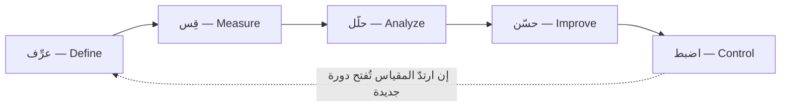

# عرِّف قِس حلّل حسّن اضبط (DMAIC)

> [!info] تعريف مختصر
> **DMAIC** دورة تحسين من خمس مراحل مرتّبة هي عمود منهجية [[Six Sigma|ستّة سيجما]]: **عرِّف (Define)** المشكلة وأثرها على العميل، ثم **قِس (Measure)** الحالة الراهنة بأرقام حقيقية، ثم **حلّل (Analyze)** حتى تبلغ السبب المؤكَّد بالدليل لا المرجَّح بالرأي، ثم **حسّن (Improve)** بحلّ مُختبَر، ثم **اضبط (Control)** حتى لا يعود الخلل بعد انصراف الفريق. وما يميّزها عن غيرها من دورات التحسين شرطان: أنّ **الانتقال بين المراحل ممنوع بلا دليل مُقاس**، وأنّ **مرحلة الضبط جزء من الدورة لا لاحقة بها**.

## الشرح العلمي والاحترافي

نشأت هذه الدورة داخل برامج ستّة سيجما في موتورولا وجنرال إلكتريك، وهي في جوهرها **صياغة منضبطة للمنهج العلمي**: فرضية، فقياس، فاختبار، فتعميم. لكن انضباطها هو الذي يميّزها؛ إذ تفصل بين المراحل **بوّابات مراجعة (Tollgates)** لا يُعبَر منها إلا بمخرَج مُعرَّف سلفًا.

**١. عرِّف (Define).** تُصاغ المشكلة في جملة قابلة للقياس، ويُحدَّد نطاقها، ويُترجَم صوت العميل إلى مطلب مقيس — وهو ما يسمّى **[[CTQ|الحرج للجودة]] (CTQ)**: أي الخاصية التي يحكم بها العميل على الجودة، مصوغةً حدًّا رقميًّا. فـ«الاستجابة سريعة» ليست مطلبًا، و«تأكيد الطلب خلال ثلاث دقائق في 95% من الحالات» مطلب.

**٢. قِس (Measure).** تُقاس الحالة القائمة قبل أي تدخّل، ويُتحقّق أوّلًا من **صلاحية نظام القياس نفسه**: هل يعطي المقياسان النتيجة ذاتها للحالة الواحدة؟ وهذه الخطوة أكثر ما يُتخطّى، وهي التي تجعل بقيّة الدورة مبنيّة على رمل. ومخرَج المرحلة **[[Baseline|خطّ أساس]]** يُقاس عليه كل ما يأتي بعده.

**٣. حلّل (Analyze).** يُبحث عن السبب الجذريّ بأدوات تربط المخرَج بمدخلاته — [[Root Cause Analysis|تحليل السبب الجذري]] و[[Pareto Principle|مبدأ باريتو]] و[[Control Chart|مخطّطات التحكّم]]. والصياغة الحاكمة عندهم `Y = f(x)`: أن النتيجة التي تشكو منها **دالّةٌ** في عوامل مدخلة، فمن أراد تغيير النتيجة غيّر العامل لا النتيجة. وهنا موضع الحذر من [[Correlation vs Causation|الخلط بين الارتباط والسببية]]، فالعامل المتزامن ليس بالضرورة السبب.

**٤. حسّن (Improve).** يُختار الحلّ ويُجرَّب على نطاق محدود قبل التعميم، ويُقاس أثره على المقياس نفسه الذي وُضع في المرحلة الثانية — لا على مقياس جديد يُوافق النتيجة.

**٥. اضبط (Control).** وهي **الفارق الحقيقي بين DMAIC وأكثر جهود التحسين**. إذ يُوضع للحالة الجديدة نظام يمنع ارتدادها: [[SOP|إجراء معياريّ]] مكتوب، ومخطّط تحكّم يرصد الانحراف، ومالك مسمّى، وخطّة تصعيد إن تجاوز المقياس حدّه. فالمكسب الذي لا يُحرَس يعود إلى ما كان خلال أشهر، وذلك أشيع مصائر مشروعات التحسين.

**وأختها لتصميم الجديد: DMADV** — عرِّف، قِس، حلّل، **صمّم (Design)**، **تحقّق (Verify)** — وتُستعمل حين لا تكون ثمّة عملية قائمة تُحسَّن، بل عملية أو منتج يُنشأ من الصفر. وتُعرف هذه الشعبة باسم **التصميم من أجل ستّة سيجما (DFSS)**.

## أين ومتى يُستخدم

- في **العمليات المتكرّرة ذات البيانات الكافية**: معالجة الطلبات، وسلاسل الإمداد، والدعم الفنّي، والتشغيل المصرفي — حيث يمكن قياس مئات الحالات لا حالتين.
- حين يكون **العيب مكلفًا وقابلًا للتعريف**: تسرّب مالي، أو معدّل ارتجاع، أو [[Escaped Defect Rate|عيوب تسرّبت إلى الإنتاج]].
- حين تكون المشكلة **مزمنة لا طارئة**، وقد جُرِّبت فيها حلول ارتجالية فعادت.
- **ولا تصلح** حيث تكون المشكلة جديدة أو الظرف متحرّكًا — فهناك موضع [[OODA Loop|حلقة OODA]] — ولا حيث لا تكفي البيانات، فيُكتفى بـ[[PDCA]] لخفّته وسرعة دورته.

## مثال وسيناريو تطبيقي

> [!example] سيناريو ملموس
> شركة تأمين اسمها **«أمان الأولى»** تشكو من أن **18%** من مطالبات التعويض تُعاد إلى العميل لنقص المستندات، فتطول دورة المعالجة أسبوعين وتكلّف مركز الاتصال آلاف المكالمات.
>
> - **عرِّف:** المطلب الحرج للجودة: «تُحسم المطالبة من الدفعة الأولى في 90% من الحالات». والحالة الراهنة 82%. والنطاق: مطالبات المركبات الفردية دون التأمين الطبّي.
> - **قِس:** قبل أي تحليل، يُختبر نظام القياس نفسه: يُعرض عشرون ملفًّا على موظّفَين، فيختلفان في تصنيف **سبعة** منها. فتُوحَّد أوّلًا قواعد التصنيف — إذ لا معنى لتحليل بيانات لا يتّفق اثنان على قراءتها.
> - **حلّل:** بعد التوحيد، تكشف البيانات أن **61%** من الإعادات سببها مستند واحد بعينه: تقرير الحادث المروري مصوَّرًا بجودة لا تُقرأ. وأن أكثر الحالات ترد من تطبيق الجوّال لا الموقع.
> - **حسّن:** يُجرَّب على فرع واحد شهرًا: فحص تلقائيّ لوضوح الصورة لحظة الرفع، مع رسالة فورية بإعادة التصوير. فينزل معدّل الإعادة في الفرع من 18% إلى 6%.
> - **اضبط:** يُعمَّم الفحص، ويُوضع مخطّط تحكّم أسبوعي لمعدّل الإعادة بحدّ أعلى 8%، ويُسمّى مالك المقياس، ويُوثَّق الإجراء. **وبعد ستّة أشهر يرتفع المعدّل إلى 11%** — فيكشف المخطّط أن نسخة جديدة من التطبيق عطّلت فحص الجودة. **وهذا بعينه ما تشتريه مرحلة الضبط:** أن يُكتشف الارتداد في أسبوع لا في تقرير سنويّ.

## خطوات أو مخطّط

1. **عرِّف**: صُغ المشكلة قابلة للقياس، وحدّد نطاقها ومطلب العميل الحرج، واكتب ميثاق المشروع.
2. **قِس**: تحقّق من صلاحية القياس أوّلًا، ثم أثبت خطّ الأساس.
3. **حلّل**: انتقل من الأعراض إلى السبب بدليل من البيانات لا بترجيح.
4. **حسّن**: جرّب الحلّ محدودًا، وقِس أثره على المقياس الأصلي.
5. **اضبط**: ثبّت المكسب بإجراء ومخطّط ومالك وحدّ تصعيد، ثم أغلق المشروع رسميًّا وسلّم المقياس لصاحب العملية.

## ⚠️ مفاهيم خاطئة شائعة

> [!warning]
> - **أن DMAIC وستّة سيجما اسمان لشيء واحد.** ستّة سيجما **منهجية** لها فلسفة وأدوار وتدريب معتمَد، وDMAIC **الدورة** التي تُنفَّذ بها مشروعاتها. وتُستعمل الدورة وحدها خارج أي برنامج معتمَد.
> - **أن مرحلة القياس تعني جمع كل بيانات مُتاحة.** المقصود قياس **المقياس الواحد** الذي عُرِّفت به المشكلة، والتحقّق من صلاحيته. وجمع كل شيء تهرّب من اختيار ما يهمّ.
> - **الخلط بينها وبين [[PDCA]].** تلك حلقة خفيفة لا تنتهي وتصلح لتحسين يوميّ صغير؛ وهذه **مشروع له بداية ونهاية وبوّابات ومخرجات**، لا يُفتح إلا لمشكلة تستحقّ كلفته. وجدول التمييز الثلاثي في [[PDCA]].
> - **أن الضبط إجراء إداريّ لاحق.** بل هو مرحلة من الدورة، ومن أسقطها فقد أنجز تحسينًا مؤقّتًا لا تحسينًا.

## ❌ ممارسات خاطئة في المشاريع

> [!failure]
> - **الانتقال من «عرِّف» إلى «حسّن» رأسًا**: يعرف الفريق الحلّ سلفًا فيمرّ على القياس والتحليل مرورًا شكليًّا ليبرّره. **التجنّب:** اجعل بوّابة المراجعة تسأل عن الدليل لا عن اكتمال الشرائح.
> - **قياس بنظام قياس غير مُتحقَّق منه**: فيُبنى التحليل كلّه على أرقام لا يتّفق عليها اثنان. **التجنّب:** اختبار اتّفاق بسيط قبل جمع البيانات — ملفّات معدودة يصنّفها شخصان.
> - **تغيير المقياس في منتصف المشروع**: حين لا يتحسّن المقياس الأصلي يُستبدل به مقياس تحسّن، فيُعلَن النجاح على غير ما وُعد به. **التجنّب:** تثبيت المقياس في مرحلة التعريف، وأي تغيير له يُوثَّق بعلّته.
> - **إغلاق المشروع بلا مالك للمقياس بعده**: ينصرف فريق التحسين فيرتدّ الوضع بلا أن ينتبه أحد. **التجنّب:** التسليم إلى صاحب العملية باسمه، مع حدّ رقميّ يوجب التصعيد.
> - **فتح مشروع DMAIC لمشكلة صغيرة**: كلفة الدورة أعلى من المكسب فيُنفَّر الناس من المنهج كلّه. **التجنّب:** قاعدة فرز صريحة — ما يُحلّ في أسبوع بـ[[PDCA]] لا يُفتح له مشروع.

## 🔗 مصطلحات ومفاهيم ذات صلة

[[Six Sigma]] | [[CTQ]] | [[Statistical Significance]] | [[PDCA]] | [[OODA Loop]] | [[Root Cause Analysis]] | [[Control Chart]] | [[Baseline]] | [[Pareto Principle]] | [[Correlation vs Causation]] | [[SOP]] | [[Quality Assurance]] | [[Escaped Defect Rate]] | [[Kaizen]]
