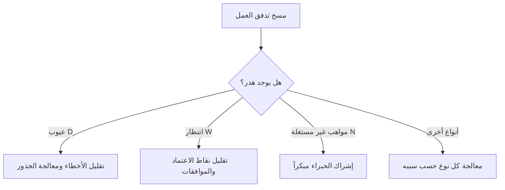

# أنواع الهدر الثمانية (DOWNTIME)

> [!info] تعريف مختصر
> DOWNTIME هي كلمة اختصارية (Mnemonic) تجمع ثمانية أنواع من الهدر (Waste) التي طوّرها الفكر الإنتاجي الرشيق (Lean)، وهي امتداد للأنواع السبعة الأصلية في نظام إنتاج تويوتا (راجع [[Toyota Production System]])، مع إضافة نوع ثامن هو "المواهب غير المستغلة".

## الشرح العلمي والاحترافي
كل حرف من DOWNTIME يمثل نوعاً من الهدر:
- **D — Defects (العيوب)**: أخطاء تتطلب إصلاحاً أو إعادة عمل (راجع [[Rework Percentage]]، [[Escaped Defect Rate]]).
- **O — Overproduction (الإنتاج الزائد)**: إنتاج ميزات أو وثائق أكثر مما يحتاجه العميل فعلاً.
- **W — Waiting (الانتظار)**: توقف العمل بانتظار موافقة، مورد، أو فريق آخر (راجع [[Blocker]]، [[Dependency]]).
- **N — Non-utilized Talent (المواهب غير المستغلة)**: عدم استغلال مهارات أو أفكار أعضاء الفريق بشكل كامل.
- **T — Transportation (النقل)**: انتقال غير ضروري للمعلومات أو المهام بين أشخاص أو أنظمة كثيرة.
- **I — Inventory (المخزون)**: تراكم عمل غير مكتمل أو متطلبات لم تُبدأ بعد (يرتبط بـ[[WIP Aging]]).
- **M — Motion (الحركة)**: جهد أو تنقل غير ضروري، مثل التبديل المستمر بين أدوات أو تطبيقات.
- **E — Extra Processing (المعالجة الزائدة)**: خطوات أو موافقات أو توثيق أكثر مما تتطلبه القيمة الفعلية للعميل.
- هذا الإطار أداة تشخيصية: يساعد الفرق على مسح تدفق العمل (راجع [[Value Stream Mapping]]) وتحديد أين يُهدَر الوقت والجهد دون أن يضيف قيمة للعميل (راجع [[Value-Added vs Non-Value-Added vs Pure Waste]]).

## أين ومتى يُستخدم
- يُستخدم في جلسات تحسين العمليات وجلسات الاستعادة (Retrospectives) (راجع [[10 - Sprint Retrospective]]) لتحديد مصادر الهدر.
- يُستخدم كأداة تشخيص أثناء جولات جيمبا (راجع [[Gemba Walk]]) أو عند رسم خرائط تدفق القيمة.
- مفيد بشكل خاص في مشاريع البرمجيات لتحليل أسباب بطء التسليم أو تكرار الأخطاء.

## مثال وسيناريو تطبيقي
> [!example] فريق منتج في شركة "نكست-آب" يراجع سبب تأخر إطلاق ميزة الدفع الإلكتروني ثلاثة أسابيع عن الموعد.
> باستخدام إطار DOWNTIME، يكتشفون:
> - **Waiting**: انتظروا 5 أيام موافقة فريق الأمان على التصميم.
> - **Defects**: أعادوا اختبار الميزة ثلاث مرات بسبب أخطاء في حساب الضرائب.
> - **Non-utilized Talent**: مطوّرة لديها خبرة سابقة في بوابات الدفع لم يُطلَب رأيها من البداية.
> - **Extra Processing**: طلبوا توقيع موافقة من ثلاث جهات إدارية على تغيير بسيط في واجهة المستخدم.
> بناءً على ذلك، يبسّط الفريق مسار الموافقات، ويُشرك الخبيرة الداخلية مبكراً في المشاريع المشابهة مستقبلاً.

## خطوات أو مخطّط
1. اجمع الفريق واعرض عليه الأنواع الثمانية للهدر.
2. راجع تدفق العمل الفعلي (من الفكرة حتى التسليم) وابحث عن أمثلة لكل نوع.
3. رتّب أنواع الهدر المكتشفة حسب تأثيرها على الوقت والجودة.
4. ضع إجراءً تصحيحياً محدداً لكل نوع هدر رئيسي.
5. تابع الأثر في الدورة التالية (Sprint أو Iteration قادمة).

## ⚠️ مفاهيم خاطئة شائعة
> [!warning]
> - الاعتقاد أن الهدر يقتصر على الوقت الضائع فقط؛ في الحقيقة يشمل أيضاً المواهب غير المستغلة والمعالجة الزائدة، وهي أنواع غير مادية يسهل تجاهلها.
> - الظن أن كل نشاط "مشغول" يعني إنتاجية؛ فقد يكون الفريق مشغولاً بأعمال هي في جوهرها هدر (مثل إنتاج زائد أو معالجة زائدة).
> - الخلط بين DOWNTIME والأنواع السبعة الكلاسيكية للهدر في التصنيع؛ DOWNTIME أضافت "المواهب غير المستغلة" كنوع ثامن خاص ببيئات المعرفة والخدمات.

## ❌ ممارسات خاطئة في المشاريع
> [!failure]
> - تحديد أنواع الهدر في جلسة استعادة ثم عدم اتخاذ أي إجراء فعلي حيالها. الحل: ربط كل نوع هدر مكتشف بخطوة تحسين محددة وقابلة للقياس.
> - التركيز فقط على هدر "الوقت والانتظار" وتجاهل هدر "المواهب غير المستغلة"، وهو الأكثر شيوعاً وضرراً في فرق المعرفة. الحل: سؤال الفريق مباشرة عن الأفكار أو المهارات غير المستغلة.
> - استخدام الإطار كأداة "لوم" لفرد أو فريق بدلاً من أداة تحسين للنظام ككل. الحل: التركيز على العمليات لا الأشخاص عند تحليل الهدر.

## 🔗 مصطلحات ومفاهيم ذات صلة
[[Muda, Mura, Muri]] | [[Value Stream Mapping]] | [[Value-Added vs Non-Value-Added vs Pure Waste]] | [[Toyota Production System]] | [[Kaizen]] | [[Rework Percentage]] | [[10 - Sprint Retrospective]] | [[Bottleneck]]
