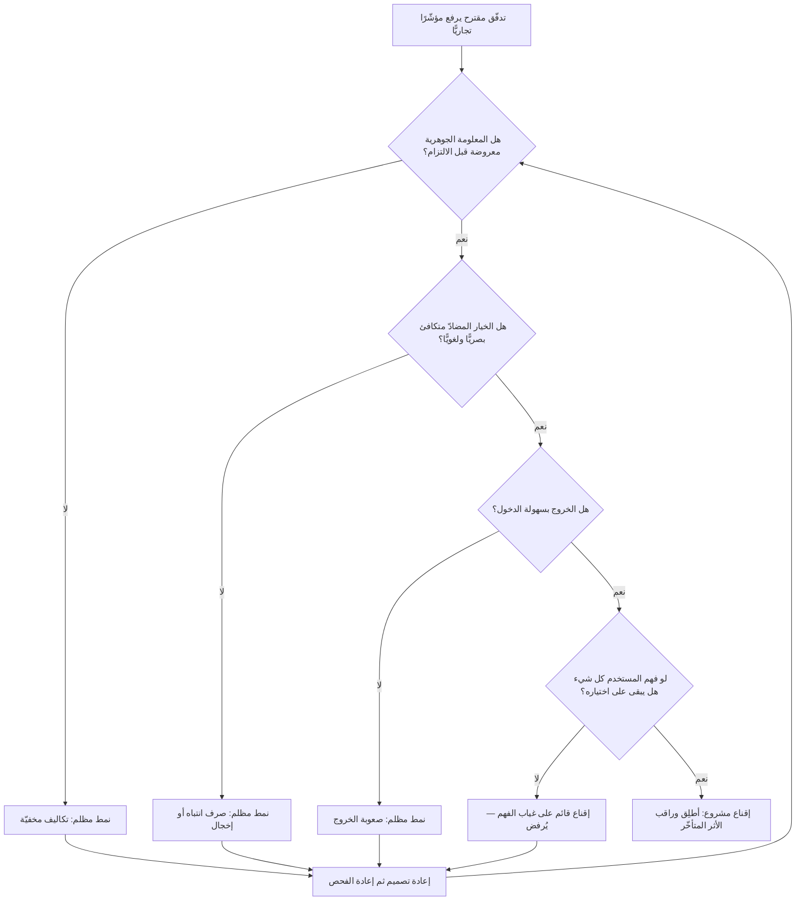

# الأنماط المظلمة (Dark Patterns)

> [!info] تعريف مختصر
> أنماط في واجهة المستخدم أو في تدفّق التجربة **مصمَّمة عمدًا** لدفع المستخدم إلى فعل لم يكن ليختاره لو عُرضت عليه الخيارات بوضوح وتكافؤ — كالاشتراك في تجديد تلقائي، أو مشاركة بيانات، أو إضافة منتج لم يطلبه، أو الاستمرار في خدمة أراد إلغاءها. والمعيار الفارق ليس أن المستخدم «انزعج»، بل أن **الواجهة استغلّت طريقة معالجة الانتباه والقراءة السريعة** لتحقيق هدف تجاري على حساب هدف المستخدم: تفاوت متعمّد في بروز الخيارين، أو إخفاء معلومة جوهرية إلى آخر خطوة، أو جعل مسار الإلغاء أصعب بمرّات من مسار الاشتراك. صاغ المصطلح المتخصّص في تجربة المستخدم **هاري برينول (Harry Brignull)** سنة **2010**، وأنشأ لتوثيقه موقعًا مرجعيًّا صار مرجع التصنيف المتداول؛ وقد صار يفضّل لاحقًا تسمية **«الأنماط الخادعة» (Deceptive Patterns)** لأنها تصف الفعل بدقّة وتتجنّب دلالات لونية غير مقصودة.

## الشرح العلمي والاحترافي

- **العمد شرط في التعريف، لكنه لا يُشترط أن يكون فرديًّا**: النمط المظلم ليس خطأ استخدامية (Usability Issue) نتج عن إهمال؛ الخطأ يضرّ الطرفين، والنمط المظلم **ينفع صاحب المنتج بمقدار ما يضرّ المستخدم**. غير أن العمد قد يكون **مؤسّسيًّا موزّعًا**: لا أحد قرّر خداع أحد، لكن هدف الربع كان «رفع نسبة التحويل 15%»، وأظهرت تجربة مقارنة (A/B) أن جعل زرّ الرفض رماديًّا باهتًا يرفعها 4 نقاط، فبقي التغيير. هذه هي الطريقة الأشيع التي تدخل بها الأنماط المظلمة إلى المنتجات: **لا بقرار شرّير، بل بتحسين محلّي بلا سقف أخلاقي**.
- **التصنيف المتداول لأنماط برينول** (بالمصطلحات المستقرّة في الأدبيات):
  1. **Roach Motel / صعوبة الخروج**: الاشتراك بنقرة واحدة، والإلغاء يتطلّب مكالمة هاتفية في أوقات محدّدة أو خمس شاشات متتالية.
  2. **Sneak into Basket / الإضافة الخفيّة**: بند يُضاف تلقائيًّا إلى السلّة (تأمين، ضمان ممتدّ، تبرّع) دون طلب صريح.
  3. **Hidden Costs / التكاليف المخفيّة**: رسوم خدمة أو ضرائب أو شحن لا تظهر إلا في الشاشة الأخيرة بعد استثمار المستخدم لجهد كافٍ يجعل التراجع مكلفًا نفسيًّا.
  4. **Forced Continuity / الاستمرار القسري**: تجربة مجانية تتحوّل إلى اشتراك مدفوع بلا تنبيه واضح، مع صعوبة مقصودة في الإلغاء قبل التحوّل.
  5. **Confirmshaming / إخجال التأكيد**: صياغة زرّ الرفض بعبارة تُشعر بالذنب أو الغباء («لا، لا يهمّني توفير المال»).
  6. **Misdirection / صرف الانتباه**: توجيه البصر إلى الخيار المربح للشركة بالحجم واللون والموضع، وإخفاء الخيار الآخر في نصّ صغير أو رابط بلا تباين.
  7. **Trick Questions / الأسئلة الملتوية**: صياغة مربكة أو نفي مزدوج في خانات الاختيار بحيث لا يدري المستخدم هل التأشير يعني الموافقة أم الرفض.
  8. **Bait and Switch / الطُّعم والتبديل**: الفعل المعتاد يُنتج نتيجة مختلفة عن المتوقّعة (زرّ الإغلاق يبدأ تثبيتًا مثلًا).
  9. **Privacy Zuckering / انتزاع الخصوصية**: دفع المستخدم إلى مشاركة بيانات أكثر ممّا ينوي عبر إعدادات افتراضية مفتوحة ولغة ملتبسة.
  10. **Disguised Ads / الإعلانات المتنكّرة**: إعلان يُصمَّم ليبدو محتوى أصليًّا أو عنصر تحكّم في الواجهة.
  11. **Price Comparison Prevention / منع المقارنة**: بنية عرض تجعل مقارنة سعر الوحدة بين الخيارات متعذّرة عمليًّا.
  12. **Friend Spam / استغلال جهات الاتصال**: طلب صلاحية للوصول إلى دفتر العناوين بذريعة، ثم استعماله لإرسال دعوات باسم المستخدم.
  ويضاف إلى هذه القائمة في الأدبيات الأحدث أنماط زمنية مثل **الإلحاح الكاذب (False Urgency)** — عدّاد تنازلي يُعاد ضبطه عند التحديث — و**البرهان الاجتماعي المفبرك (Fake Social Proof)** — إشعارات «فلان اشترى الآن» مولَّدة عشوائيًّا.
- **أين يقع الحدّ بين الإقناع المشروع والخداع؟** ثلاثة معايير عملية قابلة للتطبيق في مراجعة تصميم:
  1. **معيار الشفافية**: هل المعلومة الجوهرية (السعر الكلّي، مدّة الالتزام، ما سيحدث بعد التجربة المجانية) معروضة **قبل** لحظة الالتزام وبوضوح يماثل وضوح الدعوة إلى الفعل؟ إخفاؤها في نصّ صغير أو خلف رابط ليس عرضًا.
  2. **معيار التماثل (Symmetry)**: هل الخروج بسهولة الدخول؟ إن كان الاشتراك بنقرتين والإلغاء بسبع خطوات ومكالمة، فالفارق نفسه هو النمط المظلم — بصرف النظر عن نيّة أحد.
  3. **معيار المصلحة**: لو فهم المستخدم التدفّق فهمًا كاملًا، هل يبقى على اختياره؟ الإقناع المشروع يبقى صامدًا أمام الفهم الكامل — بل يزداد قوّة به؛ والخداع **يعتمد على غياب الفهم** وينهار بحضوره.
  ويُختصر ذلك في اختبار عملي واحد: **اختبار ضوء النهار** — هل تقبل أن يُعرض هذا التدفّق بلقطات شاشة في تقرير صحفي، أو أن يستعمله والداك؟ إن كانت الإجابة لا، فالتصنيف محسوم.
- **الفرق عن «التنبيه» (Nudge)**: أدبيات الاقتصاد السلوكي تشرح كيف تؤثّر الإعدادات الافتراضية وطريقة العرض في السلوك، وتقترح توظيفها في مصلحة الشخص نفسه مع إبقاء الخيار مفتوحًا وسهلًا. النمط المظلم يستعمل الآليات ذاتها لكن مع انقلاب في اتجاه المنفعة **وتضييق حقيقي في حرّية الخيار**. أي أن الأدوات مشتركة والفرق في اتجاه المصلحة وكلفة الاختيار المضادّ.
- **البُعد الاقتصادي: النمط المظلم قرض بفائدة مرتفعة**: يقدّم مكسبًا فوريًّا في مؤشّرات التحويل، ويؤجّل الكلفة إلى بنود لا تظهر في اللوحة نفسها: ارتفاع طلبات الاسترداد، وتضخّم تذاكر الدعم، ونزاعات ردّ المدفوعات (Chargebacks) مع بوّابات الدفع، وانهيار الثقة الذي يظهر في [[NPS]] وفي معدّل الفقد بعد شهور. ولذلك تبدو هذه الأنماط رابحة في تقرير الربع الأول وخاسرة في تقرير السنة — وهي حالة نموذجية لانفصال المخرَج عن الأثر ([[Outcome vs Output]]).
- **البُعد التنظيمي: انتقل الأمر من الأخلاق إلى القانون**: لم تعد الأنماط المظلمة مسألة ذوق مهني، بل صارت موضوعًا لنصوص ملزمة:
  - **اللائحة الأوروبية العامة لحماية البيانات ([[GDPR]])** تشترط أن تكون الموافقة **حرّة ومحدّدة ومستنيرة ولا لبس فيها**، وأن تكون بفعل إيجابي صريح — وهذا يُبطل من حيث المبدأ خانات الموافقة المؤشَّرة سلفًا واللغة الملتبسة. كما تشترط أن يكون **سحب الموافقة سهلًا كمنحها**، وهو نصّ يضرب نمط «صعوبة الخروج» مباشرة.
  - **قانون الخدمات الرقمية الأوروبي (Digital Services Act)** يتضمّن نصًّا صريحًا يمنع المنصّات من تصميم واجهاتها بطريقة تخدع المستخدمين أو تتلاعب بهم أو تعيق قدرتهم على اتّخاذ قرار حرّ ومستنير.
  - في **الولايات المتحدة**، تلاحق **لجنة التجارة الفيدرالية (FTC)** الممارسات التجارية الخادعة أو غير العادلة، وقد جعلت الأنماط المظلمة محورًا معلَنًا لعملها التنظيمي؛ كما وُضعت قواعد تخصّ تيسير الإلغاء بحيث لا يكون أصعب من الاشتراك. وعلى مستوى الولايات، أدرج قانون **CPRA** في كاليفورنيا نصًّا يعتبر الموافقة المنتزَعة عبر نمط مظلم **موافقةً باطلة**.
  - وفي الإطار الخليجي، تسير أنظمة حماية البيانات الحديثة — ومنها [[PDPL]] في السعودية — على المنطق نفسه: موافقة صريحة، وغرض محدّد، وحقّ في السحب. ويعني هذا عمليًّا أن تصميمًا يمرّ في سوق غير منظّم اليوم قد يصير مخالفة صريحة عند التوسّع أو عند تحديث اللوائح، فتتحوّل «حيلة تحويل» إلى **[[Technical Debt]] قانوني** يجب تفكيكه تحت ضغط زمني.
- **الأثر على البحث والقياس**: النمط المظلم لا يفسد الأخلاق فقط بل يفسد **المعرفة**. حين تُنتزع الموافقة أو الاشتراك بالإرباك، تصير أرقام التبنّي ([[Adoption]]) مؤشّرًا على فاعلية الحيلة لا على قيمة المنتج، فيُبنى قرار الاستثمار التالي على إشارة زائفة. أي أن الفريق يخسر بوصلته الحقيقية عن [[Product-Market Fit]].

## أين ومتى يُستخدم

- **في مراجعة تصميم تدفّقات التحويل والاشتراك والدفع**: وهي المنطقة التي تولد فيها أغلب الأنماط، خصوصًا تحت ضغط أهداف [[KPI]] ربعية.
- **في تصميم شاشات الموافقة والخصوصية**: حيث يلتقي التصميم بالإلزام القانوني في [[GDPR]] و[[PDPL]]، ويتحوّل الخطأ من مسألة تجربة إلى مسؤولية تنظيمية.
- **في كتابة [[Product Principles]] وميثاق الفريق**: بوصفها قائمة «خطوط حمراء» معلَنة يمكن الاحتكام إليها عند التعارض مع هدف قصير الأمد.
- **في تفسير نتائج التجارب وتحليلات المنتج**: للتمييز بين ارتفاع في التحويل ناتج عن وضوح أفضل، وآخر ناتج عن إرباك ([[Product Analytics]]).
- **في تعريف «تمّ» للميزات ذات الأثر التجاري**: بإضافة بند صريح إلى [[Definition of Done]] يخصّ التماثل بين الاشتراك والإلغاء ووضوح الكلفة الكلّية.
- **في حوكمة المنتج ومراجعات ما قبل الإطلاق**: عبر [[Governance]] و[[Go or No-Go Decision]]، حيث يجب أن يكون لفحص الأنماط الخادعة بند مستقلّ لا يُدمج في «مراجعة تصميم» عامّة.
- **في العلاقة مع الوكالات وفرق النموّ الخارجية**: إذ تُشترى أحيانًا خدمات «تحسين تحويل» تسلّم أنماطًا مظلمة جاهزة، فيتحمّل صاحب المنتج المسؤولية القانونية عن قرار لم يصمّمه ([[Vendor Management]]).

## مثال وسيناريو تطبيقي

> [!example] منصّة اشتراكات إقليمية لتعلّم اللغات تعمل في السعودية والإمارات ومصر. الهدف المعلَن للربع: رفع الاشتراكات المدفوعة 20%.
>
> **ما جرى**: أطلق فريق النموّ ثلاثة تغييرات في أسبوعين:
> ① تجربة مجانية 7 أيام تتطلّب بطاقة، والتحوّل إلى الاشتراك السنوي تلقائي، والتنبيه الوحيد رسالة بريدية تصل في اليوم السادس بعنوان تسويقي لا يذكر الشحن.
> ② في شاشة الدفع، خيار «الخطة السنوية» بزرّ أخضر عريض، و«الشهرية» كنصّ رمادي بحجم 12 بكسل أسفل الشاشة.
> ③ زرّ رفض الإشعارات صيغ بعبارة: «لا، أفضّل أن أنسى دراستي».
> وأُخفي مسار الإلغاء داخل: الحساب ← الفوترة ← إدارة الخطّة ← «هل أنت متأكّد؟» ← عرض خصم ← «هل أنت متأكّد فعلًا؟» ← نموذج سبب إلزامي.
>
> **الأرقام بعد شهر**: التحويل من التجربة إلى المدفوع ارتفع من 11% إلى 19%. احتفل الفريق، وعُرض الرقم على [[Steering Committee]].
>
> **الأرقام بعد أربعة أشهر**: طلبات الاسترداد ارتفعت من 3% إلى 17% من المشتركين الجدد. تذاكر الدعم المصنّفة «إلغاء» صارت 38% من إجمالي التذاكر، مستهلكةً وقت فريق كامل. فتحت بوّابة الدفع مراجعة على الحساب بسبب ارتفاع نزاعات ردّ المدفوعات وهدّدت برفع نسبة الاحتجاز. [[NPS]] هبط 24 نقطة، وانتشرت لقطات شاشة لشاشة «أفضّل أن أنسى دراستي» على منصّات التواصل مع تعليقات ساخرة، تبعتها موجة تقييمات سلبية في المتجر خفّضت التقييم من 4.5 إلى 3.2 — وهو رقم يؤثّر مباشرة في اكتساب المستخدمين العضوي. ثم وصل استفسار من جهة حماية المستهلك عن آلية الإفصاح عن التجديد التلقائي.
>
> **الحساب الصافي**: 8 نقاط تحويل مكتسبة مقابل 14 نقطة استرداد إضافية، وكلفة دعم، وضرر في قناة الاكتساب، ومخاطرة تنظيمية. المكسب كان **سالبًا** حتى بالمنطق التجاري البحت — لكن اللوحة التي عُرضت في الشهر الأول لم تكن تحتوي أيًّا من هذه البنود.
>
> **التصحيح**: عُرض التاريخ والمبلغ الدقيقان للتحويل في شاشة التسجيل نفسها، وأُرسل تنبيه قبل 48 ساعة، ووُضع الإلغاء بنقرتين في الشاشة الرئيسة للحساب، وأُعيدت صياغة الخيارات بوزن بصري متكافئ. استقرّ التحويل عند 14% — أعلى من الأصل وأقلّ من الرقم المتضخّم — وعاد الاسترداد إلى 4%، ونزلت تذاكر الإلغاء إلى 9%. وأُضيف إلى [[Definition of Done]] بند: «كل تدفّق فيه التزام مالي يمرّ بفحص التماثل: خطوات الخروج ≤ خطوات الدخول».

## خطوات أو مخطّط

1. **اجرد التدفّقات الحسّاسة**: التسجيل، الدفع، الاشتراك والتجديد، الموافقات، الإلغاء، حذف الحساب، مشاركة البيانات.
2. **طبّق معيار التماثل عدديًّا**: احسب عدد النقرات والشاشات للدخول مقابل الخروج، واعتبر أي فارق جوهري عيبًا يجب تبريره كتابةً أو إصلاحه.
3. **افحص الوزن البصري للخيارات**: هل زرّ القبول وزرّ الرفض متقاربان في الحجم والتباين والموضع؟
4. **راجع نصوص الواجهة**: هل في أي زرّ رفض إخجال أو نفي مزدوج أو صياغة ملتبسة؟
5. **تحقّق من كشف الكلفة الكلّية** قبل أي التزام، لا في الشاشة الأخيرة.
6. **افحص الإعدادات الافتراضية**: كل خانة مؤشَّرة سلفًا تحتاج مبرّرًا صريحًا، وأي منها متعلّق ببيانات شخصية يُعامَل كمخالفة حتى يثبت العكس.
7. **اختبر مع مستخدمين حقيقيين واسأل عن الفهم لا الرضا**: «ماذا تتوقّع أن يحدث بعد سبعة أيام؟ وكم ستُخصم؟». الفجوة بين التوقّع والواقع هي مقياس الخداع الأدقّ.
8. **ثبّت الفحص في العملية**: بند إلزامي في [[Definition of Done]] ومراجعة ما قبل الإطلاق، لا مبادرة فردية.
9. **راقب مؤشّرات الأثر المتأخّر**: الاسترداد، تذاكر الإلغاء، نزاعات الدفع، تقييمات المتجر، [[NPS]] — واعرضها في اللوحة نفسها التي تعرض التحويل.

## ⚠️ مفاهيم خاطئة شائعة
> [!warning]
> - **«كل تصميم مقنع نمط مظلم»**: التصحيح: الوضوح والتبسيط وإبراز الخيار الأنسب ممارسات مشروعة. الفارق أن الإقناع المشروع يصمد أمام الفهم الكامل، بينما النمط المظلم يعتمد على غياب الفهم أو على رفع كلفة الخيار المضادّ.
> - **«ما دام قانونيًّا فهو مقبول»**: التصحيح: التنظيم يتأخّر عن التصميم بسنوات، والممارسة المسموحة اليوم قد تصير مخالفة غدًا بأثر يشمل قاعدة مستخدمين قائمة. كما أن الضرر السمعي لا ينتظر صدور لائحة.
> - **«ما دام يرفع التحويل فهو تحسين»**: التصحيح: التحويل مؤشّر لحظي؛ والأنماط المظلمة تنقل الكلفة إلى مؤشّرات أخرى وإلى أرباع لاحقة. القياس الصحيح يمتدّ إلى الاسترداد والفقد وكلفة الدعم.
> - **«النمط المظلم قرار شرّير من الإدارة»**: التصحيح: أغلبه ينشأ من تحسينات صغيرة متتالية تحت ضغط هدف رقمي، بلا لحظة قرار واحدة. ولذلك لا يُعالَج بالنيّات بل بمعايير مكتوبة في العملية.
> - **«الاعتذار في نصّ الشروط والأحكام يكفي»**: التصحيح: الإفصاح المدفون في وثيقة لا يقرؤها أحد ليس إفصاحًا بالمعنى العملي ولا بالمعنى التنظيمي في كثير من الأطر؛ العبرة بما يراه المستخدم في لحظة القرار.
> - **«هذه مسؤولية المصمّم»**: التصحيح: المصمّم ينفّذ ضمن هدف ومقياس حدّدهما غيره. المسؤولية تقع على من وضع المقياس وقبل النتيجة — أي على مدير المنتج والقيادة.
> - **«الأنماط المظلمة ظاهرة في المنتجات الاستهلاكية فقط»**: التصحيح: توجد نظائرها في المنتجات المؤسّسية: عقود تجديد تلقائي يصعب إيقافها، تصدير بيانات معطَّل عمدًا لتقييد الخروج ([[Vendor Lock-in]])، وتسعير مصمَّم لمنع المقارنة.

## ❌ ممارسات خاطئة في المشاريع
> [!failure]
> - **تحديد هدف ربعي لرفع التحويل بلا حدود أو مقاييس مضادّة** → يدفع الفريق حتميًّا إلى استكشاف الحيل باعتبارها أرخص طريق للرقم → **الحل**: اقرن كل هدف تحويل بمؤشّر حارس (Guardrail Metric) مثل نسبة الاسترداد وتذاكر الإلغاء، واجعل تجاوزه سببًا لإلغاء التغيير آليًّا ([[Guard Rails]]).
> - **قبول أي نتيجة تجربة إيجابية دون فحص آليّتها** → قد يكون الارتفاع ناتجًا عن إرباك المستخدم لا عن قيمة، فيُبنى المنتج على إشارة زائفة → **الحل**: اشترط في كل تجربة رابحة تفسيرًا سببيًّا للآلية، وارفض التغيير إن كان التفسير الوحيد «لأن المستخدم لم ينتبه».
> - **إسناد تصميم شاشات الموافقة إلى المطوّر أو المصمّم بلا مراجعة قانونية** → يُنتج موافقات باطلة بموجب [[GDPR]] و[[PDPL]] وقد تُبطل قاعدة المعالجة كاملة بأثر رجعي → **الحل**: اجعل شاشات الموافقة عنصرًا خاضعًا لمراجعة الامتثال ووثّق أساس المعالجة في [[ROPA]].
> - **جعل الإلغاء أصعب من الاشتراك «لتقليل الفقد»** → يؤجّل الفقد ولا يمنعه، ويحوّل مستخدمًا محايدًا إلى ناقد علني، ويستنزف الدعم، ويستدعي التدقيق التنظيمي → **الحل**: قاعدة صريحة بالتماثل، واستثمر بدلًا من ذلك في فهم أسباب المغادرة عبر [[User Interview]] مع المنسحبين.
> - **شراء «تحسين تحويل» من وكالة خارجية بلا معايير مكتوبة** → تسلَّم أنماط مظلمة جاهزة، والمسؤولية القانونية والسمعية تبقى على صاحب المنتج → **الحل**: ضمّن [[SOW]] بندًا يحظر الأنماط الخادعة صراحةً بتعدادها، واجعل الفحص شرط قبول.
> - **إخفاء الرسوم الإضافية حتى الشاشة الأخيرة لرفع إتمام السلّة** → يرفع التخلّي في اللحظة الأخيرة فعليًّا في كثير من الحالات، ويؤسّس لانعدام ثقة في كل سعر لاحق → **الحل**: أظهر الكلفة الكلّية مبكرًا؛ الشفافية السعرية أرخص من استرداد ثقة مفقودة.
> - **معاملة الشكاوى المتكرّرة عن الإلغاء كمشكلة دعم لا كمشكلة تصميم** → تُبتلع الإشارة في طابور التذاكر ولا تصل إلى الـ Backlog أبدًا → **الحل**: اجعل تصنيفات تذاكر الدعم مدخلًا دوريًّا إلى ترتيب الأولويات، وارصد «تكرار الشكوى» كمؤشّر أول على نمط مظلم.
> - **غياب أي بند عن الأنماط الخادعة في مبادئ المنتج** → يجعل الاعتراض عليها موقفًا شخصيًّا يواجه صاحبه وحده أمام ضغط الرقم → **الحل**: اكتب الخطوط الحمراء في [[Product Principles]] بصيغة قابلة للاحتكام، وامنح أي عضو في الفريق حقّ إيقاف التدفّق للمراجعة.

## 🔗 مصطلحات ومفاهيم ذات صلة
[[Cognitive Bias]] | [[Confirmation Bias]] | [[Product Principles]] | [[GDPR]] | [[PDPL]] | [[ROPA]] | [[Governance]] | [[Guard Rails]] | [[NPS]] | [[Adoption]] | [[Product Analytics]] | [[Outcome vs Output]] | [[Vendor Lock-in]] | [[UX vs CX]] | [[Definition of Done]] | [[Concierge MVP]]
