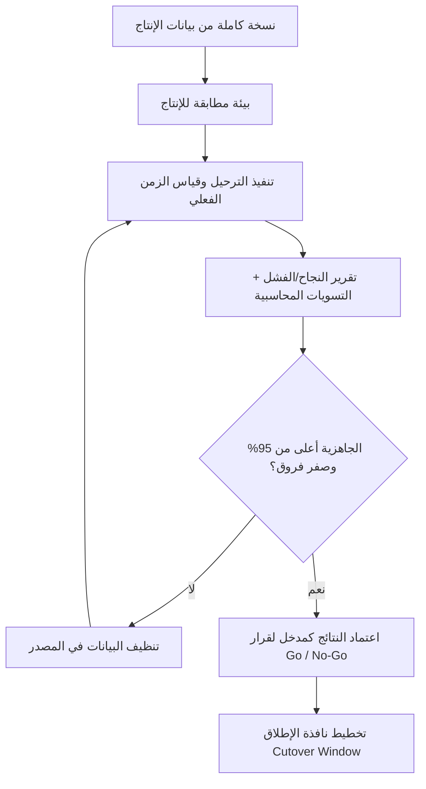

# التجربة الجافة للبيانات (Data Dry Run)

> [!info] تعريف مختصر
> التجربة الجافة للبيانات (Data Dry Run) — وتُسمّى أيضًا الترحيل التجريبي (Mock Migration) — هي **بروفة كاملة** لعملية ترحيل البيانات الحقيقية إلى بيئة مطابقة لبيئة الإنتاج، تُجرى قبل [[Go or No-Go Decision|الإطلاق الفعلي]] بأسابيع. الغرض ليس اختبار وظائف النظام، بل اختبار **البيانات نفسها وعملية نقلها**: هل تصل كاملة؟ صحيحة؟ متوازنة محاسبيًا؟ وفي كم من الوقت؟ وهي أهم إجراء منفرد لخفض مخاطر الإطلاق، لأن **نحو 70% من مشاكل الإطلاق مصدرها البيانات لا البرمجيات**.

## الشرح العلمي والاحترافي
- **لماذا البيانات تحديدًا؟** الإحصائية المحورية في مشاريع الأنظمة المؤسسية أن **قرابة 70% من مشاكل ما بعد الإطلاق سببها البيانات**: أرصدة غير مطابقة، عملاء مكرّرون، حقول إلزامية فارغة، تصنيفات غير موحّدة، تواريخ بصيغ مختلطة، حسابات محاسبية غير مربوطة. البرمجيات تُختبر عادة بعناية، أما البيانات فتُفترض "جاهزة" — وهذا الافتراض هو مصدر معظم كوارث الإطلاق.
- **الفرق الجوهري بينه وبين الاختبار العادي (Testing)** — وهو الالتباس الأكثر شيوعًا:
  - **الاختبار العادي** يجري على بيئة تجريبية ([[Staging vs Production Environment|Sandbox]]) بعيّنة بيانات **مصطنعة أو مختصرة**: عشرة عملاء، خمسة أصناف، فاتورتان. هدفه التأكد أن **الوظيفة** تعمل.
  - **التجربة الجافة** تجري على بيئة **مطابقة للإنتاج** ببيانات **إنتاج حقيقية كاملة الحجم**: كل العملاء، كل الأصناف، كل الأرصدة والحركات التاريخية. هدفها التأكد أن **الواقع** يمرّ.
  - النتيجة العملية: نظام ناجح في كل اختبارات الوظائف قد يفشل تمامًا يوم الإطلاق لأن ملف الأصناف يحتوي 40 ألف صنف بدل خمسة، أو لأن 12% من العملاء بلا رقم ضريبي إلزامي.
- **ما الذي تقيسه التجربة الجافة فعلًا؟**
  1. **نِسب النجاح والفشل في الاستيراد**: كم سجلًا دخل بنجاح، وكم رُفض، ولماذا رُفض (تقرير أخطاء مصنَّف بالسبب لا قائمة أخطاء خام).
  2. **سلامة البيانات الأساسية ([[Master Data]])**: العملاء، الموردون، الأصناف، شجرة الحسابات، الموظفون — تكامل حقولها الإلزامية وتوحيد ترميزها.
  3. **التكرارات والحقول الفارغة**: عملاء مكرّرون بأسماء مختلفة قليلًا، أصناف بأكواد متعددة، حقول مطلوبة خالية تمنع إتمام العمليات لاحقًا.
  4. **زمن الترحيل الفعلي (Actual Cutover Duration)**: كم ساعة استغرق النقل والتحقق فعليًا؟ هذا الرقم هو ما تُخطَّط عليه **نافذة الإطلاق (Cutover Window)**؛ من دونه يكون تقدير "نطلق ليلة الخميس" تخمينًا.
  5. **التسويات المحاسبية (Reconciliation)**: مطابقة مجاميع الأرصدة بين النظام القديم والجديد — إجمالي الذمم المدينة، الدائنة، قيمة المخزون، ميزان المراجعة. الفرق المقبول هنا صفر، لا "قريب".
  6. **الأداء تحت الحجم الحقيقي**: هل تفتح التقارير والشاشات بسرعة مقبولة بعد امتلاء قاعدة البيانات؟
- **التكرار حتى بلوغ الجاهزية**: التجربة الجافة ليست حدثًا واحدًا بل **دورة تتكرر**: تجربة → تقرير أخطاء → تنظيف البيانات في المصدر → إعادة التجربة. تُجرى عادة 2 إلى 4 دورات، وتستمر حتى تتجاوز **نسبة الجاهزية 95%** من السجلات المرحّلة بنجاح ومطابَقة، مع تصفير الأخطاء الحرجة في البيانات المالية والأساسية.
- **دورها في قرار الانطلاق**: نتيجة آخر تجربة جافة هي أحد أقوى مدخلات [[Go or No-Go Decision|قرار Go / No-Go]]. مدير المشروع لا يقول "أعتقد أن البيانات جاهزة"، بل يعرض رقمًا: 97.4% نجاح، صفر فروق في التسويات، زمن ترحيل 6 ساعات و20 دقيقة ضمن نافذة 10 ساعات. وإن لم تُستوفَ العتبة، فالقرار المهني هو التأجيل — لأن الإطلاق ببيانات معطوبة يُنتج عملًا يدويًا لأشهر ويُدمّر ثقة المستخدمين.
- **علاقتها بخطة التراجع**: التجربة الجافة تكشف أيضًا الجانب المعاكس؛ إذ توضّح حجم البيانات وزمنها، وهو ما يجعل [[Rollback|خطة التراجع]] واقعية وقابلة للتنفيذ ضمن النافذة الزمنية.

## أين ومتى يُستخدم
- في مشاريع تطبيق أنظمة المؤسسات (ERP / CRM / HRMS) عند الانتقال من نظام قديم أو من ملفات Excel إلى نظام موحّد.
- عند ترحيل قاعدة بيانات أو استبدال منصّة (Platform Migration) أو دمج نظامَي شركتين بعد اندماج.
- قبل أي [[Go or No-Go Decision|Go-Live]] يتضمن نقل أرصدة مالية أو مخزون أو رواتب، حيث لا يُقبل هامش خطأ.
- قبل ربط تكاملات (Integrations) تعتمد على تطابق البيانات الأساسية بين نظامين.
- في المشاريع متعددة المواقع: تُجرى تجربة جافة لكل موجة إطلاق (Wave) لأن جودة بيانات كل فرع مختلفة.
- كمدخل لتخطيط نافذة الإطلاق (Cutover Plan) وتحديد ساعة التوقف المسموح بها للعمل.

## مثال وسيناريو تطبيقي
> [!example] شركة توزيع تنتقل من نظام محاسبي قديم إلى ERP جديد، الإطلاق مخطط له بعد 6 أسابيع. حجم البيانات: **18,400 عميل**، **7,200 صنف**، **312 موردًا**، وأرصدة افتتاحية بقيمة **11.6 مليون** ريال.
> **التجربة الجافة الأولى**: نجح استيراد **81%** من العملاء فقط. الأسباب: 1,940 عميلًا بلا رقم ضريبي (حقل إلزامي)، و**640 عميلًا مكرّرًا** بصيغ اسم مختلفة ("مؤسسة النور" / "مؤسسه النور" / "AL NOOR EST"). المخزون: 5% من الأصناف بلا وحدة قياس. التسوية المحاسبية أظهرت فرقًا قدره **74,300** ريال في الذمم المدينة. زمن الترحيل الفعلي: **11 ساعة و40 دقيقة** — أي أطول من نافذة الإطلاق المخطّطة (8 ساعات ليلة الخميس).
> **الإجراء**: أُعيدت قوائم الأخطاء إلى فريق العميل لتنظيفها في المصدر، وأُضيف فهرس ومعالجة دفعية لتسريع الاستيراد.
> **التجربة الجافة الثانية** (بعد أسبوعين): نجاح **94%**، الفرق المحاسبي انخفض إلى 3,100 ريال (سببه قيود معلّقة لم تُرحَّل)، وزمن الترحيل نزل إلى **7 ساعات و10 دقائق**.
> **التجربة الجافة الثالثة** (قبل الإطلاق بأسبوع): نجاح **97.8%**، **صفر فروق** في التسويات المحاسبية، زمن الترحيل **6 ساعات و05 دقائق** ضمن نافذة 8 ساعات.
> **النتيجة**: عُرضت الأرقام في اجتماع [[Go or No-Go Decision|Go / No-Go]] فصدر قرار Go بثقة، وخُطّطت نافذة الإطلاق من 9 مساءً الخميس حتى 6 صباحًا الجمعة مع هامش أمان ساعتين. لو اعتُمد على التجربة الأولى فقط لكان الإطلاق تجاوز النافذة وبدأ يوم العمل والنظام ما زال في منتصف الترحيل.

## خطوات أو مخطّط
1. **تجهيز بيئة مطابقة للإنتاج** من حيث الإصدار والإعدادات والموارد (لا بيئة Sandbox مصغّرة).
2. **استخراج نسخة كاملة من بيانات الإنتاج الحقيقية** من النظام المصدر بتاريخ قطع محدد.
3. **تنفيذ سكربتات الترحيل** كاملة مع **تسجيل زمن كل مرحلة** بدقة.
4. **إصدار تقرير الاستيراد**: نسب النجاح والفشل مصنّفة حسب سبب الرفض ونوع الكيان.
5. **فحص جودة [[Master Data]]**: التكرارات، الحقول الفارغة، توحيد الترميز، سلامة الروابط.
6. **إجراء التسويات المحاسبية**: مطابقة المجاميع بين المصدر والهدف حتى تصفير الفروق.
7. **قياس زمن الترحيل الفعلي** ومقارنته بنافذة الإطلاق المتاحة مع هامش أمان.
8. **إعادة قوائم الأخطاء إلى المصدر** لتنظيف البيانات لدى فريق العميل.
9. **تكرار الدورة** حتى تتجاوز الجاهزية **95%** وتُصفَّر الأخطاء الحرجة.
10. **رفع النتائج كمُدخَل رسمي** إلى قرار [[Go or No-Go Decision|Go / No-Go]] وتحديث [[RAID Log]] و[[Rollback|خطة التراجع]].

## ⚠️ مفاهيم خاطئة شائعة
> [!warning]
> - **الخلط بينها وبين [[UAT]] أو [[Smoke Testing]]**: الاختبارات تتحقق من **الوظائف** بعيّنة بيانات، والتجربة الجافة تتحقق من **البيانات الحقيقية كاملة الحجم** وعملية نقلها.
> - **الاعتقاد أن نجاح الاستيراد يعني صحة البيانات**: قد تدخل السجلات كلها بنجاح تقني بينما تكون قيمها خاطئة أو مكرّرة. النجاح الحقيقي يُثبت بالتسوية المحاسبية والفحص النوعي.
> - **الظن أنها تُجرى مرة واحدة**: هي دورة تتكرر حتى بلوغ العتبة؛ التجربة الأولى غايتها كشف حجم المشكلة لا اجتيازها.
> - **تجاهل قياس الزمن**: كثيرون يقيسون الجودة وينسون المدة، فتفاجئهم نافذة إطلاق أقصر من زمن الترحيل الفعلي.
> - **افتراض أن تنظيف البيانات مسؤولية المورّد**: البيانات ملك العميل ومعرفتها لديه؛ دور المورّد كشف الأخطاء وتوفير الأدوات، لا تخمين القيم الصحيحة.
> - **الاكتفاء بعيّنة "تمثيلية" بحجة توفير الوقت**: العيّنة لا تكشف مشاكل الحجم ولا زمن الترحيل ولا الحالات النادرة، وهي بالضبط ما يفجّر الإطلاق.

## ❌ ممارسات خاطئة في المشاريع
> [!failure]
> - **إجراء التجربة الجافة على بيئة أضعف من الإنتاج**: تُعطي زمن ترحيل وأداءً غير واقعيين، فتنهار التقديرات ليلة الإطلاق. الحل: بيئة مطابقة في الموارد والإصدار والإعدادات كما في [[Staging vs Production Environment]].
> - **تأجيل التجربة إلى الأسبوع السابق للإطلاق**: لا يبقى وقت لتنظيف البيانات، فيُختار بين إطلاق ببيانات معطوبة أو تأجيل مُكلف. الحل: أول تجربة جافة قبل الإطلاق بـ 6–8 أسابيع على الأقل، وجدولة الدورات في الخطة.
> - **عدم تصنيف أخطاء الاستيراد حسب السبب**: تسليم العميل ملفًا بآلاف الأخطاء الخام يجعله عاجزًا عن التصرف. الحل: تقرير مصنّف بالسبب والكيان وعدد السجلات لكل نوع خطأ، مع أولوية معالجة.
> - **تنظيف البيانات في ملف الترحيل بدل النظام المصدر**: يُصلح الأعراض مرة واحدة وتعود الأخطاء في الدورة التالية ويضيع الجهد. الحل: التصحيح في المصدر دائمًا، وإبقاء سكربت الترحيل نظيفًا وقابلًا للتكرار.
> - **تخطّي التسويات المحاسبية بحجة أن الأرقام "قريبة"**: فرق صغير في الأرصدة الافتتاحية يتضخّم عبر الحركات ويظهر بعد شهور كخلل لا يمكن تتبّعه. الحل: اشتراط تصفير الفروق كمعيار خروج غير قابل للتفاوض.
> - **عدم توثيق نتائج التجربة كمُدخَل رسمي للقرار**: يتحوّل قرار الإطلاق إلى انطباع شخصي. الحل: تقرير جاهزية بيانات مُعتمد وموقّع يُعرض في اجتماع [[Go or No-Go Decision|Go / No-Go]].
> - **إهمال تدريب فريق العميل على قراءة تقارير الأخطاء**: تتراكم الأخطاء لأن لا أحد يفهمها. الحل: جلسة قصيرة بعد التجربة الأولى لشرح التقرير وتوزيع مسؤوليات التنظيف باسم ومهلة.

## 🔗 مصطلحات ومفاهيم ذات صلة
[[Master Data]] | [[Go or No-Go Decision]] | [[Staging vs Production Environment]] | [[Rollback]] | [[Smoke Testing]] | [[UAT]] | [[Hypercare]] | [[RAID Log]]
