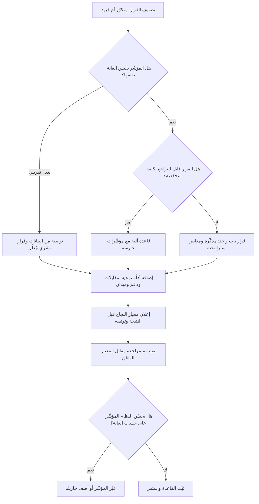

# الاسترشاد بالبيانات مقابل القيادة بالبيانات (Data Informed vs Data Driven)

> [!info] تعريف مختصر
> مذهبان في مكانة البيانات داخل القرار. **القيادة بالبيانات (Data-Driven)** تجعل الرقم هو الحَكَم: يُحدَّد مؤشّر مسبقًا، ويقرّر نتيجته المسار آليًّا. و**الاسترشاد بالبيانات (Data-Informed)** يجعل الرقم أحد المُدخلات إلى جانب سياق السوق، والاستراتيجية، والمعرفة النوعية بالمستخدم، والقيود الأخلاقية والتنظيمية — فالبيانات **تُخبر** ولا **تقرّر**. الفارق ليس في حبّ البيانات أو كراهيتها، بل في تحديد ما تصلح البيانات للحكم فيه: كلّما كان القرار متكرّرًا وقابلًا للقياس والتراجع اقترب المنطق الصحيح من القيادة بالبيانات، وكلّما كان نادرًا وطويل الأثر وغامض القياس اقترب من الاسترشاد.

## الشرح العلمي والاحترافي
- **الحجّة لصالح القيادة بالبيانات — بإنصاف**: الحكم البشري عرضة لانحيازات موثّقة (تأكيد المعتقد، الأثر الحديث، انحياز الأقدمية والسلطة). حين يُتّخذ القرار برأي أعلى راتب في الغرفة، تتحوّل المنظّمة إلى ماكينة تبرير. والقاعدة المسبقة — «إن لم يرتفع المؤشّر بنسبة كذا خلال أسبوعين نتراجع» — تُلزم الجميع بمعيار واحد قبل معرفة النتيجة، فتحمي من إعادة تفسير الأرقام بعد وقوعها. وفي القرارات المتكرّرة عالية التردّد (ترتيب النتائج، حدود التنبيهات، تسعير ديناميكي، توجيه التذاكر) تتفوّق القاعدة الآلية على الحدس بفارق واضح، وتُنتج اتّساقًا وقابلية تدقيق يستحيل بلوغهما بالحكم الفردي.
- **الحجّة لصالح الاسترشاد بالبيانات — بإنصاف أيضًا**: البيانات ليست الواقع بل **قياس للواقع**، وكل قياس مقيَّد بأربعة حدود: يقيس ما هو سهل القياس لا ما هو مهم؛ ويصف الماضي القريب لا المستقبل؛ ولا يشمل من لم يستخدم المنتج أصلًا (تحيّز الناجين)؛ ويصمت تمامًا عن الخيارات التي لم تُعرض قط. لذلك تميل القيادة الحرفية بالبيانات إلى **التحسين المحلّي**: صقل مستمرّ للقمّة القريبة مع عجز بنيوي عن رؤية القمّة الأعلى في الاتّجاه الآخر. وتزداد الحجّة قوّة حين تكون البيانات شحيحة أصلًا (منتج جديد بلا مستخدمين، سوق لم يُدخل بعد) — أي في نطاق [[Knightian Uncertainty]] حيث لا توزيعة يُحتكم إليها.
- **الحدّ العملي بين المذهبين — القاعدة الفاصلة**: ثلاثة أسئلة تحسم أي القرارين تتّبع: (١) **هل القرار متكرّر أم فريد؟** المتكرّر يستحق قاعدة آلية. (٢) **هل المؤشّر يقيس النتيجة الحقيقية أم بديلًا عنها؟** كلّما ابتعد المؤشّر عن الغاية وجب الحكم البشري. (٣) **هل القرار قابل للتراجع؟** ([[Reversible vs Irreversible Decisions]]) القابل للتراجع يُسلَّم للرقم بأمان لأن كلفة الخطأ محدودة، وغير القابل للتراجع لا يُسلَّم لمؤشّر مهما بدا واضحًا.
- **قانون جودهارت (Goodhart's Law)**: مبدأ معروف في الاقتصاد وسياسات القياس مفاده أن المقياس حين يصبح هدفًا يتوقّف عن كونه مقياسًا جيّدًا. فبمجرّد ربط الحوافز بمؤشّر، يبدأ النظام بتحسين المؤشّر نفسه لا الغاية خلفه: يُغلق الفريق التذاكر ليخفض زمن الاستجابة دون حلّ المشكلة، فيرتفع [[Reopen]]؛ أو تُحسَّن نسبة النقر بعناوين مضلّلة فترتفع نسبة المغادرة. وهذا وحده سبب كافٍ لإبقاء عين بشرية على أي قاعدة آلية.
- **الاختلاف الحقيقي في القرارات الاستراتيجية**: أشد ما يفشل فيه منطق القيادة بالبيانات هو القرارات التي تُغيّر تعريف المنتج أو السوق. لا توجد بيانات عن سلوك لم يحدث بعد، والاعتماد الحرفي على المؤشّر الحالي في مثل هذه اللحظات يقود إلى تحسين ما ينبغي هدمه. البديل ليس الحدس المجرّد، بل **تحويل الحدس إلى فرضية قابلة للاختبار الرخيص** ([[Hypothesis]], [[Fake Door Test]], [[Cost of Experimentation]]) — أي شراء بيانات حيث لا توجد، بدل الاستسلام لغيابها أو تجاهله.
- **البيانات النوعية بيانات أيضًا**: خطأ شائع في التصنيف هو مطابقة «البيانات» بالأرقام. مقابلات المستخدمين ([[User Interview]], [[The Mom Test]]) وسجلّات الدعم وملاحظات الميدان ([[Gemba Walk]]) أدلّة منهجية تفسّر **لماذا** يتحرّك الرقم — والرقم وحده يخبرك **ماذا** حدث دون سببه. الاسترشاد الناضج يجمع الاثنين: الكمّي يحدّد أين تنظر، والنوعي يفسّر ما رأيت.
- **الاستخدام الخطابي للبيانات**: من أكثر الآفات انتشارًا استعمال البيانات درعًا لا بوصلة: يُتّخذ القرار أولًا ثم يُبحث عن الشريحة التي تدعمه، أو تُقطَّع النتائج حتى تظهر شريحة إيجابية. هذا استعمال لغة القيادة بالبيانات لممارسة عكسها تمامًا، وعلاجه إجرائي بحت: **إعلان المؤشّر ومعيار النجاح قبل رؤية النتيجة**، وتوثيقه في [[Decision Log]].
- **نضج البيانات شرط سابق**: لا معنى للجدل بين المذهبين إذا كانت البيانات نفسها غير موثوقة. تعريفات المؤشّرات المتضاربة بين الفرق، والتتبّع الناقص، وغياب مصدر حقيقة واحد ([[Single Source of Truth]]) تجعل الرقم مادّة نزاع لا أساس قرار. الخطوة الأولى دائمًا هي الاتفاق على التعريف ومصدر البيانات قبل الاتفاق على القرار.

## أين ومتى يُستخدم
- **في إدارة المنتج وترتيب الأولويات** ([[Product Analytics]], [[North Star Metric]], [[RICE Prioritization]], [[Outcome vs Output]]): لتحديد ما تحكمه الأرقام وما يحكمه اختيار استراتيجي معلن.
- **في تصميم التجارب وقرارات الإطلاق** ([[Hypothesis]], [[Pilot Launch]], [[Go or No-Go Decision]]): بإعلان معيار النجاح قبل التجربة، مع تحديد من يملك حق الاستثناء ولماذا.
- **في أهداف الأداء والمؤشّرات** ([[OKR]], [[KPI]], [[SMART Goals]]): لتفادي تحسين المؤشّر على حساب الغاية، وضبط الحوافز المرتبطة به.
- **في قرارات الجودة والموثوقية** ([[SLO]], [[SLI]], [[Escaped Defect Rate]], [[Severity vs Priority]]): القواعد الآلية مناسبة هنا غالبًا لأن القرارات متكرّرة والقياس مباشر.
- **في أنظمة القرار الآلي والنماذج الذكية** ([[Automation Bias]], [[Human in the Loop]], [[Guard Rails]], [[Evals]]): لتحديد أين يقرّر النموذج وأين يوصي فقط.
- **في القرارات الاستراتيجية النادرة** ([[Business Case]], [[Market Entry Modes]], [[Product Principles]]): حيث تُستعمل البيانات لتضييق فضاء الخيارات، بينما يُحسم الاختيار بمعايير استراتيجية معلنة.

## مثال وسيناريو تطبيقي
> [!example] منصّة تجارة إلكترونية خليجية تعمل بثقافة «مدفوعة بالبيانات» صارمة: أي تغيير في الواجهة يُطلق كتجربة، ويُعتمد إن رفع **معدّل إتمام الشراء** بنسبة تزيد على 1% بدلالة إحصائية، ويُلغى تلقائيًّا إن لم يفعل. خلال 14 شهرًا، اعتُمد 46 تغييرًا وارتفع معدّل الإتمام من 2.4% إلى 3.1% — نجاح ظاهر.
> لكن مؤشّرين آخرين تحرّكا في الاتجاه المعاكس: تكرار الشراء خلال 90 يومًا انخفض من 31% إلى 24%، ونسبة المرتجعات ارتفعت من 6% إلى 11%. عند التفكيك، تبيّن أن جزءًا معتبرًا من التغييرات المعتمدة كان يرفع الإتمام بأساليب ضاغطة: عدّادات ندرة، وإخفاء رسوم الشحن حتى الخطوة الأخيرة، وتفعيل مسبق لخيار الشحن السريع المدفوع. كل تغيير منها **ربح التجربة قصيرة المدى وخسر العلاقة طويلة المدى** — مثال حيّ على قانون جودهارت: المؤشّر صار هدفًا فتوقّف عن تمثيل الغاية.
> وأظهرت 12 مقابلة مع مشترين متكرّرين توقّفوا (بحث نوعي لم يكن جزءًا من النظام أصلًا) أن سبب الانصراف الأكثر تكرارًا كان «شعور بأن الموقع يحاول استدراجي» — وهي معلومة لا يمكن لأي لوحة مؤشّرات أن تُظهرها.
> أعادت الشركة تصميم منطق القرار بدل التخلّي عن التجريب: (١) بقي القرار آليًّا للتغييرات الصغيرة القابلة للتراجع، لكن بشرط **مؤشّر حارس** إلزامي: يُرفض التغيير إذا خفض تكرار الشراء أو رفع المرتجعات بما يتجاوز حدًّا معلنًا، مهما فعل بمعدّل الإتمام. (٢) وُضعت مبادئ منتج معلنة ([[Product Principles]]) تحظر أنماطًا محدّدة (إخفاء التكلفة، الاختيار المسبق للخيارات المدفوعة) بوصفها خطًّا أحمر لا يخضع لتجربة أصلًا. (٣) صارت قرارات مثل تغيير سياسة الشحن أو هيكل التسعير تُعامل قرارات باب واحد تُحسم بمذكّرة واستراتيجية، لا بتجربة أسبوعين.
> بعد ثلاثة أرباع: معدّل الإتمام استقرّ عند 2.9% (أقل من الذروة السابقة)، وتكرار الشراء عاد إلى 30%، والمرتجعات إلى 7% — ونمت الإيرادات الإجمالية رغم انخفاض المؤشّر الذي كان يُحتفى به.

## خطوات أو مخطّط
1. صنّف القرار: متكرّر عالي التردّد، أم فريد استراتيجي؟
2. تحقّق من صلاحية القياس: هل المؤشّر يقيس الغاية أم بديلًا عنها؟ وما نسبة ما لا يقيسه؟
3. قدّر قابلية التراجع وكلفة الخطأ ([[Reversible vs Irreversible Decisions]]).
4. اختر النمط: قاعدة آلية · قاعدة آلية مع مؤشّرات حارسة · توصية بيانات وقرار بشري · قرار استراتيجي معلن المعايير.
5. أعلن المؤشّر ومعيار النجاح والحدود الحارسة **قبل** رؤية النتائج، ووثّقها في [[Decision Log]].
6. أضف طبقة نوعية: ما الذي تقوله المقابلات وسجلّات الدعم عن سبب حركة الرقم؟
7. نفّذ، ثم راجع النتيجة مقابل المعيار المعلن دون إعادة تعريفه بأثر رجعي.
8. راجع دوريًّا صحّة المؤشّر نفسه: هل بدأ النظام يحسّن الرقم على حساب الغاية؟ إن كان كذلك، غيّر المؤشّر لا الغاية.

## ⚠️ مفاهيم خاطئة شائعة
> [!warning]
> - **اعتبار الاسترشاد بالبيانات تهرّبًا من المساءلة**: بالعكس، الاسترشاد الناضج **أشدّ** انضباطًا لأنه يُلزم بإعلان المعايير مسبقًا وبتبرير أي انحراف عنها كتابيًّا. التهرّب الحقيقي هو القرار بلا معيار معلن، لا القرار الذي يوازن بين معايير متعدّدة معلنة.
> - **مطابقة «البيانات» بالأرقام فقط**: المقابلات وسجلّات الدعم وملاحظات الميدان بيانات منهجية. استبعادها ليس صرامة بل نقص في مصادر الأدلّة.
> - **الظنّ بأن حجم العيّنة يُغني عن صحّة التصميم**: مليون نقطة بيانات من فئة منحازة تُنتج ثقة عالية في استنتاج خاطئ. تحيّز الناجين وأثر المرحلة الموسمية لا يعالجهما الحجم.
> - **افتراض أن الدلالة الإحصائية تعني الأهمية العملية**: فرق بمقدار 0.2% قد يكون ذا دلالة إحصائية مع عيّنة ضخمة وعديم الأثر التجاري، بينما تكلفته التشغيلية حقيقية.
> - **الاعتقاد بأن الأتمتة تُلغي الانحياز**: القاعدة الآلية تُثبّت انحياز من صمّمها ومن أنتج بياناتها، وتُخفيه خلف واجهة محايدة — وهو ما يفاقمه [[Automation Bias]] لدى المشغّلين الذين يميلون إلى قبول مخرج النظام بلا فحص.
> - **الظنّ بأن المذهبين خياران متعارضان يُختار أحدهما للمؤسسة كلها**: النضج أن تُوزّع القرارات على النمطين بقاعدة صريحة، لا أن تُعلن المؤسسة هويّة واحدة تنطبق على كل قرار.

## ❌ ممارسات خاطئة في المشاريع
> [!failure]
> - **اختيار المؤشّر بعد رؤية النتائج**: تُقطَّع البيانات حتى تظهر شريحة داعمة فيتحوّل التحليل إلى ترافع. الحل: سجّل المؤشّر الأساسي والحدود الحارسة في [[Decision Log]] قبل بدء التجربة، واعتبر أي تغيير لاحق قرارًا يحتاج موافقة معلنة.
> - **ربط الحوافز بمؤشّر واحد**: يُنتج تحسينًا للرقم على حساب الغاية بشكل شبه حتمي. الحل: اربط الحافز بمجموعة مؤشّرات متوازنة تتضمّن حارسًا معاكسًا واحدًا على الأقل (سرعة مقابل جودة، إتمام مقابل تكرار).
> - **تسليم قرارات باب-واحد لتجربة قصيرة**: تُقرَّر سياسة تسعير أو خصوصية بناءً على تجربة أسبوعين، ولا يمكن التراجع بعد أن يعلمها السوق. الحل: اقصر الحسم الآلي على القرارات القابلة للتراجع، وارفع ما عداها إلى مذكّرة ومعايير استراتيجية.
> - **إطلاق تجربة بلا فرضية مكتوبة**: يُبنى تغيير ثم يُبحث له عن مبرّر، فلا يتعلّم الفريق شيئًا من النتيجة أيًّا كانت. الحل: اشترط [[Hypothesis]] مكتوبة تتضمّن الآلية المتوقّعة، لا الأثر المتوقّع فقط.
> - **تجاهل من ليس في البيانات**: تُبنى القرارات على سلوك المستخدمين الحاليين فقط، فيُقصى من غادر ومن لم يدخل أصلًا. الحل: أضف بحثًا دوريًّا مع المنسحبين وغير المستخدمين، وضمّنه في مراجعة القرار.
> - **تعريفات مؤشّرات متضاربة بين الفرق**: يقضي الاجتماع في الجدل حول صحّة الرقم بدل القرار. الحل: أنشئ [[Single Source of Truth]] بتعريف مكتوب لكل مؤشّر ومالك محدّد له.
> - **استخدام غياب البيانات ذريعة للجمود أو للحدس المطلق**: «لا بيانات لدينا» تُستعمل إمّا لتعطيل القرار وإمّا لتمرير رأي بلا فحص. الحل: عامل غياب البيانات كمشكلة قابلة للحل بأرخص تجربة ممكنة، وحدّد لها ميزانية وسقفًا زمنيًّا قبل بدئها.

## 🔗 مصطلحات ومفاهيم ذات صلة
[[Base Rate]] | [[Calibration]] | [[Knightian Uncertainty]] | [[Reversible vs Irreversible Decisions]] | [[First Principles Thinking]] | [[Product Analytics]] | [[North Star Metric]] | [[Automation Bias]] | [[Confirmation Bias]] | [[Outcome vs Output]] | [[Hypothesis]] | [[Single Source of Truth]]
