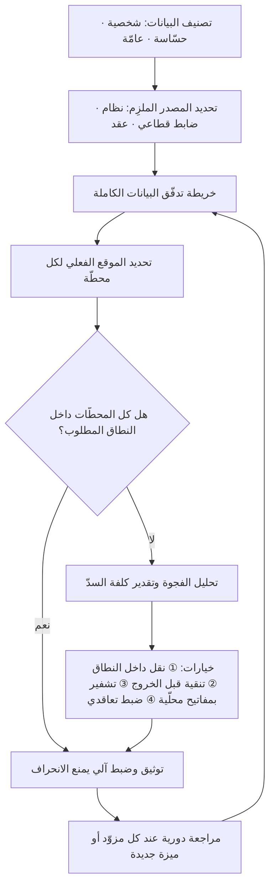

# إقامة البيانات (Data Residency)

> [!info] تعريف مختصر
> اشتراط أن تُخزَّن البيانات — وأحيانًا أن تُعالَج — داخل نطاق جغرافي محدّد (دولة أو إقليم أو منطقة سحابية بعينها). هو في جوهره **شرط مكانيّ** يجيب عن سؤال واحد: *أين ترقد البيانات فيزيائيًّا على القرص؟* وينبع إمّا من نصّ نظامي مُلزِم، أو من سياسة قطاعية (بنوك، صحّة، جهات حكومية)، أو من بند تعاقدي طلبه العميل. وهو غير مطابق لسيادة البيانات (Data Sovereignty) التي تسأل سؤالًا أعمق: *أي قانون وأي سلطة قضائية تحكم هذه البيانات ومن يستطيع إجبار مُشغّلها على تسليمها؟* — فقد تكون بياناتك مقيمة داخل الحدود وغير سيادية في الوقت نفسه.

## الشرح العلمي والاحترافي
- **الفرق الجوهري بين الإقامة والسيادة والتوطين**: هذه ثلاثة مفاهيم متداخلة يخلط بينها كثير من فرق المشاريع، وتمييزها يغيّر قرار الهندسة والعقد معًا:
  - **إقامة البيانات (Residency)**: أين تُخزَّن فيزيائيًّا. شرط جغرافي قابل للتحقّق تقنيًّا (اسم المنطقة السحابية، موقع مركز البيانات، نسخ الاحتياط).
  - **سيادة البيانات (Sovereignty)**: أي ولاية قضائية تحكمها ومن يملك حقّ الوصول القسري إليها. شرط قانوني، لا يكفي فيه موقع الخادم؛ فمزوّد أجنبي يشغّل مركز بيانات داخل الحدود قد يظلّ خاضعًا لقوانين موطنه الأصلي التي تخوّل سلطاته طلب البيانات منه أينما كانت.
  - **توطين البيانات (Localization)**: أشدّ الثلاثة، ويعني منع خروج نسخة من البيانات خارج الحدود إطلاقًا، لا مجرّد اشتراط وجود نسخة بالداخل.
  والقاعدة العملية: **الإقامة شرط ضروري للسيادة، لكنها ليست شرطًا كافيًا**.
- **الإقامة لا تخصّ التخزين وحده**: الخطأ الهندسي الأكثر تكرارًا هو ضبط قاعدة البيانات الأساسية على المنطقة الصحيحة ونسيان بقيّة مسار البيانات. الإقامة تشمل: النسخ الاحتياطية (Backups)، ونسخ التعافي من الكوارث ([[RTO and RPO]])، وسجلّات التطبيق (Logs) التي كثيرًا ما تحتوي بيانات شخصية، وطوابير الرسائل، وذاكرة التخزين المؤقّت وشبكات توصيل المحتوى (CDN)، ومنصّات التحليلات وتتبّع الأخطاء، ونسخ بيئة الاختبار المستنسخة من الإنتاج ([[Staging vs Production Environment]])، وحتى شاشات فريق الدعم الذي يقرأ البيانات من دولة أخرى.
- **الوصول عن بُعد نقل فعليّ للبيانات**: من الناحية التنظيمية، تمكين مهندس دعم مقيم خارج النطاق من الاطّلاع على البيانات يُعامَل في أغلب الأطر على أنه نقل عابر للحدود، حتى لو لم تُنسخ أي بايت خارج الخادم. لذلك تُعالَج الإقامة بضوابط وصول لا بموقع القرص فقط.
- **الأصل والدافع**: تصاعد الاشتراط عالميًّا مع تحوّل الحوسبة إلى السحابة وتركّزها في عدد محدود من المزوّدين العابرين للقارّات، فبرزت مخاوف ثلاثة: حماية خصوصية المواطنين، وحماية الأمن الوطني والبيانات الحسّاسة، ودعم الاقتصاد الرقمي المحلّي عبر إلزام الاستثمار في بنية تحتية داخلية. وفي السعودية يظهر البُعد الأول والثاني بوضوح في [[PDPL]] وفي الضوابط التنظيمية القطاعية.
- **علاقته بـ[[PDPL]]**: النظام السعودي يضع الأصل في أن البيانات الشخصية تُعالَج داخل المملكة، ويجعل نقلها إلى الخارج **استثناءً مشروطًا** لا حقًّا مطلقًا: يشترط ألّا يمسّ النقل الأمن الوطني أو المصالح الحيوية، وأن يتوفّر في الجهة المستقبِلة مستوى حماية لا يقلّ عمّا يكفله النظام، وأن يقتصر النقل على الحدّ الأدنى اللازم. وهنا تدخل آليات مثل [[Standard Contractual Clauses]] كأداة لسدّ فجوة الحماية عند النقل. عمليًّا يعني هذا أن قرار «أي منطقة سحابية نختار؟» ليس قرارًا هندسيًّا بل قرار امتثال يُتّخذ مبكرًا.
- **الأثر على تصميم المعمارية والتكلفة**: اشتراط الإقامة يُقصي أحيانًا خدمات مُدارة كاملة غير متوفّرة في المنطقة المطلوبة، ويفرض تكرار البنية التحتية لكل نطاق (Multi-region)، ويرفع كلفة التشغيل ويعقّد الإصدارات والمراقبة. وكل ذلك يجب أن ينعكس في [[TCO]] لا أن يُكتشف بعد التوقيع.
- **بيانات الذكاء الاصطناعي حالة خاصّة**: حين يُرسل نصّ المستخدم إلى نموذج لغوي مستضاف خارج النطاق، فقد خرجت البيانات فعليًّا حتى لو لم تُخزَّن. والسؤال الصحيح ثلاثي: أين يعمل النموذج؟ وهل تُحتفظ المدخلات ولو مؤقّتًا للمراقبة أو مكافحة الإساءة؟ وهل تُستخدم في تدريب لاحق؟ وينطبق الأمر نفسه على قواعد المتّجهات في أنظمة [[Retrieval-Augmented Generation]] لأنها تحمل مقاطع من الوثائق الأصلية لا أرقامًا مجرّدة.

## أين ومتى يُستخدم
- **في مرحلة اختيار المزوّد السحابي وتقييم الموردين ([[Vendor Management]])**: يصبح توفّر منطقة داخل النطاق المطلوب معيار استبعاد (Knock-out Criterion) لا معيار تفضيل، ويُدرَج صراحةً في [[SOW]] وفي [[SLA]].
- **في تحليل الفجوة بين متطلبات النظام وقدرات الحلّ ([[Fit-Gap Analysis]])**: لتحديد أي وظائف المنتج ستفقد لأن الخدمة المُدارة اللازمة غير متاحة محلّيًا، وما البدائل وكلفتها.
- **في توثيق الامتثال**: كل نشاط معالجة في [[ROPA]] يجب أن يحمل حقلًا صريحًا لموقع التخزين وموقع النسخ الاحتياطي وأي نقل خارجي وأساسه النظامي، ومعه تحديد من هو المتحكّم ومن هو المعالج وفق [[Controller vs Processor]].
- **في [[Risk Register]] وقرارات البوّابة ([[Go or No-Go Decision]])**: تُرصد مخاطر مثل «تفعيل ميزة سحابية جديدة تنسخ البيانات تلقائيًّا لمنطقة أخرى» أو «مزوّد تحليلات طرف ثالث يخزّن خارج النطاق»، وقد تكون كافية لتأجيل الإطلاق.
- **في تصميم التعافي من الكوارث**: التوتّر الكلاسيكي بين [[RTO and RPO]] الطموحَين وبين حصر النسخ داخل نطاق واحد، خصوصًا حين لا يوجد سوى منطقة واحدة محلّية بلا منطقة احتياطية مجاورة.
- **في مفاوضات العقود مع عملاء القطاع العام والمالي**: يُطلب غالبًا بند صريح بالإقامة مع حقّ التدقيق (Audit Right)، ورفضه قد يعني خسارة الصفقة.

## مثال وسيناريو تطبيقي
> [!example] شركة تقنية سعودية تبني منصّة سحابية لإدارة الملفّات الطبّية لعيادات صغيرة. المعمارية الأولى كانت: قاعدة بيانات في منطقة محلّية داخل المملكة — وهو ما اعتبره الفريق كافيًا للامتثال — بينما وُزّعت بقيّة المكوّنات على ما كان متاحًا وأرخص: سجلّات التطبيق إلى خدمة مراقبة في أوروبا، وتتبّع الأخطاء إلى منصّة أمريكية، والنسخ الاحتياطي الليلي إلى منطقة في آسيا لأن التخزين البارد فيها أرخص بنحو 40%، ومنصّة دعم العملاء تعرض سجلّ المحادثات مع صور مرفقة من تقارير المختبر.
> في مراجعة امتثال قبل التعاقد مع مجموعة عيادات كبيرة، طلب فريق العميل خريطة تدفّق البيانات كاملة. المفاجأة أن **قاعدة البيانات كانت المكوّن الوحيد الممتثل**: سجلّات التطبيق كانت تحتوي رقم الهوية ورقم الجوال داخل رسائل الخطأ، وأداة تتبّع الأخطاء كانت تلتقط لقطة من حالة الشاشة وقت العطل بما فيها اسم المريض، والنسخة الاحتياطية — وهي أكمل نسخة من البيانات على الإطلاق — كانت خارج المملكة تمامًا.
> خطّة المعالجة استغرقت 7 أسابيع: تنقية السجلّات عند المصدر بحيث تُستبدل الحقول الشخصية بمعرّفات بديلة قبل الإرسال، ونقل التخزين الاحتياطي إلى داخل المملكة مع تشفير ومفاتيح تُدار محلّيًا، واستبدال منصّة الدعم بأخرى مستضافة داخل النطاق، وحصر وصول المطوّرين الخارجيين ببيئة اختبار ببيانات مُصطنَعة لا نسخة من الإنتاج. ارتفعت الكلفة التشغيلية الشهرية بنحو 18%، لكن الشركة كسبت عقدًا كان مشروطًا ببند إقامة صريح، وأصبح لديها خريطة تدفّق بيانات موثّقة تُستخدم كأساس لكل مشروع جديد بدل إعادة الاكتشاف في كل مرّة.

## خطوات أو مخطّط
1. تصنيف البيانات أولًا: أي الحقول شخصية؟ وأيّها حسّاس (صحّي، مالي، هوية)؟ وأيّها مجهول الهوية فعلًا لا اسمًا فقط.
2. تحديد المصدر الملزِم لكل تصنيف: نصّ نظامي، أم ضابط قطاعي، أم بند تعاقدي مع عميل، أم سياسة داخلية — لأن صرامة كلٍّ منها مختلفة.
3. رسم خريطة تدفّق البيانات الكاملة من الإدخال إلى الإتلاف، بما فيها الأنظمة الفرعية وأطراف ثالثة والسجلّات والنسخ الاحتياطية.
4. تحديد الموقع الفعلي الحالي لكل محطّة في الخريطة، بالتحقّق التقني لا بالسؤال والافتراض.
5. تحليل الفجوة بين المطلوب والواقع، وتقدير كلفة السدّ زمنًا ومالًا وإدراجها في [[TCO]].
6. اختيار آلية المعالجة لكل فجوة: نقل الخدمة داخل النطاق، أو تنقية البيانات قبل خروجها، أو تشفير مع إبقاء المفاتيح بالداخل، أو ضبط تعاقدي عبر [[Standard Contractual Clauses]].
7. ترجمة القرار إلى ضوابط تقنية دائمة: سياسات تمنع إنشاء موارد خارج المناطق المسموحة ([[Guard Rails]])، وتنبيه آلي عند أي انحراف.
8. توثيق النتيجة في [[ROPA]] وفي بنود العقد، وإعادة المراجعة عند كل تغيير مزوّد أو ميزة أو منطقة.

## ⚠️ مفاهيم خاطئة شائعة
> [!warning]
> - **«البيانات داخل الحدود إذن نحن سياديّون»**: خلط مباشر بين الإقامة والسيادة. الموقع الفيزيائي لا يحسم أي قانون يحكم البيانات ولا من يملك سلطة طلبها من المزوّد. السيادة تُعالَج بمن يشغّل الخدمة ومن يملك مفاتيح التشفير وأي ولاية قضائية يخضع لها العقد — لا بخريطة مراكز البيانات وحدها.
> - **«اخترنا المنطقة السحابية الصحيحة فانتهى الأمر»**: المنطقة تضبط الخدمة الأساسية فقط. النسخ الاحتياطي والسجلّات والتحليلات والـCDN وأدوات المراقبة قد تكون كلها خارج النطاق بإعدادات افتراضية لم يفحصها أحد.
> - **«البيانات مشفّرة فلا يهمّ أين توجد»**: التشفير يقلّل أثر التسريب ولا يلغي شرط الإقامة. والسؤال الحاسم: من يملك مفاتيح فكّ التشفير وأين تُدار؟ فمفتاح بيد طرف خاضع لولاية أخرى يُضعف الحماية القانونية مهما قوي التشفير رياضيًّا.
> - **«الإقامة تعني منع الخروج مطلقًا»**: هذا هو التوطين الصارم. أغلب الأطر — ومنها [[PDPL]] — تسمح بالنقل ضمن شروط وضمانات، والخلط بين الاثنين يجعل الفريق يرفض حلولًا مشروعة أو يبالغ في الكلفة بلا داعٍ.
> - **«البيانات المجهولة الهوية خارج النطاق»**: كثير مما يُسمّى «مجهول الهوية» هو في الحقيقة **مستعار الهوية (Pseudonymized)**: استُبدل الاسم بمعرّف لكن الربط لا يزال ممكنًا بجدول آخر أو بدمج حقول. والبيانات المستعارة تبقى بيانات شخصية خاضعة للشرط.
> - **«الإقامة مسألة قانونية تخصّ الشؤون النظامية لا الفريق التقني»**: الإقامة تُنفَّذ في المعمارية أو لا تُنفَّذ أصلًا. اكتشافها متأخّرًا يعني إعادة بناء لا مجرّد تعديل بند في عقد.

## ❌ ممارسات خاطئة في المشاريع
> [!failure]
> - **الخطأ**: معالجة الإقامة كبند امتثال يُراجَع قبل الإطلاق بأسابيع. **لماذا يضرّ**: القرار يمسّ اختيار المزوّد والخدمات المُدارة وبنية النسخ الاحتياطي، وتغييرها متأخّرًا يكلّف أضعاف كلفة تبنّيها مبكرًا وفق [[Cost-of-Change Curve]]. **الحل**: اجعل الإقامة قيدًا معماريًّا يُحسم في مرحلة التصميم ويُوثَّق ضمن متطلبات النظام ([[Software Requirements Specification]]).
> - **الخطأ**: الاكتفاء بإجابة المزوّد التسويقية «نعم نحن ممتثلون ولدينا منطقة محلّية». **لماذا يضرّ**: التوفّر في المنطقة لا يعني أن *خدمتك* مُفعَّلة فيها، ولا أن سجلّات المزوّد وبيانات القياس تبقى بالداخل. **الحل**: اطلب إفصاحًا مكتوبًا لكل مكوّن على حدة (تخزين، نسخ احتياطي، سجلّات، دعم)، واجعله ملحقًا تعاقديًّا لا رسالة بريد.
> - **الخطأ**: استنساخ قاعدة بيانات الإنتاج إلى بيئة اختبار لتسهيل التطوير. **لماذا يضرّ**: بيئات الاختبار أقلّ تشدّدًا في الوصول وغالبًا أقلّ التزامًا بالموقع، فتتحوّل إلى أوسع ثغرة إقامة وخصوصية في المنظومة. **الحل**: بيانات مُصطنَعة أو مقنَّعة، مع منع صريح لنسخ الإنتاج ورقابة آلية على ذلك.
> - **الخطأ**: إضافة أداة طرف ثالث (تحليلات، دردشة دعم، خرائط حرارية، تتبّع أخطاء) بقرار من مطوّر واحد. **لماذا يضرّ**: كل سكربت مضاف هو قناة تصدير بيانات جديدة لم تمرّ بأي مراجعة ولا تظهر في [[ROPA]]. **الحل**: قائمة أدوات معتمدة، ومراجعة إلزامية لأي مكوّن خارجي جديد قبل دمجه.
> - **الخطأ**: تجاهل بند الإقامة عند تجديد العقد أو تغيير خطّة الاشتراك. **لماذا يضرّ**: المزوّدون يغيّرون بنية خدماتهم ومناطقها، وقد تُرحَّل خدمتك تلقائيًّا إلى بنية جديدة بموقع مختلف. **الحل**: اجعل مراجعة الإقامة بندًا ثابتًا في دورة تجديد العقود وفي [[Vendor Management]].
> - **الخطأ**: قبول شرط إقامة صارم في عقد دون تسعير أثره. **لماذا يضرّ**: ينهار هامش المشروع لأن الشرط يفرض بنية مكرّرة وخدمات أغلى وأحيانًا تطويرًا بديلًا لخدمة مُدارة غير متاحة. **الحل**: سعّر الشرط صراحةً في [[TCO]] وفي عرض السعر، وبيّن للعميل ما الذي يشتريه بهذه الزيادة.
> - **الخطأ**: إرسال مطالبات المستخدمين إلى نموذج ذكاء اصطناعي خارجي دون فحص مسار البيانات. **لماذا يضرّ**: قد يخرج نصّ يحوي بيانات عملاء خارج النطاق ويُحتفظ به مؤقّتًا لدى المزوّد. **الحل**: افحص سياسة الاحتفاظ والتدريب وموقع الاستضافة قبل الدمج، وطبّق تنقية للمدخلات، وسجّل النتيجة في سجلّ المعالجة.

## 🔗 مصطلحات ومفاهيم ذات صلة
[[PDPL]] | [[GDPR]] | [[Outsourcing]] | [[Controller vs Processor]] | [[ROPA]] | [[Standard Contractual Clauses]] | [[RTO and RPO]] | [[Vendor Management]] | [[Vendor Lock-in]] | [[TCO]] | [[Risk Register]] | [[Retrieval-Augmented Generation]]
