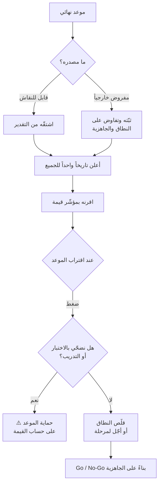

# الموعد النهائي (Deadline)

> [!info] تعريف مختصر
> **الموعد النهائي** هو التاريخ المتّفق عليه لإنجاز عمل أو تسليمه. وظيفته المشروعة **التنسيق**: يُمكّن أطرافاً متعدّدة من مزامنة جهودها ويمنع التمدّد اللانهائي. لكن خطره أنه **مؤشّر قابل للتلاعب**: يمكن تمديده، أو إعلان تاريخ للعميل وآخر للفريق، أو إعلان «الالتزام به» بتسليم ناقص. ولهذا لا يصلح وحده مقياساً لنجاح التسليم — والمقياس الأصدق هو [[Time to Value|زمن الوصول للقيمة]] الذي لا يقبل التجميل.

## الشرح العلمي والاحترافي

- **الوظيفة المشروعة**: الموعد ليس شرّاً. فبدونه يتمدّد العمل ليملأ الوقت المتاح (**قانون باركنسون**)، وتفقد الأطراف المتعدّدة نقطة مزامنة. المشكلة ليست في وجوده بل في **معاملته كمقياس نجاح** بدل كونه أداة تنسيق.

- **لماذا يقبل التلاعب؟** ثلاث طرق شائعة يُحافَظ بها على الموعد ظاهرياً:
  1. **التمديد الصامت** — يُعاد التفاوض عليه فيبدو أنه لم يُخرَق.
  2. **الازدواج** — تاريخ معلَن للعميل وآخر أضيق للفريق، فيبدو الالتزام محقّقاً.
  3. **التسليم الناقص** — يُسلَّم في موعده بجودة أقلّ أو نطاق مبتور، فينتقل العجز إلى ما بعد الإطلاق ديناً.
  
  والنتيجة أن «التزمنا بالموعد» جملة قد تصف نجاحاً أو تخفي فشلاً — ولا يمكن التمييز من الجملة وحدها.

- **الفرق الحاسم عن [[Time to Value]]**:
  | | `Deadline` | `Time to Value` |
  |---|---|---|
  | يقيس | تاريخاً متّفقاً عليه | الزمن حتى **تصل القيمة للمستفيد** |
  | قابل للتلاعب؟ | **نعم** | **لا** — حقيقة على الأرض |
  | قد يتحقّق بلا قيمة؟ | **نعم** | لا — تحقّقه هو القيمة |
  
  ولهذا فإن مشروعاً يُسلَّم في موعده ثم لا يستخدمه أحد **ناجح بمقياس الموعد وفاشل بمقياس القيمة**.

- **الموعد المفروض خارجياً**: أصعب حالاته — تاريخ سياسي أو تنظيمي أو موسمي لا يُناقَش. والخطأ فيه ردّان: «مستحيل» (يفقدك المصداقية) أو «حاضر» (يفقدك المشروع). والردّ المهني ينقل التحكّم إلى المتغيّر الثالث: **«التاريخ محفوظ؛ إذاً نتحكّم في الجاهزية والنطاق — وهذا ما نحتاجه منكم.»** انظر [[Go or No-Go Decision]] و[[Phasing]].

- **الموعد ليس قراراً**: أوضح تطبيق لهذا التمييز في الإطلاق: **`Go-Live Date` يحدّد متى نريد، و`Go/No-Go` يحدّد هل نحن جاهزون**. والخلط بينهما يُنتج إطلاقات تتمّ في موعدها وتنهار في أسبوعها الأول.

- **متى يصير الموعد ضاراً بالتدفّق؟** حين يُستخدم للضغط بدل التنسيق: فيرتفع العمل الجاري (`WIP`) لأن الجميع يبدأ كل شيء ليبدو منتِجاً، فيزيد الانتظار، فيزيد زمن التسليم فعلياً. **الضغط بالموعد على نظام مختنق يبطئه لا يسرّعه.**

## أين ومتى يُستخدم
- في **التنسيق بين أطراف متعدّدة** (مورّدون، فرق، جهات تنظيمية) حيث المزامنة ضرورية.
- في **الالتزامات التعاقدية والتنظيمية** التي لها أثر قانوني أو مالي.
- في **الأحداث الموسمية** التي لا تقبل التأجيل (موسم، معرض، بداية سنة مالية).
- في **تحديد نطاق زمني للاستكشاف** (`Time-box`) حين يكون العمل غامضاً — وهنا الموعد أداة ممتازة لأنه يحدّ الاستكشاف لا الإنجاز.
- **لا يُستخدم** مقياساً وحيداً لنجاح التسليم — يُقرَن دائماً بمؤشّر قيمة.

## مثال وسيناريو تطبيقي
> [!example] مشروعان — كلاهما «التزم بالموعد»
> | | المشروع أ | المشروع ب |
> |---|---|---|
> | تاريخ الإطلاق | في موعده ✅ | في موعده ✅ |
> | النطاق المُسلَّم | كامل | كامل |
> | `User Adoption` بعد شهر | **31%** | **87%** |
> | زمن دورة الطلب | لم يتغيّر (5 أيام) | **من 5 أيام إلى يومين** |
> | [[Flow Efficiency]] | 5% (كان 4%) | **32%** (كان 4%) |
>
> **بمقياس الموعد: المشروعان متطابقان.** وبمقياس القيمة: الأول لم يُغيّر شيئاً، والثاني غيّر طريقة العمل.
>
> **ما الذي حدث في المشروع أ؟** أُطلق في موعده لأن الفريق ضغط على الاختبار والتدريب لحماية التاريخ. فوصل النظام إلى مستخدمين غير جاهزين، فعادوا إلى `Excel` بالتوازي — وبقيت المؤشّرات التشغيلية كما هي.
>
> **الدرس:** الموعد حُمِي على حساب ما وُجد الموعد لأجله. **ولهذا يُقرَن كل موعد بمؤشّر قيمة يُقاس بعده بمدّة معلومة** — وإلا صار الاحتفال بالتسليم بديلاً عن قياس الأثر.

## خطوات أو مخطّط
1. اسأل عن **مصدر الموعد**: تعاقدي؟ تنظيمي؟ موسمي؟ أم افتراضي قابل للنقاش؟
2. إن كان قابلاً للنقاش، اشتقّه من [[Estimation|التقدير]] لا العكس.
3. إن كان مفروضاً، انقل التفاوض إلى **النطاق والجاهزية**.
4. اقرن الموعد دائماً بمؤشّر قيمة يُقاس بعده بمدّة معلومة.
5. أعلن **تاريخاً واحداً** للجميع — الازدواج يهدم الثقة حين يُكتشف.
6. راقب أن حماية الموعد لا تتمّ على حساب الاختبار والتدريب.
7. افصل صراحةً بين **تاريخ الإطلاق** و**قرار الإطلاق**.

## ⚠️ مفاهيم خاطئة شائعة
> [!warning]
> - **اعتبار الالتزام بالموعد مقياس نجاح**: قد يتحقّق دون أن تصل أي قيمة.
> - **الخلط بينه وبين [[Go or No-Go Decision|قرار الإطلاق]]**: التاريخ للتخطيط والقرار للجاهزية.
> - **الظنّ بأن المواعيد الضاغطة تسرّع الفرق**: على نظام مختنق ترفع العمل الجاري فتزيد الانتظار وتبطئ التسليم فعلياً.
> - **إعلان تاريخين — واحد للعميل وآخر للفريق**: يبدو حكمة إدارية وينهار عند أول تسريب، ويهدم الثقة داخلياً.
> - **افتراض أن كل موعد مفروض غير قابل للتفاوض**: أغلبه قابل للتفاوض في **النطاق** وإن لم يكن في **التاريخ**.
> - **الخلط بينه وبين `Milestone`**: المحطّة نقطة تحقّق داخلية للتتبّع، والموعد التزام تجاه طرف آخر.

## ❌ ممارسات خاطئة في المشاريع
> [!failure]
> - **اشتقاق التقدير من الموعد بدل العكس**: يُنتج أرقاماً تُرضي ولا تتحقّق. الحلّ: قدّر أولاً، ثم فاوض على الفجوة بالنطاق.
> - **حماية الموعد بضغط الاختبار والتدريب**: ينقل العجز إلى ما بعد الإطلاق مضاعفاً. الحلّ: قلّص النطاق لا الجاهزية.
> - **الاحتفال بالتسليم دون قياس الأثر**: يجعل الموعد غاية بذاته. الحلّ: تقرير قيمة بعد شهر من كل إطلاق.
> - **إخفاء انزلاق الموعد حتى اللحظة الأخيرة**: يمنع أي تصحيح ممكن. الحلّ: مؤشّرات مبكّرة في [[Early Warning Dashboard|لوحة الإنذار]].
> - **تثبيت الزمن والنطاق والجودة معاً**: مستحيل رياضياً. الحلّ: ثبّت الزمن والجودة والعب على النطاق.

## 🔗 مصطلحات ومفاهيم ذات صلة
[[Time to Value]] | [[Go or No-Go Decision]] | [[Iron Triangle]] | [[Estimation]] | [[Phasing]] | [[Flow Efficiency]] | [[WIP Limit]] | [[Early Warning Dashboard]] | [[Cost of Delay]]
