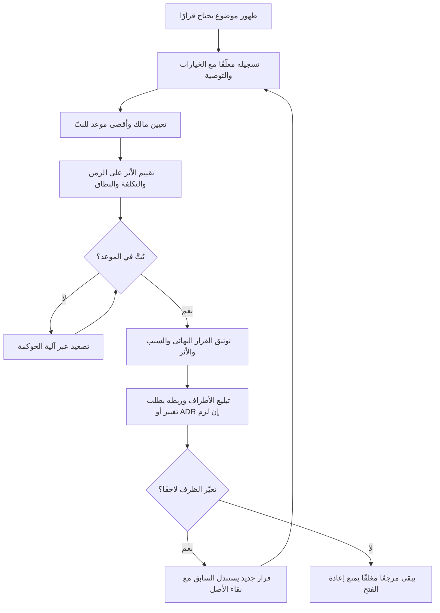

# سجل القرارات (Decision Log)

> [!info] تعريف مختصر
> سجل القرارات (Decision Log) هو مستند حيّ يوثّق كل قرار مؤثّر في المشروع: ما القرار، ومن اتخذه، ومتى، ولماذا، وما أثره على الزمن والتكلفة والنطاق. مبدؤه الحاكم بسيط وقاسٍ: **«أي قرار غير مكتوب قرار ضائع»** — فالقرار الذي لا يُوثَّق يتحوّل بعد أسابيع إلى خلاف على الذاكرة، لا إلى مرجع يمكن الاحتكام إليه.

## الشرح العلمي والاحترافي
- سجل القرارات ليس "محضر اجتماع" ولا قائمة مهام؛ هو **سجل مرجعي (Reference Artifact)** مخصّص لنوع واحد من المعلومات: القرارات المُغلقة والقرارات المعلّقة التي تنتظر البتّ. محضر الاجتماع يوثّق النقاش، أما سجل القرارات فيوثّق **الخلاصة الملزِمة** ومبرّرها.
- الأعمدة القياسية لسجل قرارات محترف:
  - **رقم القرار / التاريخ (ID & Date)**: معرّف ثابت يمكن الإحالة إليه في العقود والمراسلات (مثل: DEC-014).
  - **وصف القرار (Decision Statement)**: صياغة السؤال أو الموضوع محلّ القرار بجملة واضحة.
  - **الخيارات المطروحة (Options Considered)**: البدائل التي دُرست فعليًا — وجودها هو ما يثبت أن القرار كان مدروسًا لا ارتجاليًا.
  - **التوصية (Recommendation)**: رأي الفريق أو الخبير الفني قبل البتّ.
  - **المالك (Owner / Decision Maker)**: الشخص المخوَّل بالبتّ — لا الفريق ولا "الإدارة"، بل اسم واحد محدّد.
  - **أقصى موعد للبتّ (Decision Deadline / Need-by Date)**: التاريخ الذي يتحوّل بعده التأخير إلى ضرر فعلي على الجدول الزمني.
  - **القرار النهائي (Final Decision)**: ما استُقرّ عليه فعلًا، بصياغة قاطعة لا تحتمل التأويل.
  - **السبب (Rationale)**: لماذا اختير هذا البديل دون غيره — وهذا أهمّ عمود على الإطلاق، لأنه ما يمنع إعادة فتح النقاش لاحقًا.
  - **الأثر (Impact)**: التأثير المتوقَّع على **الزمن (Schedule)** و**التكلفة (Cost)** و**النطاق (Scope)**، وأحيانًا على الجودة والمخاطر.
  - **الحالة (Status)**: مفتوح / معلّق بانتظار طرف ثالث / مُتخَذ / مُلغى أو مُستبدَل بقرار لاحق.
- **الوظائف الثلاث لسجل القرارات:**
  1. **حماية عند النزاع مع العميل (Protection)**: عندما يقول العميل بعد ستة أشهر «لم نطلب هذا» أو «لم نوافق على حذف تلك الميزة»، يكون الردّ إحالةً إلى رقم قرار موثّق بتاريخه ومالكه ومبرّره، لا جدالًا حول الذاكرة. هذا هو الفرق بين مناقشة مهنية ومواجهة تعاقدية.
  2. **ذاكرة مؤسسية تمنع إعادة فتح القرارات المغلقة (Institutional Memory)**: المشاريع الطويلة تُبتلى بظاهرة "دوّامة القرار" (Decision Churn)، حيث يعود الفريق كل بضعة أسابيع لمناقشة أمر حُسم سابقًا — غالبًا لأن عضوًا جديدًا انضم أو لأن أحدًا نسي السبب. وجود عمود **السبب** يحوّل الجواب من نقاش جديد إلى إحالة: «حُسم في DEC-014 لهذا السبب؛ إن تغيّر السبب فافتح قرارًا جديدًا يستبدله».
  3. **تسريع القرار (Decision Velocity)**: بربط كل قرار معلّق بـ **مالك** و**موعد أقصى** و**آلية تصعيد (Escalation Path)**، يتحوّل السجل من أرشيف سلبي إلى أداة ضغط إيجابية. القرارات المعلّقة هي أحد أكبر أسباب تعطّل المشاريع، وهي غالبًا غير مرئية في خطة العمل لأنها ليست "مهامًا".
- القرار المُوثَّق قابل للاستبدال لا للمحو: إذا تغيّر الظرف، يُضاف قرار جديد يُشير صراحةً إلى أنه يستبدل القرار السابق (Supersedes DEC-014)، مع بقاء الأصل في السجل. حذف القرارات القديمة يُفقد السجل قيمته كدليل.
- السجل يجب أن يكون **مصدرًا واحدًا للحقيقة** ([[Single Source of Truth]]) ومتاحًا للعميل ولفريق العمل معًا؛ سجل قرارات سرّي لدى مدير المشروع فقط يفقد وظيفته الحمائية والتواصلية.

## أين ومتى يُستخدم
- في المشاريع التعاقدية والاستشارية حيث توجد أطراف متعددة وميزانية ثابتة، وحيث يُشكّل الخلاف على «ما الذي اتُّفق عليه» أكبر مصدر للاحتكاك.
- عند بدء المشروع (Kick-off) يُنشأ السجل مباشرة، وتُوثَّق فيه قرارات التأسيس: النطاق المستبعَد، المنصة التقنية، نموذج التسليم، وقنوات الاعتماد.
- في الاجتماعات الدورية للحوكمة ([[Governance]]) ولجان التوجيه (Steering Committee)، حيث يكون بند «القرارات المعلّقة» بندًا ثابتًا على جدول الأعمال.
- عند اعتماد أو رفض [[Change Request]]: نتيجة طلب التغيير — قبولًا أو رفضًا أو تأجيلًا — تُقيَّد كقرار في السجل مع أثرها على الزمن والتكلفة.
- في مراحل الانتقال بين الفرق أو تسليم المشروع (Handover)، حيث يكون السجل أسرع طريق لفهم «لماذا المشروع على ما هو عليه».
- **التمييز عن السجلات الأخرى:**
  - **مقابل [[RAID Log]]**: سجل RAID يتتبّع أربعة عناصر — المخاطر (Risks) والافتراضات (Assumptions) والقضايا (Issues) والاعتماديات (Dependencies) — أي أشياء **غير محسومة** أو أحداث تحتاج معالجة. أما سجل القرارات فيتتبّع ما **حُسم فعلًا**. بعض المؤسسات توسّعه إلى RAAIDD ليشمل القرارات، لكن فصل السجلَّين أوضح عمليًا: المخاطر تُدار، والقرارات تُوثَّق.
  - **مقابل [[Change Request]]**: طلب التغيير آلية رسمية لإدخال تعديل على خط الأساس (Baseline) المعتمد، وله مسار موافقات وتقييم أثر. العلاقة سببية: **طلب التغيير غالبًا يُنتج قرارًا** ينتهي مقيّدًا في سجل القرارات. لكن ليس كل قرار ناتجًا عن طلب تغيير — كثير من القرارات تفسيرية أو تشغيلية ولا تمسّ خط الأساس أصلًا.
  - **مقابل [[ADR]] (Architecture Decision Record)**: سجل قرارات المعمارية هو النظير التقني المتخصّص، يُحفَظ عادةً داخل مستودع الكود بصيغة ملفات Markdown مرقّمة، ويوثّق القرارات المعمارية (اختيار قاعدة بيانات، نمط تكامل، بروتوكول). العلاقة تكاملية: الـ ADR يخدم فريق الهندسة بتفصيل تقني عميق، وسجل القرارات على مستوى المشروع يخدم الحوكمة وأصحاب المصلحة؛ ويُفضَّل أن يشير أحدهما إلى الآخر عندما يكون للقرار التقني أثر تجاري أو زمني.

## مثال وسيناريو تطبيقي
> [!example] في مشروع تنفيذ نظام ERP لشركة توزيع، ظهر في الشهر الثالث أن موديول المشتريات (Procurement) يحتاج تكاملًا مع نظام جمركي حكومي لم يكن مذكورًا في نطاق العمل الأصلي. عرض مدير المشروع خيارين: تنفيذه ضمن المرحلة الحالية بتمديد الجدول ستة أسابيع وتكلفة إضافية، أو تأجيله إلى Phase 2 والإطلاق بالموديولات الأساسية في موعدها.
> قُيّد ذلك في السجل كالتالي: **DEC-022 | 14 مارس | وصف: تحديد موقع موديول المشتريات في خطة الإصدار | الخيارات: (أ) ضمن Phase 1 بتمديد 6 أسابيع، (ب) تأجيل إلى Phase 2 | التوصية: الخيار (ب) | المالك: مدير العمليات لدى العميل | أقصى موعد للبتّ: 20 مارس (بعده يتوقّف فريق التكامل) | القرار النهائي: تأجيل إلى Phase 2 | السبب: أولوية الإطلاق قبل موسم الذروة تفوق اكتمال الموديول، والعمل الجمركي يدويًا مقبول مؤقتًا | الأثر: الزمن — الحفاظ على تاريخ الإطلاق؛ التكلفة — لا تغيير في Phase 1؛ النطاق — استبعاد صريح لموديول المشتريات من التسليم الأول | الحالة: مُتخَذ.**
> بعد أربعة أشهر، في اجتماع مراجعة، اعترض مدير المشتريات: «كان يُفترض أن يكون النظام كاملًا عند الإطلاق». استغرق حسم الأمر ثلاثين ثانية: عُرض القرار DEC-022 بتاريخه واسم مالكه وسببه المكتوب. لم يتحوّل الموقف إلى نزاع، بل إلى بند في نطاق Phase 2. القرار نفسه كان صحيحًا أو خاطئًا — لكن **توثيقه** هو ما حال دون أن يتحوّل إلى أزمة ثقة.

## خطوات أو مخطّط
1. إنشاء السجل في بداية المشروع بصيغة مشتركة ومتاحة لكل الأطراف (جدول واحد، مصدر واحد للحقيقة).
2. رصد القرار فور ظهوره كسؤال مفتوح، وتسجيله بحالة «معلّق» مع الخيارات المطروحة والتوصية.
3. تعيين **مالك واحد** مخوَّل بالبتّ، و**أقصى موعد** للبتّ مرتبط بأثره على الجدول الزمني.
4. تقييم أثر كل خيار على الزمن والتكلفة والنطاق قبل عرضه على المالك.
5. البتّ في القرار وتوثيق **القرار النهائي مع سببه** بصياغة قاطعة، لا بصياغة نقاش.
6. تفعيل مسار التصعيد ([[Governance]]) إذا تجاوز القرار موعده الأقصى دون بتّ.
7. تبليغ القرار للأطراف المتأثرة، وربطه بما ينبثق عنه: [[Change Request]] إن مسّ خط الأساس، أو [[ADR]] إن كان معماريًا، أو بند في [[Risk Register]] إن ولّد مخاطرة جديدة.
8. مراجعة السجل دوريًا: إغلاق ما بُتّ فيه، وتصعيد ما تأخّر، وإضافة قرار جديد يستبدل السابق عند تغيّر الظرف — دون حذف الأصل.

## ⚠️ مفاهيم خاطئة شائعة
> [!warning]
> - **اعتبار محاضر الاجتماعات بديلًا عن سجل القرارات**: المحضر يوثّق النقاش مبعثرًا عبر عشرات الملفات، ولا أحد يستطيع استخراج «ما القرارات السارية اليوم؟» منه. سجل القرارات مُجمَّع وقابل للبحث والإحالة برقم.
> - **الظن بأن سجل القرارات هو نفسه [[RAID Log]]**: الأول يوثّق المحسوم، والثاني يدير غير المحسوم (مخاطر وافتراضات وقضايا واعتماديات). دمجهما بلا تمييز يُغرق القرارات وسط بنود مفتوحة فتضيع.
> - **الخلط بينه وبين [[Change Request]]**: طلب التغيير إجراء رسمي لتعديل خط الأساس، والقرار هو **نتيجته**. كل طلب تغيير معتمد يُنتج قرارًا، لكن أغلب القرارات لا تحتاج طلب تغيير أصلًا.
> - **الاكتفاء بتسجيل «ماذا» دون «لماذا»**: سجل بلا عمود سبب يفقد وظيفته الأهم؛ بعد ستة أشهر لن يعترض أحد على القرار نفسه بقدر ما سيسأل عن مبرّره، وغياب المبرّر يعيد فتح النقاش تلقائيًا.
> - **اعتباره أداة دفاعية فقط "للتغطية"**: وظيفته الأساسية تشغيلية — تسريع البتّ ومنع دوّامة القرار — والحماية التعاقدية أثر جانبي لا الغاية.

## ❌ ممارسات خاطئة في المشاريع
> [!failure]
> - **تسجيل القرار دون مالك محدّد** (كتابة "الإدارة" أو "الفريق" في خانة المالك): القرار الذي يملكه الجميع لا يبتّ فيه أحد. الحل: اسم شخص واحد مخوَّل، مع بديل عند غيابه.
> - **ترك القرارات المعلّقة بلا موعد أقصى**: تتحوّل إلى تأخيرات صامتة لا تظهر في خطة العمل لأنها ليست مهامًا. الحل: ربط كل قرار معلّق بتاريخ Need-by مشتقّ من المسار الحرج، وعرض القرارات المتأخرة في تقرير الحالة الأسبوعي.
> - **حذف أو تعديل قرار قديم بعد تغيّر الرأي**: يُفقد السجل مصداقيته كدليل ويمحو مسار التفكير. الحل: إضافة قرار جديد يشير صراحة إلى أنه يستبدل السابق (Supersedes)، مع إبقاء الأصل وتغيير حالته.
> - **الاحتفاظ بالسجل داخليًا وعدم مشاركته مع العميل**: يجعل المفاجأة مضمونة عند أول خلاف، ويحرم السجل من قيمته التواصلية. الحل: سجل مشترك ومرئي، ومراجعة بنوده في اجتماع الحوكمة الدوري.
> - **توثيق القرارات الكبيرة فقط**: كثير من النزاعات تنشأ من قرارات صغيرة الحجم كبيرة الأثر (تفسير متطلب، استبعاد حالة استخدام، تأجيل تدريب). الحل: المعيار ليس حجم القرار بل كلفة التراجع عنه — كل قرار يصعب عكسه يُوثَّق.
> - **خلط القرارات التقنية العميقة بسجل المشروع**: يُثقل السجل الإداري بتفاصيل لا يقرؤها أصحاب المصلحة. الحل: توثيق القرارات المعمارية في [[ADR]] داخل المستودع، وإدراج إحالة مختصرة إليها في سجل المشروع عند وجود أثر زمني أو مالي.

## 🔗 مصطلحات ومفاهيم ذات صلة
[[RAID Log]] | [[Change Request]] | [[ADR]] | [[Issue Log]] | [[Risk Register]] | [[Single Source of Truth]] | [[Governance]]
