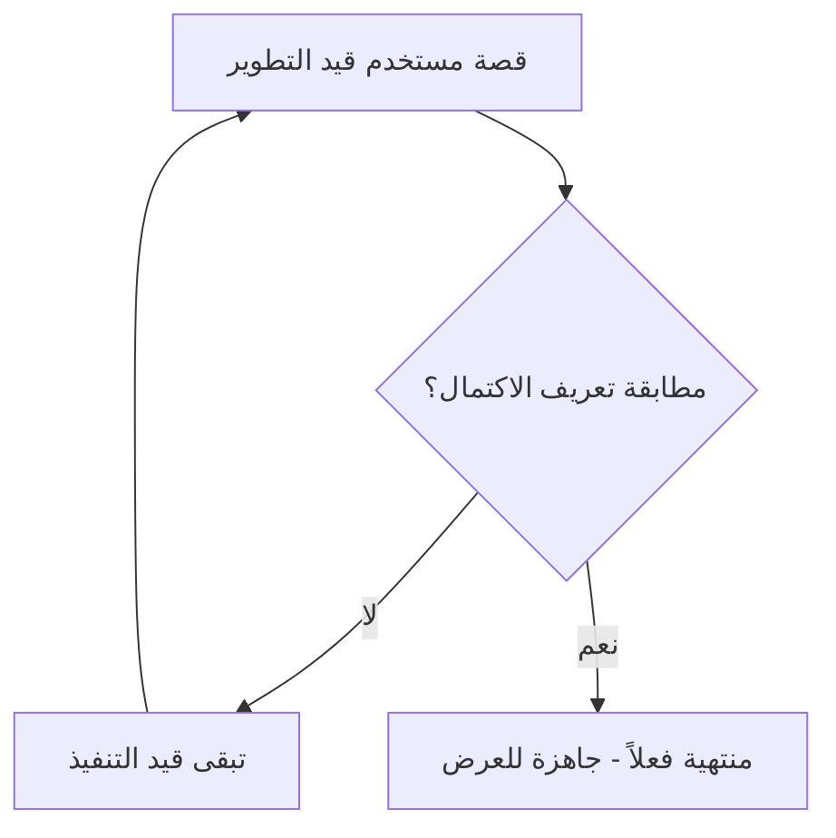

# تعريف الاكتمال (Definition of Done)

> [!info] تعريف مختصر
> تعريف الاكتمال (Definition of Done - DoD) هو قائمة متفق عليها من الفريق تحدد الشروط التي يجب أن تتوفر في أي عنصر عمل (قصة مستخدم، مهمة، زيادة) كي يُعتبر "منتهياً فعلاً" وجاهزاً للتسليم أو النشر.

## الشرح العلمي والاحترافي
- بدون تعريف اكتمال واضح، يختلف كل عضو في الفريق على معنى "انتهيت"؛ فمطوّر قد يعتبر كتابة الكود كافية، بينما يرى آخر أن الاختبارات والتوثيق ضروريان أيضاً. الـ DoD يزيل هذا الغموض بمعيار موحّد يوافق عليه الجميع.
- عادة يشمل تعريف الاكتمال بنوداً مثل: اجتياز الكود للمراجعة (Code Review)، مرور جميع الاختبارات الآلية، تحديث التوثيق، اجتياز اختبار الانحدار ([[Regression Testing]])، ونشر الميزة في بيئة الاختبار (Staging) على الأقل.
- الـ DoD يُطبَّق على مستوى الفريق بأكمله، ويكون ثابتاً نسبياً عبر جميع السبرنتات (Sprints)، بخلاف [[INVEST Criteria]] أو معايير القبول (Acceptance Criteria) الخاصة بكل قصة مستخدم على حدة.
- يضمن الـ DoD أن كل [[Increment]] يُسلَّم في نهاية السبرنت هو فعلاً "قابل للشحن" (Shippable) أو "منتج قابل للاستخدام المحتمل"، لا مجرد كود مكتوب لم يُختبر أو يُدمج.
- يمنع الـ DoD ظاهرة "الاكتمال الوهمي"، حيث تُحسب المهمة منجزة في تقرير التقدم بينما يتبقى عليها عمل خفي (اختبار، توثيق، مراجعة أمنية) يظهر لاحقاً كمفاجأة سيئة قرب الإطلاق.

## أين ومتى يُستخدم
- يُستخدم بشكل أساسي في سكرم ([[02 - Scrum]]) حيث يُراجَع في اجتماع [[09 - Sprint Review]] للتأكد أن الزيادة المعروضة تحقق فعلاً معايير الاكتمال المتفق عليها.
- يُلجأ إليه أيضاً في كانبان ([[03 - Kanban]]) وسكرم-بان ([[Scrum-ban]]) كجزء من "السياسات الصريحة" ([[Explicit Policies]]) التي تحدد متى تنتقل البطاقة إلى عمود "منتهي".
- يُنشأ ويُراجَع عادة في بداية المشروع أو أثناء [[10 - Sprint Retrospective]]، ويُحدَّث كلما تعلّم الفريق دروساً جديدة (مثلاً إضافة بند "اختبار الأمان" بعد حادثة أمنية سابقة).

## مثال وسيناريو تطبيقي
> [!example] سيناريو ملموس
> فريق تطوير في شركة تجارة إلكترونية يتفق على تعريف الاكتمال التالي لكل قصة مستخدم: (1) الكود مكتوب ومُراجَع من مطوّر آخر، (2) تغطية اختبارات الوحدة لا تقل عن 80%، (3) نجاح اختبارات القبول التلقائية (Given/When/Then)، (4) عدم وجود أخطاء حرجة في فحص الأمان الآلي، (5) نشر الميزة في بيئة Staging والتحقق من عملها هناك.
> عندما ينهي المطور "علي" ميزة "سلة الشراء"، يظنها جاهزة لأن الكود يعمل على جهازه. لكن عند مراجعتها مقابل الـ DoD، يتضح أن تغطية الاختبارات 60% فقط وأن الفحص الأمني لم يُشغَّل بعد.
> بناءً على ذلك، لا تُحتسب القصة "منتهية" في تقرير السبرنت، ويعود علي لإكمال الاختبارات الناقصة قبل عرضها في [[09 - Sprint Review]]، مما يمنع ظهور مشكلة أمنية لاحقاً في الإنتاج.

## خطوات أو مخطّط
1. يجتمع الفريق (المطورون، مالك المنتج، فريق الجودة) لتحديد بنود الاكتمال المشتركة لكل عنصر عمل.
2. تُكتَب البنود بشكل محدد وقابل للتحقق (مثال: "تغطية اختبار 80%" وليس "اختبار كافٍ").
3. يُوضَع تعريف الاكتمال في مكان مرئي للجميع (لوحة كانبان، أداة إدارة المشروع).
4. عند إنهاء أي مهمة، يُقارَن العمل الفعلي ببنود الـ DoD بندًا بندًا.
5. إذا لم تتحقق كل البنود، تبقى المهمة "قيد التنفيذ" ولا تُحتسب ضمن الإنجاز.
6. يُراجَع الـ DoD دورياً في الـ Retrospective ويُحدَّث عند الحاجة.

## ⚠️ مفاهيم خاطئة شائعة
> [!warning]
> - الخلط بين تعريف الاكتمال (DoD) ومعايير القبول (Acceptance Criteria)؛ الأول معيار عام ثابت لكل عناصر الفريق، والثاني خاص بكل قصة على حدة ويصف السلوك الوظيفي المطلوب منها تحديداً.
> - الاعتقاد أن الـ DoD يُكتب مرة واحدة ولا يتغير أبداً؛ في الحقيقة يجب مراجعته وتطويره كلما نضج الفريق أو تغيّرت متطلبات الجودة.
> - الظن أن "الكود يعمل" يعني "منتهٍ"؛ فالاكتمال الحقيقي يشمل الاختبار والتوثيق والمراجعة، لا مجرد التشغيل على جهاز المطور.

## ❌ ممارسات خاطئة في المشاريع
> [!failure]
> - كتابة تعريف اكتمال غامض مثل "الكود جيد ونظيف" بدون معايير قابلة للقياس، فيختلف الفريق على تفسيره. التجنب: صياغة بنود محددة وقابلة للتحقق (نسبة تغطية، عدد أخطاء مسموح، خطوات نشر محددة).
> - تجاهل الـ DoD تحت ضغط الموعد النهائي واعتبار المهمة "منتهية تقريباً" رغم عدم اكتمالها. التجنب: الالتزام الصارم بأن أي عنصر لم يستوفِ كل البنود لا يُحسب منجزاً، مهما كان الضغط.
> - وضع تعريف اكتمال مختلف لكل عضو في الفريق دون اتفاق جماعي عليه. التجنب: صياغة الـ DoD بمشاركة كل الفريق (تطوير، جودة، مالك المنتج) لضمان التزام الجميع به.

## 🔗 مصطلحات ومفاهيم ذات صلة
[[Definition of Ready]] | [[INVEST Criteria]] | [[Increment]] | [[Regression Testing]] | [[09 - Sprint Review]] | [[10 - Sprint Retrospective]] | [[Explicit Policies]] | [[02 - Scrum]] | [[Sign-off]] | [[UAT]]
