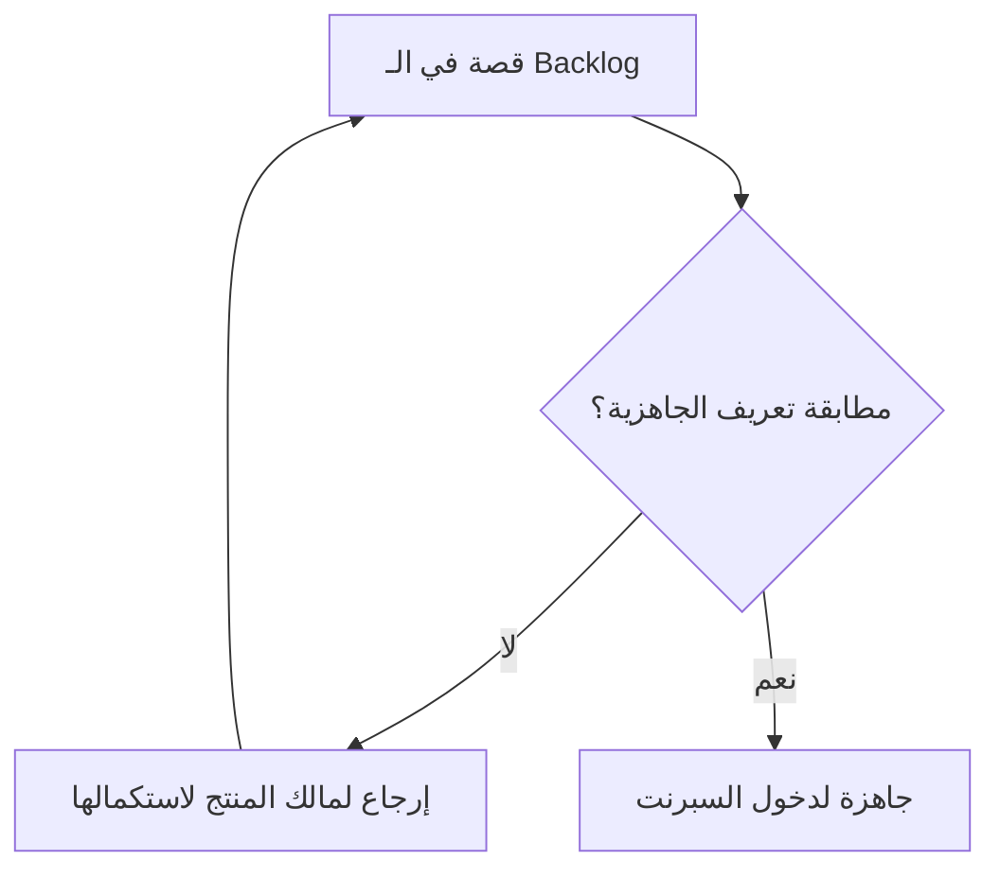

# تعريف الجاهزية (Definition of Ready)

> [!info] تعريف مختصر
> تعريف الجاهزية (Definition of Ready - DoR) هو قائمة معايير متفق عليها تحدد متى تكون قصة المستخدم أو عنصر العمل ناضجاً ومفهوماً بما يكفي ليدخل السبرنت أو تبدأ العمل عليه، دون غموض أو نواقص تعيق التنفيذ.

## الشرح العلمي والاحترافي
- الهدف من DoR هو منع دخول مهام غير واضحة إلى دورة التطوير، لأن القصة الغامضة تُنتج نقاشات متكررة، توقفاً منتصف العمل، وتقديرات غير دقيقة.
- عادة يتضمن تعريف الجاهزية بنوداً مثل: وجود وصف واضح للقصة، تحديد معايير القبول (Acceptance Criteria)، تقدير حجم العمل ([[12 - Story Points]] أو [[Man-Day and Person-Day]])، عدم وجود اعتماديات ([[Dependency]]) محجوبة، وتوفر التصاميم أو الموارد اللازمة.
- يرتبط الـ DoR بمعايير [[INVEST Criteria]] (مستقلة، قابلة للتفاوض، ذات قيمة، قابلة للتقدير، صغيرة، قابلة للاختبار) التي تُستخدم غالباً كأساس لصياغة بنوده.
- على عكس [[Definition of Done]] الذي يحدد "متى ننتهي"، يحدد DoR "متى نبدأ"؛ فهو بوابة دخول للعمل وليس بوابة خروج منه.
- تطبيق DoR بشكل صارم للغاية قد يخلق بيروقراطية ويبطئ الفريق، لذا يُنصح غالباً باعتباره "دليلاً استرشادياً" لا "قانوناً صارماً"، خصوصاً في الفرق الناضجة.

## أين ومتى يُستخدم
- يُستخدم أساساً في سكرم ([[02 - Scrum]]) أثناء [[Backlog Refinement]] و[[08 - Sprint Planning]]، حيث يُراجَع مالك المنتج والفريق كل قصة مقابل بنود الـ DoR قبل قبولها في السبرنت.
- يُستخدم أيضاً في كانبان وسكرم-بان ([[Scrum-ban]]) كجزء من معايير الدخول إلى عمود "قائمة الانتظار الجاهزة للسحب" قبل [[Pull System]].
- يُلجأ إليه خصوصاً في الفرق التي عانت سابقاً من توقف المهام منتصف الطريق بسبب غموض المتطلبات أو نقص المعلومات.

## مثال وسيناريو تطبيقي
> [!example] سيناريو ملموس
> فريق تطوير في شركة توصيل طلبات يضع تعريف الجاهزية التالي: يجب أن تحتوي كل قصة على وصف بصيغة "بصفتي... أريد... حتى..."، معايير قبول بصيغة Given/When/Then، تقدير بالنقاط، وتصميم واجهة معتمَد من فريق UX.
> أثناء [[08 - Sprint Planning]]، تُطرَح قصة "إضافة خاصية تتبع الطلب على الخريطة"، لكن لا يوجد تصميم UX جاهز لها بعد.
> بما أن القصة لا تحقق تعريف الجاهزية، يرفض الفريق إدخالها في السبرنت الحالي، ويطلب من مالك المنتج ([[05 - Product Owner]]) التنسيق مع فريق التصميم أولاً، فتُؤجَّل القصة لسبرنت لاحق بدلاً من أن تبدأ وتتوقف منتصف الطريق.

## خطوات أو مخطّط
1. يحدد الفريق مع مالك المنتج بنود الجاهزية المطلوبة لكل قصة (وضوح الوصف، معايير قبول، تقدير حجم، عدم وجود اعتماديات محجوبة).
2. أثناء [[Backlog Refinement]]، تُراجَع القصص المرشحة للسبرنت القادم مقابل هذه البنود.
3. أي قصة لا تحقق البنود تُعاد لمالك المنتج لاستكمال المعلومات الناقصة، ولا تدخل السبرنت.
4. القصص التي تحقق كل البنود تصبح "جاهزة" ومؤهلة للدخول في [[08 - Sprint Planning]].
5. يُراجَع تعريف الجاهزية دورياً ويُعدَّل بناءً على تجارب الفريق.

## ⚠️ مفاهيم خاطئة شائعة
> [!warning]
> - الخلط بين تعريف الجاهزية وتعريف الاكتمال ([[Definition of Done]])؛ الأول شرط للبدء بالعمل، والثاني شرط لاعتباره منتهياً.
> - الاعتقاد أن كل قصة يجب أن تكون "جاهزة 100%" قبل بدء أي عمل عليها؛ في الواقع بعض الفرق تسمح ببعض المرونة لقصص كبيرة تُفصَّل أثناء السبرنت.
> - الظن أن تطبيق DoR يبطئ الفريق دائماً؛ الحقيقة عكس ذلك غالباً، لأنه يمنع التوقفات المفاجئة والنقاشات المتكررة أثناء التنفيذ.

## ❌ ممارسات خاطئة في المشاريع
> [!failure]
> - إدخال قصص غامضة إلى السبرنت لمجرد ملء السعة (Capacity) دون التحقق من جاهزيتها. التجنب: الالتزام بمراجعة كل قصة مقابل تعريف الجاهزية قبل الالتزام بها في [[08 - Sprint Planning]].
> - جعل تعريف الجاهزية معقداً جداً وبيروقراطياً لدرجة تعطّل تدفق العمل. التجنب: إبقاء البنود عملية وقليلة العدد، والتركيز على ما يمنع التوقف الفعلي فقط.
> - عدم مراجعة الـ DoR وتحديثه رغم تكرار نفس المشاكل (مثل نقص التصاميم). التجنب: مناقشة فعالية الـ DoR دورياً في [[10 - Sprint Retrospective]] وتعديله حسب الحاجة.

## 🔗 مصطلحات ومفاهيم ذات صلة
[[Definition of Done]] | [[INVEST Criteria]] | [[Backlog Refinement]] | [[08 - Sprint Planning]] | [[12 - Story Points]] | [[Dependency]] | [[05 - Product Owner]] | [[13 - Backlog]] | [[Pull System]] | [[02 - Scrum]]

> [!tip] 💡 إثراء عملي — كورس الإنتاجية
> تعريف الجاهزية بستّة شروط بوصفه بوّابة المجرى الأعلى، وأكثر شروطه إهمالًا (**التبعيّات**): [[07 - المجرى الأعلى والمجرى الأدنى]].
