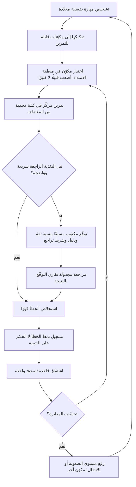

# التدريب المتعمّد (Deliberate Practice)

> [!info] تعريف مختصر
> نوع خاصّ ومحدّد من التمرين يستهدف **تحسين أداء بعينه بشكل مقصود**، لا مجرّد أداء العمل مرارًا. صاغ المفهوم وطوّره عالم النفس السويدي-الأمريكي **أندرس إريكسون (K. Anders Ericsson)** وزملاؤه في أبحاثهم عن اكتساب الخبرة والأداء الاستثنائي منذ أوائل التسعينيات. خلاصة أطروحته أن الفارق بين الخبير والمتوسّط لا يُفسَّر أساسًا بالموهبة الفطرية ولا بعدد السنوات، بل بطبيعة التمرين ذاته وشروطه. ومن هنا الاستنتاج العملي الأهم لأي مدير: **الخبرة المتراكمة بلا تصميم تُنتج ألفة لا إتقانًا** — فمن مارس عملًا عشرين سنة على النمط نفسه قد يكون كرّر السنة الأولى عشرين مرة.

## الشرح العلمي والاحترافي
- **أصل المفهوم ومساره**: طرح إريكسون وزملاؤه المفهوم في ورقة بحثية سنة 1993 عن دور التمرين المتعمّد في اكتساب الأداء الخبير، مستندين إلى دراسة عازفي الكمان والرياضيين ولاعبي الشطرنج. لاحقًا شرح إريكسون الفكرة لجمهور أوسع في كتابه *Peak* (2016). ومن المهم التنبيه إلى أن ما اشتهر إعلاميًّا باسم «قاعدة العشرة آلاف ساعة» صيغة مبسَّطة انتشرت عبر كتّاب آخرين، وقد **اعترض عليها إريكسون نفسه صراحةً** لأنها اختزلت أطروحته في الكمّ وأسقطت جوهرها وهو **نوعية التمرين وشروطه**؛ فالساعات وحدها لا تفسّر شيئًا.
- **الشرط الأول — هدف محدّد يتجاوز المستوى الحالي بقليل**: التمرين المتعمّد لا يستهدف «التحسّن عمومًا» بل جانبًا ضيّقًا مُعرَّفًا بدقّة، ويقع في **منطقة الامتداد**: أصعب قليلًا ممّا يمكنك أداؤه بارتياح، لا أسهل (فلا تعلّم) ولا أصعب بكثير (فلا نجاح ولا استخلاص). العمل داخل منطقة الراحة هو بالضبط ما يجعل السنوات تمرّ بلا تحسّن.
- **الشرط الثاني — تركيز كامل ومجهود ذهني حقيقي**: الأداء الآلي المريح لا يُنتج تعلّمًا. التمرين المتعمّد مُجهِد بطبيعته، ولهذا لا يُمارَس ساعات طويلة متّصلة. وهو حسّاس جدًّا لتشتّت الانتباه — وهنا الصلة المباشرة بـ[[Context Switching Cost]]: التمرين في بيئة مقاطعات متكرّرة يفقد أثره التعليمي حتى مع بذل الوقت.
- **الشرط الثالث — تغذية راجعة فورية ودقيقة**: يجب أن تعرف بسرعة **ما الذي أخطأت فيه وأين بالضبط**، لا أن الأمر «لم يسر جيدًا». هذا الشرط هو أصعبها في المهن الإدارية، لأن نتيجة القرار قد تظهر بعد أشهر، وحين تظهر تكون قد اختلطت بعشرات العوامل. ولهذا يُعوَّض عن التأخّر بآليات صناعية: توقّع مكتوب مسبقًا، مراجعة لاحقة منظّمة، ومرشد يرى ما لا تراه ([[Feedback Loop]]).
- **الشرط الرابع — التكرار مع التصحيح**: إعادة المحاولة على الجزء الضعيف تحديدًا، لا تكرار الأداء الكامل. عازف الكمان لا يعزف المقطوعة كاملة عشر مرات، بل يعزف الأربع نغمات المتعثّرة خمسين مرة بأساليب مختلفة. المقابل الإداري: لا تُعِد كتابة خطط المشاريع كلها، بل تمرّن على العنصر الذي تخفق فيه دائمًا (تقدير المدد؟ صياغة النطاق؟ إدارة اعتراض في اجتماع؟).
- **بنية التمثيل الذهني (Mental Representations)**: الآلية التي يرى إريكسون أنها تفسّر تفوّق الخبير هي بناء تمثيلات ذهنية أغنى للمجال: أنماط مخزّنة تسمح بإدراك الموقف كوحدة ذات معنى بدل تفاصيل متفرّقة. الخبير لا يفكّر أسرع فحسب، بل **يرى أشياء مختلفة** في المشهد نفسه. وهذا ما يجعل الحكم الخبير يبدو «حدسًا» وهو في حقيقته تعرّف على نمط مبنيّ عبر تعرّض منظَّم مصحوب بتغذية راجعة.
- **حدود المفهوم وشروط انطباقه**: التمرين المتعمّد نشأ في مجالات ذات **قواعد مستقرّة ومعايير أداء واضحة** (موسيقى، شطرنج، رياضة، جراحة). في المجالات المفتوحة وضعيفة التغذية الراجعة — كإدارة المنتج والقيادة — لا ينطبق حرفيًّا، وقد جرى جدل أكاديمي حقيقي حول حجم أثر التمرين مقارنة بعوامل أخرى، وحول قابلية النتائج للتعميم. الموقف المهني السليم: **استخدم شروطه الأربعة كمعيار تصميم للتعلّم**، لا كوعد بأن تكرارًا كافيًا يصنع خبيرًا في كل مجال.
- **مفهوم مجاور مهم — البيئات «الودودة» و«الخبيثة»**: يميّز أدب صنع القرار بين بيئات تعطي تغذية راجعة سريعة وصادقة (تُبنى فيها الخبرة الحقيقية)، وبيئات تعطي تغذية راجعة متأخّرة أو مضلّلة (فتُبنى فيها **ثقة زائفة** بدل الخبرة). كثير من مواقف الإدارة تنتمي إلى النوع الثاني: قرار سيّئ ينجح بالحظ فيُعزَّز، وقرار سليم يخفق لسبب خارجي فيُعاقَب. ومن هنا تأتي القيمة الحاسمة لـ[[Decision Log]]: تسجيل الحكم والتوقّع **قبل** ظهور النتيجة، لأنه الطريقة الوحيدة لتحويل بيئة خبيثة إلى بيئة قابلة للتعلّم.
- **تطبيقه على مهارة الحُكم عند مدير المنتج**: أثمن ما يملكه مدير المنتج ليس معرفة الأدوات بل **جودة الحُكم**: أي إشارة يثق بها، متى يوقف مسارًا، كيف يزن دليلًا ضعيفًا. تدريب هذه المهارة يقتضي تفكيكها إلى مكوّنات قابلة للتمرين (تقدير الأثر، قراءة بحث المستخدم، الحكم على جاهزية الإطلاق)، ثم بناء تغذية راجعة صناعية عليها: توقّع مكتوب مسبقًا بنسبة ثقة، ومراجعة بعد ظهور النتيجة، وسجل للأنماط التي تخطئ فيها باستمرار. من دون ذلك يتحوّل «الحدس» إلى تراكم تحيّزات مؤكَّدة ذاتيًّا ([[Confirmation Bias]]).

## أين ومتى يُستخدم
- **في تطوير قدرات الفريق وخطط النموّ الفردية**: لتحويل «خطة تطوير» عامة إلى تمارين محدّدة على مهارات ضعيفة مُشخَّصة، بدل دورات تدريبية عامة لا أثر لها.
- **في تحسين جودة التقدير**: تقدير المدد مهارة قابلة للتمرين لأن تغذيتها الراجعة قابلة للقياس؛ مقارنة [[Original Estimate]] بالفعلي دوريًّا هي بالضبط حلقة تمرين متعمّد تعالج [[Estimation Variance]] وتحسّن [[Planning Poker]] و[[Relative Estimation]].
- **في بناء مهارة صنع القرار**: عبر [[Decision Log]] المكتوب مسبقًا بتوقّع صريح، ثم مراجعته لاحقًا — وهي أقوى آلية عملية لتدريب الحكم في بيئة بطيئة التغذية الراجعة.
- **في الاسترجاع والتحسين المستمر**: ربطه بدورات [[Kaizen]] و[[PDCA]] و[[Root Cause Analysis]]، بحيث ينتهي كل درس بتمرين محدّد لا بتوصية عامة.
- **في التمكين والقيادة الموزّعة**: تدريب الأفراد على مواقف حقيقية بمخاطر محدودة ضمن [[Empowerment]] و[[Leadership at Every Level]]، وهو ما يستلزم [[Psychological Safety]] لأن التمرين يقتضي الفشل المتكرّر أمام الآخرين.
- **في التأهيل وفترة التجربة**: تصميم [[Probation Period]] كسلسلة تمارين متدرّجة بتغذية راجعة أسبوعية، بدل تقييم واحد في نهايتها.

## مثال وسيناريو تطبيقي
> [!example] مديرة منتج في شركة سعودية للتقنية المالية، خبرتها 6 سنوات. مشكلتها المتكرّرة أن ثلاث ميزات كبرى أطلقتها خلال 18 شهرًا لم تحقّق أيًّا من نتائجها المتوقّعة، رغم أن كل واحدة نُفّذت بإتقان وفي موعدها. تقييمها السنوي كان جيّدًا لأن التسليم منضبط، لكن الأثر غائب.
> الفرضية التي وضعتها مع مديرها: المشكلة ليست في التنفيذ بل في **الحكم على قوّة الدليل قبل الالتزام** — وهي مهارة لم تتحسّن في ستّ سنوات لأنها لم تتلقَّ عنها تغذية راجعة قطّ.
> صمّمت برنامج تمرين لثلاثة أرباع بشروط أربعة:
> **الهدف المحدّد**: التنبؤ بأثر المبادرة قبل تنفيذها — لا «تحسين مهارات المنتج».
> **التمرين**: قبل كل قرار بناء (وكان معدّلها 8–10 قرارات في الربع)، تكتب في [[Decision Log]] قبل البدء: النتيجة المتوقّعة برقم، ونسبة ثقة من 0 إلى 100، والدليل المستنِد إليه ومصدره، وأقوى حجّة معاكسة، والإشارة التي ستقنعها بالتراجع. ثم تكتب الشيء نفسه لعشر مبادرات نفّذتها فرق أخرى في الشركة — لتضاعف عدد التكرارات دون مضاعفة المخاطرة.
> **التغذية الراجعة**: مراجعة نصف شهرية مدّتها 45 دقيقة مع زميل أقدم، تُقارن فيها التوقّعات المكتوبة بالنتائج الظاهرة، ويُسجَّل **نمط الخطأ** لا صوابه أو خطؤه فقط.
> **التصحيح والتكرار**: بعد كل مراجعة تُشتقّ قاعدة شخصية واحدة قابلة للاختبار في الدورة التالية.
> النتائج بعد ثلاثة أرباع (48 توقّعًا مكتوبًا): كشفت المراجعة نمطين ثابتين. الأول أن ثقتها كانت ترتفع فوق 80% كلما جاء الطلب من عميل كبير واحد، حتى دون أي دليل سلوكي مساند — أي أنها كانت تخلط بين **حجم مصدر الطلب** و**قوّة الدليل**. الثاني أنها لم تكن تكتب إشارة تراجع قابلة للقياس إلا في 3 توقّعات من أول 20، فكانت المبادرات تستمرّ بحكم القصور الذاتي.
> بعد التصحيح: صارت تشترط على نفسها دليلًا سلوكيًّا من [[Product Analytics]] أو من ثلاث مقابلات مستقلّة قبل تجاوز نسبة ثقة 70%، وصارت كل مبادرة تحمل شرط إيقاف مكتوبًا. في الربع الرابع، من 7 مبادرات، أُوقفت 2 مبكرًا بعد أسبوعين من الإطلاق المحدود، ووفّرت الشركة ما يقارب 9 أسابيع عمل هندسي. والأهم أن **معايرة ثقتها** تحسّنت: نسبة التوقّعات التي أعطتها ثقة 70%+ وتحقّقت فعلًا ارتفعت من 41% إلى 68%. لم تزد سنوات خبرتها إلا ثلاثة أرباع، لكن مهارة الحكم لديها تغيّرت لأن الحلقة أُغلقت لأول مرة.

## خطوات أو مخطّط
1. **شخّص المهارة الضعيفة تحديدًا**: لا «تحسين الأداء» بل «التنبؤ بأثر المبادرات» أو «إدارة اعتراض في اجتماع أصحاب المصلحة». التشخيص الغامض يُنتج تمرينًا غامضًا.
2. **فكّكها إلى مكوّنات قابلة للتمرين مستقلًّا**، واختر المكوّن الأضعف الذي له أثر أعلى.
3. **صمّم تمرينًا في منطقة الامتداد**: أصعب قليلًا من مستواك الحالي، ويمكن تكراره كثيرًا بمخاطرة محدودة (حالات حقيقية سابقة، قرارات فرق أخرى، محاكاة).
4. **اصنع التغذية الراجعة صناعيًّا حين تكون بطيئة**: اكتب التوقّع ونسبة الثقة والدليل **قبل** ظهور النتيجة — فبدون تسجيل مسبق لا يمكن تمييز الحكم الجيّد من الحظ الجيّد.
5. **جدول المراجعة بإيقاع ثابت** (كل أسبوعين مثلًا) بمشاركة شخص أقدم أو نظير يرى النمط من الخارج.
6. **سجّل نمط الخطأ لا الحكم على النتيجة**: هل تفرط في التفاؤل؟ تنحاز لمصدر بعينه؟ تتجاهل الدليل المعاكس؟
7. **اشتقّ قاعدة تصحيح واحدة** لكل دورة، وطبّقها فورًا في التكرار التالي.
8. **احمِ زمن التمرين وتركيزه**: كتل قصيرة ومتّصلة ومحمية من المقاطعة، فالتمرين المشتَّت لا يُنتج تعلّمًا.
9. **قِس التقدّم بالمعايرة لا بالإنجاز**: هل تحسّنت مطابقة توقّعاتك للواقع؟ لا كم مبادرة نجحت.
10. **أعد التشخيص كل ربع**: المهارة التي كانت الأضعف قد لا تبقى كذلك، والتمرين على مهارة أُتقنت تحوّل مرة أخرى إلى راحة.

## ⚠️ مفاهيم خاطئة شائعة
> [!warning]
> - **اختزاله في «عشرة آلاف ساعة»**: هذه الصيغة تبسيط إعلامي اعترض عليه إريكسون نفسه. الساعات وسيط ضعيف؛ الجوهر في الشروط الأربعة. عشرة آلاف ساعة من التكرار المريح تُنتج ألفة لا إتقانًا، وبضع مئات من الساعات المصمَّمة قد تفوقها أثرًا.
> - **الخلط بين «سنوات الخبرة» و«الخبرة»**: العمل اليومي ليس تمرينًا متعمّدًا، لأنه يُؤدَّى غالبًا في منطقة الراحة، بتغذية راجعة غائبة أو متأخّرة، ودون تكرار مقصود للجزء الضعيف. لهذا يستوي كثير من ذوي السنوات الطويلة مع أقلّ منهم سنوات.
> - **افتراض أن كثرة التغذية الراجعة تكفي**: التغذية الراجعة المتأخّرة أو الغامضة («كان بإمكانك التصرّف أفضل») لا تُنتج تعلّمًا. الشرط أن تكون **محدّدة وقريبة زمنيًّا وقابلة للترجمة إلى فعل** في المحاولة التالية.
> - **الظنّ أن المفهوم ينطبق على كل مجال بالدرجة نفسها**: نشأ في مجالات ذات قواعد مستقرّة ومعايير واضحة، وانطباقه على القيادة وإدارة المنتج أضعف وأكثر إشكالًا، وقد جرى حوله جدل أكاديمي حقيقي. استخدمه معيارًا لتصميم التعلّم، لا وعدًا بالنتيجة.
> - **الخلط بينه وبين التعلّم بالاطلاع**: قراءة كتاب أو حضور دورة اكتساب معلومة لا تمرين مهارة. المهارة لا تتحسّن إلا بأداء متكرّر مصحّح، والمعلومة مُدخل مساعد لا بديل.
> - **اعتبار الفشل أثناء التمرين مؤشّر ضعف**: التمرين الصحيح يقع عند حافّة القدرة، فالخطأ فيه متوقّع ومطلوب. البيئة التي تعاقب على الخطأ التدريبي تدفع الجميع للبقاء في منطقة الراحة، ولهذا فـ[[Psychological Safety]] شرط بنيويّ لا رفاهية.
> - **الظنّ أن الحدس الإداري لا يُدرَّب**: الحدس تعرّف على أنماط. يتحسّن حين يتوفّر تعرّض منظَّم وتغذية راجعة صادقة، ويتحوّل إلى تحيّز راسخ حين تغيب — والفارق بين الحالتين هو التصميم لا الموهبة.

## ❌ ممارسات خاطئة في المشاريع
> [!failure]
> - **بناء خطة التطوير على الدورات التدريبية فقط**: الخطأ اعتبار حضور دورة إنجازًا تطويريًّا. لماذا يضرّ؟ لأن المعلومة تُنسى دون تمرين مصحَّح، فتُصرف الميزانية والوقت دون تغيّر قابل للقياس في الأداء. الحل: اربط كل دورة بتمرين محدّد على حالة حقيقية خلال أسبوعين، مع مراجعة نتيجة.
> - **ترقية الأفراد بمعيار سنوات الخبرة**: الخطأ افتراض أن الزمن ينتج كفاءة. لماذا يضرّ؟ لأنه يكافئ البقاء لا التحسّن، ويضع في مواقع الحكم من كرّر السنة الأولى مرارًا. الحل: اجعل معيار الترقية أدلّة على تحسّن مهارة محدّدة (جودة تقدير، معايرة قرار، نتائج مراجعات).
> - **الاسترجاع الذي ينتهي بتوصيات عامة**: الخطأ إغلاق الجلسة بعبارات مثل «نتواصل بشكل أفضل». لماذا يضرّ؟ لأن التوصية غير القابلة للتمرين لا تُنفَّذ ولا تُقاس، فتتكرّر المشكلة نفسها في الاسترجاع القادم. الحل: حوّل كل درس إلى تمرين محدّد بمسؤول وموعد ومعيار نجاح ضمن [[Kaizen]].
> - **إلقاء المهام الصعبة على الأقوى دائمًا**: الخطأ إسناد الحالات المعقّدة لمن يتقنها ضمانًا للنتيجة. لماذا يضرّ؟ لأنه يحرم البقية من منطقة الامتداد، فتتجمّد قدراتهم وتتركّز المعرفة في شخص واحد ([[Dependency]]). الحل: أسند حالات ممتدّة مع شبكة أمان (مراجعة، إشراف، نطاق محدود).
> - **عدم تسجيل التوقّعات قبل القرار**: الخطأ الاكتفاء بتقييم النتائج بعد ظهورها. لماذا يضرّ؟ لأن التحيّز الرجعي يعيد كتابة الذاكرة («كنت أعرف أن هذا سيحدث»)، فيستحيل التعلّم من الحكم نفسه. الحل: [[Decision Log]] مكتوب مسبقًا بنسبة ثقة وشرط تراجع، يُراجَع بعد ظهور النتيجة.
> - **تمرين المهارات في بيئة مقاطعات دائمة**: الخطأ توقّع التطوّر أثناء يوم مجزّأ إلى عشرات الانتقالات. لماذا يضرّ؟ لأن التمرين المتعمّد يتطلّب تركيزًا كاملًا، وتبديل السياق يُلغي أثره التعليمي ([[Context Switching Cost]]). الحل: كتل زمنية محمية للتمرين والمراجعة ضمن [[Team Working Agreement]].
> - **معاقبة الخطأ التدريبي كما يُعاقَب الخطأ التشغيلي**: الخطأ عدم التمييز بين خطأ وقع في محاولة توسيع القدرة وخطأ ناتج عن إهمال. لماذا يضرّ؟ لأنه يجعل الجميع يختار المهام المضمونة، فيتوقّف نموّ الفريق بالكامل. الحل: عرّف صراحةً أين يُسمح بالتجريب وأين لا، واحمِ [[Psychological Safety]] في نطاق التمرين المعلن.

## 🔗 مصطلحات ومفاهيم ذات صلة
[[Feedback Loop]] | [[Psychological Safety]] | [[Decision Log]] | [[Kaizen]] | [[PDCA]] | [[Estimation Variance]] | [[Original Estimate]] | [[Planning Poker]] | [[Relative Estimation]] | [[Confirmation Bias]] | [[Empowerment]] | [[Leadership at Every Level]] | [[Probation Period]] | [[Emotional Intelligence]] | [[Active Listening]] | [[Context Switching Cost]] | [[Voice of the Customer]]
