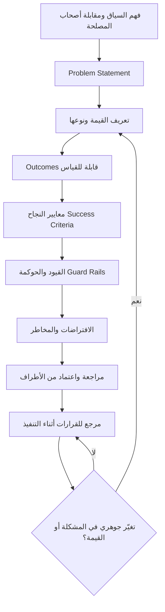

# وثيقة التسليم (Delivery Charter)

> [!info] تعريف مختصر
> وثيقة التسليم (Delivery Charter) هي الوثيقة التأسيسية لـ[[Delivery Layer]]؛ وثيقة مختصرة ومتّفق عليها تُحدّد **المشكلة** التي نحلّها، و**القيمة** التي نسعى إليها، و**النتائج القابلة للقياس** التي نحكم بها على النجاح، و**القيود والحوكمة** التي نعمل ضمنها. هي ليست بديلًا عن `BRD` أو `PRD` أو `SRS` أو ميثاق المشروع، بل تُجيب عن سؤال لا تُجيب عنه أيّ منها: **كيف تُحقَّق القيمة وتُحمى أثناء التنفيذ؟**

## الشرح العلمي والاحترافي
- **لماذا وُجدت**: معظم المشاريع تبدأ بوثائق تصف *ما* سيُبنى (`PRD`، `SRS`) أو *لماذا* يستحق البناء ماليًّا (`BRD`، [[Business Case]]) أو *من* يملك التفويض ([[ميثاق المشروع (Project Charter)]]). لكن ما إن يبدأ التنفيذ حتى تظهر ضغوط الجدول وطلبات التغيير وتضارب الأطراف، فتُتَّخذ عشرات القرارات اليومية بلا مرجع يحمي القيمة. وثيقة التسليم هي ذلك المرجع.
- **طبيعتها**: وثيقة **حيّة** لا أرشيفية، قصيرة عمدًا (غالبًا بين ثلاث وسبع صفحات)، مكتوبة بلغة مفهومة لغير المتخصّصين، وموقّعة ضمنًا أو صراحةً من الأطراف الأساسية. قيمتها في كونها مرجعًا يُفتح عند الخلاف لا ملفًّا يُحفظ ويُنسى.
- **أقسامها الأساسية**:
  1. **معلومات عامة (General Information)**: اسم المشروع، الجهة الراعية، الفريق، النطاق الزمني العام، إصدار الوثيقة وتاريخه.
  2. **تعريف المشكلة (`Problem Statement`)**: وصف دقيق للألم الحالي بلغة العمل لا بلغة الحل: من يتألّم؟ وما حجم الألم؟ وما كلفة بقائه دون معالجة؟ صياغة المشكلة بوضوح تمنع أشيع أخطاء المشاريع: بناء حلّ لمشكلة غير محدّدة.
  3. **تعريف القيمة وأنواعها (Value Definition)**: تحديد القيمة المستهدفة وتصنيفها — قيمة مالية (زيادة إيراد أو خفض كلفة)، قيمة تشغيلية (سرعة، دقة، تقليل هدر)، قيمة تجربة المستخدم، قيمة امتثال وحوكمة، أو قيمة استراتيجية طويلة المدى. تحديد **نوع** القيمة يحسم لاحقًا أولويات التنفيذ عند التعارض.
  4. **الأهداف والـ`Outcomes` القابلة للقياس**: تحويل القيمة إلى نتائج مقيسة بأرقام وخطّ أساس وهدف ومهلة، وفق منطق [[Outcome vs Output]] و[[SMART Goals]] — لا "تحسين الأداء" بل "خفض زمن معالجة الطلب من 6 دقائق إلى دقيقتين خلال ربع واحد".
  5. **أصحاب المصلحة (Stakeholders)**: من يقرّر، من يُستشار، من يُبلَّغ، ومن يتأثّر؛ مع تحديد صريح لصاحب القرار النهائي عند الخلاف.
  6. **معايير النجاح (`Success Criteria`)**: الشروط التي إذا تحقّقت اعتُبر المشروع ناجحًا، بما يشمل معايير القبول ومعايير التبنّي بعد الإطلاق، لا مجرد اكتمال التسليم.
  7. **القيود والحوكمة ([[Guard Rails]])**: الحدود التي لا يجوز تجاوزها — سقف الميزانية، متطلبات الأمان والامتثال، القرارات المعمارية الثابتة، وحدود التغيير المسموح دون تصعيد. وظيفتها منح الفريق حرية داخل إطار آمن بدل الرجوع في كل تفصيل.
  8. **الافتراضات والمخاطر (Assumptions & Risks)**: ما نبني عليه دون يقين، وما قد يعصف بالمشروع، مع نقاط التحقّق واستراتيجيات الاستجابة — ويُغذّى منها [[RAID Log]] لاحقًا.
- **التمييز الحاسم عن الوثائق الأخرى**: هذا الفرق هو مربط الفرس، وخلطه يُفقد الوثيقة معناها:
  - **`BRD` (Business Requirements Document)**: يركّز على مبرّر العمل والجدوى المالية والعائد المتوقّع؛ أقرب في روحه إلى [[Business Case]]، ويجيب عن: *لماذا نستثمر في هذا أصلًا؟*
  - **`PRD` (Product Requirements Document)**: يصف **ما يجب أن يفعله المنتج** — الوظائف، سلوك المستخدم، حالات الاستخدام. يجيب عن: *ماذا نبني؟*
  - **`SRS` ([[Software Requirements Specification]])**: يصف **كيف يُنفَّذ** تقنيًّا — المتطلبات الوظيفية وغير الوظيفية بتفصيل هندسي. يجيب عن: *كيف يُبنى؟*
  - **[[ميثاق المشروع (Project Charter)]]**: يمنح **التفويض الرسمي** لانطلاق المشروع ويعيّن مدير المشروع ويحدّد سلطته وحدود الموارد. يجيب عن: *من يملك الصلاحية؟*
  - **وثيقة التسليم**: تجيب عن سؤال مختلف كليًّا: **كيف تُحقَّق القيمة وتُحمى أثناء التنفيذ؟** ما القيمة، ومن يملكها، وبماذا نقيسها، وضمن أي حدود نناور، وكيف نقرّر حين تتعارض القيمة مع الجدول. الوثائق الأخرى تصف الحل أو تبرّره أو تفوّضه؛ هذه وحدها تحرس النتيجة.
- **متى تُكتب ومتى تُحدَّث**: تُكتب **قبل** بدء التنفيذ وبعد وضوح كافٍ للمشكلة، عادةً بالتوازي مع [[Scope Statement]] أو بعده مباشرة. وتُحدَّث عند كل تغيّر جوهري في المشكلة أو القيمة أو القيود، وعند نهاية كل مرحلة كبرى، وعند تبدّل أصحاب المصلحة الرئيسيين. أما تغيّر تفاصيل التنفيذ فلا يستدعي تحديثها — ذلك شأن الـ[[13 - Backlog]] لا شأن الوثيقة.

## أين ومتى يُستخدم
- في بداية أي مشروع تنفيذ لدى جهة مزوّدة للخدمات، لتثبيت فهم موحّد للقيمة قبل توقيع خطة التنفيذ.
- عند تسلّم مشروع متعثّر أو موروث من فريق سابق، حيث تكون الوثيقة أسرع طريق لإعادة بناء الوضوح المفقود.
- عند بدء مرحلة جديدة داخل برنامج طويل، لإعادة تعريف القيمة المستهدفة لتلك المرحلة تحديدًا.
- كمرجع تحكيم عند طلبات التغيير: هل هذا الطلب يخدم القيمة المعلنة أم يبتعد عنها؟
- في اجتماعات الحوكمة الدورية، لقياس التقدّم مقابل النتائج المعلنة لا مقابل نسبة إنجاز المهام.

## مثال وسيناريو تطبيقي
> [!example] بنك متوسط الحجم يطلب "تطبيقًا جديدًا لفتح الحسابات". الفريق يملك `BRD` من إدارة الأعمال يقدّر عائدًا سنويًّا، و`PRD` من فريق المنتج يصف ثلاثًا وأربعين شاشة، و`SRS` من الفريق التقني يفصّل التكاملات. ومع ذلك، بعد شهرين من الانطلاق، تحوّل كل اجتماع إلى جدال حول أولوية الشاشات، وكل طلب تغيير يُقبل لأن "العميل طلبه"، وتأخّر الجدول ثمانية أسابيع.
> عند إدخال وثيقة تسليم من خمس صفحات تغيّر المشهد: عُرِّفت المشكلة صراحةً ("42% من طلبات فتح الحساب تُهجر قبل الإكمال، بكلفة فرصة تقديرية 3.1 مليون سنويًّا")، وحُدِّدت القيمة كقيمة تشغيلية وتجربة مستخدم معًا، وصيغ الـ`Outcome` كرقم واحد حاسم: "خفض معدل هجر الطلب من 42% إلى 20% خلال ستة أشهر من الإطلاق". ووُضعت `Guard Rails` واضحة: لا تغيير يمسّ متطلبات الامتثال، وأي تغيير يتجاوز 5% من الجهد يحتاج تصعيدًا للجنة التوجيه.
> بعد ذلك صار الجدال محسومًا بمرجع: طُلب إدراج لوحة تحليلات للإدارة، فطُرح السؤال: هل يخفض هذا معدل الهجر؟ لا. فأُجِّل إلى ما بعد الإطلاق دون خصومة. ولم تعد الوثيقة ملفًّا في مجلّد، بل صارت تُفتح فعليًّا في كل اجتماع قرار.

## خطوات أو مخطّط
1. **جمع السياق**: مقابلات قصيرة مع أصحاب المصلحة الرئيسيين لفهم الألم الحقيقي بلغتهم لا بلغة الحل.
2. **صياغة `Problem Statement`**: كتابة المشكلة بجملة أو جملتين مع رقم يوضّح حجمها وكلفتها.
3. **تعريف القيمة ونوعها**: تحديد القيمة المستهدفة وتصنيفها (مالية · تشغيلية · تجربة · امتثال · استراتيجية).
4. **تحويل القيمة إلى `Outcomes` مقيسة**: خطّ أساس، هدف رقمي، مهلة زمنية، ومصدر قياس موثوق.
5. **تحديد أصحاب المصلحة وصاحب القرار**: من يقرّر عند التعارض، وكيف يجري التصعيد.
6. **كتابة معايير النجاح و`Guard Rails`**: ما يُعتبر نجاحًا، وما الحدود التي لا تُتجاوز.
7. **توثيق الافتراضات والمخاطر**: ونقلها إلى [[RAID Log]] كمخرَج تشغيلي حيّ.
8. **المراجعة والاعتماد**: جلسة قصيرة للاتفاق الصريح، لا مجرد إرسال بالبريد.
9. **التحديث الدوري**: مراجعة عند كل مرحلة كبرى أو تغيّر جوهري في المشكلة أو القيود.

## ⚠️ مفاهيم خاطئة شائعة
> [!warning]
> - **اعتبارها نسخة أخرى من `BRD` أو `PRD`**: تلك تصف الجدوى أو الوظائف، وهذه تصف كيف تُحقَّق القيمة وتُحمى أثناء التنفيذ؛ اختلاف السؤال لا اختلاف التنسيق.
> - **الخلط بينها وبين [[ميثاق المشروع (Project Charter)]]**: الميثاق يمنح التفويض ويعيّن السلطة، ووثيقة التسليم تمنح الاتجاه وتحمي النتيجة؛ وقد يتعايشان في المشروع نفسه دون تعارض.
> - **الظنّ بأن طولها دليل جودتها**: وثيقة من خمس صفحات تُقرأ وتُستخدم أفضل من أربعين صفحة لا يفتحها أحد بعد الاعتماد.
> - **اعتبارها وثيقة تُكتب مرة وتُجمَّد**: هي وثيقة حيّة تُراجَع عند كل تغيّر جوهري؛ وثيقة قديمة أخطر من غيابها لأنها تمنح وهم الوضوح.
> - **افتراض أنها مسؤولية مدير المشروع حصرًا**: كاتبها هو من يحمل [[Delivery Layer]] أيًّا كان مسمّاه، وقد يكون محلّل أعمال أو قائد منتج أو [[Service Delivery Manager]].

## ❌ ممارسات خاطئة في المشاريع
> [!failure]
> - **البدء بالتنفيذ قبل تعريف المشكلة كتابةً**: يبني الفريق حلًّا أنيقًا لمشكلة لم يتّفق أحد على وجودها، ويُكتشف ذلك بعد أشهر. الحل: عدم فتح أول سباق قبل اعتماد `Problem Statement` مكتوب بأرقام.
> - **صياغة الأهداف كقوائم ميزات بدل `Outcomes` مقيسة**: تجعل النجاح مرادفًا للتسليم لا للأثر، وتحوّل الوثيقة إلى `PRD` مكرّر. الحل: كل هدف يحمل خطّ أساس ورقمًا مستهدفًا ومهلة ومصدر قياس.
> - **إهمال قسم `Guard Rails`**: يُترك الفريق بين شلل الرجوع في كل تفصيل وبين تجاوزات تكتشفها الحوكمة متأخرًا. الحل: تحديد صريح لحدود الميزانية والامتثال والقرارات المعمارية وعتبات التصعيد.
> - **نسخ الوثيقة من مشروع سابق دون إعادة تفكير**: تُنتج قيمة عامة لا تخصّ أحدًا، فتفقد الوثيقة سلطتها المرجعية. الحل: إعادة اشتقاق المشكلة والقيمة من سياق العميل الحالي حتى مع إعادة استخدام القالب.
> - **عدم تحديد صاحب القرار عند التعارض**: يتحوّل كل خلاف بين الأطراف إلى جمود يستهلك أسابيع. الحل: تسمية صاحب القرار ومسار التصعيد صراحةً ضمن قسم أصحاب المصلحة.
> - **الاعتماد عبر البريد دون جلسة مناقشة**: يوقّع الجميع دون قراءة، ثم ينكرون الفهم عند أول خلاف. الحل: جلسة مراجعة قصيرة تُقرأ فيها الأهداف والقيود بصوت عالٍ ويُثبَّت الاتفاق في [[Decision Log]].

## 🔗 مصطلحات ومفاهيم ذات صلة
[[ميثاق المشروع (Project Charter)]] | [[BRD]] | [[PRD]] | [[Software Requirements Specification]] | [[Business Case]] | [[Guard Rails]] | [[Scope Statement]] | [[Delivery Layer]] | [[Liftoff]]
