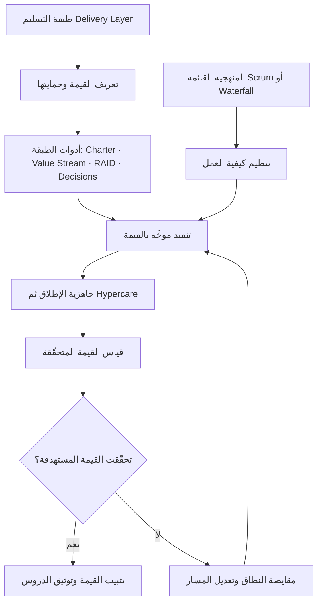

# طبقة التسليم (Delivery Layer)

> [!info] تعريف مختصر
> طبقة التسليم (Delivery Layer) هي طبقة قيادة وتحكّم تُضاف **فوق** المنهجية القائمة في المؤسسة — سواء كانت `Scrum` أو `Waterfall` أو نموذجًا هجينًا — ولا تلغيها ولا تنافسها. وظيفتها أن تملك **القيمة** وتحمي **الهدف التنفيذي** للمشروع من أوله إلى آخره، بينما تبقى المنهجية مسؤولة عن تنظيم *كيف* يعمل الفريق. باختصار: المنهجية تحكم آلية العمل، وطبقة التسليم تحكم جدوى العمل.

## الشرح العلمي والاحترافي
- **المشكلة التي وُجدت لأجلها**: المنهجيات الرشيقة والتقليدية على حدّ سواء أطر لتنظيم *كيف* نعمل: كيف نخطّط، كيف نجتمع، كيف ننتقل من مرحلة إلى أخرى. لكن أيًّا منها لا يُجيب عن السؤال الأهم: *ما القيمة التي نسعى إليها، ومن يحميها حين تتعارض مع الجدول أو الميزانية أو رغبة العميل؟* هذه فجوة بنيوية لا تُسدّ بمزيد من الاجتماعات ولا بأدوات إدارة مهام أفضل.
- **فراغ ملكية القيمة**: عند فحص الأدوار الشائعة في أي مشروع نجد أن كلًّا منها يحمي شيئًا مختلفًا عن القيمة:
  - مدير المشروع (`Project Manager`) يحمي **الخطة**: النطاق والزمن والكلفة، ونجاحه يُقاس بالالتزام لا بالأثر.
  - الـ`Scrum Master` يحمي **الفريق** والعملية: يزيل المعوقات ويصون الطقوس، لكنه ليس مسؤولًا عن جدوى ما يُبنى.
  - الـ`Implementer` أو الفريق الفني يحمي **المتطلبات**: يبني ما طُلب منه بجودة، لا ما ينبغي أن يُبنى.
  - حتى `Product Owner` — حين يوجد فعلًا ويمتلك صلاحية حقيقية — غالبًا ما يكون منشغلًا بترتيب الـ[[13 - Backlog]] لا بحماية النتيجة التنفيذية أمام الإدارة والعميل.
  والنتيجة أن **لا أحد يملك القيمة**، فتضيع في المسافة بين الأدوار، ويُسلَّم المشروع "ناجحًا" ورقيًّا وفاشلًا فعليًّا — وهو جوهر التمييز في [[Outcome vs Output]].
- **طبيعتها كطبقة لا كبديل**: طبقة التسليم لا تطلب تغيير المنهجية. إن كان الفريق يعمل بـ[[02 - Scrum]] فهو يستمر بالسباقات والمراجعات؛ وإن كان يعمل بـ`Waterfall` فهو يستمر بمراحله وبواباته. ما يتغيّر هو أن تُضاف فوق ذلك حلقة قيادية تسأل باستمرار: *هل ما نبنيه ما زال يحقّق القيمة المستهدفة؟ وما الذي يجب أن يتغيّر إن لم يعد يحقّقها؟*
- **مكوّناتها العملية**: طبقة التسليم ليست فكرة تجريدية، بل مجموعة ممارسات ملموسة قابلة للتطبيق:
  1. **تعريف القيمة (Value Definition)**: صياغة صريحة للقيمة المستهدفة ومن المستفيد منها، غالبًا في [[Delivery Charter]].
  2. **تدفّقات القيمة ([[Value Stream]])**: رسم مسار القيمة من الطلب حتى وصولها للمستخدم، وكشف الاختناقات والهدر.
  3. **التقدير الواقعي (Realistic Estimation)**: تقدير مبني على قدرة الفريق الفعلية وسجلّه التاريخي، لا على ما يريد العميل سماعه.
  4. **مقايضة النطاق (Scope Trade-off)**: إدارة صريحة للمفاضلة بين النطاق والزمن والجودة بدل التظاهر بأن الثلاثة ثابتة.
  5. **سجل القرارات ([[Decision Log]])**: توثيق القرارات المفصلية وسياقها ومبرّراتها ومن اتّخذها.
  6. **[[RAID Log]]**: متابعة منظّمة للمخاطر والافتراضات والمشكلات والاعتماديات.
  7. **تقرير الصحّة ([[Project Health Report]])**: صورة دورية صادقة عن وضع المشروع لا مجرد نسبة إنجاز.
  8. **جاهزية الإطلاق (Launch Readiness)**: تحقّق منهجي من الجاهزية الفنية والتشغيلية والبشرية قبل الإطلاق.
  9. **[[Hypercare]]**: فترة دعم مكثّف بعد الإطلاق لتثبيت القيمة وامتصاص الصدمات الأولى.
  10. **قياس القيمة (Value Measurement)**: قياس الأثر الفعلي بعد التسليم ومقارنته بما وُعد به في البداية.
- **نقطة جوهرية: ليست بالضرورة منصبًا وظيفيًا**. من الخطأ اختزال طبقة التسليم في مسمّى وظيفي جديد يُضاف إلى الهيكل التنظيمي. هي **مسؤولية** قبل أن تكون **وظيفة**؛ يمكن أن يتبنّاها مدير المشروع نفسه، أو محلّل الأعمال، أو قائد الفريق التقني، أو [[Service Delivery Manager]] في المؤسسات الأكبر. ويمكن كذلك أن تُوزَّع مسؤولياتها بين عدة أشخاص شريطة أن تبقى **ملكية القيمة** واضحة وغير قابلة للتشتّت. المعيار الحقيقي ليس من يحملها، بل أن تكون محمولة فعلًا.

## أين ومتى يُستخدم
- في المشاريع التي تُسلَّم في موعدها وضمن ميزانيتها ومع ذلك لا يشعر العميل بأنه حصل على ما أراد — العَرَض الكلاسيكي لغياب طبقة التسليم.
- في مشاريع التنفيذ لدى الشركات المزوّدة للخدمات (`Implementation Projects`)، حيث يتقاطع فريق داخلي مع عميل خارجي وتتعدّد الأطراف وتضيع المسؤولية بينها.
- عند تبنّي `Scrum` تبنّيًا شكليًّا (`Zombie Scrum`): طقوس منتظمة، سرعة مقاسة، لكن دون أي وضوح حول القيمة المتحقّقة.
- في البرامج الكبيرة متعدّدة الفرق، حيث يعمل كل فريق بمنهجيته الخاصة ويحتاج البرنامج إلى طبقة موحّدة تربط الجميع بالقيمة النهائية.
- عند الانتقال من مرحلة البناء إلى مرحلة الإطلاق والتشغيل، وهي المرحلة التي تسقط فيها معظم المشاريع لأن أحدًا لا يملك ما بعد التسليم.

## مثال وسيناريو تطبيقي
> [!example] شركة تقنية تنفّذ نظام إدارة موارد لعميل في قطاع التجزئة. الفريق يعمل بـ`Scrum` بانضباط تام: سباقات كل أسبوعين، مراجعات منتظمة، سرعة مستقرة عند 40 نقطة. بعد سبعة أشهر أُطلق النظام في موعده وبالميزانية المتّفق عليها، ثم فوجئ الجميع بأن أقسام المتاجر عادت خلال شهر إلى جداول `Excel` القديمة.
> عند التحليل تبيّن أن أحدًا لم يكن مسؤولًا عن القيمة: مدير المشروع كان يتابع نسبة الإنجاز مقابل الخطة، الـ`Scrum Master` كان يقيس صحّة العملية، والفريق الفني نفّذ المتطلبات كما وردت في وثيقة العميل حرفيًّا. لم يسأل أحد لماذا يحتاج مدير المتجر إلى ثلاث عشرة خطوة لإغلاق يوم عمل، ولم يقس أحد أثر النظام على زمن الإغلاق اليومي.
> في المشروع التالي أضافت الشركة طبقة تسليم دون تغيير `Scrum`: كُتبت [[Delivery Charter]] تحدّد القيمة المستهدفة صراحة ("تقليص زمن إغلاق اليوم من 45 دقيقة إلى 15")، ورُسم [[Value Stream]] كشف أن ثلاث خطوات موافقة لا تضيف شيئًا، وأُنشئ [[Decision Log]] و[[RAID Log]] وتقرير صحّة نصف شهري، وخُصّصت أربعة أسابيع [[Hypercare]] بعد الإطلاق مع قياس زمن الإغلاق أسبوعيًّا. لم يتغيّر السباق ولا الطقوس؛ تغيّر فقط أن أحدًا صار يملك القيمة.

## خطوات أو مخطّط
1. **تشخيص الفجوة**: تحديد من يملك القيمة اليوم في المشروع — وغالبًا ستكون الإجابة "لا أحد".
2. **تسمية المالك**: إسناد ملكية القيمة إلى شخص أو أشخاص بوضوح، دون بالضرورة استحداث منصب جديد.
3. **تعريف القيمة كتابةً**: صياغة القيمة المستهدفة والنتائج القابلة للقياس في [[Delivery Charter]].
4. **تشغيل أدوات الطبقة**: تفعيل [[RAID Log]] و[[Decision Log]] وتقرير الصحّة كإيقاع دوري ثابت.
5. **حماية القيمة أثناء التنفيذ**: عند كل ضغط على الجدول أو تغيّر في النطاق، تُدار المقايضة صراحة بالرجوع إلى القيمة لا إلى الخطة وحدها.
6. **تأمين الإطلاق**: التحقّق من جاهزية الإطلاق ثم تشغيل [[Hypercare]] بدل اعتبار التسليم نهاية المشروع.
7. **قياس الأثر وإغلاق الحلقة**: قياس القيمة المتحقّقة فعليًّا ومقارنتها بالمستهدف، وتغذية الدروس المستفادة في المشروع التالي.

## ⚠️ مفاهيم خاطئة شائعة
> [!warning]
> - **الظنّ بأن طبقة التسليم بديل عن المنهجية**: هي طبقة فوقها لا محلّها؛ من يتبنّاها لا يتخلّى عن `Scrum` ولا عن `Waterfall`، بل يضيف إليهما ما ينقصهما.
> - **اعتبارها منصبًا وظيفيًا جديدًا يجب توظيفه**: هي مسؤولية قابلة للتبنّي أو التوزيع داخل الفريق الحالي؛ المهم أن تكون ملكية القيمة واضحة، لا أن يُضاف اسم جديد إلى الهيكل.
> - **الخلط بينها وبين إدارة المشروع التقليدية**: إدارة المشروع تحمي الخطة (نطاق، زمن، كلفة)، وطبقة التسليم تحمي القيمة — وقد يتعارضان، وحينها يكون الحسم للقيمة لا للخطة.
> - **افتراض أن تبنّي `Agile` يُغني عنها تلقائيًا**: الرشاقة تحسّن آلية العمل وسرعة التغذية الراجعة، لكنها لا تُعرّف القيمة ولا تحميها في مواجهة ضغوط العميل والإدارة.
> - **الاعتقاد بأنها تصلح للمشاريع الكبيرة فقط**: مشروع من ثلاثة أشخاص يحتاج تعريفًا واضحًا للقيمة وسجلّ قرارات بقدر ما يحتاجه برنامج من مئة شخص، وإن اختلف حجم الأدوات.

## ❌ ممارسات خاطئة في المشاريع
> [!failure]
> - **ترك ملكية القيمة موزّعة ضمنًا على الجميع**: ما يملكه الجميع لا يملكه أحد، فتُتَّخذ القرارات المفصلية بلا مرجع ويُكتشف الانحراف بعد فوات الأوان. الحل: تسمية مالك صريح للقيمة وتوثيق ذلك في [[Delivery Charter]] منذ اليوم الأول.
> - **الاكتفاء بتقارير نسبة الإنجاز كمؤشّر صحّة**: نسبة 80% من الخطة قد تقابل 0% من القيمة، والتقرير يبدو أخضر حتى لحظة الانهيار. الحل: اعتماد [[Project Health Report]] يجمع بين تقدّم التنفيذ ومؤشّرات القيمة والمخاطر المفتوحة.
> - **اعتبار الإطلاق نهاية المشروع وتسريح الفريق فورًا**: القيمة تتحقّق بعد الإطلاق لا عنده، وغياب الدعم في الأسابيع الأولى يقتل التبنّي. الحل: تخصيص فترة [[Hypercare]] معلنة في الخطة والميزانية مع مسؤول واضح لها.
> - **قبول تقديرات مبنية على رغبة العميل لا على قدرة الفريق**: يخلق ديونًا زمنية تُدفع لاحقًا من الجودة والنطاق ومن ثقة العميل. الحل: تقدير واقعي مستند إلى السجلّ التاريخي، مع إدارة مقايضة النطاق بشكل صريح ومكتوب.
> - **عدم توثيق القرارات المفصلية وأسبابها**: تتكرّر النقاشات نفسها كل شهرين ويُلقى اللوم عند الخطأ بلا سياق. الحل: [[Decision Log]] يُحدَّث فور اتخاذ أي قرار مؤثّر على النطاق أو القيمة أو البنية.
> - **غياب قياس للقيمة بعد التسليم**: يُصنَّف المشروع ناجحًا لأنه سُلِّم، ولا يتعلّم أحد شيئًا للمشروع القادم. الحل: تحديد مقاييس أثر قبل البدء ([[Outcome vs Output]])، وقياسها فعليًّا بعد فترة تشغيل كافية.

## 🔗 مصطلحات ومفاهيم ذات صلة
[[Value Stream]] | [[Outcome vs Output]] | [[RAID Log]] | [[Decision Log]] | [[Project Health Report]] | [[Service Delivery Manager]] | [[02 - Scrum]] | [[Hypercare]]
