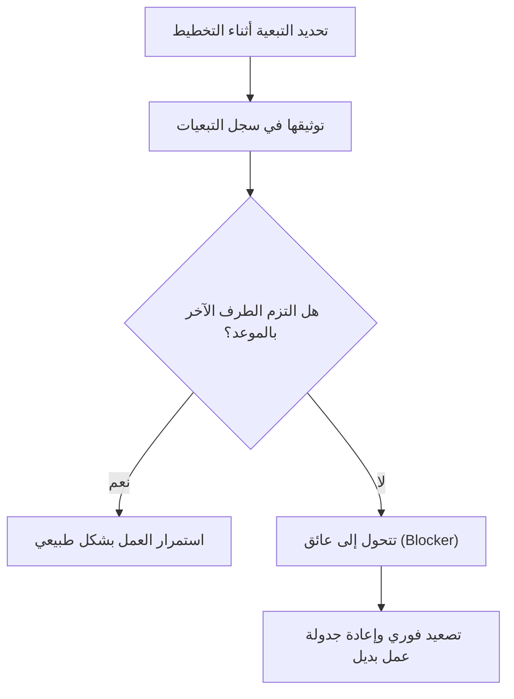

# التبعية (Dependency)
> [!info] تعريف مختصر
> التبعية (Dependency) هي علاقة بين مهمتين أو أكثر بحيث لا يمكن بدء إحداهما أو إنهاؤها إلا بعد اكتمال أو بدء الأخرى. إدارتها الجيدة ضرورية لتجنّب التأخير المفاجئ في المشروع.

## الشرح العلمي والاحترافي
- التبعية تصف ترتيبًا منطقيًا إلزاميًا بين عناصر العمل. من أشهر أنواعها:
  - إنهاء-إلى-بدء (Finish-to-Start): يجب إنهاء المهمة أ قبل بدء المهمة ب (الأكثر شيوعًا).
  - بدء-إلى-بدء (Start-to-Start): يجب أن تبدأ المهمتان معًا أو بترتيب معيّن.
  - إنهاء-إلى-إنهاء (Finish-to-Finish): يجب أن تنتهيا معًا.
- تُقسَّم التبعيات أيضًا إلى: داخلية (بين مهام الفريق نفسه)، وخارجية (فريق آخر، مورّد خارجي، جهة تنظيمية).
- التبعية غير المُدارة تتحوّل إلى عائق فعلي (Blocker) يوقف العمل فعليًا، بينما التبعية المُدارة تكون معروفة ومخطَّطًا لها مسبقًا.
- تحليل التبعيات جزء أساسي من حساب المسار الحرج (Critical Path) في جانت (Gantt Chart)، وأيضًا من سجل المخاطر (Risk Register) لأن التبعية على طرف خارجي تحمل مخاطرة أعلى.
- في الفرق الرشيقة (Agile)، تُكتَب التبعيات صراحة على بطاقات المهام أو في سجل خاص (Dependency Log) ليراها الجميع في الوقفة اليومية (Daily Scrum).

## أين ومتى يُستخدم
- يُحدَّد أثناء تخطيط المشروع (Sprint Planning أو Project Planning) وأثناء تفصيل المهام (Backlog Refinement).
- يُستخدم في رسم مخططات جانت (Gantt Chart) وحساب المسار الحرج (Critical Path Method).
- يُراقَب يوميًا في الاجتماعات القصيرة لتحديد ما إذا تحوّلت تبعية إلى عائق فعلي (Blocker).

## مثال وسيناريو تطبيقي
> [!example] فريق تطوير تطبيق جوّال في شركة "نبض" يعمل على ميزة الدفع الإلكتروني. مهمة "دمج واجهة برمجة تطبيقات (API) بوابة الدفع" لها تبعية على فريق خارجي (مزوّد الدفع) يجب أن يوفر مفاتيح API أولًا. حدّد فريق المشروع هذه التبعية في اجتماع تخطيط السباق، ووضع لها تاريخًا متوقعًا. بعد أسبوع، تأخر المزوّد الخارجي 3 أيام عن الموعد، فتحوّلت التبعية إلى عائق (Blocker) فعلي أوقف عمل مطوّرَين. بفضل التوثيق المسبق، تمكّن الفريق من إعادة جدولة عملهم مؤقتًا على مهام أخرى غير مرتبطة بدلًا من التوقف الكامل.

## خطوات أو مخطّط
1. حدّد كل مهمة تعتمد على مُخرَج مهمة أخرى أو طرف خارجي.
2. صنّف نوع التبعية (داخلية/خارجية) ونوع العلاقة (إنهاء-إلى-بدء وغيرها).
3. سجّل التبعية في سجل مخصص أو على بطاقة المهمة نفسها مع الطرف المسؤول والتاريخ المتوقع.
4. راقب حالتها يوميًا؛ إن تجاوزت الموعد المتوقع، صنّفها فورًا كعائق (Blocker) وصعّدها.
5. خطّط لعمل بديل (Buffer Work) يمكن للفريق الانتقال إليه إذا تعثّرت التبعية.

## ⚠️ مفاهيم خاطئة شائعة
> [!warning]
> - الخلط بين "التبعية" و"العائق (Blocker)": التبعية علاقة مخطَّط لها ومعروفة مسبقًا، بينما العائق مشكلة فعلية توقف العمل الآن غالبًا نتيجة تبعية لم تُدَر جيدًا.
> - الاعتقاد بأن كل التبعيات سلبية؛ بعضها طبيعي وضروري في أي مشروع معقّد، والمهم إدارتها لا إلغاؤها بالكامل.
> - تجاهل التبعيات الخارجية (موردين، فرق أخرى) لأنها "خارج سيطرتنا"، بينما هي غالبًا الأخطر لأنها الأصعب في التحكم بجدولها.

## ❌ ممارسات خاطئة في المشاريع
> [!failure]
> - عدم توثيق التبعيات كتابيًا والاعتماد على الذاكرة أو المحادثات الشفهية؛ الحل: استخدم سجل تبعيات مرئي (مثل عمود مخصص في لوحة المهام أو سجل RAID).
> - اكتشاف التبعية بعد فوات الأوان (أثناء التنفيذ لا التخطيط)؛ الحل: راجع التبعيات المحتملة صراحة في كل جلسة تفصيل المهام (Backlog Refinement).
> - عدم وجود خطة بديلة عند تعثّر تبعية خارجية، ما يوقف الفريق بالكامل؛ الحل: جهّز دائمًا مهامًا احتياطية مستقلة يمكن العمل عليها أثناء الانتظار.

## 🔗 مصطلحات ومفاهيم ذات صلة
[[Blocker]] | [[Critical Path]] | [[Gantt Chart]] | [[Risk Register]] | [[RAID Log]] | [[Bottleneck]] | [[Backlog Refinement]] | [[Buffer]] | [[19 - Risk Management]]
