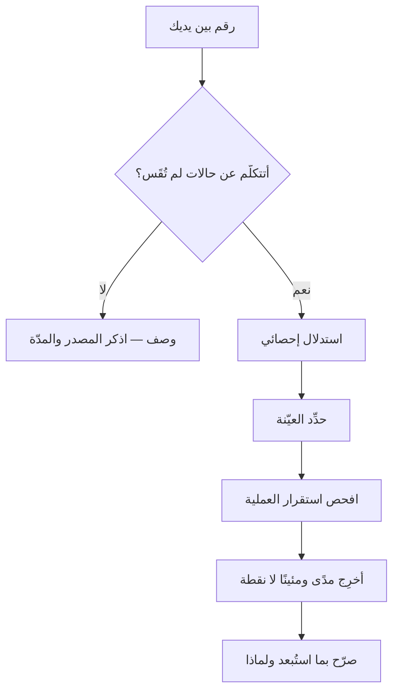

# الإحصاء الوصفي والاستدلالي (Descriptive and Inferential Statistics)

> [!info] تعريف مختصر
> **الإحصاء الوصفي (Descriptive)** يلخّص البيانات التي **بين يديك** ولا يدّعي شيئًا عمّا سواها: متوسّط، ووسيط، ومئينات، وتشتّت، وشكل توزيع. و**الإحصاء الاستدلالي (Inferential)** يستعمل ما بين يديك ليقول شيئًا عمّا **لم ترَه** — عن المجتمع كلّه، أو عن الأسابيع القادمة — ويلزمه لذلك أن يعلن مقدار عدم يقينه. والفرق بينهما ليس في الأدوات بل في **الادّعاء**: فالجملة الواحدة قد تكون وصفًا سليمًا أو استدلالًا متهوّرًا بحسب ما يُقصد بها. و«أنجز الفريق 32 نقطة في السبرنت الماضي» وصفٌ لا يُخطئ؛ و«سرعة الفريق 32 نقطة» **استدلالٌ** لم يُذكر معه شيء ممّا يلزمه.

## الشرح العلمي والاحترافي

### 1. الحدّ الفاصل: أين ينتهي الوصف ويبدأ الادّعاء؟

الحدّ لحظةٌ واحدة يسهل تجاوزها بلا انتباه: **حين تتكلّم عن حالات لم تقسها.**

- ما دمتَ تصف الأربعين مهمّة التي أنجزتها، فأنت في الوصف، ومهما بلغ الرقم من غرابة فهو صحيح لأنه **حساب** لا حكم.
- ومتى قلتَ «مهامّنا تستغرق كذا» أو «سننجز كذا»، فقد عاملتَ الأربعين **عيّنةً** من شيء أكبر — من كل مهامّك الماضية والآتية — وهذا استدلال، ويلزمه ما يلزم الاستدلال.

**وأكثر أخطاء القياس في المشاريع تقع في هذه اللحظة بالذات**: يُحسب رقمٌ حسابًا سليمًا في مرحلة الوصف، ثم يُنقل إلى جملة تخصّ المستقبل بلا أن يُضاف إليه شيء — فيرث ثقة الحساب وهو لم يعد حسابًا.

### 2. ثلاثة شروط لا يصحّ العبور بدونها

من أراد أن يستدلّ من بياناته لزمه أن يُصرّح بثلاثة، وكلّها ممّا يستطيع فريق مشروع فحصه بلا رياضيات:

1. **أن تكون العيّنة ممثِّلة.** فبيانات فريقٍ عمل الربع الماضي على صيانة نظام قديم لا تصف قدرته على بناء نظام جديد. والعيّنة المنحازة لا يصلحها كِبَر الحجم؛ بل يزيدها ثقةً في الجواب الخطأ.
2. **أن تكون العملية مستقرّة.** فالاستدلال يفترض أن ما وَلَّد الأرقامَ الماضية هو الذي سيولّد الآتية. وفريقٌ تبدّل نصفه، أو انتقل إلى منتج آخر، أو تغيّر تعريف اكتماله — عمليته انقطعت، وتاريخه صار عن فريق آخر. وأداة فحص هذا الشرط هي [[Control Chart|مخطط التحكّم]].
3. **أن يُذكر مدًى لا نقطة.** فالاستدلال الذي يُنطق برقم واحد أخفى الشيء الوحيد الذي كان يميّزه عن الوصف. والصيغة السليمة: **«بين كذا وكذا»**، أو «في 85% من الحالات كذا أو أقلّ» — وهو ما تنتجه [[Monte Carlo Simulation|محاكاة مونت كارلو]] و[[Percentiles and Median vs Average|المئينات]].

### 3. جدول التمييز: أتصف أم تستدلّ؟

| وجه المقارنة | الإحصاء الوصفي | الإحصاء الاستدلالي |
|---|---|---|
| **عمّاذا يتكلّم؟** | عن البيانات التي جُمعت وحدها | عن حالات لم تُقَس بعد |
| **ماذا يفعل الفريق به؟** | يلخّص · يقارن · يرسم | يتوقّع · يلتزم · يعمّم |
| **أيمكن أن يخطئ؟** | لا يخطئ إن صحّ الحساب | يخطئ دائمًا بمقدارٍ، والمطلوب إعلانه |
| **ما الذي يلزم ذكره معه؟** | مصدر البيانات ومدّتها | العيّنة · افتراض الاستقرار · المدى |
| **صيغته السليمة** | «كان» | «يُتوقَّع، بين … و…» |

> **السؤال الفارق:** الوصف يجيب عن **«ماذا حدث؟»**، والاستدلال عن **«وماذا يُتوقَّع أن يحدث؟»**. فمتى وجدتَ نفسك تعِد أحدًا بشيء اعتمادًا على رقم، فقد استدللتَ — سمّيتَ ذلك أم لم تسمّه.

### 4. لماذا يهمّ هذا الفصل في المشاريع خاصّةً؟

لأن أثمن الأرقام في المشاريع أرقامٌ **يُستدلّ بها ولا يُعلَن أنها استدلال**: السرعة، وزمن الدورة، والإنتاجية، ونسبة العيوب. وكلّها تُعرض في لوحات بوصفها وقائع، ثم تُبنى عليها التزامات تجاه أطراف خارجية. فالضرر ليس في الرقم بل في **تجريده من مداه**: الفريق الذي يقول «ننجز عشر مهامّ أسبوعيًّا» قد يكون صادقًا في وصفه ومخطئًا في وعده، لأن العشر كانت وسيطًا لمدًى يمتدّ من أربعٍ إلى ستّ عشرة.

> [!info] إضافة مرجعية — «الاستدلال» هنا `Statistical Inference`
> يعتمد هذا المستودع «**الاستدلال**» مقابلًا لـ`Inference` بمعنى تشغيل النموذج في باب الذكاء الاصطناعي. والمقصود هنا مفهوم آخر لا صلة له به: **الاستدلال الإحصائي** — التعميم من عيّنة إلى مجتمع. ولهذا يُذكر اللفظ في هذه الصفحة مقيَّدًا بوصفه («الاستدلال الإحصائي») حيث يُخشى اللبس، ولا يُترك مطلقًا.

## أين ومتى يُستخدم

- عند عرض أي رقم على أصحاب المصلحة، بأن يُسأل قبل عرضه: **أهذا وصفٌ لما مضى، أم وعدٌ عمّا يأتي؟**
- في التقدير والتنبّؤ بموعد الإنجاز، حيث يُبنى الالتزام على مدًى ومئين لا على متوسّط ([[Estimation Variance]]).
- في قراءة نتائج [[AB Testing|اختبار أ/ب]]، فالفرق الظاهر بين نسختين وصفٌ، ودلالته على السلوك المستقبلي استدلالٌ له شروطه ([[Statistical Significance]]).
- في مراجعة الجودة، للتمييز بين «ارتفعت العيوب هذا الشهر» (وصف) و«جودتنا تتدهور» (استدلال يحتاج سلسلة لا نقطتين — انظر [[Trend Analysis]]).
- عند استعمال [[Base Rate|معدّل الأساس]]، فهو استدلال معلن الشروط: فئة مرجعية مصرَّح بها، وتوزيعة لا رقم.

## مثال وسيناريو تطبيقي

> [!example] سيناريو ملموس
> فريق أنهى ستّة سبرنتات بالنقاط: **28 · 35 · 31 · 12 · 34 · 32**.
>
> **الوصف الصحيح:** المتوسّط 28.7، والوسيط 31.5، والمدى من 12 إلى 35. وسبرنت الاثني عشر وقع في أسبوع إجازة رسمية.
>
> **الاستدلال المتهوّر:** «سرعتنا 29 نقطة، فالمتبقّي 174 نقطة يكتمل في ستّة سبرنتات.» — وهذه جملة أخذت متوسّطًا تجرّه إلى الأسفل حالةٌ لها سبب معروف، ثم ضربته في المستقبل بلا مدى.
>
> **الاستدلال المنضبط:** يُستبعد سبرنت الإجازة **بتصريح** لا صمتًا، لأن سببه خاصّ لا يتكرّر (وهو ما يسمّيه [[Control Chart|مخطط التحكّم]] «سببًا خاصًّا»). فتصير الخمسة الباقية 28–35، والوسيط 32. فيقال: **«يُتوقَّع أن يكتمل المتبقّي بين خمسة سبرنتات وسبعة، وأقرب التقديرين إلى الالتزام سبعة.»**
>
> والفرق بين الجملتين ليس دقّة حساب، بل أن الثانية **تُعلن ما لا تعرفه**، فتترك للمدير الذي يخطّط بها مجالًا للاحتياط. والأولى تُخفيه، فتُنتج خطّةً بلا احتياط.

## خطوات أو مخطّط

1. اكتب الجملة التي تنوي قولها بالرقم.
2. اسأل: **أفيها حالات لم أقسها؟** فإن كان لا، فهي وصف — واكتفِ بأن تذكر مصدر البيانات ومدّتها.
3. فإن كان نعم، فحدّد **العيّنة**: أي بيانات بالضبط استندتَ إليها، وكم مدّتها.
4. افحص **الاستقرار**: أوقع في المدّة تغيّرٌ في الفريق أو المنتج أو تعريف الاكتمال؟ فما قبل التغيّر لا يُضمّ إلى ما بعده بلا تنبيه.
5. أخرِج **مدًى** لا نقطة، وسمِّ المئين الذي تلتزم عنده.
6. صرّح بما استبعدتَه ولماذا — فالاستبعاد الصامت هو الفرق بين التحليل والتزيين.

## ⚠️ مفاهيم خاطئة شائعة

> [!warning]
> - **الظنّ أن الإحصاء الوصفي «بسيط» والاستدلالي «متقدّم».** الفرق فرق ادّعاء لا فرق صعوبة: أكثر أخطاء المشاريع تقع في استدلالٍ حسابُه بدائيّ — متوسّطٌ ضُرب في عدد الأسابيع.
> - **حسبان أن كثرة البيانات تُغني عن السؤال عن تمثيلها.** فالعيّنة المنحازة لا يصلحها الحجم؛ بل تزداد بها ثقتك في نتيجة خاطئة.
> - **الظنّ أن الاستدلال يحتاج عيّنة عشوائية دائمًا.** في المشاريع نستدلّ غالبًا من **سلسلة زمنية** لا من عيّنة عشوائية، وشرطها الحاكم ليس العشوائية بل **الاستقرار**: أن يكون ما وَلَّد الماضي هو ما سيولّد الآتي.
> - **الخلط بين «لم يظهر فرق» و«لا فرق».** وهذا استدلال معكوس: انتفاء الدليل ليس دليل الانتفاء، وقد يكون سببه صِغَر ما قِيس لا انعدام الأثر.

## ❌ ممارسات خاطئة في المشاريع

> [!failure]
> - **عرض متوسّط بلا تشتّت** في لوحة تُتَّخذ عليها قرارات. فالمتوسّط وحده يخفي أخطر ما في البيانات: أن نصف الحالات بعيد عنه.
> - **استبعاد القيم الشاذّة صمتًا** حتى تستقيم الصورة. والاستبعاد قد يكون صحيحًا — لكنه قرارٌ يُعلَن سببه، لا تنظيفٌ يُجرى في الخلفية.
> - **الالتزام بمتوسّط أمام جهة خارجية.** فالمتوسّط يُخلَف نصف المرّات بحكم تعريفه، والالتزام يُبنى على مئين مرتفع.
> - **مقارنة فترتين مختلفتين في الطول أو الظرف** ثم إعلان تحسّن أو تدهور — وهو استدلال بلا شرط الاستقرار، وأشيع صوره مقارنة شهرٍ فيه إجازة بشهرٍ ليس فيه.

## 🔗 مصطلحات ومفاهيم ذات صلة

[[Percentiles and Median vs Average]] | [[Statistical Significance]] | [[Trend Analysis]] | [[Anomaly Detection]] | [[Control Chart]] | [[Monte Carlo Simulation]] | [[Base Rate]] | [[Estimation Variance]] | [[Correlation vs Causation]] | [[Cycle Time]] | [[Throughput]] | [[Vanity Metrics]] | [[AB Testing]]
