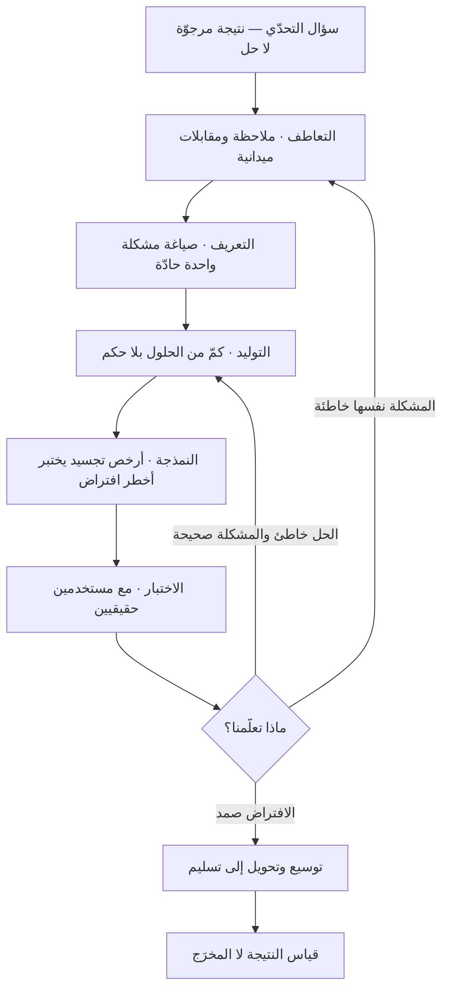

# التفكير التصميمي (Design Thinking)

> [!info] تعريف مختصر
> منهج لحلّ المشكلات يستعير طريقة عمل المصمّمين ويطبّقها على مسائل ليست تصميمية بالضرورة: خدمات، وعمليات، وسياسات، ونماذج أعمال. جوهره ثلاثة تحوّلات: الانطلاق من **فهم الإنسان المستخدم** لا من القدرات التقنية، و**تأجيل الحل** حتى تُعاد صياغة المشكلة نفسها، و**التعلّم بالصنع** عبر نماذج أوّلية رخيصة تُختبر مع بشر حقيقيين بدل الجدال المكتبي. صيغته الشائعة خمس مراحل: التعاطف، والتعريف، وتوليد الأفكار، والنمذجة، والاختبار — وهي مراحل **متكرّرة ومتداخلة** لا خطية. وهو من أكثر المناهج انتشارًا في العقدين الأخيرين، وأيضًا من أكثرها تعرّضًا لنقد منشور جادّ يستحقّ أن يُعرف قبل تبنّيه.

## الشرح العلمي والاحترافي
- **الجذور الفكرية قبل الاسم التجاري**: الفكرة أقدم بكثير من انتشارها في عالم الأعمال. أرسى **هربرت سايمون (Herbert Simon)** في كتابه *The Sciences of the Artificial* عام ١٩٦٩ تصوّرًا للتصميم بوصفه علمًا لتحويل «الأوضاع القائمة إلى أوضاع مفضّلة». وأدخل **هورست ريتِل (Horst Rittel)** و**ملفن ويبر (Melvin Webber)** عام ١٩٧٣ مفهوم **«المشكلات الشرّيرة» (Wicked Problems)** — وهي مشكلات لا صياغة نهائية لها ولا حل صحيح/خاطئ بل حل أفضل/أسوأ، ولا يمكن فهمها إلا بمحاولة حلّها. ثم بحث منظّرون مثل **براين لوسون (Bryan Lawson)** و**نايجل كروس (Nigel Cross)** في «كيف يفكّر المصمّمون فعلًا»، ونشر **بيتر راو (Peter Rowe)** عام ١٩٨٧ كتابًا بعنوان *Design Thinking* في سياق العمارة والتخطيط العمراني.
- **الأصل المؤسّسي للصيغة الشائعة**: الصيغة التي انتشرت في الشركات ترجع أساسًا إلى شركة التصميم الأمريكية **IDEO** وإلى **مدرسة ستانفورد للتصميم** المعروفة اختصارًا بـ**d.school** (واسمها الرسمي معهد هاسو بلاتنر للتصميم)، التي تأسّست عام ٢٠٠٥ بمبادرة من **ديفيد كيلي (David Kelley)** — مؤسّس IDEO نفسه. وأسهم **تيم براون (Tim Brown)**، الرئيس التنفيذي لـIDEO آنذاك، في تعميم المصطلح على جمهور الإدارة عبر مقالته في *Harvard Business Review* عام ٢٠٠٨ وكتابه *Change by Design* عام ٢٠٠٩. أي أن التفكير التصميمي بصيغته الرائجة **منتج تعليمي واستشاري** بقدر ما هو منهج بحثي — وهذه حقيقة مهمّة لفهم كل من انتشاره ونقده.
- **المراحل الخمس ووظيفة كل منها**:
  1. **التعاطف (Empathize)**: بناء فهم أوّلي مباشر للمستخدم عبر الملاحظة الميدانية والمقابلات وعيش السياق — لا عبر الاستبيانات وحدها. الأدوات المتّصلة: [[User Interview]] و[[The Mom Test]] و[[Voice of the Customer]] و[[Gemba Walk]].
  2. **التعريف (Define)**: تكثيف ما جُمع في **صياغة مشكلة** واحدة حادّة ومركّزة على المستخدم لا على الحل ([[Problem Statement]]). هذه أهمّ المراحل وأكثرها تخطّيًا في التطبيق العملي.
  3. **توليد الأفكار (Ideate)**: توسيع فضاء الحلول كمًّا قبل الحكم، بقاعدة صريحة تفصل التوليد عن النقد، بحثًا عن كمّ يفتح خيارات غير بديهية.
  4. **النمذجة (Prototype)**: بناء تجسيد ملموس بأرخص وسيلة ممكنة — ورق، أو شاشة صمّاء، أو خدمة يؤدّيها بشر يدويًّا خلف الكواليس ([[Concierge MVP]]) — بهدف **التعلّم** لا الإبهار ([[Prototype]] و[[Wireframe]]).
  5. **الاختبار (Test)**: عرض النموذج على مستخدمين حقيقيين ورصد سلوكهم لا آرائهم، ثم العودة إلى أي مرحلة سابقة بحسب ما تعلّمناه.
- **المبدأ التشغيلي الأهم: التباعد ثم التقارب**: كل مرحلة إمّا توسّع فضاء الاحتمالات (تباعد) أو تضيّقه (تقارب)، والخطأ الأكبر خلط النمطين في اللحظة نفسها. هذه البنية بالضبط هي ما تصوّره **[[Double Diamond]]** بشكل بصري صريح.
- **الفشل المبكر الرخيص**: القاعدة الاقتصادية الكامنة خلف المنهج هي أن تكلفة تغيير الفكرة تتصاعد أُسّيًّا كلما تأخّر اكتشاف الخطأ ([[Cost-of-Change Curve]]). لذلك يُستثمر في النماذج الرخيصة القابلة للرمي، ويُعدّ إسقاط فكرة بعد اختبار من ثلاثة أيام **نجاحًا** لا فشلًا ([[Intelligent Failure]]).
- **النقد المنشور — وهو نقد جادّ لا تشكيك عابر**: تعرّض التفكير التصميمي منذ منتصف العقد الثاني من الألفية لموجة نقد أكاديمي ومهني معتبَر، وأبرز محاوره:
  1. **التسطيح والتحوّل إلى طقوس**: اختُزل المنهج في كثير من الشركات إلى ورشة من يومين وأوراق لاصقة ملوّنة وصور جماعية، تنتهي بلا أي تغيير في تخصيص الموارد أو خارطة الطريق. أي أن الشكل انتقل والمضمون لم ينتقل — وهو نقد يوجّهه ممارسون داخل مجال التصميم نفسه قبل خصومه.
  2. **ادّعاء الصلاحية الشاملة**: يُسوَّق أحيانًا بوصفه منهجًا يصلح لكل مشكلة، من تصميم تطبيق إلى إصلاح التعليم والفقر. والاعتراض أن مشكلات النظم الكبرى تحكمها بنى سلطة وموارد وتشريعات، لا تُحلّ بتعاطف قصير المدى مع أفراد. وقد نشرت *Harvard Business Review* عام ٢٠١٨ مقالًا للأكاديمية **نتاشا إسكندر (Natasha Iskander)** بعنوان صريح مؤدّاه أن التفكير التصميمي محافظ في جوهره ويميل إلى **الحفاظ على الوضع القائم**، لأنه يعالج الأعراض داخل الإطار القائم بدل مساءلة الإطار نفسه.
  3. **ضعف الأدلّة على الأثر المؤسّسي**: لا يوجد جسم متين من الدراسات المضبوطة يثبت أن تبنّي المنهج يرفع أداء المؤسسات بمقدار قابل للقياس ومعزول عن العوامل الأخرى. أغلب ما يُستشهد به دراسات حالة رواها من يبيع الخدمة نفسها — وهو نمط استدلال ضعيف. وقد كتب الباحث **لي فينسل (Lee Vinsel)** نقدًا لاذعًا وشهيرًا عام ٢٠١٧ وصف فيه الرواج التعليمي للمنهج بأنه ادّعاء متضخّم يفوق ما يقدّمه فعلًا.
  4. **تهميش الخبرة التخصّصية**: افتراض أن أي فريق يستطيع، بعد ورشة، أن يصمّم حلًّا في مجال يتطلّب عمقًا هندسيًّا أو طبّيًّا أو تنظيميًّا. تُنتج هذه الفرضية أفكارًا جذّابة بصريًّا وغير قابلة للتنفيذ.
  5. **التعاطف المزعوم**: زيارة ميدانية قصيرة لا تولّد فهمًا حقيقيًّا لحياة الناس، وقد تولّد ثقة زائفة أخطر من الجهل الصريح، خصوصًا حين يُصمَّم لفئات يختلف سياقها اختلافًا جذريًّا عن سياق الفريق المصمِّم.
  6. **حادثة الشركة الرائدة نفسها**: أعلنت IDEO — الشركة التي روّجت المنهج — تقليصات كبيرة في القوى العاملة وإغلاق مكاتب خلال عام ٢٠٢٣، وهو ما فتح في أوساط التصميم نقاشًا علنيًّا حول حدود نموذج «الاستشارة التصميمية» ومدى قابلية المنهج للتسليع.
  والخلاصة العملية من هذا النقد ليست رفض المنهج، بل استعماله **حيث يصلح**: مشكلات يكون فيها فهم المستخدم هو القيد الحاكم، مع الوعي بأنه لا يعالج قيود السلطة والموارد والتشريع، ولا يغني عن العمق التخصّصي ولا عن الجدوى الاقتصادية.

## أين ومتى يُستخدم
- **في [[Product Discovery]] وبداية أي مبادرة غامضة المشكلة**: حين يكون السؤال «ما المشكلة أصلًا؟» لا «كيف ننفّذ الحل المتّفق عليه؟».
- **في إعادة تصميم رحلة خدمة متعثّرة**: بالتزامن مع [[User Journey Map]] و[[User Flow]] لرصد نقاط التسرّب الحقيقية ([[Pain Point]]).
- **في مسار الاكتشاف داخل [[Dual-Track Agile]]**: بوصفه المحرّك المنهجي لمسار الاكتشاف الذي يغذّي مسار التسليم بعناصر مثبتة القيمة.
- **في ورش المواءمة بين إدارات متنازعة**: النموذج الأوّلي الملموس يحسم خلافات لفظية استمرّت أشهرًا، لأن الجدال ينتقل من التصوّرات إلى شيء مرئي.
- **قبل الالتزام بميزانية كبيرة**: لتقليص المخاطرة عبر [[Fake Door Test]] و[[Proof of Concept]] بدل بناء الحل كاملًا على افتراض غير مختبَر.
- **في المشكلات المركّبة تحديدًا**: يتطابق منطقه (جرّب ← استشعر ← استجب) مع المجال المركّب في [[Cynefin]]؛ وهو بالمقابل **مُسرِف وغير ملائم** في المشكلات الواضحة التي لها إجراء موثّق معروف.

## مثال وسيناريو تطبيقي
> [!example] بنك خليجي يعاني من ارتفاع كلفة فتح الحسابات للشركات الصغيرة. الرقم الابتدائي: متوسّط زمن فتح الحساب ١٩ يوم عمل، ونسبة الطلبات التي تُستكمل من أول مرة ٣٤٪، وعدد مكالمات مركز الاتصال المرتبطة بحالة الطلب ٧٤٠ مكالمة أسبوعيًّا. القرار الأوّلي للإدارة كان بناء بوّابة رقمية جديدة بميزانية ٦ ملايين ريال.
> قبل اعتماد الميزانية، أُجريت دورة تفكير تصميمي مدّتها ستة أسابيع:
> **التعاطف** — جلس فريق من ٥ أشخاص مع ٢٢ صاحب منشأة صغيرة، ورافقوا ٩ منهم فعليًّا أثناء تجهيز أوراقهم، وقضوا يومين في فرعين يراقبون موظّفي الاستقبال ([[Gemba Walk]]).
> **الاكتشاف المفصلي**: التأخير الأكبر لم يكن في النظام المصرفي بل في **مرحلة سابقة عليه**: أصحاب المنشآت لا يعرفون أي مستندات مطلوبة بدقّة لحالتهم تحديدًا، فيأتون بأوراق ناقصة، فيُردّون، فيعودون بعد أيام. من أصل متوسّط ١٩ يومًا، كان ١١ يومًا في المتوسّط يقع **قبل** أول لمسة للنظام.
> **التعريف** — أُعيدت صياغة المشكلة من «بوّابتنا الرقمية بطيئة» إلى: «صاحب منشأة صغيرة لا يعرف يقينًا ما المطلوب منه بالضبط في حالته، فيدخل دورة رفض وإعادة تكلّفه أيامًا وتكلّفنا مكالمات».
> **التوليد والنمذجة** — وُلّدت ٣١ فكرة، اختير منها ثلاث للنمذجة. النموذج الفائز لم يكن نظامًا: كان **قائمة تحقّق مخصّصة** من صفحة واحدة تُولَّد بعد ٦ أسئلة، جُرّبت في أسبوعها الأول بنموذج ورقي وموظّف يملؤها يدويًّا لـ٤٠ عميلًا.
> **الاختبار** — في المجموعة التجريبية (٤٠ عميلًا) ارتفعت نسبة الاكتمال من أول مرة إلى ٧١٪، وانخفض متوسّط الزمن إلى ٨ أيام.
> النتيجة: أُعيد تحجيم المشروع من بوّابة بـ٦ ملايين إلى أداة تشخيص مستندات مدمجة بتكلفة ٦٥٠ ألف ريال، مع تأجيل بقيّة البوّابة إلى ما بعد قياس الأثر. الأهم أن المنهج لم يخترع الحل من العدم — بل **منع بناء الحل الخطأ**، وهذه هي مساهمته الأصدق.

## خطوات أو مخطّط
1. حدّد سؤال التحدّي بصيغة مفتوحة تركّز على النتيجة المرجوّة للمستخدم، لا على حل مقترح.
2. اجمع فهمًا ميدانيًّا مباشرًا: ملاحظة في الموقع، ومقابلات سلوكية عن وقائع حدثت، لا عن تفضيلات متخيّلة.
3. حلّل ما جمعته بحثًا عن الأنماط والتوتّرات والمفارقات — خصوصًا الفجوة بين ما يقوله الناس وما يفعلونه.
4. أعد صياغة المشكلة في جملة واحدة حادّة، واعرضها للنقض قبل المضي.
5. ولّد كمًّا كبيرًا من الحلول مع فصل صارم بين التوليد والحكم.
6. اختر ٢–٣ اتجاهات متباينة عمدًا، لا ثلاث نسخ من فكرة واحدة.
7. ابنِ أرخص نموذج يختبر **أخطر افتراض** ([[Assumption Mapping]])، لا أجمل نموذج.
8. اختبر مع ٥–٨ مستخدمين حقيقيين لكل اتجاه، وسجّل السلوك والعثرات لا التعليقات المجاملة.
9. قرّر صراحةً: تطوير، أو تحوير، أو إسقاط — ووثّق القرار وسببه في [[Decision Log]].
10. كرّر الدورة، وحوّل ما ثبت إلى عناصر تسليم مربوطة بمقياس نتيجة لا بمقياس إنتاج ([[Outcome vs Output]]).

## ⚠️ مفاهيم خاطئة شائعة
> [!warning]
> - **الظنّ بأنه عملية خطّية من خمس خطوات**: المراحل الخمس تمثيل تعليمي مبسّط. الممارسة الفعلية دورانية وفوضوية: قد تعود من الاختبار إلى التعاطف مباشرة، وقد تكتشف أثناء النمذجة أن صياغة المشكلة نفسها خاطئة.
> - **اعتباره مرادفًا لتصميم واجهات المستخدم**: هو منهج لحلّ المشكلات يُطبَّق على خدمات وعمليات وسياسات وحتى هياكل تنظيمية. أمّا تصميم الواجهة فحرفة تخصّصية مستقلّة، والخلط بينهما يُنقص من قدر الاثنين معًا.
> - **الظنّ بأنه يصلح لكل مشكلة**: هذا بالضبط ما يستهدفه النقد المنشور. في المشكلات ذات الحل المعروف والموثّق يكون المنهج إسرافًا في الوقت؛ وفي مشكلات النظم الكبرى التي تحكمها الموارد والتشريعات والسلطة قد يكون تسطيحًا مضلّلًا يوهم بالتقدّم.
> - **اعتبار «التعاطف» شعورًا لطيفًا**: التعاطف هنا **إجراء بحثي منضبط** غايته استخراج سياق ودوافع لا يصرّح بها المستخدم، ويُقاس بجودة ما اكتُشف لا بدفء الجلسة.
> - **الظنّ بأن الأدلّة على فاعليته حاسمة**: القاعدة التجريبية المنشورة لأثره المؤسّسي المعزول أضعف بكثير مما يُوحي به رواجه. الاستخدام المهني الرشيد يقول: إنه أسلوب معقول لتقليل مخاطر بناء الحل الخطأ، لا وصفة مضمونة لرفع الأداء.
> - **أن النموذج الأوّلي مسوّدة من المنتج**: النموذج الأوّلي **سؤال مُجسَّد** لا نسخة مبكّرة. مقياس جودته أن يحسم افتراضًا بأسرع وأرخص طريقة، ثم يُرمى بلا أسف.

## ❌ ممارسات خاطئة في المشاريع
> [!failure]
> - **الاكتفاء بورشة معزولة**: الخطأ → يومان من الأوراق اللاصقة ثم العودة إلى خارطة الطريق القديمة كما هي. لماذا يضرّ → يستهلك وقت القيادة ويولّد سخرية داخلية من المناهج كلها لأن شيئًا لم يتغيّر. الحل → اربط الورشة سلفًا بقرار تمويل: ما الذي سيُموَّل أو يُوقَف بناءً على مخرجاتها؟
> - **تخطّي مرحلة التعريف**: الخطأ → القفز من المقابلات إلى العصف الذهني مباشرة. لماذا يضرّ → تُولَّد حلول لمشكلة غير محدّدة، فيستحيل الحكم على أيّها أفضل لغياب المعيار. الحل → اجعل [[Problem Statement]] المكتوبة بوّابة عبور إلزامية لا يُبدأ التوليد قبلها.
> - **النمذجة بجودة إنتاجية عالية**: الخطأ → صرف ستة أسابيع على نموذج شديد الإتقان. لماذا يضرّ → يجعل الفريق متعلّقًا بالنموذج فيقاوم النقض ([[Sunk Cost Fallacy]])، ويحوّل الاختبار إلى استعراض بدل تعلّم. الحل → اضبط سقفًا زمنيًّا صارمًا للنموذج ([[Timeboxing]]) وابدأ بالورق.
> - **اختبار بسؤال المستخدم عن رأيه**: الخطأ → «هل يعجبك هذا؟». لماذا يضرّ → المجاملة تولّد إشارة زائفة تُبنى عليها قرارات خاطئة. الحل → كلّف المستخدم بمهمّة حقيقية وراقب أين يتعثّر، والتزم بمبادئ [[The Mom Test]].
> - **تشكيل الفريق من التصميم وحده**: الخطأ → عزل الهندسة والامتثال والعمليات عن الدورة. لماذا يضرّ → تخرج أفكار جميلة تصطدم لاحقًا بقيود تقنية أو تنظيمية فتُهدر الدورة كلها. الحل → فريق متعدّد التخصّصات من اليوم الأول ([[Cross-functional Team]])، بمن فيهم من سيبني ومن سيوافق.
> - **إسقاط قيود الجدوى من الحساب**: الخطأ → اختيار الحل الأكثر إلهامًا للمستخدم بلا فحص تكلفة أو نموذج ربح. لماذا يضرّ → يولّد مبادرات محبوبة وغير قابلة للاستدامة ماليًّا. الحل → افحص كل اتجاه على ثلاثة محاور معًا: مرغوبية للمستخدم، وجدوى تقنية، وقابلية اقتصادية عبر [[Business Model Canvas]].
> - **تجاهل من سينفّذ الحل يوميًّا**: الخطأ → قصر التعاطف على العميل النهائي وإهمال الموظّف الذي سيشغّل الخدمة. لماذا يضرّ → تصميم يبدو ممتازًا للعميل ويستحيل تشغيله على الخط الأمامي، فيُلتَفّ عليه بحلول جانبية تُفسده. الحل → اعتبر الموظّف مستخدمًا من الدرجة الأولى وأدرجه في البحث والاختبار.

## 🔗 مصطلحات ومفاهيم ذات صلة
[[Double Diamond]] | [[Cynefin]] | [[SCAMPER]] | [[Six Thinking Hats]] | [[Product Discovery]] | [[Problem Statement]] | [[Prototype]] | [[User Interview]] | [[The Mom Test]] | [[User Journey Map]] | [[Assumption Mapping]] | [[Lean Startup]] | [[Business Model Canvas]] | [[Cost-of-Change Curve]]
