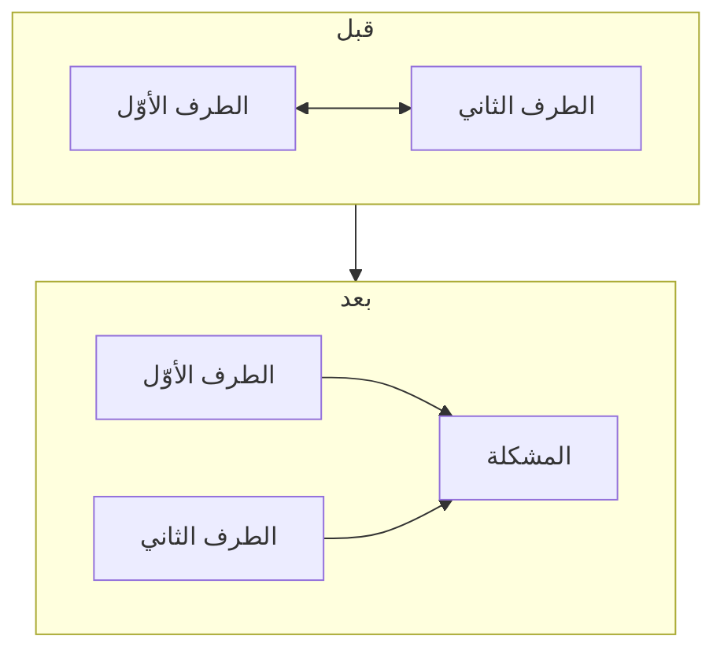

# استراتيجية الإزاحة (Displacement Strategy)
> [!info] تعريف مختصر
> الإزاحة إجراء من أربع خطوات لحلّ صراع بين طرفين، غايته **تغيير هندسة الموقف**: نقل الطرفين من التقابل وجهًا لوجه إلى التجاور أمام المشكلة بوصفها طرفًا ثالثًا يُواجَه معًا.

## الشرح العلمي والاحترافي
المفهوم امتداد عملي لمبدأ **«افصل الناس عن المشكلة»** — أوّل مبادئ *Getting to Yes* لفيشر ويوري (1981). والفرق أنّ هارفارد يفترض طرفين قادرين على الفصل بوعي، **والإزاحة تفترض العكس**: طرفان في حالة استثارة تمنع الفصل — فتجعل الفصل **إجراءً** لا مبدأً يُوصى به.

**والخطوات الأربع:**

| # | الخطوة | الأداة | معيار الانتقال |
|---|---|---|---|
| ① | **كسر الهجوم الشخصي** | [[Labeling\|تسمية]] · [[Mirroring\|مرآة]] · [[Accusation Audit\|تدقيق اتّهام]] | انخفضت الحدّة وبدأ يُفصّل |
| ② | **نقله إلى خندقك** | لغة «نحن» + تأطير المشكلة طرفًا ثالثًا | صار يتكلّم عن المشكلة لا عنك |
| ③ | **المستقبل لا الماضي** | [[Calibrated Questions\|أسئلة معايرة]] | ظهرت خيارات قابلة للتنفيذ |
| ④ | **الإغلاق** | شكر + **مسؤوليات وخطوات ومراجعة** | مكتوب ومُتّفق عليه |

**والخطوة الثالثة ليست نصيحة أسلوبية بل نتيجة عصبية:** اللوم يستدعي تحديد المسؤول فيُنتج تهديد مكانة ويرفع الكورتيزول، فتتراجع القدرات نفسها التي يحتاجها الحلّ. أمّا الحديث عن المستقبل فلا يُهدّد أحدًا فيُبقي المعالجة الاستدلالية عاملة.

**وموقعها في شبكة توماس–كيلمان** هو نمط **التعاون** (حزم عالٍ + تعاون عالٍ) — انظر [[Thomas-Kilmann Conflict Modes]].

## أين ومتى يُستخدم
- صراع معلن بين عضوين أو قسمين (تطوير ضدّ ضبط جودة · قائد فريق ضدّ مالك منتج).
- خلاف بينك وبين عميل أو صاحب مصلحة تريد أن يستمرّ بعده التعاون.
- كلّ موقف يكون فيه استمرار العلاقة جزءًا من النتيجة المطلوبة.

## مثال وسيناريو تطبيقي
> [!example] في تخطيط السبرنت، أمام سبعة أشخاص، يصرخ قائد الفريق التقني: «أنت لا تفهم كيف يُدار هذا الكون — هذا الطلب انتحار تقني»، فيردّ مالك المنتج: «هذه هي الأعمال ولا بدّ من تنفيذها وإلّا فشل السبرنت.» **①** إخراجهما بلا إحراج: «نقطة تستحقّ وقتًا أطول ممّا لدينا — نُكمل البنود ونأخذها بعد الاجتماع.» **②** جملة افتتاحية محايدة في الغرفة المغلقة: «أعلم أنّنا الثلاثة نريد الشيء نفسه: تسليمًا لا نندم عليه.» ثم وصف **وظيفة** كلّ موقف لا نيّة صاحبه: «كلٌّ منكما يحمي شيئًا حقيقيًّا — التقدير يحمينا من تسليم لا يعمل، والموعد يحمينا أمام العميل. والاثنان لازمان.» **③** «فكيف نحمي الاثنين في هذا السبرنت؟» **④** بند إجرائي + «وما الذي نُغيّره كي لا يتكرّر؟» + شكر. **وبعد يومين — لا في اليوم نفسه — اجتماعان فرديّان.**

## خطوات أو مخطّط
1. أخرج الطرفين من الاجتماع الجماعي — لمنع انتشار الاستثارة ولمنع اصطفاف الشهود.
2. ابدأ بجملة محايدة تُوحّد الصفّ بلا تصريح بخطأ أحد.
3. صف **وظيفة** موقف كلّ طرف لا نيّته — ادّعاء النيّة يسقط إن كان مُختلَقًا.
4. انتقل إلى «كيف نصل إلى…؟».
5. أغلِق بخطّة: من · ماذا · متى · وتاريخ مراجعة.
6. **الاجتماعات الفردية بعد يوم أو يومين** — لا أثناء الصراع.

## ⚠️ مفاهيم خاطئة شائعة
> [!warning]
> - **«الصراع لا ينتهي بابتسامة.»** الاجتماع الودّي يُنهي **الحالة** ولا يُنهي **السبب**؛ والصراع الذي أُغلِق بلا خطّة عمل **لم ينتهِ بل صار غير مرئيّ** وسيعود خلال أسابيع بسبب آخر.
> - **الحياد المُدَّعى يُكتشَف.** في معظم صراعات العمل أنت لست محايدًا — لك رأي فنّي ومصلحة. **وإعلان موقعك يحفظ المصداقية أكثر من ادّعاء الحياد**: «لن أُخفي أنّ لي رأيًا وسأذكره بعد أن أسمع منكما.»
> - **«المستقبل لا الماضي» قاعدة لجلسة الإزاحة لا مبدأ إداري عامّ.** من يُعمّمها يُنتج منظّمة لا يُحاسَب فيها أحد؛ والماضي يُستدعى في الاجتماع الاستعادي وبصيغة نظامية.

## ❌ ممارسات خاطئة في المشاريع
> [!failure]
> - **اجتماعان فرديّان أثناء الصراع** — كارثة: كلّ طرف يفترض أنّك تُنسّق مع الآخر ضدّه، ويُفسّر إنصافك للثاني تحيّزًا.
> - **إدارة صراع بلا سلطة تُمكّنك منه** — الخطوات تفترض صلاحية إخراج الطرفين وإلزامهما بخطّة ومراجعة. ومن يفتقر إليها بديله أن **يصف الأثر النظاميّ** لمن يملك القرار بلغة الأثر لا الأشخاص.
> - **خطّة بلا آلية متابعة** — كلّ جلسة تنتهي بخطّة لا تُنفَّذ تُخفّض قابلية الفريق للمشاركة في الجلسة التالية، حتى يصير الحلّ نفسه مصدر سخرية. الحل: خطوة صغيرة تُنفَّذ فعلًا خير من خمس طموحة تموت في محضر.
> - **تكرار الإجراء على صراع لا يستجيب** — إن فشلت جلستان كاملتان، فالمشكلة إمّا **حِمل نظاميّ** (انظر [[Capacity]] و[[Flow Load]]) وإمّا سلوك يستدعي مسارًا آخر (توجيه · نقل · استبعاد).

## 🔗 مصطلحات ومفاهيم ذات صلة
[[Thomas-Kilmann Conflict Modes]] | [[Labeling]] | [[Calibrated Questions]] | [[Accusation Audit]] | [[Task vs Relationship Conflict]] | [[Psychological Safety]] | [[Team Working Agreement]] | [[Facilitator]] | [[Blameless Postmortem]]

> [!tip] 💡 إثراء عملي — كورس لعبة العقل
> الخطوات الأربع بالنصّ، والجملة الافتتاحية المحايدة، وبروتوكول الإغلاق الكامل: [[08 - الإزاحة والأسئلة المعايرة]].
