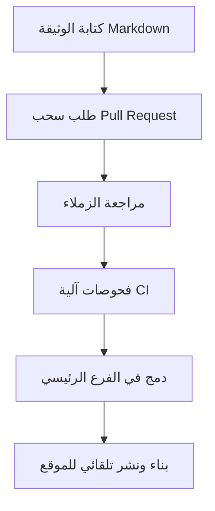

# التوثيق كالكود (Docs as Code)

> [!info] تعريف مختصر
> التوثيق كالكود (Docs as Code) هو نهج يُعامل فيه توثيق المنتج والمشروع بنفس الأدوات والعمليات المستخدمة في كتابة الكود البرمجي: تُكتب الوثائق بصيغة نصية (مثل Markdown)، وتُحفظ في نظام التحكم بالإصدارات (Git)، وتمر بمراجعة (Code Review) وبناء واختبار آليّين قبل نشرها.

## الشرح العلمي والاحترافي
- الفكرة الأساسية: بدلاً من كتابة الوثائق في برامج معالجة نصوص منفصلة (Word) أو أنظمة ويكي معزولة يصعب تتبع تاريخها، تُكتب الوثائق كملفات نصية بسيطة (غالبًا Markdown أو reStructuredText) تعيش بجانب الكود في نفس مستودع Git أو مستودع مرتبط به.
- تطبّق على هذه الملفات نفس الممارسات الهندسية: طلبات السحب (Pull Requests) للتعديل، مراجعة الزملاء قبل الدمج، واختبارات آلية (مثل التحقق من الروابط المكسورة أو أخطاء التهجئة) ضمن خط أنابيب التكامل المستمر ([[CI and CD]]).
- تُبنى الوثائق النهائية (موقع ويب، ملف PDF) آليًا من هذه الملفات النصية باستخدام أدوات توليد ثابتة (Static Site Generators) مثل MkDocs أو Docusaurus أو Sphinx، ثم تُنشر تلقائيًا عند كل دمج ناجح.
- الفائدة الجوهرية: يقلّل الاحتكاك بين كتابة الكود وكتابة توثيقه، لأن المطوّر يحدّث الاثنين في نفس طلب السحب، مما يقلل احتمال أن يصبح التوثيق قديمًا أو غير متوافق مع الكود الفعلي.
- يمنح هذا النهج تتبعًا كاملاً للتاريخ (من غيّر ماذا ومتى ولماذا)، وإمكانية الرجوع لإصدار سابق من الوثائق، تمامًا كما يحدث مع الكود.

## أين ومتى يُستخدم
- يُستخدم بكثافة في فرق تطوير البرمجيات وواجهات برمجة التطبيقات (API Documentation)، حيث يجب أن يبقى التوثيق متزامنًا مع تغيّرات الكود السريعة.
- شائع في مشاريع المصادر المفتوحة (Open Source) لأنه يسمح لأي مساهم خارجي بتعديل الوثائق عبر نفس آلية المساهمة بالكود.
- يُلجأ إليه عندما يريد فريق تقني تبنّي ثقافة "التوثيق مسؤولية الجميع" بدلاً من حصره في فريق كتّاب تقنيين منفصل تمامًا عن التطوير.
- يتكامل طبيعيًا مع ممارسات البرمجة القصوى ([[Extreme Programming]]) وأي منهجية Agile تُشجّع على تسليم تدريجي متكرر (Increment) يشمل التوثيق كجزء من تعريف الاكتمال ([[Definition of Done]]).

## مثال وسيناريو تطبيقي
> [!example] فريق تطوير واجهة برمجة تطبيقات (API) في شركة "بيانات" أضاف نقطة نهاية (Endpoint) جديدة لجلب بيانات المستخدمين. بدلاً من فتح تذكرة منفصلة لفريق التوثيق وانتظار دورها، أضاف المطوّر نفسه ملف `users-endpoint.md` داخل مجلد `docs/` في نفس مستودع الكود، ووصف فيه المعاملات (Parameters) والاستجابة المتوقعة بأمثلة فعلية.
> فتح طلب سحب (Pull Request) واحد يحوي الكود والتوثيق معًا. زميل في الفريق راجع الاثنين، ولاحظ أن مثالاً في التوثيق يستخدم اسم حقل قديم، فطلب تعديله قبل الموافقة.
> عند الدمج، عملية النشر التلقائي (CI/CD) أعادت بناء موقع التوثيق (باستخدام MkDocs) ونشرته خلال دقائق على نفس عنوان الوثائق الرسمي، دون أي تدخّل يدوي.

## خطوات أو مخطّط
1. كتابة الوثيقة بصيغة نصية بسيطة (Markdown) داخل مستودع Git، بجانب الكود أو في مستودع مخصص للتوثيق.
2. فتح طلب سحب (Pull Request) لأي تعديل على الوثيقة، تمامًا كما يحدث مع الكود.
3. مراجعة الزملاء للتعديل (المحتوى، الدقة، الأسلوب) قبل الموافقة على الدمج.
4. تشغيل فحوصات آلية ضمن خط أنابيب CI (روابط مكسورة، تهجئة، بناء ناجح للموقع).
5. الدمج في الفرع الرئيسي، ثم البناء والنشر التلقائي لموقع التوثيق النهائي.

## ⚠️ مفاهيم خاطئة شائعة
> [!warning]
> - الاعتقاد بأن "Docs as Code" يعني فقط كتابة الوثائق بصيغة Markdown؛ الجوهر الحقيقي هو تطبيق كامل عملية هندسة البرمجيات (مراجعة، اختبار، نشر آلي) وليس مجرد الصيغة النصية.
> - الظن بأن هذا النهج يُغني عن وجود كاتب تقني متخصص؛ في الواقع الكاتب التقني ما زال ضروريًا لضمان الجودة والوضوح، لكنه يعمل ضمن نفس سير عمل المطوّرين بدلاً من عمليات معزولة.
> - الخلط بين "Docs as Code" وبين مجرد رفع ملفات PDF أو Word إلى مستودع Git؛ الفكرة تتطلب ملفات نصية قابلة للمقارنة (Diff) والمراجعة سطرًا بسطر، لا ملفات ثنائية مغلقة.

## ❌ ممارسات خاطئة في المشاريع
> [!failure]
> - ترك تحديث التوثيق لمرحلة لاحقة "عندما يتوفر وقت"، فيتراكم فرق بين الكود والوثائق حتى تصبح الأخيرة عديمة الفائدة. التجنب: اعتبار تحديث التوثيق جزءًا من تعريف الاكتمال ([[Definition of Done]]) لأي مهمة تغيّر سلوكًا ظاهرًا للمستخدم.
> - عدم تفعيل فحوصات آلية على الوثائق (روابط مكسورة، أمثلة كود غير صحيحة)، فتتدهور الجودة تدريجيًا دون أن يلاحظ أحد. التجنب: إضافة اختبارات بسيطة للتوثيق ضمن خط أنابيب CI/CD.
> - حصر تحديث الوثائق بفريق منفصل تمامًا عن المطوّرين، مما يعيد نفس مشكلة التأخر والانفصال التي يحاول هذا النهج حلها. التجنب: تمكين أي مطوّر من تعديل الوثائق مباشرة عبر نفس سير عمل الكود.

## 🔗 مصطلحات ومفاهيم ذات صلة
[[CI and CD]] | [[Extreme Programming]] | [[Definition of Done]] | [[Single Source of Truth]] | [[Hub and Spoke Content Model]] | [[Software Requirements Specification]] | [[Increment]]
