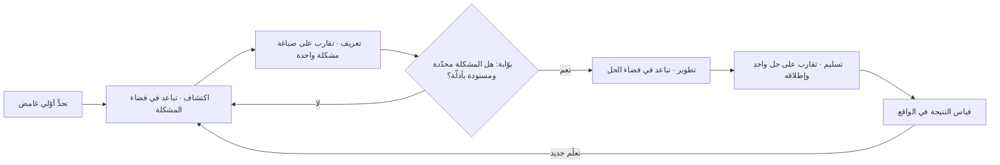

# الماسة المزدوجة (Double Diamond)

> [!info] تعريف مختصر
> نموذج بصري يصوّر عملية التصميم والابتكار على شكل **ماستين متتاليتين**، تمرّ كل منهما بمرحلة **تباعد** (توسيع الاحتمالات) ثم مرحلة **تقارب** (تضييقها وحسمها). الماسة الأولى مخصّصة **للمشكلة**: اكتشاف واسع للواقع ثم تعريف حادّ لما نحن بصدد حلّه. والماسة الثانية مخصّصة **للحل**: تطوير متعدّد الخيارات ثم تسليم لخيار واحد. القيمة الأساسية للنموذج ليست في المراحل الأربع نفسها، بل في **الفصل الصريح بين فضاء المشكلة وفضاء الحل** — وهو الفصل الذي تُهدر بسبب غيابه أغلب ميزانيات المشاريع، حين يبدأ الفريق بالحل ثم يكتشف بعد أشهر أنه حلّ مشكلة لم تكن هي المشكلة.

## الشرح العلمي والاحترافي
- **الأصل والتاريخ**: طوّر النموذج **مجلس التصميم البريطاني (UK Design Council)** ونشره عام **٢٠٠٤** (وشاع في وثائقه المنشورة عام ٢٠٠٥) بعد دراسة داخلية لطرائق عمل فرق التصميم في عدد من الشركات البريطانية والعالمية. لم يكن الهدف اختراع منهج جديد بل **وصف نمط مشترك** رصده المجلس عبر ممارسات متباينة ظاهريًّا. وهذا يفسّر بساطته الشديدة: هو تلخيص لما يحدث فعلًا، لا وصفة مفروضة.
- **المراحل الأربع**:
  1. **الاكتشاف (Discover)** — تباعد في فضاء المشكلة: بحث ميداني، وملاحظة، ومقابلات، وبيانات، دون التزام بأي فرضية عن الحل. الهدف: توسيع فهم الواقع بما في ذلك ما لم يكن في الأذهان.
  2. **التعريف (Define)** — تقارب في فضاء المشكلة: تصفية وتركيب ما جُمع في **صياغة مشكلة** واحدة محدّدة تُوجّه ما بعدها ([[Problem Statement]]).
  3. **التطوير (Develop)** — تباعد في فضاء الحل: توليد بدائل متعدّدة ومتباينة، ونمذجتها واختبارها ([[Prototype]]).
  4. **التسليم (Deliver)** — تقارب في فضاء الحل: اختيار واحد وصقله وإطلاقه وقياس أثره.
- **الفكرة المحورية: التباعد والتقارب نمطان ذهنيان متعارضان**: التباعد يتطلّب تعليق الحكم وقبول الغموض والإكثار من الاحتمالات؛ والتقارب يتطلّب النقد والحسم والاستبعاد. ممارستهما في اللحظة نفسها تُبطلهما معًا: الفريق الذي ينتقد كل فكرة لحظة ولادتها لا يتباعد، والذي لا ينتقد أبدًا لا يتقارب فيبقى في «شلل الخيارات». ولذلك تُعلن المرحلة صراحةً في الاجتماعات: «نحن الآن في تباعد — النقد مؤجّل». وفكرة التناوب بين التفكير المتباعد والمتقارب أقدم من النموذج نفسه، وتعود إلى أدبيات الإبداع في علم النفس في منتصف القرن العشرين.
- **الماسة الأولى هي المهملة عمليًّا**: يجري في أغلب المؤسسات ضغط شديد على تقصير الماسة الأولى («نعرف المشكلة، لنبدأ التنفيذ»)، فيتحوّل النموذج فعليًّا إلى **ماسة واحدة**. والنتيجة النمطية: منتج مبنيّ بإتقان لمشكلة ثانوية أو متخيّلة. الاستثمار في الماسة الأولى هو أرخص تأمين متاح، لأن كلفة تصحيح الخطأ ترتفع بحدّة كلما تأخّر اكتشافه ([[Cost-of-Change Curve]]).
- **علاقته بـ[[Product Discovery]]**: الماسة الأولى وجزء من الثانية هما بالضبط ما تسمّيه أدبيات المنتج «الاكتشاف». والفرق في التأكيد: يركّز اكتشاف المنتج على المخاطر الأربع (القيمة، والاستخدامية، والجدوى التقنية، والقابلية للأعمال)، بينما تركّز الماسة المزدوجة على **إيقاع التباعد والتقارب** بوصفه انضباطًا إجرائيًّا. وفي التشغيل الحديث لا تُنفَّذ الماسة دفعة واحدة في بداية المشروع بل **باستمرار** بالتوازي مع التسليم ([[Continuous Discovery]] و[[Dual-Track Agile]]).
- **علاقته بـ[[Problem Statement]]**: نقطة التقاء الماسة الأولى — أضيق نقطة في النموذج — هي حرفيًّا مكان صياغة المشكلة. وجودة النموذج كله رهن بجودة تلك الجملة: إن كانت فضفاضة («تحسين تجربة العميل») فلن تُنتج الماسة الثانية إلا حلولًا عشوائية لا معيار للحكم بينها؛ وإن كانت مصوغة على شكل حل مبطّن («نحتاج تطبيقًا جوّالًا») فقد أُغلق فضاء الحل قبل أن يُفتح.
- **التحديث اللاحق للنموذج**: أصدر مجلس التصميم عام ٢٠١٩ نسخة موسّعة تُعرف بـ«إطار الابتكار» (Framework for Innovation)، أضافت إلى الماستين عناصر تعالج الانتقادات الشائعة: مبادئ عمل صريحة (التركيز على الناس، والتواصل البصري، والتعاون، والتكرار)، وأنشطة **الإشراك والربط** مع أصحاب المصلحة، و**القيادة** بوصفها شرطًا لنجاح العملية داخل المؤسسة. الإضافة اعتراف بأن العملية التصميمية وحدها لا تكفي إن لم تكن مسنودة تنظيميًّا ([[Sponsor]] و[[Stakeholder Map]]).
- **موقعه بين المناهج**: هو أوضح تمثيل بصري لمنطق [[Design Thinking]]، وأقلّ منه ادّعاءً لأنه يصف الإيقاع فحسب ولا يعد بنتائج. ويتقاطع مع [[Cynefin]] في أن الماسة الأولى ضرورية بشدّة في المجال المركّب، ومُسرِفة في المجال الواضح حيث المشكلة والحل معلومان سلفًا.

## أين ومتى يُستخدم
- **في تأطير مبادرة جديدة غامضة**: حين لا يكون هناك اتفاق على تعريف المشكلة أصلًا بين أصحاب المصلحة.
- **في التخطيط لبرنامج بحث في [[Product Discovery]]**: لتقسيم الجهد بين توسيع الفهم وتضييقه، وتحديد متى تُغلق مرحلة البحث.
- **في تصميم الخدمات الحكومية والعامة**: النموذج شائع في هذا القطاع تحديدًا بحكم منشئه، ويصلح لرحلات تشمل قنوات وجهات متعدّدة ([[User Journey Map]]).
- **في إدارة الورش والاجتماعات**: بوصفه بروتوكولًا يُعلن فيه نمط التفكير المطلوب في كل جلسة، فيمنع نمط «الجميع ينتقد الجميع من الدقيقة الأولى» ([[Facilitator]]).
- **في التفاوض على النطاق مع الجهة الطالبة**: يبرّر عقدًا أو مرحلة مستقلّة للاكتشاف قبل الالتزام بنطاق التنفيذ وسعره ([[Scope Statement]]).
- **في مراجعة سبب فشل مبادرة سابقة**: كثير من حالات الفشل تُشخَّص بدقّة بأنها «قفز مباشرة إلى الماسة الثانية» — وهو تشخيص مفيد في [[Blameless Postmortem]].

## مثال وسيناريو تطبيقي
> [!example] بلدية في مدينة خليجية تتلقّى شكاوى متصاعدة بشأن خدمة إصدار تراخيص اللوحات التجارية. الطلب الرسمي الوارد إلى فريق التحوّل الرقمي كان محدّدًا سلفًا: «بناء تطبيق جوّال للتراخيص»، بميزانية تقديرية ٣٫٢ مليون ريال ومدّة ٩ أشهر.
> اعترض الفريق على البدء من الحل، وحصل على تمويل منفصل صغير للماسة الأولى: ٧ أسابيع و٢٨٠ ألف ريال.
> **الاكتشاف (تباعد)** — ٣١ مقابلة مع أصحاب محلّات، و٦ مقابلات مع موظّفي الترخيص، وملاحظة ميدانية في مكتبين، وتحليل ٤٢٠ شكوى مؤرشفة، وتتبّع زمني لـ٥٠ طلبًا فعليًّا من الإيداع إلى الإصدار.
> البيانات كشفت توزيعًا غير متوقّع: متوسّط زمن الدورة ٢٦ يومًا، منها **١٧ يومًا** في انتظار موافقة جهة أخرى تتعلّق بمطابقة تصميم اللوحة للاشتراطات، و٤ أيام في الفحص الميداني، و٥ أيام فقط في الإجراءات التي يمكن لتطبيق جوّال أن يمسّها. كما تبيّن أن ٥٨٪ من الطلبات تُرفَض مرة واحدة على الأقل بسبب **مخالفة في التصميم المقدَّم** يكتشفها المراجع بعد أسبوعين — بينما كان بالإمكان اكتشافها قبل التقديم.
> **التعريف (تقارب)** — أُعيدت صياغة المشكلة من «لا يوجد تطبيق جوّال» إلى: «صاحب المحل يقدّم تصميم لوحة لا يعرف مسبقًا هل يطابق الاشتراطات، فينتظر أسبوعين ليكتشف الرفض، ثم يعيد الدورة من أولها».
> **التطوير (تباعد)** — وُلّدت ١٩ فكرة، اختير منها ٣ للنمذجة: أداة تحقّق ذاتي للاشتراطات قبل التقديم، ومكتبة تصاميم معتمدة مسبقًا يختار منها المتقدّم، ومسار مراجعة متوازٍ بدل التسلسلي. جُرّبت الثلاثة بنماذج ورقية ويدوية مع ٣٥ متقدّمًا خلال أسبوعين.
> **التسليم (تقارب)** — اعتُمدت مكتبة التصاميم المعتمدة مسبقًا مع أداة تحقّق مبسّطة. التكلفة الفعلية ٩٤٠ ألف ريال بدل ٣٫٢ مليون. بعد ستة أشهر من التشغيل: انخفض متوسّط زمن الدورة إلى ١١ يومًا، ونسبة الرفض من أول مرة إلى ٢١٪.
> ملاحظة جوهرية: التطبيق الجوّال بُني لاحقًا فعلًا، لكن بعد أن صار يخدم عملية سليمة — لا بوصفه غطاءً رقميًّا على عملية معطوبة.

## خطوات أو مخطّط
1. اتفق مع الراعي على أن الماسة الأولى مرحلة مموَّلة مستقلّة لها مخرَج محدّد، لا مقدّمة مجانية للتنفيذ.
2. **اكتشاف**: اجمع من مصادر متعدّدة ومتباينة — ميدان، وبيانات تشغيلية، وشكاوى، وموظّفي الخط الأمامي — مع منع طرح الحلول في هذه المرحلة صراحةً.
3. ركّب المُجمَّع في أنماط، وابحث عن التوتّرات والمفارقات لا عن التأكيدات.
4. **تعريف**: اكتب صياغة المشكلة في جملة واحدة تصف المتضرّر والسلوك والأثر القابل للقياس، ثم اعرضها للنقض.
5. اجعل عبور بوّابة التعريف قرارًا صريحًا موثّقًا ([[Go or No-Go Decision]]) بمشاركة أصحاب المصلحة.
6. **تطوير**: ولّد بدائل متباينة عمدًا (لا نسخًا من فكرة واحدة)، وانمذج أرخصها أولًا لاختبار أخطر افتراض.
7. اختبر البدائل مع مستخدمين حقيقيين، وقارن بمعيار مشتق من صياغة المشكلة نفسها.
8. **تسليم**: اختر واحدًا، وأطلقه تدريجيًّا ([[Progressive Delivery]] أو [[Pilot Launch]])، وقس النتيجة لا حجم المنجَز.
9. أعد الدورة: كل إطلاق يولّد اكتشافًا جديدًا يغذّي ماسة أولى تالية.

## ⚠️ مفاهيم خاطئة شائعة
> [!warning]
> - **الظنّ بأنه عملية خطّية تُنفَّذ مرة واحدة**: النموذج يُرسم خطًّا مستقيمًا لأغراض الشرح فقط. عمليًّا تُكرَّر الماستان دوريًّا، ويحدث ارتداد من التسليم إلى الاكتشاف كلما كشف الواقع ما لم يكن معلومًا.
> - **الخلط بينه وبين [[Design Thinking]]**: التفكير التصميمي منهج بمراحله وأدواته وأدبياته ونقده؛ والماسة المزدوجة **تمثيل بصري لإيقاع** يمكن أن ينطبق على مناهج متعدّدة، بما فيها البحث الهندسي والسياسات العامة. الماسة أقلّ ادّعاءً وأوسع انطباقًا.
> - **اعتبار الماسة الأولى «مرحلة جمع متطلّبات»**: جمع المتطلّبات يسجّل ما يطلبه الناس؛ والاكتشاف يبحث عمّا لا يعرفون أنهم يحتاجونه وعمّا يفعلونه فعلًا خلافًا لما يقولون. الفارق بين توثيق طلب وتشخيص مشكلة.
> - **الظنّ بأن التباعد يعني غياب الانضباط**: التباعد المنضبط له أهداف وحدود زمنية وأسئلة بحث محدّدة وسقف إنفاق. الفوضى ليست تباعدًا، والاثنان يفترقان في وجود سؤال البحث.
> - **افتراض تساوي حجم الماستين دائمًا**: الرسم متناظر لكن الواقع ليس كذلك. في مجال جديد كليًّا قد تستهلك الماسة الأولى أغلب الجهد؛ وفي تحسين خدمة ناضجة قد تكون قصيرة جدًّا. التناظر البصري لا يعني تناظرًا في الميزانية.
> - **الظنّ بأن نقطة التعريف تُغلق نهائيًّا**: صياغة المشكلة قابلة للمراجعة عند ظهور دليل ناقض. الصياغة الجامدة تتحوّل بسرعة إلى عقيدة تحمي نفسها من الوقائع.

## ❌ ممارسات خاطئة في المشاريع
> [!failure]
> - **البدء من الماسة الثانية مباشرة**: الخطأ → استلام طلب بصيغة حل («نريد تطبيقًا») والشروع في التنفيذ. لماذا يضرّ → يُنفَق كامل الميزانية على حل قد يعالج ٥٪ فقط من سبب المشكلة الحقيقي. الحل → حوّل كل طلب صيغته حلٌّ إلى سؤال: ما النتيجة المرجوّة؟ وما الدليل على أن هذا الحل يحقّقها؟
> - **ضغط الماسة الأولى إلى ورشة نصف يوم**: الخطأ → اعتبار الاكتشاف رفاهية تُقلَّص عند ضيق الوقت. لماذا يضرّ → أسبوع اكتشاف يوفّر أشهر إعادة عمل ([[Rework Percentage]])، وحذفه يبدو توفيرًا وهو تأجيل للتكلفة بفائدة مركّبة. الحل → اجعل للاكتشاف حدًّا أدنى غير قابل للتفاوض متناسبًا مع حجم الالتزام المالي.
> - **الانتقاد أثناء التباعد**: الخطأ → «هذا مستحيل تقنيًّا» في الدقيقة الثالثة من جلسة التوليد. لماذا يضرّ → يقتل الاحتمالات غير البديهية ويُرجع الفريق إلى الحل الأول الذي دخلوا به الغرفة. الحل → أعلن نمط الجلسة صراحةً، وخصّص جلسة تقارب منفصلة للجدوى والقيود.
> - **البقاء في التباعد بلا حسم**: الخطأ → دورات بحث متتالية بلا صياغة مشكلة نهائية. لماذا يضرّ → «شلل التحليل» يستنزف الميزانية ويولّد تكلفة تأخير خالصة ([[Cost of Delay]]). الحل → حدّد تاريخًا وبوّابة قرار سلفًا: في هذا التاريخ تُكتب صياغة المشكلة مهما كان مستوى اليقين، وتُسجَّل المجاهيل المتبقّية بوصفها مخاطر.
> - **تعريف المشكلة بلغة داخلية**: الخطأ → «مشكلتنا أن نظام الـERP لا يتكامل مع البوّابة». لماذا يضرّ → يقيّد فضاء الحل بالبنية الحالية ويستبعد حلولًا تشغيلية أو تنظيمية أبسط وأرخص. الحل → اكتب المشكلة من زاوية المتضرّر النهائي وأثرها عليه، ثم اذكر القيود الداخلية على حدة.
> - **توليد بدائل متشابهة**: الخطأ → ثلاثة خيارات هي في الحقيقة ثلاث نسخ من فكرة واحدة بألوان مختلفة. لماذا يضرّ → يوهم بوجود اختيار بينما القرار محسوم سلفًا، ويهدر مرحلة التطوير كلها. الحل → اشترط أن يكون أحد البدائل «بلا برمجة» وآخر يعالج المشكلة من جذر مختلف تمامًا.
> - **إنهاء المشروع عند التسليم**: الخطأ → اعتبار الإطلاق نهاية الدورة. لماذا يضرّ → لا يُعرف هل حُلّت المشكلة أصلًا، فتتكرّر الدورة نفسها بعد عام بميزانية جديدة. الحل → اربط التسليم بمقياس نتيجة ([[Outcome vs Output]]) وبمراجعة بعد الإطلاق ([[Post-Launch Review]]).

## 🔗 مصطلحات ومفاهيم ذات صلة
[[Design Thinking]] | [[Cynefin]] | [[Product Discovery]] | [[Problem Statement]] | [[Continuous Discovery]] | [[Dual-Track Agile]] | [[Prototype]] | [[User Journey Map]] | [[Opportunity Solution Tree]] | [[Cost-of-Change Curve]] | [[Post-Launch Review]]
