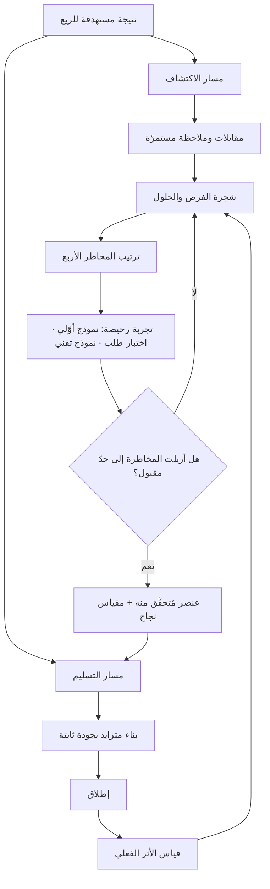

# المسار المزدوج في الأجايل (Dual-Track Agile)

> [!info] تعريف مختصر
> نموذج عمل يجري فيه **الاكتشاف (Discovery)** و**التسليم (Delivery)** بالتوازي وباستمرار داخل الفريق الواحد، لا بالتتابع ولا بفريقين منفصلين. مسار الاكتشاف يسأل: **هل هذا يستحقّ أن يُبنى؟** ومخرجه معرفة مُتحقَّق منها تقلّل عدم اليقين. ومسار التسليم يسأل: **كيف نبنيه بجودة موثوقة؟** ومخرجه برمجيات صالحة للاستخدام. الكلمة المفتاح في التعريف هي **دائمًا**: المساران يعملان في كل أسبوع من عمر المنتج، لا مرحلة اكتشاف تسبق ثم تنتهي. سوء الفهم الأشهر هو تصوّره «مرحلة تحليل قبل التطوير» بمسمّى عصري — وهذا يعيد إنتاج النموذج الشلّالي بلغة أجايل.

## الشرح العلمي والاحترافي
- **المشكلة التي وُلد لعلاجها**: تبنّت فرق كثيرة الأجايل فأتقنت **بناء الأشياء بسرعة**، لكنها لم تحلّ مسألة **بناء الأشياء الصحيحة**. النتيجة فرق عالية الإنتاجية تُنتج ميزات لا يستخدمها أحد بكفاءة مذهلة — وهو تعريف [[Feature Factory]]. المسار المزدوج يعالج ذلك بجعل تقليل عدم اليقين عملًا مجدولًا وله مخرجات ومالك، لا نشاطًا يحدث «إن توفّر وقت».
- **مسارٌ واحد وفريقٌ واحد، لا فريقان**: أخطر تشوّه في التطبيق هو إنشاء "فريق اكتشاف" منفصل يسلّم مواصفات إلى "فريق تسليم". هذا يعيد بناء الحاجز التسليمي نفسه الذي جاء النموذج لهدمه، ويولّد فقدان سياق وإعادة عمل. الصياغة الصحيحة: **فريق واحد ذو مسارين من النشاط**، يشترك في الاكتشاف ثلاثيّ أساسي — مدير المنتج، ومصمّم التجربة، وقائد تقني — بمشاركة متفاوتة من بقية الفريق. المهندس الذي شارك في مقابلة مستخدم يبني حلًّا مختلفًا عن المهندس الذي استلم وثيقة.
- **اختلاف طبيعة العمل بين المسارين**: عمل الاكتشاف **احتمالي** بطبيعته: لا يمكن تقدير مدّته بدقّة، ومخرجه قد يكون «لا تبنِ هذا» وهو مخرج ناجح تمامًا. عمل التسليم **حتمي نسبيًّا**: قابل للتقدير والتخطيط والقياس بمعدّل الإنجاز و[[Cycle Time]]. الخلط بينهما بإخضاع الاكتشاف لمقاييس التسليم (نقاط، سرعة، التزام بالسبرنت) يقتل الاكتشاف، لأن المكافأة تصير على إنتاج مخرجات لا على تعلّم.
- **العلاقة الزمنية بين المسارين**: لا يعمل المساران على العنصر نفسه في الوقت نفسه. الاكتشاف يعمل على **ما سيأتي لاحقًا**، والتسليم يعمل على **ما تحقّق منه سابقًا**. يشبه الأمر خطًّا للإنتاج فيه مخزون صغير من "الفرص المُتحقَّق منها" يغذّي التسليم. وضبط هذا المخزون مسألة تدفّق كلاسيكية: مخزون قليل يعني توقّف التسليم انتظارًا، ومخزون كبير يعني اكتشافًا يتقادم قبل أن يُنفَّذ — وهو تطبيق مباشر لمنطق [[WIP Limit]] و[[Pull System]].
- **مخرجات الاكتشاف ليست وثائق**: المخرج الصحيح هو **معرفة مثبتة تُغيّر قرارًا**: فرضية دُحضت، حجم مشكلة قُدِّر، نموذج أوّلي اختُبر مع مستخدمين حقيقيين، مخاطرة تقنية أُزيلت بنموذج شوكي (Spike). الوثيقة وسيلة نقل لا مخرج بحدّ ذاته. ومن هنا فإن نتيجة "لن نبني هذا" توفّر أسابيع تطوير وتُعدّ من أعلى مخرجات الاكتشاف عائدًا.
- **المخاطر الأربع التي يعالجها الاكتشاف**: يُدار الاكتشاف عادةً حول أربعة أسئلة مخاطرة: **القيمة** (هل يريده الناس ويدفعون مقابله؟)، و**قابلية الاستخدام** (هل يستطيعون استعماله؟)، و**الجدوى التقنية** (هل نستطيع بناءه بالتقنية والوقت المتاحين؟)، و**الجدوى التجارية** (هل يناسب نموذج العمل والقيود القانونية والتشغيلية؟). ترتيب معالجة هذه المخاطر يبدأ بأرخصها اختبارًا وأعلاها فتكًا إن تُجوهلت.
- **علاقته بالتحسين المستمر للاكتشاف**: المسار المزدوج هو **البنية التنظيمية**، بينما [[Continuous Discovery]] هو **الإيقاع والممارسة** داخل مسار الاكتشاف (تواصل أسبوعي منتظم مع مستخدمين)، و[[Opportunity Solution Tree]] هو **أداة التنظيم** التي تربط النتيجة المستهدفة بالفرص ثم بالحلول ثم بالتجارب. الثلاثة تُستخدم معًا عادةً وليست بدائل.
- **أثره على تعريف الجاهزية**: في هذا النموذج يصبح [[Definition of Ready]] معيارًا ذا معنى حقيقي: لا يدخل عنصر مسار التسليم إلا وقد أُزيلت عنه المخاطر الأربع إلى حدّ مقبول، ووُضع له مقياس نجاح متوقَّع. هذا يقلّل بشدّة إعادة العمل وطلبات التوضيح أثناء السبرنت.

## أين ومتى يُستخدم
- **في المنتجات الرقمية ذات عدم اليقين العالي**: حين تكون المشكلة نفسها غير محسومة، لا مجرّد تنفيذها — وهو المجال الطبيعي لـ[[Product Discovery]].
- **في تغذية الـ Backlog بعناصر مُتحقَّق منها**: بحيث تصبح جلسة [[Backlog Refinement]] مراجعة لعناصر جاهزة فعلًا لا محاولة اختراع متطلّبات في الاجتماع.
- **في كسر نمط مصنع الميزات**: كعلاج بنيوي لفرق تنتج بغزارة بلا أثر، بربط كل عنصر بنتيجة متوقَّعة وفق [[Outcome vs Output]].
- **في الفرق متعدّدة التخصّصات**: يفترض النموذج وجود [[Cross-functional Team]] يضمّ منتجًا وتصميمًا وهندسة في وحدة قرار واحدة، ويصعب تطبيقه في هيكل وظيفي منفصل.
- **قبل الالتزام بنطاق كبير أو تعاقد**: لتقليل مخاطر الالتزام بمتطلّبات لم تُختبر، وربطها بـ[[Go or No-Go Decision]] مستندة إلى أدلّة.
- **في ضبط تدفّق العمل بين المرحلتين**: عبر [[Upstream vs Downstream Kanban]] الذي يوفّر تمثيلًا بصريًّا دقيقًا لهذين المسارين على لوح واحد.
- **في تحديد نطاق أوّل إصدار**: لتحويل [[MVP]] من "أقل ما يمكن برمجته" إلى "أقل ما يختبر أخطر فرضية".

## مثال وسيناريو تطبيقي
> [!example] فريق منتج في شركة لوجستية سعودية (12 شخصًا: مدير منتج، مصمّم، 8 مهندسين، محلّل بيانات، ضمان جودة). كان الفريق يعمل بسبرنتات أسبوعين، ويستقبل المتطلّبات جاهزة من إدارة العمليات. خلال 3 أرباع أطلق 22 ميزة، لكن قياسًا لاحقًا أظهر أن 5 ميزات فقط تجاوزت 10% استخدامًا بين السائقين المستهدفين.
> اعتُمد المسار المزدوج على النحو التالي: خُصّصت من قدرة الفريق نسبة تقارب 15% لمسار الاكتشاف، بمشاركة ثابتة من مدير المنتج والمصمّم وقائد تقني، وبتناوب مهندس واحد أسبوعيًّا. وتقرّر إيقاع ثابت: مقابلتان أسبوعيًّا مع سائقين، وجلسة رسم فرص أسبوعية، وتجربة واحدة على الأقل كل أسبوعين.
> **الحالة الأولى**: طلبت العمليات "لوحة تحليلات متقدّمة للسائق" بتقدير 6 أسابيع تطوير. أظهرت 7 مقابلات أن السائق لا يفتح التطبيق أثناء العمل إلا 3 مرات في الرحلة، وأن سؤاله الحقيقي واحد: «هل سأصل في الوقت المحدّد أم لا؟». اختُبر نموذج ورقي ثم نموذج تفاعلي خلال 9 أيام. النتيجة: أُلغيت اللوحة، وبُنيت بدلًا منها إشارة واحدة في أعلى الشاشة، بكلفة تطوير 5 أيام. **وفّر الاكتشاف نحو 5 أسابيع من عمل ثمانية مهندسين.**
> **الحالة الثانية**: فرضية أن السائقين يريدون اختيار الطلبات يدويًّا. اختُبرت بتجربة محدودة على 40 سائقًا لمدة أسبوعين، فتبيّن أن الاختيار اليدوي رفع رضا السائقين لكنه خفض نسبة تغطية الطلبات في الأحياء البعيدة بشكل ملموس. القرار: تنفيذ بصيغة مقيّدة (اختيار ضمن نطاق جغرافي محدّد) بدل الإلغاء أو التنفيذ الكامل — وهو قرار لم يكن ممكنًا الوصول إليه بلا تجربة.
> **الإيقاع بعد ربع كامل**: يعمل مسار التسليم دائمًا على عناصر تحقّق منها الاكتشاف قبل 2–4 أسابيع. انخفضت طلبات التوضيح أثناء السبرنت بشكل واضح، وانخفض العمل المُعاد بعد المراجعة، وارتفعت نسبة الميزات التي تجاوزت عتبة الاستخدام من 23% إلى 61%. الأهم أن الفريق **أطلق ميزات أقل عددًا** في ذلك الربع — وهو ما كان سيبدو تراجعًا لولا أن مقاييس النتائج تغيّرت.

## خطوات أو مخطّط
1. تحديد النتيجة المستهدفة للربع بلغة سلوك أو أثر تجاري، لا بقائمة ميزات.
2. تخصيص قدرة معلنة ومحمية لمسار الاكتشاف (نسبة ثابتة من وقت الفريق)، وتسمية المشاركين فيه.
3. تثبيت إيقاع تواصل أسبوعي مع مستخدمين حقيقيين لا يتوقّف عند انشغال الفريق.
4. رسم شجرة الفرص: النتيجة ← الفرص المكتشفة ← الحلول المقترحة ← التجارب التي ستحكم عليها.
5. ترتيب المخاطر الأربع لكل فرصة (قيمة، قابلية استخدام، جدوى تقنية، جدوى تجارية) والبدء بأرخص اختبار لأخطر مخاطرة.
6. تشغيل تجربة محدودة سريعة: نموذج أوّلي، اختبار قابلية استخدام، تجربة طلب، أو نموذج تقني شوكي.
7. الحكم بمعيار مُعلَن مسبقًا: تنفيذ، أو تعديل الفرضية، أو إسقاط الفكرة — وتوثيق الحكم في [[Decision Log]].
8. تمرير ما نجح إلى مسار التسليم بعد استيفاء [[Definition of Ready]] مع مقياس نجاح متوقّع.
9. تسليم متزايد بجودة ثابتة، ثم قياس الأثر الفعلي بعد الإطلاق عبر [[Product Analytics]].
10. تغذية نتائج القياس عكسيًّا إلى شجرة الفرص، وضبط حجم مخزون العناصر الجاهزة كي لا يتضخّم ولا ينضب.

## ⚠️ مفاهيم خاطئة شائعة
> [!warning]
> - **«الاكتشاف مرحلة تسبق التسليم»**: هذا هو الخطأ الجوهري. المرحليّة تعيد إنتاج النموذج الشلّالي بمفردات أجايل: تحليل ثم بناء. المقصود بالمسار المزدوج تزامن دائم — الاكتشاف يعمل على ما بعد الأفق بينما التسليم يبني ما تحقّق منه.
> - **«يحتاج فريق اكتشاف منفصل»**: الفصل التنظيمي يخلق حاجزًا تسليميًّا ويفقد المهندسين السياق الذي يجعلهم يقترحون حلولًا أبسط. الصحيح مسارا نشاط داخل فريق واحد.
> - **«الاكتشاف مسؤولية مدير المنتج وحده»**: مشاركة التصميم والهندسة ليست ترفًا؛ الجدوى التقنية مخاطرة أصيلة لا يستطيع مدير المنتج تقييمها، وحضور المهندس مقابلة واحدة يغيّر الحل جذريًّا في كثير من الحالات.
> - **«مخرَج الاكتشاف وثيقة متطلّبات»**: المخرَج معرفة تغيّر قرارًا. وثيقة تصف ما قرّرناه سلفًا دون أن يختبرها أحد ليست اكتشافًا مهما بلغ تفصيلها.
> - **«الاكتشاف يبطّئ التسليم»**: يقلّل عدد الميزات المُطلقة أحيانًا، لكنه يرفع نسبة الميزات التي تُحدث أثرًا، ويقلّص إعادة العمل الناتجة عن متطلّبات خاطئة — وهي أكبر مصادر الهدر خفاءً.
> - **«نتيجة الاكتشاف يجب أن تكون ميزة»**: النتيجة السليمة قد تكون «لا نبني شيئًا» أو «المشكلة أصغر ممّا ظننّا». الفريق الذي لا يُسقط أي فكرة في الاكتشاف لا يكتشف، بل يبحث عن تأكيد لما قرّره.
> - **«يُقاس الاكتشاف بنقاط ومعدّل إنجاز كالتسليم»**: إخضاع عمل احتمالي لمقاييس عمل حتمي يحوّله إلى طقس شكلي. يُقاس الاكتشاف بعدد الفرضيات المُختبَرة وحجم عدم اليقين المُزال والقرارات التي تغيّرت.

## ❌ ممارسات خاطئة في المشاريع
> [!failure]
> - **الخطأ: عدم تخصيص قدرة محمية للاكتشاف** → **لماذا يضرّ**: يُلتهم وقت الاكتشاف عند أول ضغط تسليم، فيموت النموذج خلال شهرين ويبقى الاسم فقط → **الحل**: خصّص نسبة معلنة من قدرة كل سبرنت للاكتشاف واحمِها كما تُحمى الالتزامات التعاقدية.
> - **الخطأ: بدء الاكتشاف بحل مقترح بدل مشكلة أو نتيجة** → **لماذا يضرّ**: يتحوّل النشاط إلى بحث عن أدلّة تؤيّد قرارًا متّخذًا سلفًا، وهو أسوأ من غياب الاكتشاف لأنه يمنح غطاءً زائفًا → **الحل**: ابدأ من النتيجة المستهدفة والفرص، واكتب معيار الدحض قبل التجربة.
> - **الخطأ: تكديس مخزون ضخم من العناصر "الجاهزة" أمام مسار التسليم** → **لماذا يضرّ**: تتقادم المعرفة ويتغيّر السياق قبل التنفيذ، فيُبنى ما تحقّقنا منه قبل أشهر لا ما نعرفه اليوم → **الحل**: طبّق حدًّا أعلى للعمل الجاري على مخرجات الاكتشاف نفسها كما في [[WIP Limit]].
> - **الخطأ: استبعاد المهندسين من جلسات المستخدمين حفاظًا على وقتهم** → **لماذا يضرّ**: تضيع الحلول التقنية الأرخص التي لا يراها إلا من يعرف النظام، ويُبنى الحل الأغلى دائمًا → **الحل**: تناوب حضور مهندس واحد على الأقل في كل جلسة، واجعله جزءًا من التزام السبرنت.
> - **الخطأ: تشغيل التجارب دون معيار قرار متّفق عليه مسبقًا** → **لماذا يضرّ**: تُفسَّر النتائج بعد وقوعها بما يوافق هوى الأقوى في الغرفة → **الحل**: اكتب قبل التجربة: ما الذي سنفعله إن تجاوزنا العتبة، وما الذي سنفعله إن لم نتجاوزها.
> - **الخطأ: قياس الفريق بعدد الميزات المُطلقة مع تبنّي المسار المزدوج** → **لماذا يضرّ**: تناقض بنيوي بين النموذج ونظام الحوافز؛ يفوز نظام الحوافز دائمًا → **الحل**: بدّل مقاييس الفريق إلى نتائج سلوكية وتجارية قبل إطلاق النموذج لا بعده.
> - **الخطأ: تحويل الاكتشاف إلى سلسلة عروض تقديمية للإدارة** → **لماذا يضرّ**: يستنزف وقت البحث في الإخراج والتنسيق، ويصير المقياس جودة العرض لا صدق التعلّم → **الحل**: وثّق بإيجاز قابل للقراءة (فرضية، طريقة، نتيجة، قرار) في مكان واحد مشترك، واستبدل العرض بجولة اطّلاع على الأدلّة.

## 🔗 مصطلحات ومفاهيم ذات صلة
[[Product Discovery]] | [[Continuous Discovery]] | [[Opportunity Solution Tree]] | [[Definition of Ready]] | [[Backlog Refinement]] | [[Cross-functional Team]] | [[Upstream vs Downstream Kanban]] | [[WIP Limit]] | [[Feature Factory]] | [[Outcome vs Output]] | [[MVP]] | [[Fake Door Test]] | [[Lean Startup]] | [[Product Analytics]]
