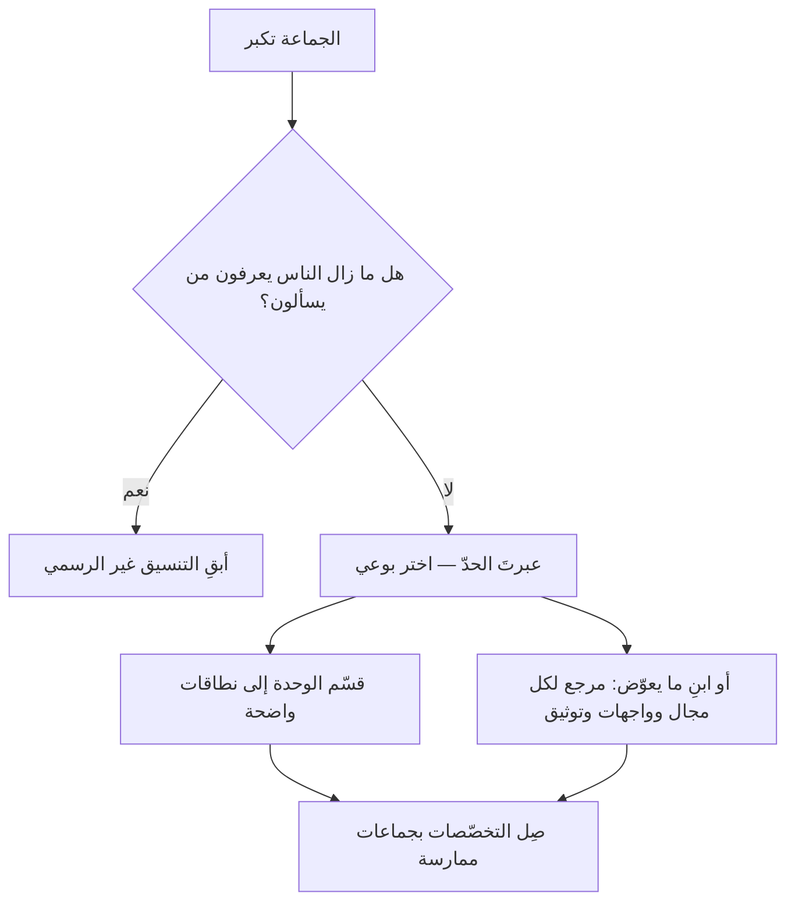

# عدد دنبار (Dunbar's Number)

> [!info] تعريف مختصر
> **عدد دنبار** فرضيةٌ في الأنثروبولوجيا التطوّرية طرحها **روبِن دنبار** مطلع التسعينيات: أن عدد العلاقات الاجتماعية **المستقرّة** التي يستطيع الإنسان أن يحفظها محدودٌ بحدود قدرته الإدراكية، وأن تقديره نحو **150** شخصًا. وبناها على ارتباط مقيس بين حجم القشرة المخّية الحديثة في الرئيسيات وحجم جماعاتها، ثم أسند التقدير بشواهد من أحجام القرى والوحدات العسكرية.
> **وأثره في تنظيم العمل** أن الجماعة إذا تجاوزت هذا الحدّ لم تعد تُدار بالمعرفة الشخصية، **فتستبدل بها القواعد واللوائح والتسلسل الإداري** — لا لسوء نيّة، بل لأن الوسيلة الأولى نفدت.

## الشرح العلمي والاحترافي

**والرقم ليس 150 وحده**، بل سلسلة طبقات متداخلة تتّسع كلّما ضعف عمق الصلة، وأشهرها في أدبيات دنبار: **5** (الدائرة الحميمة) · **15** (الأصدقاء المقرّبون) · **50** (الجماعة الموسّعة) · **150** (المعارف المستقرّون). وكلّما اتّسعت الطبقة قلّ ما تحتمله من ثقة تلقائية وزاد ما تحتاجه من ترتيب صريح.

**وموضعه من إدارة المشاريع** أنه يفسّر ظاهرتين يراهما كل من عمل في منظّمة نامية:

1. **أن الوثائق تكثر فجأة.** فالمنظّمة التي كانت تعمل بالكلام وجدت نفسها تكتب السياسات — والسبب أن عدد من يعرف بعضهم لم يعد يغطّي عدد من يحتاج التنسيق معه.
2. **أن «الجميع يعرف الجميع» تنقطع دفعةً واحدة تقريبًا.** فهي لا تتلاشى تدريجيًّا، وإنما تنكسر عند حدٍّ يشعر به الناس قبل أن يسمّوه.

**واستُعمل صراحةً في تصميم المنظّمات.** فورقة [[Spotify Model|نموذج سبوتيفاي]] نصّت على أن حدّ القبيلة **أقلّ من مئة شخص** وعلّلته بعدد دنبار. وقبلها اشتهرت **شركة غور** (`W. L. Gore`) — صانعة `Gore-Tex` — بممارسة موثّقة: أن يُقسَم المصنع إذا تجاوز حدًّا قريبًا من مئتين، حفاظًا على أن يعرف الناس بعضهم. وعلى المستوى الأصغر يقف [[Two-Pizza Team|فريق البيتزتين]] عند الطبقة الأولى: خمسة إلى خمسة عشر.

> [!info] إضافة مرجعية — على قدر ما تحتمله الفرضية
> عدد دنبار **فرضية متنازَع فيها لا قانون مستقرّ**. وقد نُشرت مراجعات إحصائية تخلص إلى أن هامش عدم اليقين في التقدير واسع جدًّا، وأن الاستدلال من الرئيسيات على البشر لا يحتمل رقمًا بعينه. **والذي يُنتفع به منه في العمل هو الاتّجاه لا الرقم:** أن للمعرفة الشخصية سقفًا، وأن ما بعد السقف يُدار بالبنية. فلا يُبنى قرار تنظيميّ على أن الحدّ 150 بالضبط، ويُبنى على أن هناك حدًّا.

## أين ومتى يُستخدم

- **في تصميم حدود الوحدات التنظيمية**: متى تُقسم القبيلة أو القسم أو المكتب؟
- **في تفسير مقاومة النموّ**: حين تشكو منظّمة من أن «الأمور صارت رسمية» بعد أن كانت سهلة، فهذا وصفٌ لعبور حدّ لا لتغيّر في الأخلاق.
- **في تقدير كلفة التنسيق**، إلى جانب [[Brooks's Law|قانون بروكس]]: فالأوّل يصف سقف العلاقات، والثاني يصف كلفة القنوات.
- **في تصميم جماعات الممارسة والمجتمعات الداخلية**، فالجماعة التي تتجاوز الطبقة تحتاج تيسيرًا صريحًا لا يحتاجه ما دونها.

> [!warning] متى لا يُستخدَم؟
> - **حجّةً على رقمٍ بعينه** في مقترح تنظيمي: الفرضية لا تحتمل هذه الدقّة.
> - **مبرّرًا لمنع النموّ.** المنظّمات تتجاوز 150 بالضرورة؛ والسؤال ليس أنتجاوز أم لا، بل **بأيّ بنية** نتجاوز.
> - **في العلاقات الرقمية الخفيفة** (متابعون · جهات اتّصال): الفرضية عن علاقات **مستقرّة** يعرف صاحبها موضع كل واحد منها، لا عن قوائم.

## مثال وسيناريو تطبيقي

> [!example] «شركة نُهى» — عند الشخص المئة والعشرين
> **الوضع:** شركة نمت من 40 إلى 120 موظفًا في ثمانية عشر شهرًا. والشكوى المتكرّرة في الاسترجاعات: «صرنا بطيئين»، «لم نعد نعرف من يفعل ماذا»، «كل شيء صار يحتاج نموذجًا».
> **التشخيص الخاطئ الذي كاد يُتّخذ:** أن السبب ضعف في الالتزام، والعلاج مزيد من التقارير.
> **ما ظهر بالقياس:** لا الإنتاجية الفردية تراجعت ولا الجودة؛ وإنما ارتفع **زمن انتظار المعلومة**: متوسّط ما يمضي حتى يجد أحدهم من يجيبه ارتفع من ساعتين إلى يومين. أي أن المشكلة في **الوصول إلى المعرفة** لا في المعرفة نفسها.
> **ما فُعل:** لم تُضَف تقارير. قُسّمت الشركة إلى ثلاث وحدات لكلٍّ نطاق واضح، وأُعلن لكل مجال **مرجعٌ واحد معروف بالاسم**، وأُنشئت [[Community of Practice|جماعات ممارسة]] تصل أهل التخصّص عبر الوحدات.
> **الدرس:** ما انكسر لم يكن الناس، بل **الوسيلة**: كانت المنظّمة تعمل بالمعرفة الشخصية حتى نفدت. والعلاج بنيةٌ تُغني عن معرفة الجميع بالجميع، لا لومٌ على ضياعها.

## خطوات أو مخطّط

1. **اعرف موضعك من الطبقات:** فريق (5–15) · وحدة (50) · مكتب أو قبيلة (150).
2. **راقب العلامة لا العدد:** متى بدأ الناس يسألون «من المسؤول عن هذا؟» — فهذه إشارة العبور.
3. **عند العبور، اختر بوعي:** إمّا أن تُقسم الوحدة، وإمّا أن تبني ما يعوّض المعرفة الشخصية (مرجع معروف لكل مجال · واجهات معرَّفة · توثيق يُرجع إليه).
4. **لا تُضِف طبقة إدارة بوصفها الحلّ التلقائي**، فهي أغلى بدائل التعويض وأبطؤها.
5. **صِل ما قطعه التقسيم** بجماعات ممارسة عابرة، وإلّا تحوّلت الوحدات إلى صوامع.

## ⚠️ مفاهيم خاطئة شائعة

> [!warning]
> - **عدّه قانونًا مثبتًا.** هو فرضية ذات شواهد ومنازعات، والرقم تقدير لا قياس.
> - **اختزاله في 150.** الطبقات هي الأنفع عمليًّا، لأن كل طبقة تفرض نمط تنسيق مختلفًا.
> - **حسبانه سقفًا لحجم المنظّمة.** ليس سقفًا للنموّ، بل حدًّا **لأسلوب** إدارةٍ بعينه.
> - **إسقاطه على الشبكات الاجتماعية.** قائمة المتابعين ليست علاقات مستقرّة، والفرضية لا تتناولها.
> - **استعماله لتبرير التقسيم وحده.** التقسيم أحد حلّين؛ والآخر بناء ما يعوّض المعرفة الشخصية — وقد يكون أرخص.

## ❌ ممارسات خاطئة في المشاريع

> [!failure]
> - **معالجة أعراض العبور بمزيد من التقارير** — فيزداد العبء ولا يُحلّ شيء. **الحلّ:** عالج الوصول إلى المعلومة، لا وثّق أكثر.
> - **الاستشهاد بالرقم في مقترح تنظيميّ بوصفه دليلًا قاطعًا.** **الحلّ:** استشهد بالاتّجاه، وبقياسك أنت لزمن انتظار المعلومة.
> - **تقسيم الوحدة بلا رسم نطاقات واضحة** — فتنقسم الأسماء وتبقى التبعيّات. **الحلّ:** لكل وحدة نطاق يُملك كاملًا.
> - **إهمال ما قطعه التقسيم** — فتنشأ صوامع خلال أشهر. **الحلّ:** جماعات ممارسة تصل أهل التخصّص عبر الوحدات.

## 🔗 مصطلحات ومفاهيم ذات صلة

[[Two-Pizza Team]] | [[Spotify Model]] | [[Brooks's Law]] | [[Conway's Law]] | [[Community of Practice]] | [[Cross-functional Team]] | [[Knowledge Management]] | [[Dependency]] | [[Alignment]]
