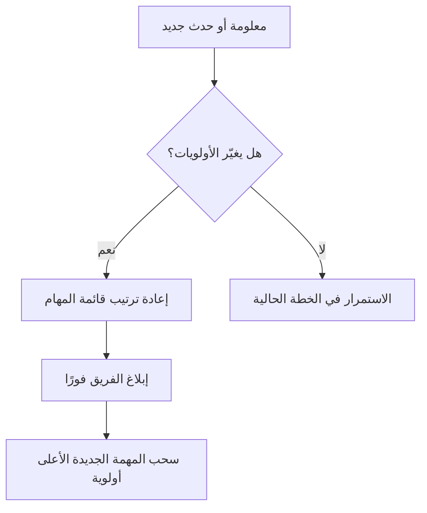

# الإدارة الديناميكية للمهام (Dynamic Task Management)
> [!info] تعريف مختصر
> الإدارة الديناميكية للمهام (Dynamic Task Management) هي أسلوب يُعاد فيه ترتيب أولويات المهام وتوزيعها باستمرار استجابةً لتغيّرات فعلية (أولويات جديدة، عوائق، معلومات جديدة)، بدلًا من الالتزام بخطة ثابتة موضوعة مسبقًا لا تتغيّر.

## الشرح العلمي والاحترافي
- في الإدارة التقليدية الثابتة، توضع خطة تفصيلية مسبقًا (كما في جانت التقليدي) ويصعب تعديلها دون إجراءات رسمية طويلة.
- في الإدارة الديناميكية، تُعامَل قائمة المهام كنظام حي يتغيّر باستمرار: تُضاف مهام جديدة، تُعاد جدولة أخرى، وتُعاد الأولويات كل يوم أو حتى كل ساعة عند الحاجة.
- تعتمد هذه الإدارة على مبادئ من كانبان (Kanban) ونظام السحب (Pull System): بدلًا من "دفع" جدول ثابت، يسحب الفريق العمل التالي الأكثر أهمية وقت الحاجة الفعلية.
- تستفيد من أدوات رقمية (لوحات مهام رقمية، أنظمة تتبع) تسمح بإعادة الترتيب الفوري ورؤية الحالة اللحظية للجميع.
- الفائدة الأساسية: مرونة أعلى في التعامل مع عدم اليقين (Uncertainty) وتغيّر الأولويات السريع، وهو أمر شائع في بيئات المنتجات الرقمية والدعم الفني.
- المخاطرة الأساسية: بلا انضباط، يمكن أن تتحول "الديناميكية" إلى فوضى تفتقر للتركيز، لذلك تُدمَج غالبًا مع حدود العمل الجاري (WIP Limit) وسياسات واضحة (Explicit Policies) لضبطها.

## أين ومتى يُستخدم
- تُستخدم في فرق كانبان (Kanban) وسكرمبان (Scrum-ban) والفرق التي تستقبل طلبات متغيرة باستمرار مثل فرق الدعم الفني وفرق DevOps.
- تُستخدم عند وجود بيئة عمل عالية التقلب (أولويات العميل تتغير أسبوعيًا أو يوميًا).
- تُلجأ إليها المؤسسات التي تدير عدة مشاريع صغيرة متوازية بموارد مشتركة ومحدودة.

## مثال وسيناريو تطبيقي
> [!example] فريق منتج في شركة "أفق ديجيتال" يدير تطبيق تجارة إلكترونية. بدل جدول ثابت لأسبوعين، يستخدم الفريق لوحة رقمية ديناميكية حيث تُعاد ترتيب المهام كل صباح بناءً على أحدث بيانات المبيعات وشكاوى العملاء. في أحد الأيام، وصل تقرير عن انخفاض مفاجئ في معدل إتمام الشراء (Checkout)، فأعاد مدير المنتج ترتيب الأولويات فورًا ليضع "إصلاح خطأ الدفع" على رأس القائمة، مؤجّلًا مهمة تصميم واجهة كانت مخططة لذلك اليوم. بفضل الإدارة الديناميكية، تم حل المشكلة خلال ساعات بدلًا من انتظار دورة تخطيط جديدة.

## خطوات أو مخطّط
1. اجعل قائمة المهام (Backlog) مرئية ومحدَّثة باستمرار لجميع الأطراف.
2. حدّد معايير واضحة لإعادة الترتيب (تأثير على العميل، إلحاح، قيمة العمل).
3. راجع الأولويات في نقطة زمنية منتظمة (يوميًا مثلًا) وأيضًا فور وصول معلومة حرجة.
4. حافظ على حدود العمل الجاري (WIP Limit) حتى لا تتحول المرونة إلى تشتت.
5. وثّق سبب كل إعادة ترتيب كبيرة حتى يفهم الفريق منطق القرار ولا يشعر بالفوضى.

## ⚠️ مفاهيم خاطئة شائعة
> [!warning]
> - الاعتقاد بأن "الديناميكية" تعني غياب أي خطة؛ في الحقيقة هي خطة مرنة قابلة للتحديث المستمر وليست غيابًا للتخطيط.
> - الخلط بينها وبين تعدد المهام (Multitasking) الفوضوي؛ الإدارة الديناميكية الجيدة لا تزال تحترم حدود العمل الجاري (WIP Limit) وتركّز على إنهاء مهمة قبل الانتقال لأخرى.
> - الاعتقاد أن إعادة الترتيب المتكرر تعني ضعف تخطيط الفريق؛ في بيئات عالية التغيّر هي استجابة صحية وليست فشلًا.

## ❌ ممارسات خاطئة في المشاريع
> [!failure]
> - إعادة ترتيب الأولويات كل ساعة دون سبب واضح موثَّق، ما يُرهق الفريق ويفقده التركيز؛ الحل: حدّد نقاط زمنية منتظمة للمراجعة وسببًا واضحًا لأي تغيير طارئ.
> - غياب أي حد للعمل الجاري أثناء إعادة الترتيب المستمر، فتتراكم مهام "قيد التنفيذ" بلا نهاية؛ الحل: طبّق حد العمل الجاري (WIP Limit) بصرامة حتى في البيئة الديناميكية.
> - عدم إبلاغ أصحاب المصلحة (Stakeholders) بتغيّر الأولويات، فيُفاجَؤون بتأخر مهام كانوا يتوقعونها؛ الحل: أنشئ قناة تواصل واضحة (Communication Plan) لإعلام الجميع فور أي تغيير جوهري.

## 🔗 مصطلحات ومفاهيم ذات صلة
[[Pull System]] | [[WIP Limit]] | [[Bottleneck]] | [[Explicit Policies]] | [[Scrum-ban]] | [[Dependency]] | [[Blocker]] | [[03 - Kanban]] | [[16 - Task Boards]]
