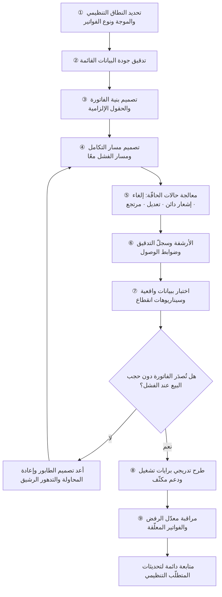

# الفوترة الإلكترونية (E-invoicing)

> [!info] تعريف مختصر
> إصدار الفواتير وحفظها وتبادلها في **صيغة إلكترونية منظَّمة يقرأها الحاسب** ضمن ضوابط يحدّدها المنظّم، بدل الفاتورة الورقية أو صورتها الرقمية. والتمييز جوهري: ملف PDF أو صورة ممسوحة ضوئيًّا ليس فاتورة إلكترونية بالمعنى التنظيمي، لأن الغاية ليست الاستغناء عن الورق بل إنتاج بيانات **موحّدة البنية وقابلة للتحقّق آليًّا** تحدّ من التهرّب الضريبي وتزيد شفافية المعاملات. وفي السوق السعودي انتقلت الفوترة الإلكترونية من ممارسة اختيارية إلى **شرط تنظيمي** تشرف عليه هيئة الزكاة والضريبة والجمارك، ما يجعلها بالنسبة لمنتجات `B2B` — من أنظمة المحاسبة إلى نقاط البيع إلى المنصّات متعدّدة الأطراف — قيدًا في التصميم لا ميزة إضافية: إن لم يكن منتجك متوافقًا، فهو غير قابل للاستخدام أصلًا عند شريحة كبيرة من العملاء.

## الشرح العلمي والاحترافي
- **لماذا وُجدت أصلًا؟** الفاتورة الورقية أو صورتها ثقيلة على الرقابة: لا يمكن التحقّق منها إلا بالفحص اليدوي أو التدقيق اللاحق، ويسهل تعديلها أو تكرارها أو إلغاؤها بلا أثر. الفوترة الإلكترونية تعالج هذا بثلاثة مبادئ: **بنية موحّدة** تجعل الحقول قابلة للقراءة الآلية، و**سلامة غير قابلة للتلاعب** عبر وسائل تقنية تربط الفاتورة بمصدرها وتكشف أي تعديل لاحق، و**قابلية التحقّق** من طرف ثالث أو من الجهة التنظيمية. والمكاسب المعلَنة عمومًا في الأدبيات التنظيمية: تقليص التهرّب الضريبي، وتسريع الإجراءات، وخفض كلفة الأرشفة والتدقيق، وتحسين جودة البيانات الاقتصادية.
- **الاتجاه العالمي**: تبنّي الفوترة الإلكترونية الإلزامية اتجاه واسع في عدد كبير من الدول، بنماذج مختلفة: نموذج يقتصر على تبادل مباشر بين الطرفين وفق معيار موحّد، ونموذج تمرّ فيه الفاتورة عبر الجهة الحكومية للاعتماد قبل أو بعد الإصدار (يُعرف عمومًا بنماذج **الإجازة/الاعتماد**). ولكل نموذج أثر مختلف تمامًا على تصميم المنتج، خاصّةً في مسألة التزامن: هل يستطيع النظام إصدار الفاتورة فورًا للعميل، أم يجب انتظار ردّ من جهة خارجية؟
- **حالة السوق السعودي — الوصف العامّ المنشور**: تُطبَّق الفوترة الإلكترونية على المكلَّفين الخاضعين لضريبة القيمة المضافة، تحت إشراف **هيئة الزكاة والضريبة والجمارك**، وقد جرى تطبيقها على **مرحلتين معلنتين**:
  - **مرحلة الإصدار والحفظ**: إلزام المنشآت بالتوقّف عن إصدار الفواتير يدويًّا أو بأدوات غير متوافقة، والانتقال إلى إصدارها وحفظها إلكترونيًّا عبر حلول تستوفي الضوابط، مع اشتراطات على محتوى الفاتورة وعناصرها.
  - **مرحلة الربط والتكامل**: إلزام بربط أنظمة الفوترة بمنظومة الهيئة لتبادل الفواتير أو بياناتها معها وفق الآلية المحدّدة، وهي المرحلة الأثقل تقنيًّا لأنها تُدخل طرفًا خارجيًّا في مسار الإصدار.
  ويجري الإلزام بمرحلة الربط **على مجموعات (موجات) متتالية** تُعلنها الهيئة، تُحدَّد عادةً بحسب حجم إيرادات المنشأة الخاضعة، بحيث تدخل المنشآت الأكبر أوّلًا ثم تتدرّج إلى الأصغر.
  > [!note] حدود هذه الوثيقة
  > المذكور أعلاه وصف عامّ للإطار كما هو منشور. **التفاصيل التقنية الدقيقة والمواعيد والحدود الرقمية لكل موجة تتغيّر وتُحدَّث بقرارات من الجهة التنظيمية، ولا يجوز الاعتماد على هذه الوثيقة فيها.** المرجع الملزم الوحيد هو الوثائق الرسمية الصادرة عن الهيئة وقت التنفيذ، ويجب مراجعتها مع مستشار ضريبي قبل أي قرار تصميم أو تعاقد.
- **التمييز بين نوعي الفاتورة**: تفرّق الأطر التنظيمية عادةً بين فاتورة المعاملات بين المنشآت (`B2B`) وفاتورة البيع للمستهلك النهائي (`B2C` / المبسّطة)، ولكلٍّ متطلّبات مختلفة في المحتوى وفي آلية التعامل مع الجهة التنظيمية. وهذا التمييز حاسم في تصميم المنتج: نظام نقاط بيع يخدم مطعمًا يواجه اشتراطات ومسارًا مختلفًا عن نظام يصدر فواتير عقود لشركات.
- **الأثر على تصميم منتجات `B2B` — أربعة محاور:**
  1. **التكامل**: لم يعد إصدار الفاتورة عملية داخلية مغلقة، بل قد يتضمّن نداءً إلى نظام خارجي. وهذا يفرض أسئلة هندسية جدّية: ماذا يحدث عند انقطاع الاتصال أو تأخّر الاستجابة؟ هل نمنع البيع أم نُصدر ونؤجّل المزامنة؟ كيف نُدير إعادة المحاولة وقائمة الانتظار وعدم التكرار (Idempotency)؟ وهي أسئلة [[Graceful Degradation]] و[[Circuit Breaker]] و[[Edge Cases]] بامتياز، ويجب أن تُحسم في مرحلة التصميم لا عند أول انقطاع.
  2. **الترميز والبنية**: يجب أن تُنتج بيانات الفاتورة بحقول منظَّمة موحّدة (هويّة البائع والمشتري، بنود، فئات ضريبية، عملة، مراجع، تسلسل) بدل نصّ حرّ. وهذا يعني ضبط **البيانات المرجعية** في المنتج ([[Master Data]]) وربطها بمصدر واحد موثوق ([[Single Source of Truth]])، لأن أي فوضى في ترميز المنتجات أو نسب الضريبة تتحوّل إلى فواتير مرفوضة.
  3. **الأرشفة والسلامة**: حفظ الفواتير لمدد نظامية بصيغة تحفظ سلامتها وقابليتها للاسترجاع والتدقيق، مع سجلّ تدقيق كامل لكل إصدار وتعديل وإلغاء ([[Audit Trail]])، ومراعاة ضوابط مكان الحفظ ([[Data Residency]]) وحماية البيانات الشخصية الواردة فيها ([[PDPL]]).
  4. **إدارة المراحل والموجات**: بما أن الإلزام يصل العملاء على دفعات، يجب أن يدعم المنتج **حالتين متزامنتين** لعملاء مختلفين في الفترة الانتقالية، وأن تُدار الإتاحة عبر [[Feature Flags]] لا عبر إصدارات منفصلة، وأن يُخطَّط الطرح تدريجيًّا ([[Progressive Delivery]] و[[Pilot Launch]]).
- **الأخطاء الشائعة في التنفيذ لا في الفهم**: أغلب إخفاقات مشاريع الفوترة الإلكترونية ليست في عدم معرفة المتطلّب، بل في: التأخّر حتى قرب موعد الإلزام، وتقدير المشروع بوصفه «تعديل قالب طباعة»، وإهمال حالات الحافّة (إلغاء، إشعار دائن، مرتجع، فاتورة تُعدَّل بعد إصدارها، عملات متعدّدة، عميل بلا رقم تسجيل ضريبي)، وعدم تصميم مسار الفشل، وإغفال جودة البيانات القائمة أصلًا في النظام.
- **البُعد التجاري**: التوافق التنظيمي **يرفع كلفة الدخول** إلى السوق ويصبح جزءًا من حاجز المنافسة؛ لكنه في المقابل لحظة يتغيّر فيها السوق كلّه دفعةً واحدة، فتتآكل مؤقّتًا [[Switching Cost]] لدى الأنظمة القديمة — فكل المنشآت مضطرّة إلى المراجعة على أي حال. هذه اللحظات التنظيمية من أخصب فرص [[Go-to-Market]] وأخطر تهديدات البقاء في آن واحد.

## أين ومتى يُستخدم
- **في تحليل متطلّبات أي منتج مالي أو تجاري** يعمل في السوق السعودي: نقاط بيع، محاسبة، تخطيط موارد، منصّات، أنظمة اشتراك ([[BRD]] و[[Software Requirements Specification]]).
- **في تقييم الجاهزية التنظيمية قبل الإطلاق**: يدخل التوافق ضمن معايير [[Go or No-Go Decision]] و[[Definition of Done]] لا كتحسين لاحق.
- **في تصميم تدفّق المدفوعات في المنصّات متعدّدة الأطراف**: من يصدر الفاتورة — المنصّة أم المورّد؟ وكيف تُعالج العمولة والتسوية ([[Two-sided Marketplace]] و[[Split Payment]]).
- **في حوكمة البيانات والامتثال**: أرشفة، سجلّات تدقيق، ضوابط الاحتفاظ والوصول ([[Governance]] و[[PDPL]] و[[Audit Trail]]).
- **في تخطيط الإصدارات وخارطة الطريق**: مواءمة جدول التطوير مع موجات الإلزام التي تصل العملاء تباعًا ([[Milestone]] و[[Feature Flags]]).
- **في إدارة المخاطر**: تُسجَّل مخاطر عدم التوافق وتأخّر الجهات والاعتماد على مزوّد خارجي في [[Risk Register]] بأثر واحتمال معلنين.

## مثال وسيناريو تطبيقي
> [!example] **الافتراض معلن: سيناريو تعليمي مُركَّب لشركة افتراضية في السوق السعودي؛ الأرقام للتوضيح، والتفاصيل التنظيمية عامّة ولا تُغني عن المرجع الرسمي.**
> شركة برمجيات افتراضية تبيع نظام إدارة عمليات لشركات التوزيع، لديها 620 عميلًا منشأةً في السعودية. أُبلغ الفريق أن جزءًا من عملائه سيدخل موجة الربط والتكامل، وأن البقية سيتبعون على دفعات لاحقة.
> **التقدير الأول للفريق**: «تعديل في قالب الفاتورة وإضافة رمز — ثلاثة أسابيع.» انتهى المشروع فعليًّا في **سبعة أشهر**، والفارق كلّه كان في ما لم يُحسب:
> - **جودة البيانات القائمة**: 31% من سجلّات العملاء بلا رقم تسجيل ضريبي أو بأرقام غير صالحة، و14% من أصناف المنتجات مرمّزة بنصّ حرّ («خصم»، «أخرى»، «رسوم») بلا فئة ضريبية واضحة. صار تنظيف البيانات وحده مشروعًا فرعيًّا استغرق نحو شهرين، بمشاركة العملاء أنفسهم عبر شاشة تصحيح موجَّهة.
> - **حالات الحافّة المهمَلة**: الفريق صمّم للمسار السعيد ([[Happy Path]]) وحده. ثم ظهرت: المرتجعات وإشعارات الدائن، وتعديل فاتورة بعد إصدارها، والفواتير الملغاة في اليوم نفسه، ومبيعات بعملات أخرى، ومبيعات لأفراد بلا تسجيل ضريبي، وفاتورة مجمّعة لعقد شهري. كلّ حالة استلزمت قرار تصميم مستقلًّا وتوثيقًا.
> - **الفشل التقني في مسار حرج**: في اختبار التحميل تبيّن أن تأخّر استجابة النظام الخارجي 4 ثوانٍ يوقف **شاشة البيع** لدى العميل. لو أُطلق كذلك، لكان التوقّف التنظيمي قد تحوّل إلى توقّف تجاري. أُعيد التصميم بمبدأ عدم حجب البيع: إصدار محلّي فوري + طابور مضمون التسليم مع إعادة محاولة تدريجية ومعرّف فريد لكل فاتورة يمنع الازدواج، ولوحة تشغيلية تُظهر الفواتير المعلَّقة، وتنبيه للمشغّل عند تجاوز حدّ زمني. أي **تدهور رشيق** بدل انهيار.
> - **الفترة الانتقالية**: كان على النظام أن يخدم في الوقت نفسه عملاء دخلوا الإلزام وعملاء لم يدخلوا بعد. حُلّت بـ[[Feature Flags]] على مستوى المنشأة مع سجلّ لتاريخ التفعيل، لا بإصدارين متوازيين.
> - **الأرشفة والتدقيق**: أُنشئ سجلّ تدقيق غير قابل للتعديل لكل إصدار وتعديل وإلغاء، مع سياسة احتفاظ ونسخ احتياطي وضوابط وصول، ومراجعة لموقع التخزين ([[Data Residency]]) ولمعالجة البيانات الشخصية داخل الفواتير ([[PDPL]]).
> - **الطرح**: أُطلق على 12 عميلًا في تشغيل تجريبي مُراقَب ([[Pilot Launch]]) لأربعة أسابيع مع دعم مكثّف ([[Hypercare]])، وكُشفت خلالها ثلاث مشكلات جوهرية قبل التعميم.
> **النتيجة التجارية غير المتوقّعة**: خلال المشروع تواصل مع الشركة 88 عميلًا محتملًا **من مستخدمي أنظمة منافسة** لم يوفّر مزوّدوهم توافقًا في الوقت. تحوّل الامتثال من كلفة إلى قناة اكتساب، لأن الموجة التنظيمية أجبرت السوق كلّه على المراجعة في اللحظة نفسها فتلاشت مؤقّتًا كلفة التحوّل. والدرس الذي وثّقه الفريق: **مشروع الامتثال ليس مشروع واجهة، بل مشروع بيانات وتكامل وحالات حافّة — ومن يبدأه مبكرًا يحوّله إلى ميزة، ومن يؤجّله يدفعه غرامةً وفقدان عملاء.**

## خطوات أو مخطّط
1. **حدّد النطاق التنظيمي بدقّة**: أي عملائك مشمولون؟ في أي موجة؟ وأي نوع فواتير يصدرون (`B2B` أم مبسّطة)؟ — بالرجوع إلى المصدر الرسمي ومستشار ضريبي.
2. **دقّق جودة البيانات القائمة أوّلًا**: أرقام التسجيل الضريبي، ترميز الأصناف، الفئات الضريبية، بيانات المنشأة. هذه عادةً أطول مسار في المشروع.
3. **صمّم بنية الفاتورة والحقول الإلزامية** وفق المتطلّب المنشور، واربطها ببيانات مرجعية واحدة موثوقة ([[Master Data]]).
4. **صمّم مسار التكامل ومسار الفشل معًا**: طابور، إعادة محاولة، منع ازدواج، حدّ زمني، وسياسة صريحة: هل نمنع البيع عند فشل التكامل أم لا؟
5. **عالج حالات الحافّة صراحةً**: إلغاء، إشعار دائن، تعديل، مرتجع، عملات، عميل بلا تسجيل، فاتورة مجمّعة ([[Edge Cases]]).
6. **ابنِ الأرشفة وسجلّ التدقيق**: صيغة الحفظ، مدّة الاحتفاظ، ضوابط الوصول، موقع التخزين، سلامة السجلّ ([[Audit Trail]]).
7. **اختبر بواقعية**: بيانات حقيقية مجهَّلة، وحجم ذروة، وسيناريوهات انقطاع الاتصال، وتشغيل تجريبي في بيئة مطابقة ([[Staging vs Production Environment]] و[[Data Dry Run]]).
8. **اطرح تدريجيًّا مع رايات تشغيل**: مجموعة صغيرة أولًا، ثم توسّع مع دعم مكثّف ومراقبة معدّل الرفض ([[Progressive Delivery]] و[[Hypercare]]).
9. **راقب واستمرّ**: عيّن مالكًا دائمًا لمتابعة تحديثات المتطلّبات التنظيمية، فالامتثال حالة مستمرّة لا مشروع ينتهي بالتسليم.

## ⚠️ مفاهيم خاطئة شائعة
> [!warning]
> - **«الفاتورة الإلكترونية = فاتورة PDF أو صورة»**: أشهر خطأ؛ الجوهر بيانات منظَّمة يقرأها الحاسب ضمن ضوابط سلامة وتحقّق، لا مجرّد الاستغناء عن الورق. إرسال صورة بالبريد لا يحقّق المتطلّب.
> - **اعتباره مشروع واجهة أو قالب طباعة**: المشروع في حقيقته **بيانات وتكامل وحالات حافّة وأرشفة**، ونصيب التصميم المرئي منه ضئيل. سوء التقدير هذا سبب متكرّر لتجاوز الجداول.
> - **الظنّ بأن المتطلّبات ثابتة**: الأطر التنظيمية تُحدَّث وتصدر لها إصدارات وتوضيحات، وتتوالى موجات الإلزام. أي منتج يعامل المتطلّب كصورة ثابتة سيجد نفسه خارج التوافق دون أن ينتبه.
> - **افتراض أن التوافق مسؤولية المزوّد وحده**: المكلَّف هو المسؤول نظاميًّا عن فواتيره؛ فاختيار حلّ متوافق لا ينقل المسؤولية، وعلى المنشأة التحقّق وضبط بياناتها وإجراءاتها.
> - **الخلط بين متطلّبات فاتورة `B2B` وفاتورة البيع للمستهلك**: لكلٍّ اشتراطات ومسار مختلف، ومعاملتهما بنفس المنطق تُنتج رفضًا أو مخالفة.
> - **الاعتقاد بأن التوافق يُنجَز مرّة واحدة**: هو حالة تشغيلية مستمرّة تحتاج مراقبة لمعدّل الرفض ومتابعة تحديثات وتدقيقًا دوريًّا، لا مشروعًا يُغلق ويُؤرشف.
> - **الاعتماد على معلومات غير رسمية عن المواعيد والحدود**: تتداول تواريخ وحدود رقمية في المدوّنات والمنتديات وقد تكون قديمة أو مبتورة. **المرجع الملزم هو المنشور الرسمي وقت التنفيذ وحده.**

## ❌ ممارسات خاطئة في المشاريع
> [!failure]
> - **الخطأ: تأجيل مشروع التوافق حتى تقترب مواعيد الإلزام.** → **لماذا يضرّ**: يضغط التطوير والاختبار في نافذة ضيّقة، فتُهمَل حالات الحافّة وجودة البيانات، وتُعرَّض المنشآت العميلة لمخالفات وتوقّف تشغيلي. → **الحل**: ابدأ من إعلان الإطار لا من موعد الإلزام، واجعل التوافق بندًا في خارطة الطريق بمالك ومراحل معلنة.
> - **الخطأ: تصميم مسار الإصدار بحيث يعتمد على استجابة فورية من نظام خارجي دون بديل.** → **لماذا يضرّ**: يحوّل أي انقطاع أو تباطؤ إلى توقّف كامل في نقطة البيع أو الفوترة، فتخسر المنشأة تشغيلها لسبب خارج عن سيطرتها. → **الحل**: افصل الإصدار عن الإرسال: أصدر محلّيًّا وضع الإرسال في طابور مضمون مع إعادة محاولة ومنع ازدواج ولوحة مراقبة ([[Graceful Degradation]] و[[Circuit Breaker]]).
> - **الخطأ: بدء التطوير قبل تدقيق جودة البيانات القائمة.** → **لماذا يضرّ**: يظهر أثر البيانات الرديئة في مرحلة الإطلاق على شكل فواتير مرفوضة بالجملة، فيتحوّل الإطلاق إلى أزمة دعم. → **الحل**: اجعل تدقيق البيانات وتنظيفها مرحلة أولى بمخرجات قابلة للقياس، وامنح العملاء أدوات تصحيح ذاتية قبل التفعيل.
> - **الخطأ: بناء الحلّ للمسار السعيد فقط.** → **لماذا يضرّ**: تظهر الإلغاءات والمرتجعات والتعديلات في الأسبوع الأول من التشغيل، وتُعالَج يدويًّا خارج النظام فيفسد سجلّ التدقيق نفسه. → **الحل**: اجعل حالات الحافّة جزءًا من [[Definition of Done]]، واختبرها بسيناريوهات مكتوبة قبل الطرح.
> - **الخطأ: إهمال الأرشفة وسجلّ التدقيق باعتبارهما تفصيلًا لاحقًا.** → **لماذا يضرّ**: عند أول تدقيق تعجز المنشأة عن إثبات سلسلة الأحداث، وقد يتعذّر استرجاع فواتير مطلوبة نظاميًّا. → **الحل**: صمّم سجلًّا غير قابل للتعديل وسياسة احتفاظ ووصول منذ اليوم الأول، وراجعها مع الامتثال ([[Governance]]).
> - **الخطأ: طرح التوافق على كامل قاعدة العملاء دفعةً واحدة.** → **لماذا يضرّ**: أي خلل يصيب الجميع في يوم واحد وفي مسار مالي حرج لا يحتمل التوقّف. → **الحل**: طرح تدريجي مع تشغيل تجريبي محدود ودعم مكثّف ومعايير عودة واضحة ([[Rollback]] و[[Pilot Launch]]).
> - **الخطأ: نسخ متطلّبات تنظيمية من دولة إلى أخرى بافتراض التشابه.** → **لماذا يضرّ**: النماذج التنظيمية مختلفة جذريًّا بين الدول، والافتراض الخاطئ يُنتج بنية غير قابلة للتوافق يصعب تعديلها لاحقًا. → **الحل**: عامل كل سوق كمتطلّب مستقلّ، وابنِ طبقة تجريد للفوترة تسمح باختلاف القواعد لكل بلد.
> - **الخطأ: اعتبار المشروع منتهيًا عند التسليم وإغلاق فريقه.** → **لماذا يضرّ**: تصدر تحديثات وتوضيحات وموجات جديدة، فيتآكل التوافق بصمت حتى تظهر المشكلة في تدقيق أو رفض جماعي. → **الحل**: عيّن مالكًا دائمًا لمراقبة المتطلّب والمؤشّرات التشغيلية (معدّل الرفض، الفواتير المعلّقة) ضمن التشغيل المستمرّ.

## 🔗 مصطلحات ومفاهيم ذات صلة
[[PDPL]] | [[Governance]] | [[Audit Trail]] | [[Data Residency]] | [[Master Data]] | [[Single Source of Truth]] | [[Two-sided Marketplace]] | [[Split Payment]] | [[KYC]] | [[Switching Cost]] | [[Feature Flags]] | [[Progressive Delivery]] | [[Pilot Launch]] | [[Hypercare]] | [[Edge Cases]] | [[Graceful Degradation]] | [[Circuit Breaker]] | [[Risk Register]]
