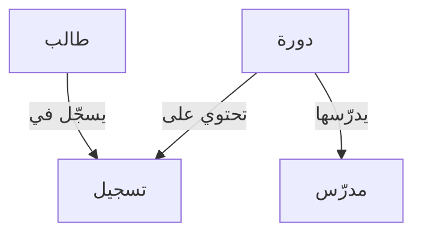

# مخطط الكيانات والعلاقات (ERD)

> [!info] تعريف مختصر
> مخطط الكيانات والعلاقات (Entity Relationship Diagram – ERD) هو رسم بياني يوضّح الكيانات الرئيسية في نظام ما (مثل "المستخدم" و"الطلب") والعلاقات بينها، ويُستخدم لتصميم قواعد البيانات قبل بنائها فعلياً.

## الشرح العلمي والاحترافي
- الكيان (Entity) يمثّل شيئاً له وجود مستقل في النظام، مثل "عميل" أو "منتج" أو "فاتورة"، ويصبح غالباً جدولاً (Table) في قاعدة البيانات.
- كل كيان له خصائص (Attributes) مثل "الاسم" و"البريد الإلكتروني" لكيان العميل، وتصبح هذه الخصائص أعمدة (Columns) في الجدول.
- العلاقة (Relationship) توضّح كيف يرتبط كيان بآخر، ولها أنواع أساسية: علاقة واحد لواحد (One-to-One)، وواحد لكثير (One-to-Many)، وكثير لكثير (Many-to-Many).
- يهم هذا المخطط لأنه يكشف مشاكل التصميم مبكراً، قبل كتابة أي كود، ويمنع إعادة هيكلة مكلفة لقاعدة البيانات لاحقاً؛ فكلما اكتُشف خطأ التصميم متأخراً، ارتفعت تكلفة إصلاحه وفق منحنى تكلفة التغيير ([[Cost-of-Change Curve]]).
- يُستخدم مع رموز قياسية مثل "أعداد المطابقة" (Cardinality) التي تحدد عدد النسخ المسموح بها في كل جهة من العلاقة.
- يمثّل ERD أحياناً جزءاً من وثيقة متطلبات النظام (Software Requirements Specification) أو من مخرجات التحليل الفني قبل مرحلة التطوير.

## أين ومتى يُستخدم
- في مرحلة تحليل المتطلبات وتصميم النظام، سواء في مشاريع الشلال ([[04 - Waterfall]]) أو قبل بدء سبرنتات ([[14 - Sprint]]) تخص بناء قاعدة بيانات جديدة في أجايل.
- عند بناء ميزة جديدة تتطلب جداول بيانات مترابطة، يرسمه المهندس المعماري (Architect) أو مطوّر قواعد البيانات (Database Developer) قبل كتابة كود الترحيل (Migration).
- يُستخدم كمرجع مشترك بين المطوّرين والمحلّلين، ويُدرج غالباً ضمن وثائق يعتمدها الفريق كمصدر وحيد للحقيقة ([[Single Source of Truth]]).
- يُراجع عند حدوث طلب تغيير ([[Change Request]]) يمس بنية البيانات، لتقييم أثره قبل التنفيذ.

## مثال وسيناريو تطبيقي
> [!example] سيناريو
> فريق يبني منصة "تعليم إلكتروني" جديدة اسمها "دروسي". قبل بدء البرمجة، رسمت مهندسة قواعد البيانات مخطط ERD يضم كيانات: "طالب"، "دورة"، "تسجيل"، و"مدرّس".
> اكتشفت أن العلاقة بين "طالب" و"دورة" هي علاقة كثير لكثير (طالب واحد يسجّل في عدة دورات، والدورة الواحدة بها عدة طلاب)، فأضافت كياناً وسيطاً اسمه "تسجيل" (Enrollment) يحتوي تاريخ التسجيل والدرجة النهائية.
> بفضل هذا المخطط، اكتُشف قبل كتابة أي سطر كود أن حقل "الدرجة" يجب أن يكون في جدول "تسجيل" وليس في جدول "طالب"، لأن الطالب قد تكون له درجات مختلفة في كل دورة. هذا وفّر على الفريق إعادة هيكلة مؤلمة لاحقاً.

## خطوات أو مخطّط
1. تحديد الكيانات الرئيسية: حصر كل "الأشياء" المهمة التي يجب تخزين بيانات عنها.
2. تحديد خصائص كل كيان: تعداد الحقول المطلوبة لكل كيان (الاسم، التاريخ، الحالة...).
3. تحديد العلاقات: تحديد كيف يرتبط كل كيان بالآخر ونوع العلاقة (واحد لواحد، واحد لكثير، كثير لكثير).
4. رسم المخطط: استخدام أداة مثل dbdiagram أو Lucidchart أو حتى ورقة وقلم لرسم الكيانات والعلاقات بصرياً.
5. المراجعة مع الفريق: عرض المخطط على المطوّرين والمحلّلين للتأكد من تغطيته كل حالات الاستخدام.
6. الترجمة إلى قاعدة بيانات فعلية: تحويل المخطط إلى جداول SQL أو مستندات NoSQL فعلية.

## ⚠️ مفاهيم خاطئة شائعة
> [!warning]
> - الاعتقاد أن ERD مجرد رسم زخرفي غير ملزم؛ في الواقع هو المخطط الفعلي الذي يُبنى عليه هيكل قاعدة البيانات، وأي خطأ فيه ينتقل مباشرة إلى الكود.
> - الخلط بين ERD ومخطط تدفق العمليات (Flowchart)؛ ERD يوضّح "البيانات وعلاقاتها" وليس "تسلسل الخطوات أو القرارات".
> - الظن بأن رسم ERD مرة واحدة في بداية المشروع يكفي إلى الأبد؛ في الواقع يحتاج تحديثاً كلما تغيّرت متطلبات البيانات أو أُضيفت ميزات جديدة.

## ❌ ممارسات خاطئة في المشاريع
> [!failure]
> - البدء في كتابة كود قاعدة البيانات مباشرة دون رسم ERD، مما يؤدي لاكتشاف أخطاء التصميم بعد إدخال بيانات حقيقية، حين يصبح الإصلاح مكلفاً جداً. التجنب: تخصيص وقت لتصميم ERD قبل أي سطر كود، مهما كان المشروع صغيراً.
> - تجاهل تحديث ERD بعد كل تعديل على بنية قاعدة البيانات، فيصبح المخطط غير مطابق للواقع ويُضلّل أعضاء الفريق الجدد. التجنب: اعتماد ERD كوثيقة حية تُحدَّث مع كل طلب تغيير ([[Change Request]]) يمس البيانات.
> - تصميم علاقات كثير لكثير مباشرة بين كيانين دون كيان وسيط، مما يجعل تخزين بيانات إضافية عن العلاقة نفسها (كتاريخ الحدث أو حالته) مستحيلاً لاحقاً. التجنب: التفكير مسبقاً في أي بيانات قد تُضاف للعلاقة نفسها واستخدام كيان وسيط عند الحاجة.

## 🔗 مصطلحات ومفاهيم ذات صلة
[[Software Requirements Specification]] | [[Cost-of-Change Curve]] | [[Single Source of Truth]] | [[Change Request]] | [[BRD]] | [[04 - Waterfall]] | [[Technical Debt]] | [[Edge Cases]]
