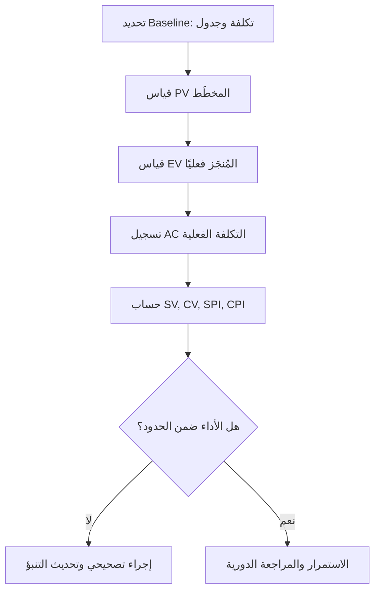

# إدارة القيمة المكتسبة (EVM)

> [!info] تعريف مختصر
> إدارة القيمة المكتسبة (Earned Value Management أو EVM) هي أسلوب تحليلي يقيس أداء المشروع في التكلفة والجدول الزمني معًا، بمقارنة العمل المخطَّط له بالعمل المُنجَز فعليًا والمال المُنفَق فعليًا. تُنتج EVM أرقامًا موضوعية تكشف هل المشروع متأخر أو متجاوز للميزانية قبل فوات الأوان.

## الشرح العلمي والاحترافي
تقوم EVM على ثلاثة أرقام أساسية تُحسب في أي نقطة زمنية من المشروع:
- **القيمة المخطَّطة (PV – Planned Value)**: قيمة العمل الذي كان يُفترض إنجازه حتى الآن حسب الخطة الأصلية (Baseline).
- **القيمة المكتسبة (EV – Earned Value)**: قيمة العمل الذي أُنجز فعليًا حتى الآن، مقاسة بميزانية ذلك العمل.
- **التكلفة الفعلية (AC – Actual Cost)**: المبلغ الذي أُنفق فعليًا لإنجاز العمل حتى الآن.

من هذه الأرقام تُشتق مقاييس الانحراف والأداء:
- **انحراف الجدول (SV = EV − PV)**: هل نحن متقدّمون أم متأخّرون عن الخطة؟
- **انحراف التكلفة (CV = EV − AC)**: هل أنفقنا أكثر أو أقل مما تستحقه القيمة المُنجزة؟
- **مؤشّر أداء الجدول (SPI) ومؤشّر أداء التكلفة (CPI)**: نسب توضّح الكفاءة، وتُستخدم للتنبؤ بتكلفة المشروع النهائية (EAC) وتاريخ انتهائه المتوقع، انظر [[CPI and SPI]].

أهمية EVM أنها لا تكتفي بالسؤال "كم أنفقنا؟" أو "كم أنجزنا؟" منفردَين، بل تربط الاثنين بالخطة الأصلية، فتكشف حالات خادعة مثل إنفاق أقل من الميزانية مع تأخّر فعلي كبير في الجدول، وهو ما لا تكشفه المقارنة المالية البسيطة وحدها.

## أين ومتى يُستخدم
- تُستخدم أساسًا في المشاريع ذات الطابع التقليدي أو الهجين (Waterfall أو Hybrid) التي لديها خط أساس واضح للتكلفة والجدول ([[Performance Measurement Baseline]])، وهي ركيزة معيار PMI (PMBOK).
- شائعة في المشاريع الحكومية والإنشائية والدفاعية والعقود الكبيرة التي تتطلب تقارير أداء دورية رسمية للجهات الممولة.
- تُطبَّق بشكل دوري (أسبوعي أو شهري) طوال دورة حياة المشروع، وتحديدًا في اجتماعات مراجعة الأداء وتقارير الحالة للإدارة العليا وأصحاب المصلحة.
- في المشاريع الرشيقة (Agile) البحتة تُستبدل غالبًا بمقاييس أبسط مثل مخطط الاحتراق (Burnup Chart) والسرعة (Velocity)، لكن بعض المؤسسات الهجينة تُطبّق EVM على مستوى البرنامج (Program) فوق سباقات Scrum.

## مثال وسيناريو تطبيقي
> [!example] مشروع بناء منصة تجارة إلكترونية بميزانية إجمالية 400,000 دولار على مدى 10 أشهر. عند نهاية الشهر الرابع، كانت الخطة الأصلية تفترض إنجاز 40% من العمل (PV = 160,000 دولار). عند القياس الفعلي، تبيّن أن الفريق أنجز فعليًا ما يعادل 30% من العمل (EV = 120,000 دولار)، وأنفق حتى الآن 150,000 دولار (AC = 150,000 دولار).
> - انحراف الجدول SV = 120,000 − 160,000 = −40,000 دولار (متأخر عن الخطة).
> - انحراف التكلفة CV = 120,000 − 150,000 = −30,000 دولار (تجاوز في الإنفاق).
> - SPI = 120,000 / 160,000 = 0.75، وCPI = 120,000 / 150,000 = 0.80.
> مدير المشروع استخدم هذه الأرقام لإبلاغ الإدارة بأن المشروع سيتأخر تقريبًا شهرين عن الموعد الأصلي وسيتجاوز الميزانية بنحو 25% إذا استمر الأداء بنفس الوتيرة، وطلب موارد إضافية أو إعادة جدولة قبل أن تتفاقم المشكلة.

## خطوات أو مخطّط
1. وضع خط أساس (Baseline) واضح للتكلفة والجدول قبل بدء التنفيذ.
2. تحديد PV لكل نقطة زمنية بناءً على الخطة.
3. قياس EV دوريًا بناءً على العمل المُنجَز فعليًا (وليس الجهد المبذول).
4. تسجيل AC من سجلات المصروفات الفعلية.
5. حساب SV وCV وSPI وCPI، ومقارنتها بحدود التسامح المتفق عليها.
6. التنبؤ بالتكلفة والموعد النهائيَّين (EAC وETC) واتخاذ إجراء تصحيحي إن لزم.

## ⚠️ مفاهيم خاطئة شائعة
> [!warning]
> - الخلط بين "التكلفة الفعلية المنفقة" و"القيمة المكتسبة": إنفاق المال لا يعني أن عملًا مكافئًا قد أُنجز فعليًا.
> - الاعتقاد بأن EVM تقيس الجودة أو رضا العميل: هي تقيس فقط الالتزام بالتكلفة والجدول، ولا تخبرك إن كان الناتج مطابقًا لمعايير الجودة.
> - افتراض أن SPI وCPI جيدان دائمًا فوق 1: قيمة أعلى بكثير من 1 قد تعني تقديرًا أوليًا للميزانية أو الجدول كان متحفظًا جدًا.

## ❌ ممارسات خاطئة في المشاريع
> [!failure]
> - **قياس EV بناءً على "نسبة الوقت المنقضي" بدلًا من العمل المُنجَز فعليًا**: يُنتج أرقامًا مضلِّلة توحي بتقدّم وهمي. الحل: اعتماد معايير موضوعية للإنجاز (مثل اكتمال معالم محددة أو معايير قبول واضحة).
> - **تحديث Baseline باستمرار لتغطية أي تأخير**: يُفقد EVM قيمته كأداة إنذار مبكر. الحل: تغيير خط الأساس فقط عبر عملية رسمية لإدارة التغيير (Change Request) موثّقة ومبرَّرة.
> - **الاكتفاء بحساب الأرقام دون التصرف بناءً عليها**: تتحول EVM إلى تقرير شكلي لا قيمة عملية له. الحل: ربط كل انحراف جوهري بخطة تصحيحية واضحة المسؤول والموعد.

## 🔗 مصطلحات ومفاهيم ذات صلة
[[CPI and SPI]] | [[Performance Measurement Baseline]] | [[Baseline]] | [[Critical Path]] | [[Gantt Chart]] | [[Contingency Reserve]] | [[Change Request]] | [[Business Case]] | [[04 - Waterfall]]
