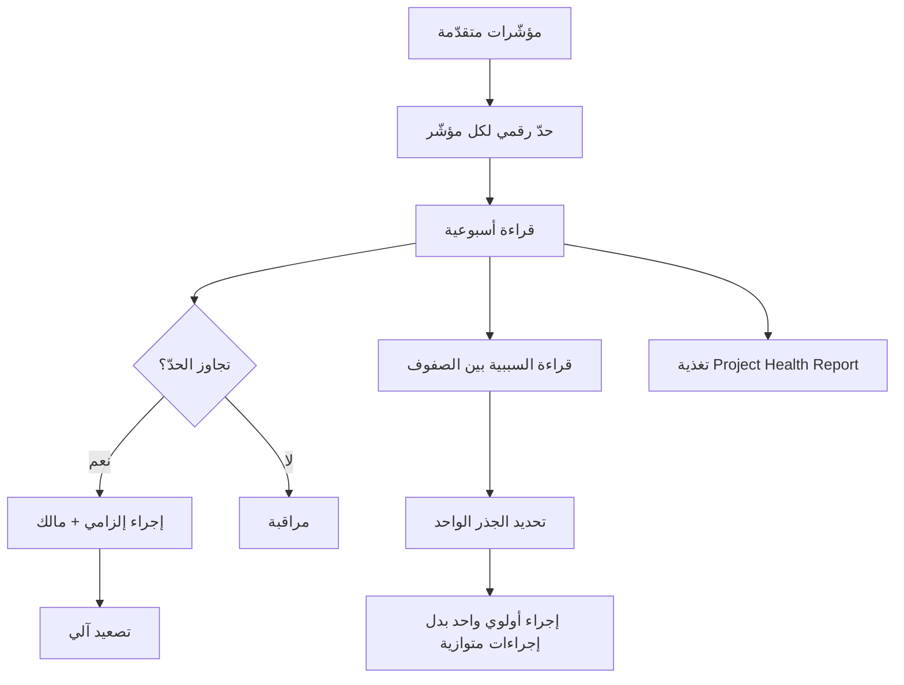

---
title: "Early Warning Dashboard — لوحة الإنذار المبكر"
aliases: [Early Warning Dashboard, لوحة الإنذار المبكر, مؤشرات الإنذار, Leading Indicators]
type: مصطلح
area: "[[Project Management]]"
tags:
  - إدارة-المشاريع
  - معجم
  - مخاطر
status: لم يبدأ
---
# لوحة الإنذار المبكر (Early Warning Dashboard)

> [!info] تعريف مختصر
> **لوحة الإنذار المبكر** ليست تقريراً بل **جهاز قياس**: مجموعة مؤشّرات قليلة، لكل منها **حدّ رقمي (`Threshold`)** وقراءة حالية و**إجراء إلزامي** عند تجاوز الحدّ. غرضها رؤية الأزمة قبل وقوعها لا وصفها بعده. والقاعدة الحاكمة التي تصنعها وتحكم كل صفّ فيها: **أيّ مؤشّر لا يقود قراراً ليس مؤشّراً مفيداً.**

## الشرح العلمي والاحترافي

- **الفرق الجوهري بين المؤشّر المتقدّم والمتأخّر**:
  | | `Lagging Indicator` (متأخّر) | `Leading Indicator` (متقدّم) |
  |---|---|---|
  | مثال | تجاوز الجدول · تجاوز الميزانية | تأخّر القرارات · جاهزية البيانات |
  | متى يظهر؟ | **بعد** وقوع الضرر | **قبله** |
  | ما ينفع فيه | التوثيق والاعتذار | **التدخّل** |
  
  ولوحة الإنذار المبكر مبنيّة بالكامل من المؤشّرات المتقدّمة. ولهذا لا تجد فيها «نسبة إنجاز المشروع».

- **البنية الإلزامية لكل صفّ**: `Indicator` · `Threshold` · `Current` · `Status` · **`Action`** · `Owner`. والعمود قبل الأخير هو **شرط القبول**: لا يُدرَج مؤشّر بلا إجراء مقابل. وهذا وحده يفرّقها عن `Status Report`.

- **المؤشّرات الستة القياسية في مشاريع الأنظمة المؤسسية**:
  | المؤشّر | الحدّ | ما يعنيه | الإجراء |
  |---|---|---|---|
  | `Decision Delay` | > 48 ساعة أو > 3 قرارات معلّقة | **المشروع ينتظر** | تصعيد |
  | `Data Readiness` | < 80% | خطر على الإطلاق | `Data War Room` |
  | `Change Requests` | > 2 أسبوعياً | **النطاق يتضخّم** | تجميد النطاق |
  | `UAT Pass Rate` | < 85% | النظام غير جاهز | دورة اختبار إضافية |
  | `Rework Rate` | > 15–20% | **التحليل ضعيف** | مراجعة السبب الجذري |
  | `Critical Bugs` | > 0 قبل الإطلاق | `No-Go` محتمل | تجميد الإصدار |

- **العلاقة بـ[[RAID Log]]**: العلاقة ليست تكراراً بل تكاملاً:
  | `RAID Log` | `Early Warning Dashboard` |
  |---|---|
  | يسجّل **ما قد يحدث** | يقيس **ما يحدث الآن** |
  | يُحدَّث عند ظهور خطر جديد | يُحدَّث أسبوعياً بأرقام |
  | عمود `Trigger` = شرط | عمود `Current` = القراءة الفعلية |
  
  **كل `Trigger` في السجلّ يجب أن يقابله صفّ في اللوحة.** فالسجلّ يحدّد متى نتصرّف، واللوحة تخبرنا هل حان الوقت.

- **قراءة السببية بين الصفوف**: أخطر ما يُفوَّت هو قراءة الصفوف منفصلة. المؤشّرات في الواقع سلسلة:
  ```
  تأخّر القرارات → بناء على فهم ناقص → إعادة عمل → أخطاء حرجة → انخفاض نجاح الاختبار
  ```
  والجذر واحد. ومعالجة إعادة العمل أو الأخطاء مباشرة **علاج للعَرَض**. وهذا تطبيق لقاعدة التدفّق: تحسين أي شيء غير الاختناق لا أثر له.

- **حدود الأداة**: اللوحة **لا توقف المشروع تلقائياً**. مشروع بثلاثة مؤشّرات حمراء قد يمضي إلى `Conditional Go` — وهذا مقبول. قيمة اللوحة أنها تمنع الادّعاء بأن أحداً لم يكن يعلم، وتجعل قرار المضيّ **قراراً واعياً موثّقاً** لا غفلة.

## أين ومتى يُستخدم
- تُحدَّث **أسبوعياً** وتُعرض في مراجعة الأسبوع كبند ثابت أول.
- كمصدر مباشر لأبعاد [[Project Health Report|تقرير صحّة المشروع]] الشهري.
- في **مسار التصعيد**: تجاوز أي حدّ هو المُطلِق الرسمي للتصعيد — لا انطباع أحد.
- عند **اقتراب الإطلاق**: تصبح المؤشّرات بوّابات جاهزية بجدول عكسي (`T-30` بيانات 80%، `T-14` اختبار 85%).
- في **إدارة المورّدين**: بعض صفوفها مشتقّ من [[Vendor Scorecard|بطاقة تقييم المورّد]].

## مثال وسيناريو تطبيقي
> [!example] شركة توزيع — خمسة صفوف كشفت جذراً واحداً
> | المؤشّر | الحدّ | القراءة | الحالة | الإجراء |
> |---|---|---|---|---|
> | `Decision Delay` | > 48h | **72h** | 🔴 | تصعيد |
> | `Data Readiness` | < 80% | **65%** | 🔴 | `Data War Room` |
> | `UAT Pass Rate` | < 85% | 81% | 🟡 | دعم إضافي |
> | `Rework` | > 15% | **22%** | 🔴 | مراجعة السبب الجذري |
> | `Critical Bugs` | > 0 | **2** | 🔴 | تجميد الإصدار |
>
> **القراءة السطحية:** أربعة مؤشّرات خارج الحدّ — مشروع متعثّر.
>
> **القراءة الصحيحة:** الصفوف ليست مستقلّة. تأخّر القرارات 72 ساعة أدّى إلى بناء على متطلبات غير معتمدة، فارتفعت إعادة العمل إلى 22%، فأنتجت أخطاءً حرجة، فانخفض نجاح الاختبار إلى 81%. **الجذر واحد: تأخّر القرارات.**
>
> **الأثر على القرار:** بدل أربعة إجراءات متوازية (مراجعة جودة، ودورة اختبار إضافية، وتجميد إصدار، وتصعيد)، صار الإجراء الأولوي واحداً: **`SLA` للقرارات ومالك قرار وحيد**. والثلاثة الباقية إجراءات احتواء مؤقّتة.
>
> **ولاحظ أثراً ثانياً:** نفس المؤشّر (`Decision Delay` = 72 ساعة) هو الذي رفع [[Reality Factor]] إلى 2.2 وضاعف مدّة المشروع. أي أن اللوحة لا ترصد المشكلة فحسب — بل **تُسعّرها**.

## خطوات أو مخطّط
1. اختر مؤشّرات **متقدّمة** فقط — واحذف كل مؤشّر لا يقود قراراً.
2. حدّد حدّاً **رقمياً** لكل مؤشّر (لا وصفياً).
3. اكتب إجراءً إلزامياً ومالكاً لكل حدّ.
4. اربط كل مؤشّر بـ`Trigger` مقابل في [[RAID Log]].
5. حدّث القراءات أسبوعياً بتاريخ قراءة معلن.
6. **اقرأ السببية بين الصفوف** قبل إطلاق إجراءات متوازية.
7. صعّد آلياً عند التجاوز — لا بقرار شخصي.
8. غذِّ [[Project Health Report]] من هذه اللوحة لا من الانطباع.



## ⚠️ مفاهيم خاطئة شائعة
> [!warning]
> - **الخلط بينها وبين `Status Report`**: التقرير يصف الماضي، واللوحة تنذر بالمستقبل وتفرض إجراءً.
> - **إدراج مؤشّرات لا تقود قراراً**: «نسبة إنجاز المشروع 70%» لا تخبرك هل تصعّد أم تجمّد أم تمدّد. احذفها.
> - **الظنّ بأن كثرة المؤشّرات قوّة**: اللوحة الطويلة لا تُقرأ. ستّة مؤشّرات تقود قرارات أنفع من عشرين تصف حالات.
> - **استخدام حدود وصفية**: «إذا تأخّرت البيانات» يحتمل التأويل ويؤجّل النقاش إلى ما بعد الأزمة. الحدّ رقم.
> - **افتراض أن الأحمر يوقف المشروع**: اللوحة تُعلم وتفرض إجراءً؛ وقرار المضيّ يبقى قراراً إدارياً واعياً.
> - **قراءة الصفوف منفصلة**: يُنتج إجراءات متوازية تعالج الأعراض وتترك الجذر.

## ❌ ممارسات خاطئة في المشاريع
> [!failure]
> - **لوحة بلا عمود إجراء**: تتحوّل إلى عرض ألوان. الحلّ: لا يُقبل صفّ بلا إجراء ومالك.
> - **حدود مختلفة في وثائق مختلفة**: مؤشّر بحدّين ليس مؤشّراً. الحلّ: وثّق الحدّ في مكان واحد، أو اعتمد تدرّجاً معلناً (أصفر عند 15% وأحمر عند 20%).
> - **تحديث اللوحة قبل الاجتماع مباشرة بأرقام تقديرية**: يفقدها مصداقيتها. الحلّ: مصدر بيانات محدّد لكل مؤشّر وتاريخ قراءة معلن.
> - **إهمال مؤشّر تضخّم النطاق**: أشيع مؤشّر مفقود، رغم أنه الوحيد الذي يرصد الزحف قبل ظهوره في الجدول. الحلّ: أدرج معدّل طلبات التغيير الأسبوعي.
> - **عدم مزامنتها مع [[RAID Log]]**: يجعل السجلّ أرشيفاً واللوحة معزولة. الحلّ: كل `Trigger` في السجلّ = صفّ في اللوحة.
> - **التصعيد بلغة اللوم**: يُقابَل بالدفاع. الحلّ: صعّد بلغة الأثر المُسعَّر — «كل يوم تأخير يكلّف كذا».

## 🔗 مصطلحات ومفاهيم ذات صلة
[[RAID Log]] | [[Project Health Report]] | [[Reality Factor]] | [[Vendor Scorecard]] | [[19 - Risk Management]] | [[SLA]] | [[Go or No-Go Decision]] | [[19 - Early Warning Dashboard]]
