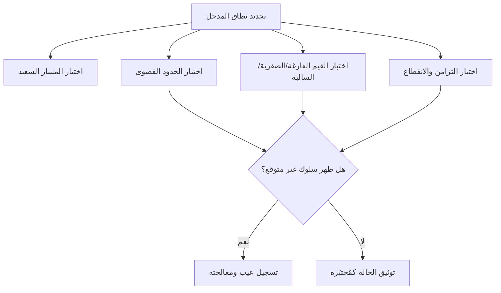

# الحالات الحافّة (Edge Cases)
> [!info] تعريف مختصر
> الحالات الحافّة هي سيناريوهات نادرة أو متطرفة تقع عند الحدود القصوى لمدخلات النظام أو ظروف تشغيله، ولا تظهر في الاستخدام العادي، لكنها قد تكشف عن عيوب خطيرة إذا لم تُختبر.

## الشرح العلمي والاحترافي
- أغلب الاختبارات تغطي "المسار السعيد" (Happy Path): المستخدم يُدخل بيانات صحيحة ومتوقعة والنظام يستجيب كما هو مخطَّط. لكن الأنظمة الحقيقية تواجه مدخلات غير متوقعة، وهنا تظهر أهمية الحالات الحافّة.
- أمثلة نمطية على حالات حافّة: حقل فارغ، رقم سالب حيث يُتوقع رقم موجب فقط، قيمة صفر، أكبر عدد ممكن (Overflow)، نص طويل جدًا، تاريخ 29 فبراير في سنة كبيسة، انقطاع الاتصال بالإنترنت أثناء عملية دفع، محاولة تسجيل دخول متزامنة لنفس الحساب من جهازين.
- تختلف الحالة الحافّة عن الحالة غير الصالحة (Invalid Input) العادية: الحالة الحافّة تقع عند "الحد الفاصل" بين ما هو صالح وما هو غير صالح، بينما الحالة غير الصالحة قد تكون أبعد من ذلك بكثير (مثل إدخال حروف في حقل رقمي).
- تحليل الحالات الحدّية (Boundary Value Analysis) هو أسلوب اختبار رسمي يعتمد على فحص القيم عند حدود النطاق المسموح به (الحد الأدنى، الحد الأدنى ناقص واحد، الحد الأقصى، الحد الأقصى زائد واحد)، وهو أداة أساسية لاكتشاف الحالات الحافّة بشكل منهجي.
- إغفال الحالات الحافّة سبب شائع جدًا لظهور عيوب في الإنتاج رغم اجتياز الاختبارات الأساسية، ولهذا ترتبط ارتباطًا وثيقًا بـ[[Risk-Based Testing]] و[[Escaped Defect Rate]].

## أين ومتى يُستخدم
- عند كتابة معايير القبول لأي [[11 - User Stories]]: يجب أن تتضمن الحالات الحافّة لا المسار السعيد فقط.
- في مرحلة تصميم حالات الاختبار (Test Case Design) قبل [[UAT]] أو [[Regression Testing]].
- في مراجعات الكود (Code Review) للتأكد أن المطور تعامل مع المدخلات غير المتوقعة.
- عند تحليل الأعطال في الإنتاج غالبًا يتضح أن السبب حالة حافّة لم تُختبر مسبقًا (انظر [[Root Cause Analysis]]).

## مثال وسيناريو تطبيقي
> [!example] طوّر فريق نظام تحويل أموال بين حسابات بنكية. غطّت الاختبارات الأساسية تحويل مبالغ عادية مثل 500 و1000 ريال بنجاح. لكن عند اختبار الحالات الحافّة، اكتُشفت ثلاث مشاكل خطيرة:
> 1. تحويل مبلغ 0.00 ريال كان يُنفَّذ فعليًا ويُنشئ سجل عملية فارغة في كشف الحساب.
> 2. تحويل كامل الرصيد بالضبط (100.00 ريال من رصيد 100.00 ريال) كان يفشل بسبب خطأ تقريب في الفاصلة العشرية، فيتبقى 0.0000001 ريال يعلّق الحساب.
> 3. تحويلان متزامنان من نفس الحساب خلال ثانية واحدة (Race Condition) تسبّبا في سحب المبلغ مرتين قبل تحديث الرصيد.
> لولا اختبار هذه الحالات الحدّية المتطرفة، لكانت هذه المشاكل ستظهر لدى عملاء حقيقيين وتسبب خسائر مالية وثقة.

## خطوات أو مخطّط
1. تحديد نطاق كل مُدخل (الحد الأدنى والحد الأقصى المسموح به).
2. اختبار القيم عند الحدود مباشرة (Boundary Value Analysis): أقل قيمة، أعلى قيمة، وما حولهما.
3. اختبار القيم الفارغة أو الصفرية أو السالبة حيث لا يُتوقع حدوثها.
4. اختبار الحمل الزمني والتزامن (طلبات متزامنة، انقطاع اتصال مفاجئ).
5. توثيق كل حالة حافّة مكتشَفة وربطها بمعيار قبول واضح لمنع تكرار إغفالها.

## ⚠️ مفاهيم خاطئة شائعة
> [!warning]
> - الاعتقاد بأن الحالات الحافّة "نادرة جدًا فلا تستحق الاختبار"؛ في الواقع كثير من أعطال الإنتاج الكبرى سببها حالة حدّية بسيطة أُهملت.
> - الخلط بين الحالة الحافّة والمدخل غير الصالح تمامًا؛ الأولى تقع عند حدود النطاق الصحيح وتتطلب تفكيرًا أدق، بينما الثانية أوضح وأسهل اكتشافًا.
> - افتراض أن المطور وحده مسؤول عن التفكير في الحالات الحافّة؛ في الواقع فريق الجودة وصاحب المنتج يشاركون في تحديدها ضمن معايير القبول.

## ❌ ممارسات خاطئة في المشاريع
> [!failure]
> - كتابة قصص المستخدم دون تحديد معايير قبول تغطي الحالات الحافّة، فيُترك الأمر لتقدير المطور الشخصي. الحل: تضمين الحالات الحافّة صراحة عند كتابة القصة (انظر [[INVEST Criteria]]).
> - الاكتفاء باختبار المسار السعيد قبل الإصدار بسبب ضغط الوقت. الحل: إعطاء أولوية للحالات الحافّة عالية الخطورة عبر [[Risk-Based Testing]] بدل حذفها بالكامل.
> - عدم توثيق الحالات الحافّة المكتشفة سابقًا، فتُنسى وتظهر كعيب متكرر (انظر [[Reopen]]). الحل: إضافتها إلى مجموعة اختبارات الانحدار الدائمة.

## 🔗 مصطلحات ومفاهيم ذات صلة
[[Risk-Based Testing]], [[Regression Testing]], [[UAT]], [[Escaped Defect Rate]], [[Root Cause Analysis]], [[11 - User Stories]], [[INVEST Criteria]], [[Given When Then]], [[Reopen]]
