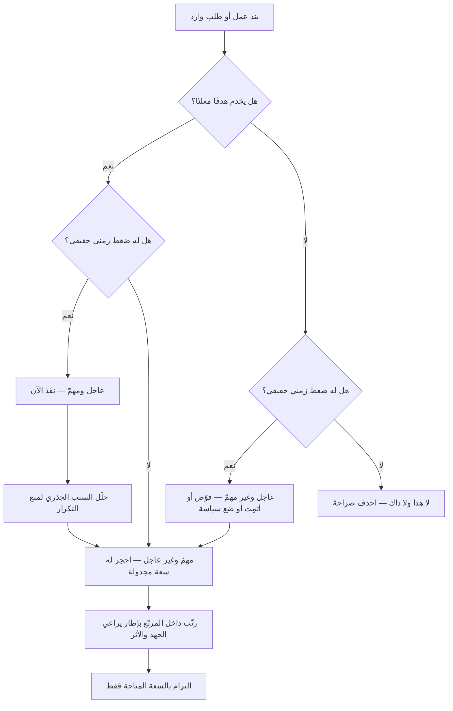

# مصفوفة أيزنهاور (Eisenhower Matrix)

> [!info] تعريف مختصر
> أداة تصنيف بسيطة تُوزّع الأعمال على أربعة مربّعات بحسب بُعدين مستقلّين: **الإلحاح** (هل يفرض ضغطًا زمنيًّا الآن؟) و**الأهمية** (هل يخدم هدفًا يهمّنا فعلًا؟). قيمتها الأساسية ليست في الترتيب الذي تنتجه، بل في **فصل البعدين عن بعضهما**؛ فالخلط بينهما هو أشيع أسباب انشغال الفرق طوال اليوم بأشياء لا تحرّك أي هدف. وهي أداة **فرز أوّلي (Triage)** لا أداة تخصيص موارد، وحدودها في سياق المنتج والمشاريع حقيقية وينبغي معرفتها قبل الاعتماد عليها.

## الشرح العلمي والاحترافي
- **البُعدان وما يقيسانه**: الإلحاح خاصية **زمنية خارجية** — موعد يقترب، عميل ينتظر، عطل قائم. والأهمية خاصية **غائية داخلية** — مدى ارتباط العمل بالأهداف والنتائج المستهدفة. البُعدان مستقلّان تمامًا نظريًّا، لكن الإدراك البشري يخلطهما لأن الإلحاح محسوس فوريًّا بينما الأهمية مجرّدة ومؤجّلة، فيميل الانتباه تلقائيًّا نحو العاجل.
- **المربّعات الأربعة ومعناها الإداري**:
  1. **عاجل ومهمّ** — أزمات وحوادث ومواعيد ملزِمة: يُنفَّذ الآن. لكن كثرة سكّان هذا المربّع مؤشّر مرض تنظيمي لا مؤشّر نشاط.
  2. **مهمّ وغير عاجل** — تخطيط، وقاية، تحسين، سداد [[Technical Debt]]، بناء قدرات: **هذا هو مربّع القيمة الحقيقية**، وهو المربّع الوحيد الذي يقلّص المربّع الأول مع الوقت. يحتاج جدولة صريحة وإلا لن يحدث أبدًا.
  3. **عاجل وغير مهمّ** — مقاطعات وطلبات لها موعد لكن لا أثر: يُفوَّض أو يُقلَّص أو تُوضع له سياسة تمنع تكراره.
  4. **غير عاجل وغير مهمّ** — يُحذف بلا اعتذار، وبقاؤه في القوائم كلفة صيانة ذهنية.
- **الأصل والنسبة**: تُنسب الفكرة شعبيًّا إلى الرئيس الأمريكي **دوايت أيزنهاور** لاقترانها بمبدأ يُروى عنه في التمييز بين العاجل والمهمّ، وقد شاعت المصفوفة بصيغتها الرباعية الحالية في أدبيات الإدارة الشخصية وإدارة الوقت في القرن العشرين. من الأمانة القول إن أيزنهاور لم يُعرف عنه أنه رسم المصفوفة بهذا الشكل، وإن الصياغة الرباعية المتداولة انتشرت لاحقًا عبر كتب الإنتاجية — فالمصطلح يحمل اسمه بوصفه ملهمًا للتمييز، لا بوصفه مؤلّفًا للأداة.
- **قوّتها الحقيقية: كشف الانحياز للإلحاح**: أهم ما تفعله المصفوفة هو إظهار أن جزءًا كبيرًا من عمل الفريق يقع في المربّع الثالث (عاجل وغير مهمّ). هذه الرؤية وحدها تُبرّر استخدامها كتمرين تشخيصي دوري، حتى لو لم تُستخدم كأداة ترتيب يومية.
- **الحدّ الأول: بُعدان لا يكفيان في سياق المنتج**: قرار الأولوية في المنتج يحتاج على الأقلّ إلى **الجهد** و**درجة الثقة/عدم اليقين** و**معدّل تحلّل القيمة زمنيًّا** — ولا شيء من ذلك في المصفوفة. بندان في المربّع نفسه قد يفصل بينهما عشرة أضعاف في الكلفة، وتعاملهما المصفوفة سواء. ولهذا تُستخدم في المنتج أُطر أغنى مثل [[RICE Prioritization]] و[[WSJF]] و[[Kano Model]].
- **الحدّ الثاني: الأهمية ليست ثنائية ولا موضوعية**: المصفوفة تفترض تصنيفًا ثنائيًّا (مهم/غير مهم)، بينما الأهمية متدرّجة وتعتمد على من يحكم. وفي غياب استراتيجية مكتوبة تصبح «الأهمية» رأيًا، فتتحوّل المصفوفة إلى غطاء شكلي لقرار [[HiPPO]].
- **الحدّ الثالث: لا تُنتج ترتيبًا خطّيًّا ولا تعرف السعة**: تضع المصفوفة عشرين بندًا في المربّع الثاني دون أن تخبرك أيّها أولًا، ودون علم بأن سعتك تكفي ثلاثة. القرار الحقيقي في [[Prioritization]] يقع **داخل** المربّع لا بينه وبين المربّعات الأخرى.
- **الحدّ الرابع: لا تلتقط التبعيات ولا التسلسل**: بند غير مهمّ بذاته قد يكون شرطًا تقنيًّا لثلاثة بنود مهمّة ([[Dependency]])، فتُصنّفه المصفوفة في مربّع الحذف بينما هو أول ما يجب أن يُنفَّذ.
- **الاستعمال الأنسب**: تُستخدم على العمل الفردي واليومي، وفي فرز الطلبات الواردة قبل دخولها الـ Backlog، وكأداة نقاش لكشف اختلال توزيع الجهد — ثم يُسلَّم القرار داخل المربّع المهمّ إلى إطار كمّي أدقّ.

## أين ومتى يُستخدم
- **في الفرز الأوّلي للطلبات الواردة**: قبل [[Backlog Refinement]]، لاستبعاد المربّع الرابع وإخراج المربّع الثالث إلى مسار سياسة أو تفويض.
- **في تشخيص توزيع جهد الفريق**: بتصنيف عمل الأسابيع الماضية بأثر رجعي، فتظهر نسبة الجهد المستهلَكة في العاجل غير المهمّ.
- **في إدارة الطلبات العاجلة**: مع [[Expedite Class]] و[[Explicit Policies]] لتحديد ما يستحق كسر التسلسل فعلًا.
- **في التخطيط الشخصي وإدارة وقت القيادة**: حيث الأداة أقرب إلى غرضها الأصلي، وحيث تكون [[Opportunity Cost]] لساعة القائد عالية.
- **في حماية العمل الوقائي**: بجدولة نصيب ثابت من السعة للمربّع الثاني (دين تقني، أمن، توثيق، تحسين [[Flow Efficiency]]) حتى لا يبتلعه العاجل.
- **في اجتماعات مراجعة الأعباء التشغيلية**: لتحديد المقاطعات المتكرّرة التي تستحق أتمتة أو سياسة بدل معالجة فردية كل مرّة.

## مثال وسيناريو تطبيقي
> [!example] فريق منصّة في شركة لوجستية بالدمام، 6 مهندسين، يشكو من أن «لا وقت لدينا لأي شيء مخطّط». طلب مدير الهندسة تصنيف كل ما عمله الفريق في الأسابيع الستة الماضية (نحو 90 بندًا) على المصفوفة، بمعيار أهمية واحد متّفق عليه: هل يخدم البند نتيجة من نتائج الربع المعلنة؟
> النتيجة كانت صادمة للفريق نفسه: **عاجل ومهمّ 18%**، **مهمّ وغير عاجل 12%**، **عاجل وغير مهمّ 54%**، **لا هذا ولا ذاك 16%**.
> تفكيك المربّع الثالث (54%) أظهر ثلاثة مصادر: طلبات استخراج تقارير يدوية من فرق التشغيل (31 طلبًا)، وإعادة تشغيل عمليات مزامنة فاشلة (19 مرّة)، وأسئلة متكرّرة عن صلاحيات الوصول.
> **القرار لم يكن «نرفض هذه الطلبات»** — فهي حقيقية ولها طالبون. بل كان تحويل كل مصدر إلى معالجة جذرية من المربّع الثاني: صفحة تقارير ذاتية الخدمة (أسبوعان عمل)، وإعادة محاولة تلقائية مع تنبيه للمزامنة (4 أيام)، وصفحة توثيق واحدة للصلاحيات مع نموذج طلب (يومان).
> خُصّص لذلك 25% من سعة الربع كحصّة محمية لا تُمسّ، وطُبّقت سياسة مكتوبة: أي طلب يدوي يتكرّر أكثر من ثلاث مرّات يفتح تلقائيًّا بندًا لمعالجته جذريًّا.
> بعد ربع كامل: نسبة العمل في المربّع الثالث نزلت إلى 21%، وارتفع المربّع الثاني إلى 34%. الدرس الجوهري الذي سجّله الفريق: **المصفوفة لم تخبرهم بما يفعلونه، بل أرتهم أين يذهب وقتهم فعلًا** — أما ترتيب البنود الثلاثة داخل المربّع الثاني فقد احتاج أداة أخرى تُقارن الجهد بالأثر، لأن المصفوفة لا تفرّق بين بند يستغرق يومين وآخر يستغرق شهرين.

## خطوات أو مخطّط
1. اتّفق أولًا على تعريف مكتوب لـ«المهمّ» مرتبط بالأهداف المعلنة — بدون هذا التعريف تصبح المصفوفة استفتاء آراء.
2. اجمع كل الأعمال والطلبات في قائمة واحدة، بما فيها العمل التشغيلي غير المسجّل.
3. صنّف كل بند على البعدين منفصلين: أولًا الأهمية بمعزل عن الموعد، ثم الإلحاح بمعزل عن الأهمية.
4. احسب **نسبة الجهد** في كل مربّع لا عدد البنود — فبند واحد قد يعادل عشرة.
5. عالج المربّع الرابع بالحذف الصريح، لا بالتأجيل.
6. حوّل المربّع الثالث إلى مصدر لبنود في المربّع الثاني: أتمتة، سياسة، تفويض، خدمة ذاتية.
7. احجز حصّة سعة ثابتة ومحمية للمربّع الثاني، وإلا فلن يبقى منه شيء.
8. رتّب داخل المربّعين الأول والثاني بإطار يراعي الجهد والأثر ([[RICE Prioritization]] أو [[WSJF]])، فالمصفوفة لا تُنهي القرار.
9. أعد التمرين كل ربع بأثر رجعي، وتابع اتّجاه النسب لا القيم المطلقة.

## ⚠️ مفاهيم خاطئة شائعة
> [!warning]
> - **اعتبارها أداة ترتيب أولويات كاملة**: المصفوفة تُصنّف ولا تُرتّب، ولا تعرف شيئًا عن الجهد أو السعة أو التبعيات. التصحيح: استخدمها للفرز، ثم استخدم إطارًا كمّيًّا للترتيب داخل المربّع المهمّ.
> - **الخلط بين الإلحاح والأهمية عند التصنيف**: يُصنَّف البند مهمًّا لأن له موعدًا، فينهار البعدان إلى بعد واحد وتفقد الأداة كل قيمتها. التصحيح: صنّف الأهمية أولًا وأنت تُخفي المواعيد تمامًا، ثم أضف بعد الإلحاح.
> - **الظنّ أن المربّع الأول هو مربّع الإنتاجية**: العمل في الأزمات يبدو بطوليًّا لكنه غالبًا ثمن إهمال المربّع الثاني سابقًا. التصحيح: اقرأ حجم المربّع الأول كمؤشّر تشخيصي، وعالج أسبابه عبر [[Root Cause Analysis]].
> - **افتراض أن الأهمية موضوعية ومتّفق عليها**: بغياب استراتيجية مكتوبة يصنّف كل شخص طلبه مهمًّا. التصحيح: اربط تعريف الأهمية بمقياس معلن ([[OKR]] أو [[North Star Metric]]) وليس بالانطباع.
> - **استخدامها لعمل الفريق كما تُستخدم للعمل الفردي**: نصيحة «فوّض» في المربّع الثالث تفترض وجود من يُفوَّض إليه، وهو ما لا يتوفّر لفريق مُحمَّل أصلًا. التصحيح: في سياق الفريق، بدائل التفويض هي الأتمتة والسياسة والخدمة الذاتية وإلغاء الطلب من جذره.
> - **الظنّ أن المربّع الرابع نادر**: في الواقع يتضخّم بصمت عبر تقارير لا يقرؤها أحد واجتماعات فقدت غرضها وميزات ميّتة. التصحيح: افحص الالتزامات المتكرّرة سنويًّا، فأغلب سكّان المربّع الرابع أعمال دورية لا مهام جديدة.
> - **اعتبار البنود «غير المهمّة» قابلة للحذف دائمًا**: بعضها ممكِّن لغيره أو التزام تنظيمي. التصحيح: افحص [[Dependency]] والالتزامات التعاقدية قبل الحذف.

## ❌ ممارسات خاطئة في المشاريع
> [!failure]
> - **الخطأ: استخدام المصفوفة كأداة قرار نهائية على مستوى المحفظة.** لماذا يضرّ: تُنتج قائمة من عشرين بندًا «مهمًّا» بلا ترتيب ولا اعتبار للسعة، فيبدأ الفريق كل شيء ولا ينهي شيئًا. الحل: اجعلها مرحلة فرز أولى فقط، ثم رتّب خطّيًّا بإطار كمّي وبالسعة المُقاسة.
> - **الخطأ: ترك المربّع الثاني بلا سعة محجوزة.** لماذا يضرّ: العاجل يبتلع المهمّ دائمًا لأن ضغطه فوري، فيتراكم [[Technical Debt]] حتى يتحوّل إلى حوادث تملأ المربّع الأول. الحل: احجز نسبة معلنة من السعة للعمل الوقائي واعتبرها غير قابلة للمساومة إلا بقرار موثّق.
> - **الخطأ: السماح لصاحب الطلب بتحديد إلحاحه وأهميته.** لماذا يضرّ: كل طلب يصل مصنّفًا «عاجل ومهمّ» فتنهار الأداة إلى مربّع واحد. الحل: اجعل التصنيف مسؤولية مالك الأولوية بمعايير مكتوبة، واطلب سندًا لكل ادّعاء إلحاح (موعد نظامي، عقد، أثر مقاس).
> - **الخطأ: معالجة بنود المربّع الثالث فرديًّا كل مرّة.** لماذا يضرّ: كلفتها الفردية صغيرة لكن تراكمها يستهلك نصف سعة الفريق دون أن يظهر ذلك في أي تقرير. الحل: اجمعها وحلّل مصادرها المتكرّرة، وحوّل كل مصدر إلى بند معالجة جذرية واحد.
> - **الخطأ: تنفيذ التمرين مرّة واحدة ثم أرشفته.** لماذا يضرّ: توزيع الجهد يتغيّر باستمرار، والقيمة في تتبّع الاتّجاه لا في اللقطة الواحدة. الحل: كرّره كل ربع بأثر رجعي على العمل الفعلي، وضع النسب في [[Project Health Report]].
> - **الخطأ: تصنيف البنود بعددها لا بجهدها.** لماذا يضرّ: يُعطي انطباعًا خاطئًا بأن الفريق يعمل على المهمّ، بينما بند واحد في المربّع الثالث قد يستهلك ثلاثة أسابيع. الحل: احسب النسب بوحدة الجهد أو الزمن المُقاس ([[Cycle Time]]).
> - **الخطأ: استخدامها لتبرير قرار متّخذ سلفًا.** لماذا يضرّ: تُوضع بنود القائد في المربّع الأول ويُلبَس القرار ثوب المنهجية، فتفقد الأداة ثقة الفريق نهائيًّا. الحل: صنّف بشكل فردي مكتوب قبل النقاش الجماعي، وأظهر مواضع الاختلاف بدل إخفائها.

## 🔗 مصطلحات ومفاهيم ذات صلة
[[Prioritization]] | [[Opportunity Cost]] | [[HiPPO]] | [[Initiative]] | [[Sunk Cost Fallacy]] | [[Circuit Breaker]] | [[MoSCoW Prioritization]] | [[RICE Prioritization]] | [[WSJF]] | [[Cost of Delay]] | [[Expedite Class]] | [[Severity vs Priority]] | [[Technical Debt]] | [[Quick Wins vs Big Bangs]]
